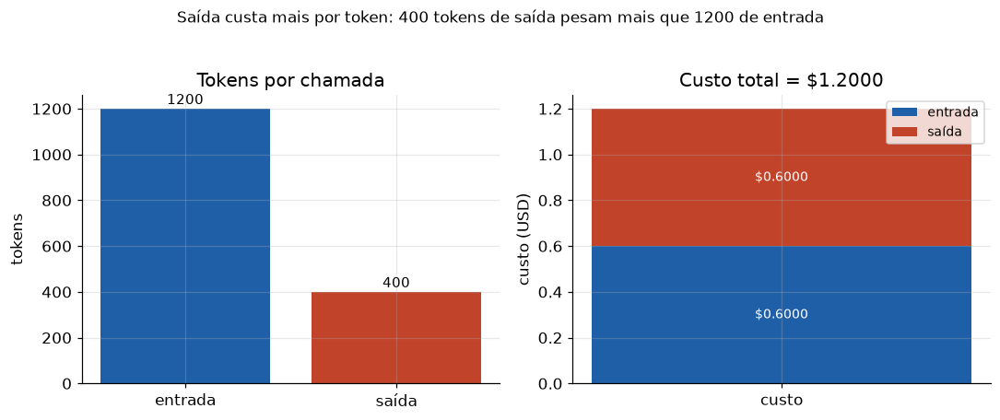

# Lição 051 — APIs de provedores de LLM: interface, autenticação, tokens e custo

> **Módulo:** M06 — GenAI Aplicado, Prompt Engineering e APIs · **Ordem de estudo:** 51 · **Tempo:** ~50 min
> **Pré-requisitos:** [049] Sampling e decodificação · [050] Panorama de GenAI e modelos multimodais
> **Classificação:** coberto pela ementa

> **Convenção de formatação:** matemática em LaTeX (`$...$` inline, `$$...$$` em
> destaque, render nativo na pré-visualização do VS Code); figuras reprodutíveis
> geradas por `tools/figuras/gerar_figuras_m06.py` e incorporadas por caminho
> relativo `assets/<NNN>-<slug>/<nome>.png`; blocos ```python só para código e
> saída.

## Seção_Teórica

### Motivação

Na prática, você raramente treina um LLM — você **chama** o de um provedor por uma
**API**. E quase todos os provedores convergiram para a mesma interface: você envia
uma lista de **mensagens** com papéis (`system`, `user`, `assistant`), parâmetros de
decodificação (`temperature`, `top_p` — Lição 049) e recebe de volta texto mais
**metadados de uso** (quantos tokens entraram e saíram). Saber montar essa
requisição, **autenticar** com segurança e **prever o custo** antes de apertar
"enviar" é o que separa um protótipo de um sistema que não estoura o orçamento nem
vaza a chave de API em um log. Esta lição constrói cada peça em Python puro,
**simulando** a forma das requisições e respostas — sem chamar nenhuma API real.

### Princípio de funcionamento

Uma requisição de chat é, no fundo, um **objeto JSON**: um campo `model`, uma lista
`messages` (cada uma `{"role": ..., "content": ...}`) e parâmetros de geração. O
servidor responde com outro JSON contendo o texto gerado e um bloco de `usage` com
`prompt_tokens` e `completion_tokens`. A **autenticação** é tipicamente um cabeçalho
HTTP `Authorization: Bearer <chave>` — e a regra de ouro é **nunca** imprimir a chave
inteira: mascaramos tudo menos os últimos caracteres.

O **custo** é linear nos tokens, mas com **preços diferentes** para entrada e saída.
Se $t_\text{in}$ e $t_\text{out}$ são os tokens de entrada e saída e $p_\text{in}$,
$p_\text{out}$ os preços por mil tokens, o custo de uma chamada é

$$\text{custo} = \frac{t_\text{in}}{1000}\,p_\text{in} + \frac{t_\text{out}}{1000}\,p_\text{out}.$$

Como $p_\text{out}$ costuma ser bem maior que $p_\text{in}$, **respostas longas
pesam desproporcionalmente** — controlar `max_tokens` é uma das alavancas de custo
mais simples. Para estimar tokens antes de enviar, uma heurística comum é
$t \approx \lceil \text{nº de caracteres} / 4 \rceil$.



*Figura 1 — À esquerda, a contagem de tokens (1200 de entrada, 400 de saída); à direita, a decomposição do custo: como a saída custa mais por token, 400 tokens de saída pesam tanto quanto 1200 de entrada. Gerada por `tools/figuras/gerar_figuras_m06.py`.*

---

### Conceito central 1 — Interface de chat por mensagens

A unidade da API é a **mensagem**: um par `{"role", "content"}`. A conversa é uma
**lista ordenada** dessas mensagens — `system` define o comportamento, `user` traz a
entrada e `assistant` guarda as respostas anteriores (para manter contexto em
múltiplos turnos). Montar essa lista corretamente é o primeiro passo de qualquer
chamada.

#### Exemplo_Resolvido 1.1

```python
def msg(role, content):
    return {"role": role, "content": content}

conversa = [
    msg("system", "Voce traduz para o ingles."),
    msg("user", "bom dia"),
    msg("assistant", "good morning"),
    msg("user", "boa noite"),
]
print("turnos:", len(conversa))
print("ultimo papel:", conversa[-1]["role"])
for m in conversa:
    print(f"{m['role']:>9}: {m['content']}")
```

**Explicação passo a passo:**
- **Bloco 1 (`msg`):** fábrica de mensagens — garante sempre o mesmo formato `{"role", "content"}`.
- **Bloco 2 (`conversa`):** uma conversa de 4 turnos; o `system` fixa o papel, e os turnos alternam `user`/`assistant`.
- **Bloco 3 (`print`):** o último papel é `user` (é a vez do modelo responder); a listagem mostra a ordem preservada da conversa.

**Saída esperada:**
```
turnos: 4
ultimo papel: user
   system: Voce traduz para o ingles.
     user: bom dia
assistant: good morning
     user: boa noite
```

---

### Conceito central 2 — Autenticação e cabeçalhos

A chave de API autentica a chamada via cabeçalho `Authorization: Bearer <chave>`. A
chave é um **segredo**: jamais deve ser impressa, logada ou commitada. A prática
correta é **mascarar** a chave (mostrar só os últimos caracteres) sempre que ela
aparecer em qualquer saída.

#### Exemplo_Resolvido 2.1

```python
def mascarar(chave, visivel=4):
    return "*" * (len(chave) - visivel) + chave[-visivel:]

api_key = "sk-9f8e7d6c5b4a3210"
header = f"Authorization: Bearer {mascarar(api_key)}"
print("chave bruta tem", len(api_key), "caracteres")
print(header)
print("vaza a chave?", api_key in header)
```

**Explicação passo a passo:**
- **Bloco 1 (`mascarar`):** substitui todos os caracteres por `*` menos os últimos `visivel` (4 por padrão).
- **Bloco 2 (`header`):** monta a linha de cabeçalho com a chave **já mascarada**.
- **Bloco 3 (`print`):** confirma que a chave bruta **não** aparece no cabeçalho exibido (`vaza a chave? False`) — só o sufixo `3210` é visível.

**Saída esperada:**
```
chave bruta tem 19 caracteres
Authorization: Bearer ***************3210
vaza a chave? False
```

---

### Conceito central 3 — Tokens e custo

O custo de uma chamada é proporcional aos tokens, com preços distintos para entrada
e saída. Antes de enviar, dá para **estimar** os tokens pela heurística de
$\approx 4$ caracteres por token e prever o custo — essencial para orçamento e para
escolher entre modelos.

#### Exemplo_Resolvido 3.1

```python
import math

def contar_tokens(texto):
    return math.ceil(len(texto) / 4)      # heuristica: ~4 caracteres por token

prompt = "Resuma o texto a seguir em uma frase curta e clara."
resposta = "O texto trata de um assunto especifico."
tin = contar_tokens(prompt)
tout = contar_tokens(resposta)
preco_in_1k, preco_out_1k = 0.50, 1.50
custo = tin / 1000 * preco_in_1k + tout / 1000 * preco_out_1k
print(f"tokens prompt  : {tin}")
print(f"tokens resposta: {tout}")
print(f"custo estimado : ${custo:.5f}")
```

**Explicação passo a passo:**
- **Bloco 1 (`contar_tokens`):** estima tokens arredondando para cima o número de caracteres dividido por 4.
- **Bloco 2 (`prompt`/`resposta`):** dois textos curtos; `prompt` (51 caracteres) vira 13 tokens, `resposta` (39) vira 10.
- **Bloco 3 (`custo`):** aplica a fórmula com $p_\text{in}=0{,}50$ e $p_\text{out}=1{,}50$ por 1k tokens — mesmo com mais tokens de entrada, a saída mais cara puxa o custo.

**Saída esperada:**
```
tokens prompt  : 13
tokens resposta: 10
custo estimado : $0.02150
```

## Seção_Prática

> **Como reproduzir:** execute cada solução de referência com
> `python trilha/solucoes/051-apis-provedores-llm/solucao_<n>.py` e compare a saída
> com o arquivo `.saida.txt` correspondente. Os enunciados/esqueletos ficam em
> `trilha/pratica/051-apis-provedores-llm/exercicio_<n>.py`.

### Exercício 1 — Montar o corpo de uma requisição de chat
- **Entrada inicial / setup:** modelo `"llm-pequeno"`, sistema `"Voce e um assistente conciso."`, usuário `"Explique JSON em uma frase."`, temperatura `0.2`.
- **Passos de execução:** implemente `construir_requisicao(...)` devolvendo o dict com `model`, `messages` (system + user) e `temperature`; serialize com `json.dumps(req, ensure_ascii=False, sort_keys=True)` e imprima `n mensagens`, `papeis` e `json`.
- **Critério de conclusão (binário):** a saída é **exatamente** igual a `solucao_1.saida.txt` (incluindo a linha `json:` com chaves ordenadas); qualquer divergência reprova.
- **Solução de referência:** `trilha/solucoes/051-apis-provedores-llm/solucao_1.py`
- **Saída esperada:** `trilha/solucoes/051-apis-provedores-llm/solucao_1.saida.txt`

### Exercício 2 — Cabeçalhos de autenticação com chave mascarada
- **Entrada inicial / setup:** `chave = "sk-ABCDEF1234567890"`.
- **Passos de execução:** implemente `mascarar(chave, visivel=4)` e `montar_headers(api_key)` (com `Authorization: Bearer <mascarada>` e `Content-Type: application/json`); imprima cada header em ordem alfabética de chave.
- **Critério de conclusão (binário):** a saída é **exatamente** igual a `solucao_2.saida.txt` (`Authorization: Bearer ***************7890`); qualquer divergência reprova.
- **Solução de referência:** `trilha/solucoes/051-apis-provedores-llm/solucao_2.py`
- **Saída esperada:** `trilha/solucoes/051-apis-provedores-llm/solucao_2.saida.txt`

### Exercício 3 — Decomposição de custo de uma chamada
- **Entrada inicial / setup:** `prompt_tokens = 1200`, `completion_tokens = 400`, `preco_in_1k = 0.50`, `preco_out_1k = 1.50`.
- **Passos de execução:** implemente `custo(...)` devolvendo `(custo_in, custo_out)` com `tokens / 1000 * preco_1k`; imprima a quebra de tokens e custos (4 casas) e o custo total.
- **Critério de conclusão (binário):** a saída é **exatamente** igual a `solucao_3.saida.txt` (`custo total    : $1.2000`); qualquer divergência reprova.
- **Solução de referência:** `trilha/solucoes/051-apis-provedores-llm/solucao_3.py`
- **Saída esperada:** `trilha/solucoes/051-apis-provedores-llm/solucao_3.saida.txt`
