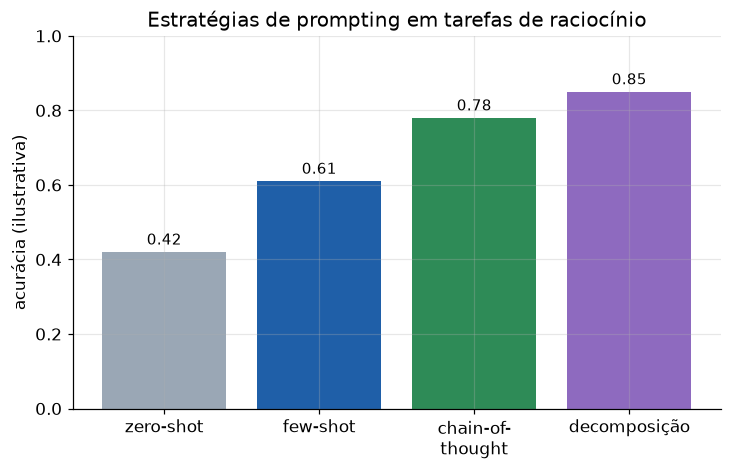

# Lição 053 — Prompt engineering avançado: few-shot, chain-of-thought e decomposição

> **Módulo:** M06 — GenAI Aplicado, Prompt Engineering e APIs · **Ordem de estudo:** 53 · **Tempo:** ~50 min
> **Pré-requisitos:** [052] Prompt engineering: fundamentos e padrões
> **Classificação:** complemento de aprofundamento à ementa

> **Convenção de formatação:** matemática em LaTeX (`$...$` inline, `$$...$$` em
> destaque, render nativo na pré-visualização do VS Code); figuras reprodutíveis
> geradas por `tools/figuras/gerar_figuras_m06.py` e incorporadas por caminho
> relativo `assets/<NNN>-<slug>/<nome>.png`; blocos ```python só para código e
> saída.

## Seção_Teórica

### Motivação

Os fundamentos da Lição 052 resolvem tarefas simples, mas tarefas que exigem
**raciocínio** — classificar com nuance, resolver problemas em vários passos,
executar um procedimento longo — pedem técnicas mais fortes. Três delas dominam a
prática e funcionam **sem treinar nada**, só mudando o texto do prompt: **few-shot**
(mostrar exemplos resolvidos antes da pergunta), **chain-of-thought** (pedir que o
modelo pense em passos antes de responder) e **decomposição** (quebrar uma tarefa
grande em subtarefas menores e combinar os resultados). Elas costumam render mais
acurácia do que trocar de modelo, e entender o *mecanismo* de cada uma — em vez de
copiar receitas — é o que permite escolher a certa para cada problema. Os exemplos
aqui são determinísticos e simulam o raciocínio localmente, sem chamar um LLM.

### Princípio de funcionamento

No **few-shot**, você inclui $k$ exemplos rotulados no prompt antes da consulta. O
modelo infere o padrão "por analogia" — quanto mais parecido um exemplo é da
consulta, mais ele influencia a resposta. Podemos simular essa intuição com uma
medida de similaridade entre conjuntos de palavras, o **índice de Jaccard**

$$J(A, B) = \frac{|A \cap B|}{|A \cup B|},$$

e prever o rótulo do exemplo mais similar.

No **chain-of-thought (CoT)**, em vez de pedir a resposta direta, pedimos os
**passos intermediários**. Decompor o cálculo em etapas reduz erros: cada passo é
simples e verificável, e o resultado de um alimenta o próximo — exatamente como num
programa. A **decomposição de tarefas** generaliza isso: uma tarefa complexa vira um
**pipeline** de subtarefas independentes cujos resultados são combinados no final.
Em código, isso é simplesmente compor funções pequenas — e é também a ponte para os
**agentes** do M08, que decidem dinamicamente quais subtarefas executar.



*Figura 1 — Comparação ilustrativa: em tarefas de raciocínio, few-shot supera zero-shot, e chain-of-thought e decomposição vão além ao tornar os passos explícitos. Valores didáticos. Gerada por `tools/figuras/gerar_figuras_m06.py`.*

---

### Conceito central 1 — Few-shot prompting

Em few-shot, exemplos resolvidos precedem a consulta e guiam a resposta por
analogia. Para ilustrar o mecanismo, classificamos a consulta pelo **rótulo do
exemplo mais similar**, medindo similaridade pela sobreposição de palavras (Jaccard).

#### Exemplo_Resolvido 1.1

```python
def jaccard(a, b):
    sa, sb = set(a.split()), set(b.split())
    return len(sa & sb) / len(sa | sb)

shots = [
    ("filme bom otimo", "positivo"),
    ("filme ruim pessimo", "negativo"),
    ("atendimento bom rapido", "positivo"),
]
consulta = "filme bom rapido"
melhor = max(shots, key=lambda s: jaccard(consulta, s[0]))
print("similaridades:")
for texto, rotulo in shots:
    print(f"  {rotulo:>8} ({texto}): {jaccard(consulta, texto):.3f}")
print("rotulo previsto:", melhor[1])
```

**Explicação passo a passo:**
- **Bloco 1 (`jaccard`):** mede a sobreposição entre os conjuntos de palavras de dois textos — proxy simples de similaridade semântica.
- **Bloco 2 (`shots`/`consulta`):** três exemplos rotulados e a consulta a classificar.
- **Bloco 3 (`melhor`/laço):** calcula a similaridade da consulta com cada exemplo; o de maior similaridade (0.500, `"filme bom otimo"`) define o rótulo previsto `positivo` (desempate pelo primeiro máximo).

**Saída esperada:**
```
similaridades:
  positivo (filme bom otimo): 0.500
  negativo (filme ruim pessimo): 0.200
  positivo (atendimento bom rapido): 0.500
rotulo previsto: positivo
```

---

### Conceito central 2 — Chain-of-thought

Chain-of-thought torna o **raciocínio explícito**: em vez de saltar para a resposta,
o modelo (aqui, o nosso código) registra cada passo intermediário. Isso reduz erros
em problemas de múltiplas etapas, pois cada passo é simples e o resultado de um
alimenta o próximo.

#### Exemplo_Resolvido 2.1

```python
dist, tempo = 60, 1.5
velocidade = dist / tempo
print(f"passo 1: velocidade = {dist} / {tempo} = {velocidade:.1f} km/h")
horas = 4
percorrido = velocidade * horas
print(f"passo 2: distancia = {velocidade:.1f} * {horas} = {percorrido:.1f} km")
print("resposta:", f"{percorrido:.1f} km")
```

**Explicação passo a passo:**
- **Bloco 1 (passo 1):** calcula a velocidade média ($60 / 1{,}5 = 40{,}0$ km/h) e a expõe explicitamente.
- **Bloco 2 (passo 2):** usa a velocidade do passo anterior para achar a distância em 4 h ($40{,}0 \times 4 = 160{,}0$ km).
- **Bloco 3 (`resposta`):** a resposta final emerge da cadeia de passos, não de um salto direto.

**Saída esperada:**
```
passo 1: velocidade = 60 / 1.5 = 40.0 km/h
passo 2: distancia = 40.0 * 4 = 160.0 km
resposta: 160.0 km
```

---

### Conceito central 3 — Decomposição de tarefas

Decompor é quebrar uma tarefa complexa em **subtarefas** independentes, resolver cada
uma e **combinar** os resultados. Em código, isso é compor funções pequenas — cada
uma fácil de testar — num pipeline.

#### Exemplo_Resolvido 3.1

```python
def extrair_numeros(texto):
    return [int(p) for p in texto.split() if p.isdigit()]

def somar(nums):
    return sum(nums)

def media(nums):
    return somar(nums) / len(nums)

texto = "notas 8 7 10 9 foram registradas"
nums = extrair_numeros(texto)
print("numeros:", nums)
print("soma:", somar(nums))
print("media:", round(media(nums), 2))
```

**Explicação passo a passo:**
- **Bloco 1 (subtarefas):** três funções pequenas — extrair números do texto, somar e calcular a média (que reusa `somar`).
- **Bloco 2 (`texto`/`nums`):** a entrada bruta é reduzida à lista `[8, 7, 10, 9]` pela primeira subtarefa.
- **Bloco 3 (`print`):** as subtarefas seguintes combinam o resultado intermediário em soma (34) e média (8.5).

**Saída esperada:**
```
numeros: [8, 7, 10, 9]
soma: 34
media: 8.5
```

## Seção_Prática

> **Como reproduzir:** execute cada solução de referência com
> `python trilha/solucoes/053-prompt-engineering-avancado/solucao_<n>.py` e compare
> a saída com o arquivo `.saida.txt` correspondente. Os enunciados/esqueletos ficam
> em `trilha/pratica/053-prompt-engineering-avancado/exercicio_<n>.py`.

### Exercício 1 — Montar um prompt few-shot
- **Entrada inicial / setup:** a lista `exemplos` (pares texto → rótulo) e a `consulta` dadas no esqueleto.
- **Passos de execução:** implemente `montar_few_shot(exemplos, consulta)` formatando cada exemplo como `Texto:`/`Rotulo:` e adicionando a consulta com o rótulo em aberto; imprima o prompt.
- **Critério de conclusão (binário):** a saída é **exatamente** igual a `solucao_1.saida.txt` (termina com `Texto: o atendimento foi otimo` e `Rotulo:`); qualquer divergência reprova.
- **Solução de referência:** `trilha/solucoes/053-prompt-engineering-avancado/solucao_1.py`
- **Saída esperada:** `trilha/solucoes/053-prompt-engineering-avancado/solucao_1.saida.txt`

### Exercício 2 — Chain-of-thought em passos explícitos
- **Entrada inicial / setup:** `caixas, por_caixa = 3, 4` e `comidas = 5`.
- **Passos de execução:** calcule `total = caixas * por_caixa` e `sobram = total - comidas`, registrando cada passo numa lista; imprima cada passo prefixado por `passo:` e a `resposta:`.
- **Critério de conclusão (binário):** a saída é **exatamente** igual a `solucao_2.saida.txt` (`passo: total = 3 * 4 = 12`, `passo: sobram = 12 - 5 = 7`, `resposta: 7`); qualquer divergência reprova.
- **Solução de referência:** `trilha/solucoes/053-prompt-engineering-avancado/solucao_2.py`
- **Saída esperada:** `trilha/solucoes/053-prompt-engineering-avancado/solucao_2.saida.txt`

### Exercício 3 — Decomposição de tarefa em subtarefas
- **Entrada inicial / setup:** `frase = "engenharia de ia aplicada"`.
- **Passos de execução:** implemente `n_palavras`, `maiusculas` e `inverter_ordem`; monte o dict `sub` com chaves `"n_palavras"`, `"maiusculas"`, `"invertida"` e imprima, nessa ordem, `chave: valor`.
- **Critério de conclusão (binário):** a saída é **exatamente** igual a `solucao_3.saida.txt` (`invertida: aplicada ia de engenharia`); qualquer divergência reprova.
- **Solução de referência:** `trilha/solucoes/053-prompt-engineering-avancado/solucao_3.py`
- **Saída esperada:** `trilha/solucoes/053-prompt-engineering-avancado/solucao_3.saida.txt`
