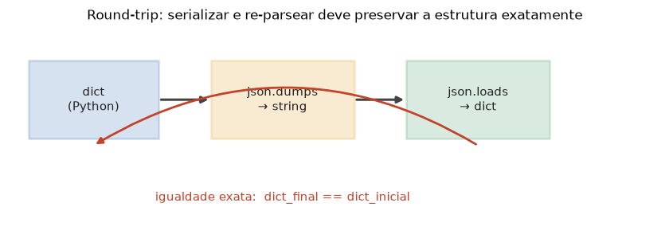

# Lição 054 — Saídas estruturadas e JSON mode

> **Módulo:** M06 — GenAI Aplicado, Prompt Engineering e APIs · **Ordem de estudo:** 54 · **Tempo:** ~50 min
> **Pré-requisitos:** [051] APIs de provedores de LLM · [052] Prompt engineering: fundamentos e padrões
> **Classificação:** complemento de aprofundamento à ementa

> **Convenção de formatação:** matemática em LaTeX (`$...$` inline, `$$...$$` em
> destaque, render nativo na pré-visualização do VS Code); figuras reprodutíveis
> geradas por `tools/figuras/gerar_figuras_m06.py` e incorporadas por caminho
> relativo `assets/<NNN>-<slug>/<nome>.png`; blocos ```python só para código e
> saída.

## Seção_Teórica

### Motivação

Um LLM responde em **texto livre**, mas um sistema precisa de **dados estruturados**:
um campo `preco` que é número, uma lista de `itens`, um booleano `em_estoque`. Colar
texto livre num programa é frágil — qualquer variação de formatação quebra o
parsing. A solução é pedir **saídas estruturadas**: instruir o modelo (ou usar o
**JSON mode** do provedor) a responder **só** com um objeto JSON que siga um
**schema**, e então **parsear e validar** essa saída antes de usá-la. Essa disciplina
é a base de *function calling* e do protocolo MCP (Módulos M08 e M09), onde a saída
do modelo vira a entrada de uma função real. E há uma propriedade de corretude que
não pode falhar: se você serializa uma estrutura e a parseia de volta, precisa
recuperar **exatamente** a mesma estrutura — o **round-trip**. Esta lição cobre os
três pilares com Python puro e a biblioteca `json`, sem chamar nenhuma API.

### Princípio de funcionamento

O fluxo tem três etapas. Primeiro, no **JSON mode / schema**, o prompt descreve o
formato esperado (quais chaves, quais tipos) e exige resposta **apenas** em JSON; o
provedor pode garantir sintaticamente isso. Recebida a string, fazemos o **parsing**
com `json.loads`, que mapeia tipos JSON para Python (`true` → `True`, `null` →
`None`, número → `int`/`float`, objeto → `dict`). Em seguida, **validamos**: cada
chave do schema existe? Tem o tipo certo? Erros são acumulados, não ignorados.

A terceira etapa é a garantia de **round-trip**. Serializar e re-parsear deve
preservar a estrutura. Formalmente, sendo $S$ a serialização (`json.dumps`) e $P$ o
parsing (`json.loads`), queremos

$$P(S(x)) = x \quad\text{e}\quad S(P(S(x))) = S(x),$$

ou seja, **ida-e-volta sem perda**. Usar `sort_keys=True` torna a serialização
**canônica** (a ordem das chaves não importa para o dict, mas a string vira única),
o que permite comparar saídas por igualdade exata — fundamental para testar e para
detectar divergências.



*Figura 1 — O ciclo dict → string JSON → dict. A seta de retorno representa a checagem de igualdade exata (`dict_final == dict_inicial`) que fecha o round-trip. Gerada por `tools/figuras/gerar_figuras_m06.py`.*

---

### Conceito central 1 — JSON mode e schema

Em JSON mode, o prompt declara o **schema** (chaves e tipos) e exige resposta só em
JSON. A saída chega como **string** e vira um objeto Python via `json.loads`. Os
tipos JSON são mapeados para Python — em especial, `true`/`false` viram
`True`/`False`.

#### Exemplo_Resolvido 1.1

```python
import json

schema = {"cidade": "string", "temperatura": "number", "chovendo": "boolean"}
instrucao = "Responda APENAS com JSON no formato: " + json.dumps(schema)
print(instrucao)

resposta = '{"cidade": "Recife", "temperatura": 29.5, "chovendo": false}'
obj = json.loads(resposta)
print("cidade:", obj["cidade"])
print("temperatura:", obj["temperatura"])
print("chovendo:", obj["chovendo"])
```

**Explicação passo a passo:**
- **Bloco 1 (`schema`/`instrucao`):** descreve o formato esperado e o embute na instrução — é assim que se pede uma saída estruturada.
- **Bloco 2 (`resposta`):** a string JSON "devolvida pelo modelo" (simulada, determinística).
- **Bloco 3 (`json.loads`/`print`):** o parsing produz um `dict`; `false` em JSON vira `False` em Python, e os campos ficam acessíveis por chave.

**Saída esperada:**
```
Responda APENAS com JSON no formato: {"cidade": "string", "temperatura": "number", "chovendo": "boolean"}
cidade: Recife
temperatura: 29.5
chovendo: False
```

---

### Conceito central 2 — Parsing e validação

Modelos às vezes embrulham o JSON em texto ("Claro, aqui está: {...}"). Um passo
robusto **extrai** o bloco JSON antes de parsear. Depois, validar contra o schema
garante que os campos esperados existem e têm o tipo certo antes de usá-los.

#### Exemplo_Resolvido 2.1

```python
import json

def extrair_json(texto):
    inicio = texto.find("{")
    fim = texto.rfind("}")
    return json.loads(texto[inicio:fim + 1])

bruto = 'Claro! Aqui esta: {"item": "caneta", "preco": 3.5} Espero ter ajudado.'
obj = extrair_json(bruto)
print("item:", obj["item"])
print("preco:", obj["preco"])
print("chaves:", sorted(obj.keys()))
```

**Explicação passo a passo:**
- **Bloco 1 (`extrair_json`):** localiza o primeiro `{` e o último `}` e parseia só esse trecho — descarta o texto extra ao redor.
- **Bloco 2 (`bruto`):** uma resposta "conversacional" com o JSON no meio.
- **Bloco 3 (`print`):** após extrair, os campos `item` e `preco` ficam acessíveis; `sorted(obj.keys())` mostra as chaves de forma determinística.

**Saída esperada:**
```
item: caneta
preco: 3.5
chaves: ['item', 'preco']
```

---

### Conceito central 3 — Round-trip dict → JSON → dict

A propriedade de corretude de serialização: serializar um dict e parseá-lo de volta
deve devolver um dict **exatamente igual** ao original. Com `sort_keys=True`, a
string serializada é canônica e pode ser comparada por igualdade.

#### Exemplo_Resolvido 3.1

```python
import json

original = {"id": 7, "nome": "pedido", "itens": ["x", "y"]}
ida = json.dumps(original, sort_keys=True)
volta = json.loads(ida)
print("ida:", ida)
print("volta == original?", volta == original)
```

**Explicação passo a passo:**
- **Bloco 1 (`ida`):** serializa o dict com chaves ordenadas — a string fica canônica (independe da ordem de inserção).
- **Bloco 2 (`volta`):** parseia a string de volta para um dict.
- **Bloco 3 (`print`):** a igualdade `volta == original` é `True` — o round-trip preservou a estrutura exatamente.

**Saída esperada:**
```
ida: {"id": 7, "itens": ["x", "y"], "nome": "pedido"}
volta == original? True
```

## Seção_Prática

> **Como reproduzir:** execute cada solução de referência com
> `python trilha/solucoes/054-saidas-estruturadas-json-mode/solucao_<n>.py` e compare
> a saída com o arquivo `.saida.txt` correspondente. Os enunciados/esqueletos ficam
> em `trilha/pratica/054-saidas-estruturadas-json-mode/exercicio_<n>.py`.

### Exercício 1 — Parsear uma saída estruturada
- **Entrada inicial / setup:** `saida_modelo = '{"nome": "Ana", "idade": 30, "ativo": true}'`.
- **Passos de execução:** parseie com `json.loads`; imprima o tipo do objeto (`type(dados).__name__`) e os campos `nome`, `idade`, `ativo`.
- **Critério de conclusão (binário):** a saída é **exatamente** igual a `solucao_1.saida.txt` (`tipo: dict` e `ativo: True`); qualquer divergência reprova.
- **Solução de referência:** `trilha/solucoes/054-saidas-estruturadas-json-mode/solucao_1.py`
- **Saída esperada:** `trilha/solucoes/054-saidas-estruturadas-json-mode/solucao_1.saida.txt`

### Exercício 2 — Validar contra um schema
- **Entrada inicial / setup:** `schema = {"nome": str, "idade": int, "ativo": bool}` e a lista `casos` com dois JSONs (um válido, um inválido).
- **Passos de execução:** implemente `validar(obj, schema)` acumulando `faltando: <chave>` e `tipo invalido: <chave>` na ordem do schema; para cada caso, parseie e imprima `ok` ou `erros: ` + erros juntos por `", "`.
- **Critério de conclusão (binário):** a saída é **exatamente** igual a `solucao_2.saida.txt` (`ok` e `erros: tipo invalido: idade, faltando: ativo`); qualquer divergência reprova.
- **Solução de referência:** `trilha/solucoes/054-saidas-estruturadas-json-mode/solucao_2.py`
- **Saída esperada:** `trilha/solucoes/054-saidas-estruturadas-json-mode/solucao_2.saida.txt`

### Exercício 3 — Round-trip dict → JSON → dict (ida-e-volta com igualdade exata)
- **Entrada inicial / setup:** o dicionário aninhado `registro = {"nome": "Ana", "tags": ["a", "b"], "meta": {"idade": 30, "ativo": True}}`.
- **Passos de execução:** serialize com `json.dumps(registro, ensure_ascii=False, sort_keys=True)`, parseie de volta com `json.loads` e verifique a **igualdade exata** (`volta == registro`); imprima `json:`, `igual?` e `identico ao re-serializar?`.
- **Critério de conclusão (binário):** a saída é **exatamente** igual a `solucao_3.saida.txt` e, em particular, `igual? True` (round-trip sem perda); qualquer divergência reprova.
- **Solução de referência:** `trilha/solucoes/054-saidas-estruturadas-json-mode/solucao_3.py`
- **Saída esperada:** `trilha/solucoes/054-saidas-estruturadas-json-mode/solucao_3.saida.txt`
