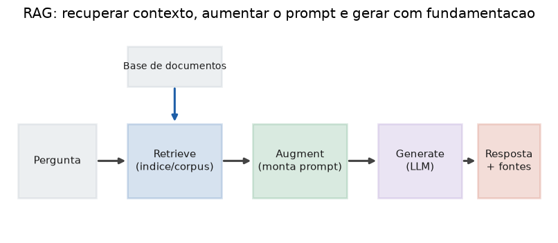

# Lição 055 — Fundamentos de RAG: motivação e arquitetura

> **Módulo:** M07 — RAG e Vector DBs · **Ordem de estudo:** 55 · **Tempo:** ~50 min
> **Pré-requisitos:** [038] HNSW por dentro · [051] APIs de provedores de LLM
> **Classificação:** coberto pela ementa

> **Convenção de formatação:** matemática em LaTeX (`$...$` inline, `$$...$$` em
> destaque, render nativo na pré-visualização do VS Code); figuras reprodutíveis
> geradas por `tools/figuras/gerar_figuras_m07.py` e incorporadas por caminho
> relativo `assets/<NNN>-<slug>/<nome>.png`; blocos ```python só para código e
> saída.

## Seção_Teórica

### Motivação

Um LLM guarda o que aprendeu **dentro dos seus pesos** — é o seu *conhecimento
paramétrico*. Esse conhecimento tem três limites incômodos para aplicações
reais. Primeiro, é **estático**: foi congelado na data de corte do treino e não
sabe nada da política de reembolso que sua empresa publicou ontem. Segundo, é
**não-atribuível**: o modelo não consegue apontar a fonte de uma afirmação, o que
abre espaço para **alucinações** — respostas fluentes e erradas. Terceiro, é
**caro de atualizar**: reescrever os pesos (fine-tuning) a cada documento novo é
inviável.

O **RAG** (*Retrieval-Augmented Generation*) resolve isso sem tocar nos pesos: em
vez de pedir ao modelo que **lembre** a resposta, nós **recuperamos** os
documentos relevantes de uma base externa e os **entregamos junto com a
pergunta**. O modelo passa a responder lendo um contexto fresco e verificável, e
podemos citar exatamente de onde veio cada afirmação. É a forma dominante de
construir assistentes sobre conhecimento proprietário.

### Princípio de funcionamento

RAG é um pipeline de três etapas — **retrieve, augment, generate**:

$$\text{pergunta} \xrightarrow{\text{retrieve}} \text{contexto} \xrightarrow{\text{augment}} \text{prompt} \xrightarrow{\text{generate}} \text{resposta}$$

1. **Retrieve:** um recuperador busca, numa base de documentos, os trechos mais
   relevantes para a pergunta. No didático desta lição usamos a sobreposição de
   termos; na prática usa-se busca vetorial (cosseno sobre embeddings, com índices
   como o HNSW da Lição 038).
2. **Augment:** os trechos recuperados são inseridos no prompt, normalmente num
   bloco de contexto separado da pergunta.
3. **Generate:** o LLM (Lição 051) gera a resposta condicionada **àquele**
   contexto, e o sistema anexa as **fontes** usadas.

A qualidade final é limitada pela **recuperação**: se o documento certo não entra
no contexto, nenhum modelo o adivinha. Por isso o resto do módulo foca em
recuperar melhor (chunking, índices, RAG híbrido, re-ranking).



*Figura 1 — As três etapas do RAG: a base de documentos alimenta o retrieve, que produz o contexto; o augment monta o prompt e o generate produz a resposta com fontes. Gerada por `tools/figuras/gerar_figuras_m07.py`.*

---

### Conceito central 1 — Conhecimento paramétrico vs não-paramétrico

O conhecimento **paramétrico** está congelado nos pesos; o **não-paramétrico**
vive numa base externa consultada em tempo de execução. RAG combina os dois: o
modelo fornece a competência linguística, a base fornece os fatos atualizados.

#### Exemplo_Resolvido 1.1

```python
import re

# Conhecimento parametrico: fixo nos "pesos" do modelo (so o que ele memorizou).
memoria_parametrica = {"capital da franca": "Paris"}

def responder_parametrico(pergunta):
    return memoria_parametrica.get(pergunta.lower(), "nao sei")

# Conhecimento nao-parametrico: documentos externos consultados em tempo real.
corpus = {
    "d1": "A capital da Franca e Paris.",
    "d2": "A politica de reembolso da empresa e de 30 dias corridos.",
}

def tokenizar(texto):
    return set(re.findall(r"[a-z0-9]+", texto.lower()))

def recuperar(pergunta, corpus):
    q = tokenizar(pergunta)
    return max(sorted(corpus), key=lambda d: len(q & tokenizar(corpus[d])))

p1 = "capital da franca"
p2 = "qual a politica de reembolso"
doc = recuperar(p2, corpus)
print("parametrico p1:", responder_parametrico(p1))
print("parametrico p2:", responder_parametrico(p2))
print("recuperado  p2:", doc, "->", corpus[doc])
```

**Explicação passo a passo:**
- **Bloco 1 (`memoria_parametrica`):** simula o que o modelo "decorou" — só conhece a capital da França.
- **Bloco 2 (`corpus`/`tokenizar`):** a base externa e um tokenizador simples (conjuntos de termos minúsculos).
- **Bloco 3 (`recuperar`):** escolhe o documento com maior sobreposição de termos com a pergunta.
- **Bloco 4 (`print`):** a pergunta sobre reembolso falha no modo paramétrico (`nao sei`), mas a recuperação encontra `d2` — exatamente o conhecimento que o modelo não tinha.

**Saída esperada:**
```
parametrico p1: Paris
parametrico p2: nao sei
recuperado  p2: d2 -> A politica de reembolso da empresa e de 30 dias corridos.
```

---

### Conceito central 2 — Arquitetura retrieve-augment-generate

As três etapas são funções encadeadas. Mantê-las **separadas** deixa claro o
ponto de falha (recuperação vs geração) e permite trocar cada peça de forma
independente.

#### Exemplo_Resolvido 2.1

```python
import re

corpus = {
    "d1": "O plano gratuito permite 3 projetos.",
    "d2": "O plano pago permite projetos ilimitados.",
}

def tokenizar(texto):
    return set(re.findall(r"[a-z0-9]+", texto.lower()))

# (1) RETRIEVE: encontra o documento mais relevante.
def recuperar(pergunta):
    q = tokenizar(pergunta)
    return max(sorted(corpus), key=lambda d: len(q & tokenizar(corpus[d])))

# (2) AUGMENT: injeta o contexto recuperado no prompt.
def aumentar(pergunta, contexto):
    return f"[CONTEXTO] {contexto}\n[PERGUNTA] {pergunta}"

# (3) GENERATE: gerador-stub que responde a partir do contexto.
def gerar(prompt):
    contexto = prompt.split("[CONTEXTO] ", 1)[1].split("\n", 1)[0]
    return contexto

pergunta = "quantos projetos no plano gratuito"
doc = recuperar(pergunta)
prompt = aumentar(pergunta, corpus[doc])
print("retrieve:", doc)
print("augment :", repr(prompt))
print("generate:", gerar(prompt))
```

**Explicação passo a passo:**
- **Bloco 1 (`corpus`/`tokenizar`):** base de dois documentos e o tokenizador.
- **Bloco 2 (`recuperar`):** etapa 1 — devolve o id do documento mais relevante.
- **Bloco 3 (`aumentar`):** etapa 2 — monta um prompt com blocos `[CONTEXTO]` e `[PERGUNTA]` separados.
- **Bloco 4 (`gerar`/`print`):** etapa 3 — o gerador-stub extrai a resposta do contexto; a saída mostra o estado após cada etapa.

**Saída esperada:**
```
retrieve: d1
augment : '[CONTEXTO] O plano gratuito permite 3 projetos.\n[PERGUNTA] quantos projetos no plano gratuito'
generate: O plano gratuito permite 3 projetos.
```

---

### Conceito central 3 — Grounding e atribuição

*Grounding* é ancorar a resposta em evidência recuperada; **atribuição** é
expor quais documentos a sustentam. Documentos sem evidência (score zero) devem
ser descartados — citar fonte irrelevante é tão ruim quanto não citar nenhuma.

#### Exemplo_Resolvido 3.1

```python
import re

corpus = {
    "d1": "O suporte tecnico atende por email.",
    "d2": "O suporte tecnico atende por telefone das 9h as 18h.",
    "d3": "A empresa foi fundada em 2010.",
}

def tokenizar(texto):
    return set(re.findall(r"[a-z0-9]+", texto.lower()))

def recuperar(pergunta, k=2):
    q = tokenizar(pergunta)
    pont = sorted(((d, len(q & tokenizar(corpus[d]))) for d in corpus),
                  key=lambda t: (-t[1], t[0]))
    return [(d, s) for d, s in pont[:k] if s > 0]

pergunta = "como falar com o suporte tecnico"
recuperados = recuperar(pergunta)
fontes = [d for d, s in recuperados]
print("recuperados:", recuperados)
print("resposta sustentada pelas fontes:", fontes)
print("sem evidencia (score 0) e descartado")
```

**Explicação passo a passo:**
- **Bloco 1 (`corpus`):** três documentos; `d3` é irrelevante para a pergunta.
- **Bloco 2 (`tokenizar`):** mesmo tokenizador por conjuntos.
- **Bloco 3 (`recuperar`):** ordena por `(-score, id)` e mantém só os `k` melhores **com score positivo**.
- **Bloco 4 (`print`):** `d1` e `d2` (ambos sobre suporte) sustentam a resposta; `d3` tem score 0 e é descartado, evitando atribuição espúria.

**Saída esperada:**
```
recuperados: [('d1', 3), ('d2', 3)]
resposta sustentada pelas fontes: ['d1', 'd2']
sem evidencia (score 0) e descartado
```

## Seção_Prática

> **Como reproduzir:** execute cada solução de referência com
> `python trilha/solucoes/055-rag-fundamentos/solucao_<n>.py` e compare a saída
> com o arquivo `.saida.txt` correspondente. Os enunciados/esqueletos ficam em
> `trilha/pratica/055-rag-fundamentos/exercicio_<n>.py`.

### Exercício 1 — Recuperação por sobreposição de termos
- **Entrada inicial / setup:** o `corpus` de 4 documentos (`d1`–`d4`) e a pergunta `"qual e a politica de reembolso em dias"` (dados no esqueleto).
- **Passos de execução:** implemente `tokenizar(texto)` (conjunto de tokens `[a-z0-9]+`) e `recuperar(pergunta, corpus, k=2)` que pontua cada documento pela sobreposição de termos e devolve os `k` melhores (desempate por id); imprima `"<id> score=<n>"` para os dois melhores.
- **Critério de conclusão (binário):** a saída é **exatamente** igual a `solucao_1.saida.txt` (`d2 score=6` e `d3 score=3`); qualquer divergência reprova.
- **Solução de referência:** `trilha/solucoes/055-rag-fundamentos/solucao_1.py`
- **Saída esperada:** `trilha/solucoes/055-rag-fundamentos/solucao_1.saida.txt`

### Exercício 2 — Pipeline retrieve-augment-generate
- **Entrada inicial / setup:** o `corpus` de 3 documentos e a pergunta `"quantos dias para reembolso"` (dados no esqueleto).
- **Passos de execução:** implemente `recuperar` (melhor documento), `aumentar` (prompt `"Contexto: <texto>\nPergunta: <pergunta>\nResposta:"`) e `gerar` (gerador-stub que devolve a sentença após `"Contexto: "`); imprima `"doc recuperado: <id>"` e `"resposta: <texto>"`.
- **Critério de conclusão (binário):** a saída é **exatamente** igual a `solucao_2.saida.txt` (`doc recuperado: d1` e a sentença de reembolso); qualquer divergência reprova.
- **Solução de referência:** `trilha/solucoes/055-rag-fundamentos/solucao_2.py`
- **Saída esperada:** `trilha/solucoes/055-rag-fundamentos/solucao_2.saida.txt`

### Exercício 3 — Resposta com atribuição de fontes
- **Entrada inicial / setup:** o `corpus` de 3 documentos (planos básico/pro) e a pergunta `"o que o plano basico inclui e quanto custa"` (dados no esqueleto).
- **Passos de execução:** implemente `recuperar(pergunta, corpus, k=2)` devolvendo apenas os ids com score `> 0`, ordenados por `(-score, id)`; imprima `"fontes: <lista>"` e `"citacao: <ids ordenados separados por virgula>"`.
- **Critério de conclusão (binário):** a saída é **exatamente** igual a `solucao_3.saida.txt` (`fontes: ['d1', 'd2']` e `citacao: d1, d2`); qualquer divergência reprova.
- **Solução de referência:** `trilha/solucoes/055-rag-fundamentos/solucao_3.py`
- **Saída esperada:** `trilha/solucoes/055-rag-fundamentos/solucao_3.saida.txt`
