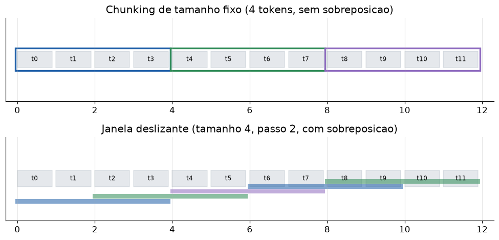

# Lição 056 — Chunking e estratégias de indexação

> **Módulo:** M07 — RAG e Vector DBs · **Ordem de estudo:** 56 · **Tempo:** ~50 min
> **Pré-requisitos:** [055] Fundamentos de RAG
> **Classificação:** complemento de aprofundamento à ementa

> **Convenção de formatação:** matemática em LaTeX (`$...$` inline, `$$...$$` em
> destaque, render nativo na pré-visualização do VS Code); figuras reprodutíveis
> geradas por `tools/figuras/gerar_figuras_m07.py` e incorporadas por caminho
> relativo `assets/<NNN>-<slug>/<nome>.png`; blocos ```python só para código e
> saída.

## Seção_Teórica

### Motivação

Na Lição 055 recuperávamos **documentos inteiros**. Em produção isso quase nunca
funciona: documentos reais (um manual, uma página de FAQ, um contrato) misturam
muitos assuntos, e jogar a página inteira no contexto traz **ruído**, gasta
tokens e dilui o trecho que de fato responde à pergunta. Pior: o **limite de
contexto** do LLM e o **custo por token** (Lição 051) tornam impraticável enfiar
documentos longos no prompt.

A solução é o **chunking**: quebrar os documentos em pedaços menores e
indexáveis, de modo que a recuperação devolva exatamente o trecho relevante. As
duas decisões centrais são **como cortar** (tamanho fixo? sobreposto? por
sentença?) e **como indexar** (que estrutura permite achar um chunk rápido). Essas
escolhas, feitas antes de qualquer LLM entrar em cena, determinam o teto de
qualidade do sistema inteiro.

### Princípio de funcionamento

Um chunk é uma janela sobre a sequência de tokens. O **tamanho** $w$ controla a
granularidade: chunks pequenos são precisos mas podem cortar uma ideia ao meio;
chunks grandes preservam contexto mas voltam a trazer ruído. Para não perder
informação que cai na **borda**, usamos uma **janela deslizante** com passo $s <
w$, gerando chunks que se **sobrepõem** em $w - s$ tokens. O número de chunks de
uma sequência de $n$ tokens é aproximadamente

$$\left\lceil \frac{n - w}{s} \right\rceil + 1$$

quando há sobreposição (passo $s$), contra $\lceil n/w \rceil$ no corte fixo sem
sobreposição.

Para **indexar** os chunks, a estrutura clássica esparsa é o **índice invertido**:
um mapa de cada termo para a lista de chunks que o contêm (as *postings*). Uma
busca por vários termos vira a **interseção** das postings — barata e exata. (No
lado denso, cada chunk vira um vetor e a busca usa índices como o HNSW da Lição
038; combinamos os dois na Lição 059.)



*Figura 1 — Em cima, chunks de tamanho fixo particionam o documento sem sobreposição; embaixo, a janela deslizante (passo menor que o tamanho) gera chunks que compartilham tokens, preservando o contexto da borda. Gerada por `tools/figuras/gerar_figuras_m07.py`.*

---

### Conceito central 1 — Granularidade do chunk

A granularidade decide o que entra no contexto. Recuperar o **chunk certo** em vez
do documento inteiro entrega um trecho focado, com a mesma evidência e muito menos
ruído e tokens.

#### Exemplo_Resolvido 1.1

```python
import re

def tokenizar(t):
    return set(re.findall(r"[a-z0-9]+", t.lower()))

documento = ("a garantia do produto e de 12 meses. "
             "o suporte funciona de segunda a sexta.")

def chunk_por_sentenca(texto):
    return [s.strip() for s in texto.split(".") if s.strip()]

chunks = chunk_por_sentenca(documento)
pergunta = "quantos meses de garantia"
q = tokenizar(pergunta)
score_doc = len(q & tokenizar(documento))
melhor = max(range(len(chunks)), key=lambda i: len(q & tokenizar(chunks[i])))
print("score doc inteiro:", score_doc)
print("melhor chunk:", melhor, "->", chunks[melhor])
```

**Explicação passo a passo:**
- **Bloco 1 (`tokenizar`):** conjunto de termos minúsculos.
- **Bloco 2 (`documento`/`chunk_por_sentenca`):** parte o documento em duas sentenças (uma por ponto final).
- **Bloco 3 (`score_doc`/`melhor`):** o documento inteiro casa 3 termos, mas isso inclui a sentença irrelevante de suporte; o melhor chunk isola só a sentença da garantia.
- **Bloco 4 (`print`):** o chunk 0 entrega o trecho focado que responde à pergunta, sem arrastar o resto do documento para o prompt.

**Saída esperada:**
```
score doc inteiro: 3
melhor chunk: 0 -> a garantia do produto e de 12 meses
```

---

### Conceito central 2 — Tamanho fixo vs sobreposição

Cortes de **tamanho fixo** são simples, mas a borda pode separar termos que só
fazem sentido juntos. A **janela deslizante** (passo $<$ tamanho) cria chunks que
se sobrepõem, garantindo que algum chunk contenha o trecho inteiro.

#### Exemplo_Resolvido 2.1

```python
tokens = ["garantia", "cobre", "defeito", "de", "fabrica"]
pergunta = {"defeito", "fabrica"}

# Tamanho fixo (3): a borda separa "defeito" e "fabrica".
fixo = [tokens[i:i + 3] for i in range(0, len(tokens), 3)]

# Janela deslizante (tamanho 3, passo 1): uma janela contem os dois termos.
sob, i = [], 0
while i < len(tokens):
    sob.append(tokens[i:i + 3])
    if i + 3 >= len(tokens):
        break
    i += 1

def melhor_overlap(chunks):
    return max(len(pergunta & set(c)) for c in chunks)

print("fixo:", [" ".join(c) for c in fixo])
print("sobreposto:", [" ".join(c) for c in sob])
print("melhor overlap fixo:", melhor_overlap(fixo))
print("melhor overlap sobreposto:", melhor_overlap(sob))
```

**Explicação passo a passo:**
- **Bloco 1 (`tokens`/`pergunta`):** a resposta exige os termos `defeito` e `fabrica`, que estão adjacentes no fim.
- **Bloco 2 (`fixo`):** o corte fixo de 3 separa `defeito` (chunk 0) de `fabrica` (chunk 1).
- **Bloco 3 (`sob`):** a janela deslizante de passo 1 produz `defeito de fabrica`, que contém ambos.
- **Bloco 4 (`print`):** o melhor overlap sobe de 1 (fixo) para 2 (sobreposto) — a sobreposição recuperou o trecho que a borda havia partido.

**Saída esperada:**
```
fixo: ['garantia cobre defeito', 'de fabrica']
sobreposto: ['garantia cobre defeito', 'cobre defeito de', 'defeito de fabrica']
melhor overlap fixo: 1
melhor overlap sobreposto: 2
```

---

### Conceito central 3 — Índice invertido

O **índice invertido** mapeia cada termo às postings (chunks que o contêm).
Buscar por vários termos é interseção de postings — a estrutura por trás da busca
esparsa que reaparece no BM25 da Lição 059.

#### Exemplo_Resolvido 3.1

```python
import re

def tokenizar(t):
    return re.findall(r"[a-z0-9]+", t.lower())

chunks = {
    "c0": "erro de conexao com o servidor",
    "c1": "erro de autenticacao no login",
    "c2": "timeout de conexao na rede",
}

indice = {}
for cid in sorted(chunks):
    for termo in sorted(set(tokenizar(chunks[cid]))):
        indice.setdefault(termo, []).append(cid)

print("termo 'erro' ->", indice["erro"])
print("termo 'conexao' ->", indice["conexao"])
print("termo 'de' ->", indice["de"])
```

**Explicação passo a passo:**
- **Bloco 1 (`tokenizar`):** lista de termos (sem deduplicar; o `set` vem depois).
- **Bloco 2 (`chunks`):** três chunks com termos parcialmente compartilhados.
- **Bloco 3 (laço):** percorre chunks e termos em ordem, anexando o id de cada chunk às postings do termo.
- **Bloco 4 (`print`):** `erro` aparece em `c0`/`c1`, `conexao` em `c0`/`c2` e `de` nos três — exatamente o que um índice invertido permite consultar em $O(1)$ por termo.

**Saída esperada:**
```
termo 'erro' -> ['c0', 'c1']
termo 'conexao' -> ['c0', 'c2']
termo 'de' -> ['c0', 'c1', 'c2']
```

## Seção_Prática

> **Como reproduzir:** execute cada solução de referência com
> `python trilha/solucoes/056-chunking-indexacao/solucao_<n>.py` e compare a saída
> com o arquivo `.saida.txt` correspondente. Os enunciados/esqueletos ficam em
> `trilha/pratica/056-chunking-indexacao/exercicio_<n>.py`.

### Exercício 1 — Chunking de tamanho fixo
- **Entrada inicial / setup:** o `texto` de 17 tokens (dado no esqueleto).
- **Passos de execução:** implemente `tokenizar(t)` e `chunk_fixo(tokens, tamanho)` (blocos contíguos sem sobreposição); com `tamanho=5`, imprima `"c<i>: <tokens>"` por chunk e `"n_chunks: <n>"`.
- **Critério de conclusão (binário):** a saída é **exatamente** igual a `solucao_1.saida.txt` (4 chunks, o último com 2 tokens); qualquer divergência reprova.
- **Solução de referência:** `trilha/solucoes/056-chunking-indexacao/solucao_1.py`
- **Saída esperada:** `trilha/solucoes/056-chunking-indexacao/solucao_1.saida.txt`

### Exercício 2 — Janela deslizante com sobreposição
- **Entrada inicial / setup:** o `texto` `"termo a termo b termo c termo d termo e termo f"` (dado no esqueleto).
- **Passos de execução:** implemente `chunk_sobreposto(tokens, tamanho, passo)` que avança `passo` tokens por vez e para quando um chunk alcança o fim; com `tamanho=4` e `passo=2`, imprima `"j<i>: <tokens>"` e `"n_chunks: <n>"`.
- **Critério de conclusão (binário):** a saída é **exatamente** igual a `solucao_2.saida.txt` (5 chunks, cada par consecutivo compartilhando 2 tokens); qualquer divergência reprova.
- **Solução de referência:** `trilha/solucoes/056-chunking-indexacao/solucao_2.py`
- **Saída esperada:** `trilha/solucoes/056-chunking-indexacao/solucao_2.saida.txt`

### Exercício 3 — Índice invertido e busca por interseção
- **Entrada inicial / setup:** o dicionário `chunks` com `c0`–`c2` (dado no esqueleto).
- **Passos de execução:** implemente `construir_indice(chunks)` (postings termo → chunks, em ordem) e `buscar(indice, consulta)` (interseção ordenada das postings); imprima as postings de `windows`, de `instalacao` e o resultado de `buscar "instalacao windows"`.
- **Critério de conclusão (binário):** a saída é **exatamente** igual a `solucao_3.saida.txt` (`windows -> ['c0', 'c2']`, `instalacao -> ['c0', 'c1']`, interseção `['c0']`); qualquer divergência reprova.
- **Solução de referência:** `trilha/solucoes/056-chunking-indexacao/solucao_3.py`
- **Saída esperada:** `trilha/solucoes/056-chunking-indexacao/solucao_3.saida.txt`
