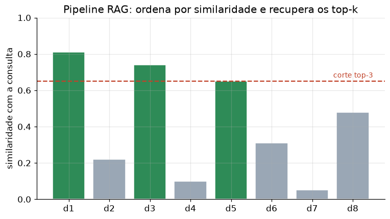

# Lição 057 — Pipeline RAG básico: retrieve-augment-generate

> **Módulo:** M07 — RAG e Vector DBs · **Ordem de estudo:** 57 · **Tempo:** ~55 min
> **Pré-requisitos:** [056] Chunking e estratégias de indexação
> **Classificação:** coberto pela ementa

> **Convenção de formatação:** matemática em LaTeX (`$...$` inline, `$$...$$` em
> destaque, render nativo na pré-visualização do VS Code); figuras reprodutíveis
> geradas por `tools/figuras/gerar_figuras_m07.py` e incorporadas por caminho
> relativo `assets/<NNN>-<slug>/<nome>.png`; blocos ```python só para código e
> saída.

## Seção_Teórica

### Motivação

Já temos as peças: documentos quebrados em chunks (Lição 056) e a noção de
recuperar o trecho relevante (Lição 055). Falta montar o **pipeline completo** e
trocar a recuperação por sobreposição de termos — que ignora sinônimos e pesa
todos os termos igual — por **recuperação densa**: representar texto como vetores
e medir relevância por **ângulo** entre eles. É o coração de qualquer sistema RAG
de produção, onde os vetores vêm de modelos de embedding (Lição 034) em vez do
bag-of-words didático que usaremos aqui.

A meta desta lição é ter, ao final, um pipeline `recuperar → montar_prompt →
gerar` que roda de ponta a ponta, é **determinístico** e expõe claramente onde
cada etapa pode falhar.

### Princípio de funcionamento

Cada texto vira um vetor $\mathbf{v}$ num espaço de dimensão igual ao tamanho do
vocabulário (no didático, a contagem de cada termo). A relevância entre a consulta
$\mathbf{q}$ e um documento $\mathbf{d}$ é a **similaridade do cosseno**:

$$\cos(\mathbf{q}, \mathbf{d}) = \frac{\mathbf{q} \cdot \mathbf{d}}{\lVert \mathbf{q} \rVert \, \lVert \mathbf{d} \rVert}$$

que vale 1 quando apontam na mesma direção e 0 quando são ortogonais. Como o
cosseno **normaliza pelo comprimento**, documentos longos não levam vantagem
indevida — diferente da contagem bruta de termos.

A recuperação **top-k** ordena os documentos por cosseno decrescente e devolve os
$k$ primeiros (com desempate por id, para ser reprodutível). Em seguida o
**augment** concatena os trechos recuperados num bloco de contexto, e o
**generate** produz a resposta condicionada a esse contexto. Trocar o gerador-stub
por uma chamada de API (Lição 051) é a única peça que muda em produção.



*Figura 1 — A recuperação ordena os documentos pela similaridade com a consulta e corta nos top-k; abaixo da linha de corte, os documentos não entram no contexto. Gerada por `tools/figuras/gerar_figuras_m07.py`.*

---

### Conceito central 1 — Representação vetorial e cosseno

Texto vira vetor; relevância vira ângulo. O cosseno mede **direção**, não
magnitude, então capta sobreposição de conteúdo independentemente do tamanho.

#### Exemplo_Resolvido 1.1

```python
import re
import numpy as np

def tokenizar(t):
    return re.findall(r"[a-z0-9]+", t.lower())

vocab = ["cachorro", "gato", "late", "mia", "python"]
idx = {t: i for i, t in enumerate(vocab)}

def vetorizar(texto):
    v = np.zeros(len(vocab))
    for tok in tokenizar(texto):
        if tok in idx:
            v[idx[tok]] += 1.0
    return v

def cosseno(a, b):
    return float(a @ b / (np.linalg.norm(a) * np.linalg.norm(b)))

q = vetorizar("gato e cachorro")
d1 = vetorizar("o cachorro late")
d2 = vetorizar("python e codigo")
print("vetor q:", q.tolist())
print("cos(q,d1): %.4f" % cosseno(q, d1))
print("cos(q,d2): %.4f" % cosseno(q, d2))
```

**Explicação passo a passo:**
- **Bloco 1 (`tokenizar`/`vocab`):** vocabulário fixo de 5 termos; termos fora dele são ignorados.
- **Bloco 2 (`vetorizar`):** conta cada termo do vocabulário no texto.
- **Bloco 3 (`cosseno`):** produto interno normalizado pelas magnitudes.
- **Bloco 4 (`print`):** `q` ativa `cachorro` e `gato`; `d1` compartilha `cachorro` (cosseno 0.5), enquanto `d2` não compartilha nenhum termo do vocabulário (cosseno 0).

**Saída esperada:**
```
vetor q: [1.0, 1.0, 0.0, 0.0, 0.0]
cos(q,d1): 0.5000
cos(q,d2): 0.0000
```

---

### Conceito central 2 — Recuperação top-k

A recuperação ordena por cosseno decrescente e corta nos $k$ melhores. O desempate
por id mantém a saída **determinística** quando dois documentos empatam.

#### Exemplo_Resolvido 2.1

```python
import re
import numpy as np

corpus = {
    "d1": "gato e cachorro sao animais",
    "d2": "python e java sao linguagens",
    "d3": "o gato dorme no sofa",
}

def tokenizar(t):
    return re.findall(r"[a-z0-9]+", t.lower())

vocab = sorted({tok for txt in corpus.values() for tok in tokenizar(txt)})
idx = {t: i for i, t in enumerate(vocab)}

def vetorizar(texto):
    v = np.zeros(len(vocab))
    for tok in tokenizar(texto):
        if tok in idx:
            v[idx[tok]] += 1.0
    return v

def cosseno(a, b):
    na, nb = np.linalg.norm(a), np.linalg.norm(b)
    return 0.0 if na == 0 or nb == 0 else float(a @ b / (na * nb))

def recuperar(pergunta, k=2):
    qv = vetorizar(pergunta)
    r = sorted(((d, cosseno(qv, vetorizar(corpus[d]))) for d in corpus),
               key=lambda t: (-t[1], t[0]))
    return r[:k]

pergunta = "o gato"
print("top-2 para:", repr(pergunta))
for d, s in recuperar(pergunta, 2):
    print(f"{d} {s:.4f}")
```

**Explicação passo a passo:**
- **Bloco 1 (`corpus`):** três documentos; `d1` e `d3` mencionam `gato`.
- **Bloco 2 (`vocab`/`vetorizar`):** vocabulário derivado do corpus, em ordem.
- **Bloco 3 (`recuperar`):** ordena por `(-cosseno, id)` e devolve os 2 melhores.
- **Bloco 4 (`print`):** `d3` (mais curto, então o termo `gato` pesa mais no cosseno) vem antes de `d1`; `d2`, sem `gato`, fica de fora.

**Saída esperada:**
```
top-2 para: 'o gato'
d3 0.6325
d1 0.3162
```

---

### Conceito central 3 — Montagem do contexto e geração

O `augment` concatena os trechos num bloco de contexto; o `generate` responde a
partir dele. Manter as fontes ao lado da resposta preserva a atribuição da
Lição 055.

#### Exemplo_Resolvido 3.1

```python
import re
import numpy as np

corpus = {
    "d1": "a troca de produtos e feita em ate sete dias",
    "d2": "o frete gratis vale para compras acima de cem reais",
}

def tokenizar(t):
    return re.findall(r"[a-z0-9]+", t.lower())

vocab = sorted({tok for txt in corpus.values() for tok in tokenizar(txt)})
idx = {t: i for i, t in enumerate(vocab)}

def vetorizar(texto):
    v = np.zeros(len(vocab))
    for tok in tokenizar(texto):
        if tok in idx:
            v[idx[tok]] += 1.0
    return v

def cosseno(a, b):
    na, nb = np.linalg.norm(a), np.linalg.norm(b)
    return 0.0 if na == 0 or nb == 0 else float(a @ b / (na * nb))

def recuperar(pergunta, k=1):
    qv = vetorizar(pergunta)
    r = sorted(((d, cosseno(qv, vetorizar(corpus[d]))) for d in corpus),
               key=lambda t: (-t[1], t[0]))
    return r[:k]

pergunta = "quantos dias para troca"
rec = recuperar(pergunta, k=1)
contexto = "\n".join(f"[{d}] {corpus[d]}" for d, _ in rec)
print("Contexto:")
print(contexto)
print("Pergunta:", pergunta)
print("Resposta:", corpus[rec[0][0]])
```

**Explicação passo a passo:**
- **Bloco 1 (`corpus`):** dois documentos sobre assuntos distintos (troca e frete).
- **Bloco 2 (`vetorizar`/`cosseno`):** mesma recuperação densa das seções anteriores.
- **Bloco 3 (`recuperar`):** pega o único trecho mais relevante (`k=1`).
- **Bloco 4 (`print`):** monta o contexto rotulado por id e gera a resposta a partir dele — o documento de frete nem entra no prompt.

**Saída esperada:**
```
Contexto:
[d1] a troca de produtos e feita em ate sete dias
Pergunta: quantos dias para troca
Resposta: a troca de produtos e feita em ate sete dias
```

## Seção_Prática

> **Como reproduzir:** execute cada solução de referência com
> `python trilha/solucoes/057-pipeline-rag-basico/solucao_<n>.py` e compare a saída
> com o arquivo `.saida.txt` correspondente. Os enunciados/esqueletos ficam em
> `trilha/pratica/057-pipeline-rag-basico/exercicio_<n>.py`.

### Exercício 1 — Similaridade do cosseno
- **Entrada inicial / setup:** o `corpus` de 3 documentos e a pergunta `"o gato e o cachorro"` (dados no esqueleto).
- **Passos de execução:** construa o vocabulário ordenado, implemente `vetorizar(texto)` (bag-of-words) e `cosseno(a, b)`; imprima `"<id> <cosseno 4 casas>"` para cada documento em ordem de id.
- **Critério de conclusão (binário):** a saída é **exatamente** igual a `solucao_1.saida.txt` (`d3` é o mais similar com `0.7715`); qualquer divergência reprova.
- **Solução de referência:** `trilha/solucoes/057-pipeline-rag-basico/solucao_1.py`
- **Saída esperada:** `trilha/solucoes/057-pipeline-rag-basico/solucao_1.saida.txt`

### Exercício 2 — Recuperação top-k por cosseno
- **Entrada inicial / setup:** o `corpus` de 4 documentos e a pergunta `"linguagem python"` (dados no esqueleto).
- **Passos de execução:** implemente `recuperar(pergunta, k=2)` que ordena por `(-cosseno, id)`; imprima `"<id> <cosseno 4 casas>"` para os 2 melhores.
- **Critério de conclusão (binário):** a saída é **exatamente** igual a `solucao_2.saida.txt` (`d2 0.5774` e `d4 0.2887`); qualquer divergência reprova.
- **Solução de referência:** `trilha/solucoes/057-pipeline-rag-basico/solucao_2.py`
- **Saída esperada:** `trilha/solucoes/057-pipeline-rag-basico/solucao_2.saida.txt`

### Exercício 3 — Pipeline completo retrieve-augment-generate
- **Entrada inicial / setup:** o `corpus` de 3 documentos (planos e suporte) e a pergunta `"quanto custa o plano basico"` (dados no esqueleto).
- **Passos de execução:** implemente `recuperar(k=2)`, `montar_prompt` (bloco `Contexto:` com `[id] texto` por linha, depois `Pergunta:` e `Resposta:`) e `gerar` (texto do melhor documento); imprima o prompt, `---`, `"fontes: <lista>"` e `"resposta: <texto>"`.
- **Critério de conclusão (binário):** a saída é **exatamente** igual a `solucao_3.saida.txt` (fontes `['d1', 'd2']` e resposta do plano básico); qualquer divergência reprova.
- **Solução de referência:** `trilha/solucoes/057-pipeline-rag-basico/solucao_3.py`
- **Saída esperada:** `trilha/solucoes/057-pipeline-rag-basico/solucao_3.saida.txt`
