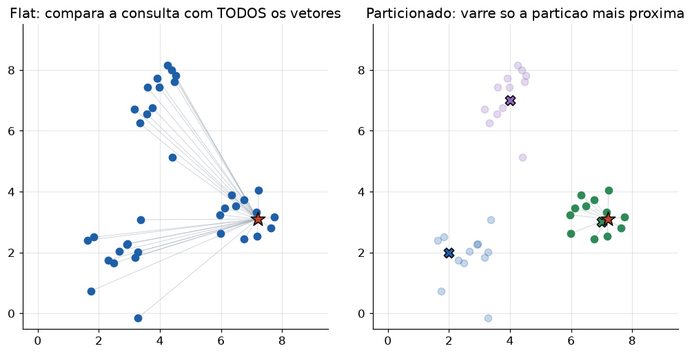

# Lição 058 — Vector databases (FAISS, pgvector) — por dentro

> **Módulo:** M07 — RAG e Vector DBs · **Ordem de estudo:** 58 · **Tempo:** ~55 min
> **Pré-requisitos:** [038] HNSW por dentro · [056] Chunking e estratégias de indexação
> **Classificação:** complemento de aprofundamento à ementa

> **Convenção de formatação:** matemática em LaTeX (`$...$` inline, `$$...$$` em
> destaque, render nativo na pré-visualização do VS Code); figuras reprodutíveis
> geradas por `tools/figuras/gerar_figuras_m07.py` e incorporadas por caminho
> relativo `assets/<NNN>-<slug>/<nome>.png`; blocos ```python só para código e
> saída.

## Seção_Teórica

### Motivação

No pipeline da Lição 057 recalculamos a similaridade contra **todos** os
documentos a cada consulta. Com milhares de chunks isso ainda roda; com milhões,
não. Um **vector database** (FAISS, pgvector, Qdrant, Milvus) é a peça de infra
que armazena os vetores e responde "quais são os $k$ mais próximos?" rapidamente,
mesmo em escala — e que, no caso do pgvector, junta isso ao **filtro por
metadados** de um banco relacional.

Não vamos rodar nenhum desses serviços aqui. Vamos implementar, em Python puro +
numpy, os **três mecanismos** que eles usam por dentro: o índice **flat** (exato),
o índice **particionado** (aproximado, mais rápido) e a **filtragem por
metadados**. Entender esses mecanismos é o que permite escolher e ajustar um banco
vetorial com critério, em vez de aceitar defaults.

### Princípio de funcionamento

O **índice flat** guarda todos os vetores e, na consulta, mede a distância a cada
um — busca **exata** ao custo de $O(n)$ comparações. É o `IndexFlatL2` do FAISS e
o baseline de recall 100%.

O **índice particionado (IVF)** primeiro agrupa os vetores em $c$ partições, cada
uma com um **centroide**. Na consulta, ele acha o centroide mais próximo e varre
**apenas** os pontos daquela partição (ou das `nprobe` mais próximas). O custo cai
para cerca de

$$c + \texttt{nprobe} \cdot \frac{n}{c}$$

comparações, contra $n$ no flat. O preço é que a busca vira **aproximada**: se o
vizinho verdadeiro caiu numa partição não visitada, ele é perdido. `nprobe`
controla esse trade-off recall × velocidade — exatamente como o `ef` do HNSW
(Lição 038).

Por fim, num banco como o **pgvector**, cada vetor convive com **metadados**
(idioma, data, dono). A busca aplica primeiro um **filtro** (cláusula `WHERE`) e só
então ordena os candidatos por similaridade — essencial para multi-tenancy e para
restringir o escopo da resposta.



*Figura 1 — À esquerda, o índice flat compara a consulta (estrela) com todos os vetores. À direita, o índice particionado varre apenas a partição cujo centroide está mais próximo, reduzindo as comparações. Gerada por `tools/figuras/gerar_figuras_m07.py`.*

---

### Conceito central 1 — Índice flat (exato)

O flat varre tudo: máxima precisão, custo linear. É o padrão-ouro de recall e o
baseline contra o qual medimos qualquer índice aproximado.

#### Exemplo_Resolvido 1.1

```python
import numpy as np

base = {"a": [0.0, 0.0], "b": [3.0, 0.0], "c": [0.0, 4.0]}
q = [1.0, 1.0]

def l2(u, v):
    u, v = np.array(u, float), np.array(v, float)
    return float(np.sqrt(((u - v) ** 2).sum()))

for vid in sorted(base):
    print(vid, "%.4f" % l2(q, base[vid]))
nn = min(sorted(base), key=lambda k: (l2(q, base[k]), k))
print("nn:", nn)
```

**Explicação passo a passo:**
- **Bloco 1 (`base`/`q`):** três vetores 2D e a consulta.
- **Bloco 2 (`l2`):** distância euclidiana com numpy.
- **Bloco 3 (laço):** imprime a distância da consulta a cada vetor — o flat calcula todas.
- **Bloco 4 (`nn`):** o vizinho mais próximo é `a` (distância $\sqrt{2}$), com desempate por id.

**Saída esperada:**
```
a 1.4142
b 2.2361
c 3.1623
nn: a
```

---

### Conceito central 2 — Índice particionado (IVF)

O IVF agrupa os vetores em partições e, na consulta, varre só a(s) partição(ões)
mais próxima(s). Menos comparações, ao custo de poder **errar** o vizinho — o
trade-off controlado por `nprobe`.

#### Exemplo_Resolvido 2.1

```python
import numpy as np

def l2(u, v):
    u, v = np.array(u, float), np.array(v, float)
    return float(np.sqrt(((u - v) ** 2).sum()))

centroides = {"c0": [0.0, 0.0], "c1": [10.0, 10.0]}
pontos = {"p1": [0.0, 1.0], "p2": [1.0, 0.0], "p3": [10.0, 11.0], "p4": [11.0, 10.0]}

clusters = {c: [] for c in centroides}
for pid in sorted(pontos):
    c = min(sorted(centroides), key=lambda c: (l2(pontos[pid], centroides[c]), c))
    clusters[c].append(pid)

q = [10.0, 9.0]
cprox = min(sorted(centroides), key=lambda c: (l2(q, centroides[c]), c))
candidatos = clusters[cprox]
nn = min(candidatos, key=lambda p: (l2(q, pontos[p]), p))
print("clusters:", clusters)
print("centroide probado:", cprox)
print("candidatos:", candidatos)
print("nn:", nn, "comparacoes:", len(centroides) + len(candidatos))
```

**Explicação passo a passo:**
- **Bloco 1 (`l2`):** mesma distância euclidiana.
- **Bloco 2 (`centroides`/`pontos`):** dois grupos bem separados, um perto da origem e outro perto de (10,10).
- **Bloco 3 (laço de atribuição):** cada ponto entra na partição do centroide mais próximo.
- **Bloco 4 (busca):** a consulta cai em `c1`; varremos só `p3`/`p4`, achamos `p4` e gastamos 4 comparações (2 centroides + 2 pontos) em vez das 6 do flat.

**Saída esperada:**
```
clusters: {'c0': ['p1', 'p2'], 'c1': ['p3', 'p4']}
centroide probado: c1
candidatos: ['p3', 'p4']
nn: p4 comparacoes: 4
```

---

### Conceito central 3 — Metadados e filtragem

Num banco vetorial real, cada vetor carrega metadados. A busca filtra primeiro
(`WHERE`) e ordena depois por similaridade — restringindo o escopo a um idioma,
um período ou um inquilino.

#### Exemplo_Resolvido 3.1

```python
registros = [
    {"id": "r1", "meta": {"tipo": "faq"}},
    {"id": "r2", "meta": {"tipo": "doc"}},
    {"id": "r3", "meta": {"tipo": "faq"}},
]

def filtrar(filtro):
    return [r["id"] for r in registros
            if all(r["meta"].get(k) == v for k, v in filtro.items())]

print("tipo=faq:", filtrar({"tipo": "faq"}))
print("tipo=doc:", filtrar({"tipo": "doc"}))
print("sem filtro:", filtrar({}))
```

**Explicação passo a passo:**
- **Bloco 1 (`registros`):** três registros com um metadado `tipo`.
- **Bloco 2 (`filtrar`):** mantém os registros cujos metadados casam com **todos** os pares do filtro.
- **Bloco 3 (`print`):** `tipo=faq` devolve `r1`/`r3`; um filtro vazio devolve tudo — a base sobre a qual a busca vetorial então ordena.

**Saída esperada:**
```
tipo=faq: ['r1', 'r3']
tipo=doc: ['r2']
sem filtro: ['r1', 'r2', 'r3']
```

## Seção_Prática

> **Como reproduzir:** execute cada solução de referência com
> `python trilha/solucoes/058-vector-databases/solucao_<n>.py` e compare a saída
> com o arquivo `.saida.txt` correspondente. Os enunciados/esqueletos ficam em
> `trilha/pratica/058-vector-databases/exercicio_<n>.py`.

### Exercício 1 — Índice flat e contagem de comparações
- **Entrada inicial / setup:** a `base` de 4 vetores 2D e a `consulta = [4, 4]` (dados no esqueleto).
- **Passos de execução:** implemente `l2(a, b)` e devolva os 2 vetores mais próximos por `(distância, id)`; imprima `"<id> dist=<4 casas>"` e `"comparacoes: <n>"` (igual ao tamanho da base).
- **Critério de conclusão (binário):** a saída é **exatamente** igual a `solucao_1.saida.txt` (`v4 dist=1.4142`, `v2 dist=2.0000`, `comparacoes: 4`); qualquer divergência reprova.
- **Solução de referência:** `trilha/solucoes/058-vector-databases/solucao_1.py`
- **Saída esperada:** `trilha/solucoes/058-vector-databases/solucao_1.saida.txt`

### Exercício 2 — Índice particionado (IVF, nprobe=1)
- **Entrada inicial / setup:** a `base` de 9 vetores, os 3 `centroides` e a `consulta = [4, 6]` (dados no esqueleto).
- **Passos de execução:** atribua cada vetor ao centroide mais próximo; na busca, probe só o cluster do centroide mais próximo da consulta e compare o top-1 IVF com o flat; imprima centroide probado, ambos os top-1 (com distâncias), `"comparacoes ivf: <n> | flat: <n>"` e `"resultados coincidem: <bool>"`.
- **Critério de conclusão (binário):** a saída é **exatamente** igual a `solucao_2.saida.txt` (top-1 `v8`, `comparacoes ivf: 6 | flat: 9`, coincidem `True`); qualquer divergência reprova.
- **Solução de referência:** `trilha/solucoes/058-vector-databases/solucao_2.py`
- **Saída esperada:** `trilha/solucoes/058-vector-databases/solucao_2.saida.txt`

### Exercício 3 — Filtragem por metadados + busca vetorial
- **Entrada inicial / setup:** os `registros` com `vec` e `meta` (idioma, ano) e a `consulta = [1, 0]` (dados no esqueleto).
- **Passos de execução:** implemente `cosseno(a, b)` e `buscar(consulta, filtro, k=3)` que filtra por metadados (todos os pares) e ordena por `(-cosseno, id)`; imprima o resultado para `{}`, `{idioma: pt}` e `{idioma: pt, ano: 2023}`.
- **Critério de conclusão (binário):** a saída é **exatamente** igual a `solucao_3.saida.txt` (sem filtro `['r1','r2','r3']`; `idioma=pt` → `['r1','r3','r4']`; com `ano=2023` → `['r1','r4']`); qualquer divergência reprova.
- **Solução de referência:** `trilha/solucoes/058-vector-databases/solucao_3.py`
- **Saída esperada:** `trilha/solucoes/058-vector-databases/solucao_3.saida.txt`
