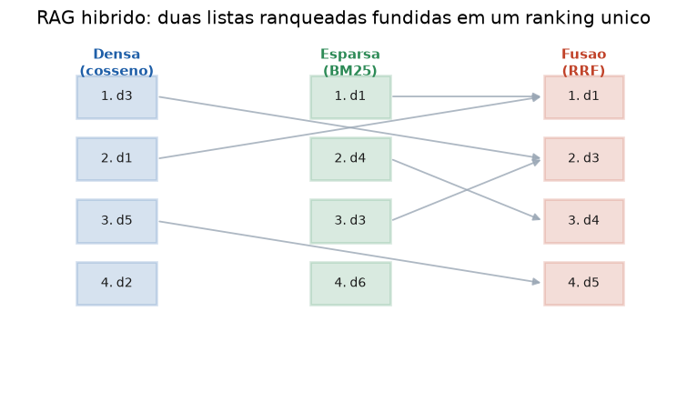

# Lição 059 — RAG híbrido: denso + esparso (BM25) e fusão

> **Módulo:** M07 — RAG e Vector DBs · **Ordem de estudo:** 59 · **Tempo:** ~55 min
> **Pré-requisitos:** [057] Pipeline RAG básico · [058] Vector databases
> **Classificação:** complemento de aprofundamento à ementa

> **Convenção de formatação:** matemática em LaTeX (`$...$` inline, `$$...$$` em
> destaque, render nativo na pré-visualização do VS Code); figuras reprodutíveis
> geradas por `tools/figuras/gerar_figuras_m07.py` e incorporadas por caminho
> relativo `assets/<NNN>-<slug>/<nome>.png`; blocos ```python só para código e
> saída.

## Seção_Teórica

### Motivação

A recuperação densa por cosseno (Lição 057) capta **semântica**: encontra
"devolução do valor" para a consulta "reembolso" mesmo sem repetir a palavra. Mas
ela tropeça justamente onde a correspondência **lexical** importa: códigos de erro
(`X502`), nomes próprios, SKUs, termos técnicos raros — coisas que o embedding
"dilui" mas que precisam casar **exatamente**. A recuperação **esparsa** (BM25),
herdeira do índice invertido da Lição 056, faz o oposto: é imbatível no casamento
exato de termos raros, e cega para sinônimos.

O **RAG híbrido** usa as duas e **funde** os resultados, ficando com o melhor de
cada mundo. É a configuração que mais frequentemente vence em benchmarks de
recuperação e a receita padrão de pipelines de produção sérios.

### Princípio de funcionamento

O **BM25** pontua um documento $D$ para uma consulta $Q$ somando, sobre os termos
$t \in Q$:

$$\text{BM25}(Q, D) = \sum_{t \in Q} \text{IDF}(t) \cdot \frac{f(t, D)\,(k_1 + 1)}{f(t, D) + k_1\left(1 - b + b\,\frac{|D|}{\text{avgdl}}\right)}$$

onde $f(t, D)$ é a frequência do termo, $|D|$ o comprimento do documento,
$\text{avgdl}$ o comprimento médio, e

$$\text{IDF}(t) = \ln\!\left(1 + \frac{N - n_t + 0.5}{n_t + 0.5}\right)$$

dá mais peso a termos **raros** ($n_t$ = número de documentos com $t$). O parâmetro
$k_1$ **satura** a contribuição de repetir um termo (a 10ª ocorrência vale pouco
mais que a 3ª), e $b$ controla a **penalização por comprimento**.

Para combinar os rankings denso e esparso, as **escalas** das pontuações não são
comparáveis (cosseno em $[0,1]$, BM25 em $[0, \infty)$). A **Reciprocal Rank
Fusion (RRF)** resolve isso usando só as **posições**:

$$\text{RRF}(d) = \sum_{r \in \text{rankings}} \frac{1}{k + \text{pos}_r(d)}$$

com $k$ tipicamente $60$. Um documento bem posicionado nos **dois** rankings sobe;
um que aparece em só um ainda contribui, mas menos. Simples, robusto e sem
calibração de escala.



*Figura 1 — A lista densa (cosseno) e a esparsa (BM25) ordenam os documentos de formas diferentes; a RRF combina as posições num único ranking, promovendo o que vai bem em ambas. Gerada por `tools/figuras/gerar_figuras_m07.py`.*

---

### Conceito central 1 — BM25 (recuperação esparsa)

O BM25 pondera cada termo da consulta pela sua raridade (IDF), satura a
frequência (k1) e normaliza pelo comprimento do documento (b). Termos raros que
casam exatamente dominam o score.

#### Exemplo_Resolvido 1.1

```python
import collections
import math
import re

corpus = {"d1": "banana banana banana", "d2": "banana maca"}

def tok(t):
    return re.findall(r"[a-z0-9]+", t.lower())

docs = {d: tok(corpus[d]) for d in corpus}
N = len(docs)
avgdl = sum(len(v) for v in docs.values()) / N
df = collections.Counter()
for v in docs.values():
    for t in set(v):
        df[t] += 1

def idf(t):
    n = df.get(t, 0)
    return math.log(1 + (N - n + 0.5) / (n + 0.5))

def bm25(query, d, k1=1.5, b=0.75):
    tf = collections.Counter(docs[d])
    dl = len(docs[d])
    s = 0.0
    for t in tok(query):
        if t not in df:
            continue
        f = tf[t]
        s += idf(t) * (f * (k1 + 1)) / (f + k1 * (1 - b + b * dl / avgdl))
    return s

print("idf(banana): %.4f" % idf("banana"))
print("idf(maca): %.4f" % idf("maca"))
print("bm25('banana', d1): %.4f" % bm25("banana", "d1"))
print("bm25('maca', d2): %.4f" % bm25("maca", "d2"))
```

**Explicação passo a passo:**
- **Bloco 1 (`corpus`/`tok`):** `banana` aparece nos dois documentos; `maca` só em `d2`.
- **Bloco 2 (`df`/`idf`):** o IDF de `maca` (rara) é bem maior que o de `banana` (comum).
- **Bloco 3 (`bm25`):** soma a contribuição saturada e normalizada de cada termo.
- **Bloco 4 (`print`):** apesar de `d1` repetir `banana` três vezes, o termo raro `maca` rende a `d2` um score maior — o IDF supera a frequência bruta.

**Saída esperada:**
```
idf(banana): 0.1823
idf(maca): 0.6931
bm25('banana', d1): 0.2894
bm25('maca', d2): 0.7617
```

---

### Conceito central 2 — Complementaridade denso × esparso

Denso casa **sentido**; esparso casa **forma**. Quando a consulta parafraseia um
documento e cita o termo exato de outro, os dois rankings discordam no topo — é
aí que fundir os dois rende mais que qualquer um sozinho.

#### Exemplo_Resolvido 2.1

```python
import collections
import math
import re
import numpy as np

corpus = {
    "d1": {"texto": "gato dorme no sofa", "emb": [1.0, 0.0, 0.0]},
    "d2": {"texto": "cachorro corre no parque", "emb": [0.0, 1.0, 0.0]},
    "d3": {"texto": "carro corre na estrada", "emb": [0.0, 0.0, 1.0]},
}
consulta_texto = "felino"
consulta_emb = [1.0, 0.0, 0.0]

def tok(t):
    return re.findall(r"[a-z0-9]+", t.lower())

docs = {d: tok(corpus[d]["texto"]) for d in corpus}
N = len(docs)
avgdl = sum(len(v) for v in docs.values()) / N
df = collections.Counter()
for v in docs.values():
    for t in set(v):
        df[t] += 1

def idf(t):
    n = df.get(t, 0)
    return math.log(1 + (N - n + 0.5) / (n + 0.5))

def bm25(query, d, k1=1.5, b=0.75):
    tf = collections.Counter(docs[d])
    dl = len(docs[d])
    s = 0.0
    for t in tok(query):
        if t not in df:
            continue
        f = tf[t]
        s += idf(t) * (f * (k1 + 1)) / (f + k1 * (1 - b + b * dl / avgdl))
    return s

def cos(a, b):
    a, b = np.array(a, float), np.array(b, float)
    n = np.linalg.norm(a) * np.linalg.norm(b)
    return 0.0 if n == 0 else float(a @ b / n)

print("BM25 (lexical):")
for d in sorted(corpus):
    print(f"  {d} {bm25(consulta_texto, d):.4f}")
print("Denso (semantico):")
for d in sorted(corpus):
    print(f"  {d} {cos(consulta_emb, corpus[d]['emb']):.4f}")
```

**Explicação passo a passo:**
- **Bloco 1 (`corpus`):** cada documento tem um texto (para o BM25) e um embedding fixo de tópico (para o denso).
- **Bloco 2 (`bm25`):** a consulta `"felino"` não aparece em texto nenhum.
- **Bloco 3 (`cos`):** o embedding da consulta aponta no eixo de `d1` (felinos).
- **Bloco 4 (`print`):** o BM25 zera (nenhum casamento lexical), mas o denso recupera `d1` com cosseno 1 — sozinho, o esparso perderia a resposta.

**Saída esperada:**
```
BM25 (lexical):
  d1 0.0000
  d2 0.0000
  d3 0.0000
Denso (semantico):
  d1 1.0000
  d2 0.0000
  d3 0.0000
```

---

### Conceito central 3 — Fusão por RRF

A RRF combina rankings somando $1/(k + \text{posição})$, ignorando a escala das
pontuações. Documentos bem colocados em **ambos** os rankings vão para o topo.

#### Exemplo_Resolvido 3.1

```python
denso = ["a", "b", "c"]
esparso = ["a", "c", "b"]

def rrf(listas, k=60):
    score = {}
    for lista in listas:
        for posicao, did in enumerate(lista, start=1):
            score[did] = score.get(did, 0.0) + 1.0 / (k + posicao)
    return sorted(score.items(), key=lambda t: (-t[1], t[0]))

fusao = rrf([denso, esparso], k=60)
for did, s in fusao:
    print(f"{did} {s:.6f}")
print("fusao:", [did for did, _ in fusao])
```

**Explicação passo a passo:**
- **Bloco 1 (`denso`/`esparso`):** `a` é o primeiro nos dois rankings; `b` e `c` se alternam.
- **Bloco 2 (`rrf`):** soma o recíproco da posição em cada lista (`k=60`).
- **Bloco 3 (`print`):** `a` (topo em ambos) lidera com folga; `b` e `c` empatam (cada um é 2º em uma lista e 3º na outra) e o desempate por id põe `b` antes de `c`.

**Saída esperada:**
```
a 0.032787
b 0.032002
c 0.032002
fusao: ['a', 'b', 'c']
```

## Seção_Prática

> **Como reproduzir:** execute cada solução de referência com
> `python trilha/solucoes/059-rag-hibrido/solucao_<n>.py` e compare a saída
> com o arquivo `.saida.txt` correspondente. Os enunciados/esqueletos ficam em
> `trilha/pratica/059-rag-hibrido/exercicio_<n>.py`.

### Exercício 1 — BM25 do zero
- **Entrada inicial / setup:** o `corpus` de 3 documentos e a `query = "gato cachorro"` (dados no esqueleto).
- **Passos de execução:** implemente `idf(t)` e `bm25(query, d, k1=1.5, b=0.75)` segundo as fórmulas da teoria; imprima `"<id> <score 4 casas>"` para cada documento em ordem de id.
- **Critério de conclusão (binário):** a saída é **exatamente** igual a `solucao_1.saida.txt` (`d3` lidera com `0.8624`); qualquer divergência reprova.
- **Solução de referência:** `trilha/solucoes/059-rag-hibrido/solucao_1.py`
- **Saída esperada:** `trilha/solucoes/059-rag-hibrido/solucao_1.saida.txt`

### Exercício 2 — Complementaridade denso × esparso
- **Entrada inicial / setup:** o `corpus` com `texto` e `emb`, `consulta_texto = "reembolso"` e `consulta_emb = [1.0, 0.0]` (dados no esqueleto).
- **Passos de execução:** produza o ranking denso (cosseno com `emb`) e o esparso (BM25 sobre `texto`), cada um ordenado por `(-score, id)`; imprima as duas listas de ids e o top-1 de cada.
- **Critério de conclusão (binário):** a saída é **exatamente** igual a `solucao_2.saida.txt` (`top-1 denso: d2 | top-1 esparso: d1`); qualquer divergência reprova.
- **Solução de referência:** `trilha/solucoes/059-rag-hibrido/solucao_2.py`
- **Saída esperada:** `trilha/solucoes/059-rag-hibrido/solucao_2.saida.txt`

### Exercício 3 — Fusão por RRF
- **Entrada inicial / setup:** as listas `denso = ["d3","d1","d5","d2"]` e `esparso = ["d1","d4","d3","d6"]` (dadas no esqueleto).
- **Passos de execução:** implemente `rrf(listas, k=60)` somando `1/(k + posição)` (posição inicia em 1) e ordene por `(-score, id)`; imprima `"RRF (k=60):"`, uma linha `"<id> <score 6 casas>"` por documento e `"fusao final: <ids>"`.
- **Critério de conclusão (binário):** a saída é **exatamente** igual a `solucao_3.saida.txt` (fusão final `['d1','d3','d4','d5','d2','d6']`); qualquer divergência reprova.
- **Solução de referência:** `trilha/solucoes/059-rag-hibrido/solucao_3.py`
- **Saída esperada:** `trilha/solucoes/059-rag-hibrido/solucao_3.saida.txt`
