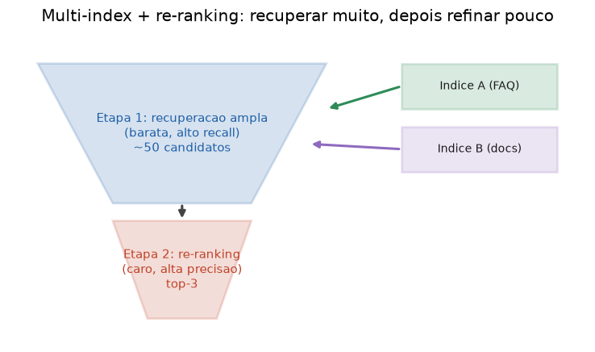

# Lição 060 — RAG multi-index e re-ranking

> **Módulo:** M07 — RAG e Vector DBs · **Ordem de estudo:** 60 · **Tempo:** ~55 min
> **Pré-requisitos:** [059] RAG híbrido: denso + esparso (BM25) e fusão
> **Classificação:** complemento de aprofundamento à ementa

> **Convenção de formatação:** matemática em LaTeX (`$...$` inline, `$$...$$` em
> destaque, render nativo na pré-visualização do VS Code); figuras reprodutíveis
> geradas por `tools/figuras/gerar_figuras_m07.py` e incorporadas por caminho
> relativo `assets/<NNN>-<slug>/<nome>.png`; blocos ```python só para código e
> saída.

## Seção_Teórica

### Motivação

Um sistema real raramente tem uma base única e homogênea. Tem **FAQs** curtas,
**documentação** longa, **tickets** de suporte, **políticas** — cada um com
formato e granularidade próprios. Jogar tudo num só índice mistura sinais e piora
a recuperação. A resposta é manter **múltiplos índices especializados** e
consultá-los em paralelo, unindo os candidatos.

E há um segundo problema: a recuperação rápida (densa/esparsa) é **boa para
recall, fraca para precisão de topo**. Ela traz os documentos certos para dentro
de um conjunto de ~50 candidatos, mas a ordem exata dos 3 primeiros — o que de
fato entra no contexto do LLM — costuma estar errada. O **re-ranking** resolve
isso: um segundo modelo, mais caro e mais preciso, reordena só esse punhado de
candidatos. Multi-index e re-ranking são as duas alavancas que separam um RAG de
demonstração de um RAG de produção.

### Princípio de funcionamento

No **multi-index**, a consulta vai a cada índice; cada um devolve seus melhores
candidatos e o sistema **une** (e deduplica) os resultados num pool. Opcionalmente
um **roteador** decide quais índices consultar (ex.: perguntas de cobrança → só o
índice de políticas), economizando trabalho.

A **recuperação em duas etapas** separa **recall** de **precisão**:

$$\text{corpus} \xrightarrow[\text{barato, } N \text{ alto}]{\text{estágio 1}} N\ \text{candidatos} \xrightarrow[\text{caro, } k \text{ baixo}]{\text{estágio 2 (re-rank)}} \text{top-}k$$

O estágio 1 (bi-encoder: cosseno/BM25) é $O(n)$ mas grosseiro. O estágio 2 aplica
um **cross-encoder** — que processa **consulta e documento juntos** — só aos $N$
candidatos. O cross-encoder é mais caro **por par**, mas como roda em $N \ll n$
pares, o custo total fica controlado. A diferença essencial: o bi-encoder
codifica consulta e documento **separadamente** (não vê a interação entre eles),
enquanto o cross-encoder vê o par inteiro e capta correspondências que o primeiro
perde — por isso ele pode **inverter** a ordem do topo.



*Figura 1 — Vários índices alimentam um estágio 1 barato de alto recall (~50 candidatos); o estágio 2 de re-ranking, caro e preciso, reordena e devolve o top-3. Gerada por `tools/figuras/gerar_figuras_m07.py`.*

---

### Conceito central 1 — Multi-index e roteamento

Índices especializados (FAQ, docs) são consultados em paralelo e seus candidatos
são unidos num pool deduplicado. Isso preserva o sinal de cada fonte em vez de
diluí-lo numa base única.

#### Exemplo_Resolvido 1.1

```python
import re

def tok(t):
    return set(re.findall(r"[a-z0-9]+", t.lower()))

ind_a = {"a1": "resetar senha"}
ind_b = {"b1": "alterar email", "b2": "resetar senha da conta"}
pergunta = "como resetar senha"

def top1(indice):
    return max(sorted(indice), key=lambda d: len(tok(pergunta) & tok(indice[d])))

print("indice A ->", top1(ind_a))
print("indice B ->", top1(ind_b))
print("pool de candidatos:", sorted({top1(ind_a), top1(ind_b)}))
```

**Explicação passo a passo:**
- **Bloco 1 (`tok`):** conjunto de termos.
- **Bloco 2 (`ind_a`/`ind_b`):** dois índices distintos com documentos próprios.
- **Bloco 3 (`top1`):** o melhor candidato de um índice por sobreposição (desempate por id).
- **Bloco 4 (`print`):** cada índice contribui seu melhor (`a1` e `b2`), unidos num pool ordenado para a próxima etapa.

**Saída esperada:**
```
indice A -> a1
indice B -> b2
pool de candidatos: ['a1', 'b2']
```

---

### Conceito central 2 — Recuperação em duas etapas

O estágio 1 traz muitos candidatos barato (recall); o estágio 2 reordena só esses
poucos com um score mais caro (precisão). O re-ranker nunca toca o corpus inteiro.

#### Exemplo_Resolvido 2.1

```python
import re

corpus = {
    "d1": "gato gato gato",
    "d2": "gato cachorro",
    "d3": "cachorro",
    "d4": "passaro",
    "d5": "gato passaro",
}
pergunta = "gato"

def tok(t):
    return re.findall(r"[a-z0-9]+", t.lower())

def overlap(t):
    return len(set(tok(pergunta)) & set(tok(t)))

estagio1 = sorted(((d, overlap(corpus[d])) for d in corpus), key=lambda t: (-t[1], t[0]))
N = 3
cands = [d for d, _ in estagio1[:N]]

def precisao(t):
    toks = tok(t)
    return len(set(tok(pergunta)) & set(toks)) / len(toks)

final = sorted(((d, precisao(corpus[d])) for d in cands), key=lambda t: (-t[1], t[0]))
print("estagio1:", cands)
print("avaliados no rerank:", len(cands), "de", len(corpus))
print("rerank top:", final[0][0], "%.4f" % final[0][1])
```

**Explicação passo a passo:**
- **Bloco 1 (`corpus`/`pergunta`):** cinco documentos; `d1` repete o termo, mas não é o mais focado.
- **Bloco 2 (`overlap`/`estagio1`):** o estágio 1 traz os 3 documentos com o termo `gato`.
- **Bloco 3 (`precisao`):** o re-ranker pontua pela fração do documento dedicada ao termo (penaliza repetição e ruído).
- **Bloco 4 (`print`):** o reranker avalia só 3 de 5 documentos e promove `d2` (mais conciso) acima de `d1` (repetitivo).

**Saída esperada:**
```
estagio1: ['d1', 'd2', 'd5']
avaliados no rerank: 3 de 5
rerank top: d2 0.5000
```

---

### Conceito central 3 — Re-ranking de candidatos

O re-ranker (cross-encoder) olha o par consulta-documento em conjunto. Por captar
a interação que o bi-encoder ignora, ele pode **inverter** o top-1 da primeira
etapa.

#### Exemplo_Resolvido 3.1

```python
import re
import numpy as np

cand = {
    "x": {"emb": [1.0, 0.0], "texto": "sobre gatos"},
    "y": {"emb": [0.6, 0.8], "texto": "como cancelar plano"},
}
pergunta_emb = [1.0, 0.0]
pergunta_texto = "cancelar plano"

def cos(a, b):
    a, b = np.array(a, float), np.array(b, float)
    return float(a @ b / (np.linalg.norm(a) * np.linalg.norm(b)))

def tok(t):
    return set(re.findall(r"[a-z0-9]+", t.lower()))

prim = sorted(((c, cos(pergunta_emb, cand[c]["emb"])) for c in cand), key=lambda t: (-t[1], t[0]))
rer = sorted(((c, len(tok(pergunta_texto) & tok(cand[c]["texto"]))) for c in cand),
             key=lambda t: (-t[1], t[0]))
print("antes:", [c for c, _ in prim])
print("depois:", [c for c, _ in rer])
```

**Explicação passo a passo:**
- **Bloco 1 (`cand`):** dois candidatos com embedding (bi-encoder) e texto (cross-encoder).
- **Bloco 2 (`cos`/`tok`):** o bi-encoder usa só os embeddings; o cross-encoder, o texto.
- **Bloco 3 (`prim`):** pela similaridade de embeddings, `x` vem primeiro.
- **Bloco 4 (`print`):** ao olhar o texto da consulta, o re-ranker vê que `y` casa exatamente (`cancelar plano`) e inverte o topo para `y`.

**Saída esperada:**
```
antes: ['x', 'y']
depois: ['y', 'x']
```

## Seção_Prática

> **Como reproduzir:** execute cada solução de referência com
> `python trilha/solucoes/060-rag-multi-index-reranking/solucao_<n>.py` e compare a
> saída com o arquivo `.saida.txt` correspondente. Os enunciados/esqueletos ficam
> em `trilha/pratica/060-rag-multi-index-reranking/exercicio_<n>.py`.

### Exercício 1 — Multi-index (união de candidatos)
- **Entrada inicial / setup:** os índices `indice_faq` e `indice_docs` e a `pergunta = "como redefinir a senha"` (dados no esqueleto).
- **Passos de execução:** implemente `buscar(indice, pergunta, k=1)` (melhores por sobreposição, só score `> 0`), pegue o top-1 de cada índice e una num conjunto ordenado; imprima `"faq: <lista>"`, `"docs: <lista>"` e `"candidatos unidos: <ids>"`.
- **Critério de conclusão (binário):** a saída é **exatamente** igual a `solucao_1.saida.txt` (`faq: [('f1', 4)]`, `docs: [('g1', 2)]`, união `['f1', 'g1']`); qualquer divergência reprova.
- **Solução de referência:** `trilha/solucoes/060-rag-multi-index-reranking/solucao_1.py`
- **Saída esperada:** `trilha/solucoes/060-rag-multi-index-reranking/solucao_1.saida.txt`

### Exercício 2 — Recuperação em duas etapas
- **Entrada inicial / setup:** o `corpus` de 6 documentos e a `pergunta = "erro de conexao"` (dados no esqueleto).
- **Passos de execução:** implemente `estagio1(pergunta, N)` (top-N por sobreposição) e `estagio2(pergunta, candidatos, k)` com `rerank_score = overlap + 2·(bigramas exatos em comum)`; com `N=4`, `k=2`, imprima os candidatos do estágio 1, o resultado do estágio 2 e `"docs avaliados no rerank: <n> de <total>"`.
- **Critério de conclusão (binário):** a saída é **exatamente** igual a `solucao_2.saida.txt` (`estagio2 (k=2): [('d1', 7), ('d2', 3)]`, `4 de 6`); qualquer divergência reprova.
- **Solução de referência:** `trilha/solucoes/060-rag-multi-index-reranking/solucao_2.py`
- **Saída esperada:** `trilha/solucoes/060-rag-multi-index-reranking/solucao_2.saida.txt`

### Exercício 3 — Re-ranking que inverte o top-1
- **Entrada inicial / setup:** os `candidatos` com `emb` e `texto`, `pergunta_emb = [1.0, 0.0]` e `pergunta_texto = "como redefinir a senha"` (dados no esqueleto).
- **Passos de execução:** ordene a 1ª etapa por cosseno dos embeddings e o rerank pela sobreposição de termos do texto (desempate `(-score, id)`); imprima as duas listas pontuadas e `"top-1 antes: <id> | depois: <id>"`.
- **Critério de conclusão (binário):** a saída é **exatamente** igual a `solucao_3.saida.txt` (`top-1 antes: c1 | depois: c2`); qualquer divergência reprova.
- **Solução de referência:** `trilha/solucoes/060-rag-multi-index-reranking/solucao_3.py`
- **Saída esperada:** `trilha/solucoes/060-rag-multi-index-reranking/solucao_3.saida.txt`
