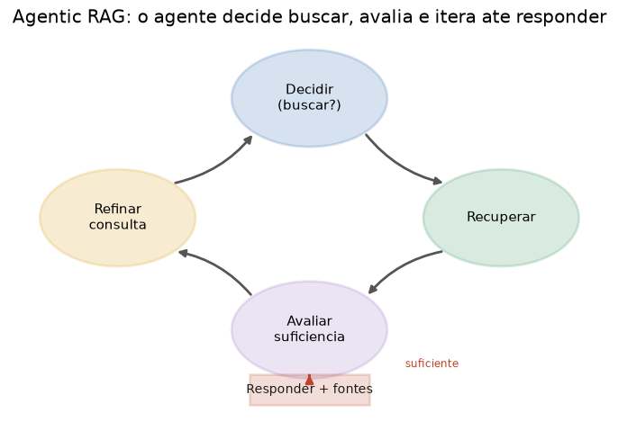

# Lição 061 — Agentic RAG

> **Módulo:** M07 — RAG e Vector DBs · **Ordem de estudo:** 61 · **Tempo:** ~55 min
> **Pré-requisitos:** [060] RAG multi-index e re-ranking
> **Classificação:** complemento de aprofundamento à ementa

> **Convenção de formatação:** matemática em LaTeX (`$...$` inline, `$$...$$` em
> destaque, render nativo na pré-visualização do VS Code); figuras reprodutíveis
> geradas por `tools/figuras/gerar_figuras_m07.py` e incorporadas por caminho
> relativo `assets/<NNN>-<slug>/<nome>.png`; blocos ```python só para código e
> saída.

## Seção_Teórica

### Motivação

Todo o RAG visto até aqui é **estático**: uma consulta entra, uma recuperação roda,
uma resposta sai. Esse pipeline de passo único quebra em três situações comuns. A
pergunta pode **não precisar** de recuperação ("bom dia") — buscar é desperdício e
fonte de ruído. A primeira busca pode **falhar** porque a consulta foi mal
formulada — e um humano simplesmente reformularia e tentaria de novo. E o contexto
recuperado pode ser **insuficiente** para responder — caso em que inventar uma
resposta é pior do que admitir que não sabe.

O **Agentic RAG** transforma o pipeline num **agente** (antecipando o M08): em vez
de uma sequência fixa, um **laço de controle** decide a cada passo se busca, como
busca, se o que achou basta e quando parar. É a ponte entre RAG e agentes, e o que
torna um assistente robusto a perguntas reais, fora do roteiro feliz.

### Princípio de funcionamento

O agente substitui o fluxo linear por um **laço** com três decisões:

1. **Decidir recuperar.** Antes de buscar, uma política decide se a recuperação é
   necessária (perguntas factuais sim; saudações não). Evita custo e ruído.
2. **Reformular e iterar.** Se a busca não traz nada relevante, o agente
   **reescreve** a consulta — expandindo sinônimos, adicionando contexto — e tenta
   de novo. Cada iteração refina a consulta.
3. **Avaliar suficiência e parar.** Um avaliador julga se o contexto recuperado
   sustenta uma resposta. Se sim, responde com fontes; se não, itera — até um
   **limite** $\texttt{max\_iter}$ que garante terminação. Esgotado o limite, a
   resposta honesta é "não sei", não uma alucinação.

O laço sempre termina porque o número de iterações é limitado: na pior hipótese,
$\texttt{max\_iter}$ tentativas e então uma recusa controlada. Esse controle
explícito — decidir, refinar, avaliar, parar — é exatamente o que distingue um
agente de um pipeline.



*Figura 1 — O agente decide se busca, recupera, avalia a suficiência e então responde (com fontes) ou refina a consulta e repete, sempre limitado por um número máximo de iterações. Gerada por `tools/figuras/gerar_figuras_m07.py`.*

---

### Conceito central 1 — Decisão de recuperar

Antes de buscar, o agente decide se a busca faz sentido. Perguntas factuais
disparam a recuperação; mensagens sociais são respondidas direto, sem custo nem
ruído de contexto.

#### Exemplo_Resolvido 1.1

```python
import re

interrogativos = {"qual", "como", "quanto", "onde", "quando", "quais"}
chitchat = {"oi", "ola", "bom", "dia", "obrigado", "tchau"}

def tok(t):
    return set(re.findall(r"[a-z0-9]+", t.lower()))

def precisa_buscar(p):
    toks = tok(p)
    if toks & interrogativos:
        return True
    if toks and toks <= chitchat:
        return False
    return True

for p in ["oi", "como funciona o plano", "ola bom dia"]:
    print(f"{p!r} -> {precisa_buscar(p)}")
```

**Explicação passo a passo:**
- **Bloco 1 (conjuntos):** termos que sinalizam pergunta factual e termos de conversa social.
- **Bloco 2 (`tok`):** conjunto de termos da mensagem.
- **Bloco 3 (`precisa_buscar`):** busca se há interrogativo; não busca se a mensagem é só chitchat; do contrário, busca por segurança.
- **Bloco 4 (`print`):** `oi` e `ola bom dia` não disparam busca; `como funciona o plano` sim.

**Saída esperada:**
```
'oi' -> False
'como funciona o plano' -> True
'ola bom dia' -> False
```

---

### Conceito central 2 — Reformulação e iteração

Quando a busca não traz nada relevante, o agente reescreve a consulta (aqui,
expandindo sinônimos) e tenta de novo. Cada iteração aproxima a consulta do
vocabulário do corpus.

#### Exemplo_Resolvido 2.1

```python
import re

corpus = {"d1": "a fatura vence todo dia dez", "d2": "suporte via chat"}
sinonimos = {"conta": "fatura", "boleto": "fatura"}

def tok(t):
    return set(re.findall(r"[a-z0-9]+", t.lower()))

def melhor(c):
    return sorted(((d, len(tok(c) & tok(corpus[d]))) for d in corpus),
                  key=lambda t: (-t[1], t[0]))[0]

def reformular(c):
    return " ".join(sinonimos.get(w, w) for w in c.lower().split())

consulta = "vencimento do boleto"
for it in range(1, 4):
    d, s = melhor(consulta)
    print(f"iter {it}: {consulta!r} -> {d} score={s}")
    if s >= 1:
        break
    consulta = reformular(consulta)
```

**Explicação passo a passo:**
- **Bloco 1 (`corpus`/`sinonimos`):** o corpus fala de `fatura`; o usuário perguntou por `boleto`.
- **Bloco 2 (`melhor`):** melhor documento por sobreposição de termos.
- **Bloco 3 (`reformular`):** troca `boleto` por seu sinônimo `fatura`.
- **Bloco 4 (laço):** a 1ª iteração não casa nada (`score=0`); após reformular, `boleto → fatura` casa `d1` e o laço para.

**Saída esperada:**
```
iter 1: 'vencimento do boleto' -> d1 score=0
iter 2: 'vencimento do fatura' -> d1 score=1
```

---

### Conceito central 3 — Avaliação de suficiência

Um avaliador decide se o contexto basta para responder. Com um limite de
iterações, o laço sempre termina — e, sem evidência suficiente, a resposta honesta
é "não sei", não uma alucinação.

#### Exemplo_Resolvido 3.1

```python
import re

corpus = {"d1": "informacoes sobre a empresa"}

def tok(t):
    return set(re.findall(r"[a-z0-9]+", t.lower()))

def melhor(c):
    return sorted(((d, len(tok(c) & tok(corpus[d]))) for d in corpus),
                  key=lambda t: (-t[1], t[0]))[0]

def suficiente(s, limiar=2):
    return s >= limiar

consulta = "qual o cnpj"
for it in range(1, 4):
    d, s = melhor(consulta)
    if suficiente(s):
        print(f"iter {it}: suficiente, responde com {d}")
        break
    print(f"iter {it}: insuficiente (score={s}), continua")
else:
    print("max iteracoes atingido: responder 'nao sei'")
```

**Explicação passo a passo:**
- **Bloco 1 (`corpus`):** a base não contém o CNPJ pedido.
- **Bloco 2 (`melhor`/`suficiente`):** o score nunca alcança o limiar de 2.
- **Bloco 3 (laço com `else`):** o `else` do `for` roda só se nenhum `break` ocorrer — ou seja, ao esgotar as iterações.
- **Bloco 4 (saída):** após 3 tentativas insuficientes, o agente recusa com "não sei" em vez de inventar — o comportamento seguro.

**Saída esperada:**
```
iter 1: insuficiente (score=0), continua
iter 2: insuficiente (score=0), continua
iter 3: insuficiente (score=0), continua
max iteracoes atingido: responder 'nao sei'
```

## Seção_Prática

> **Como reproduzir:** execute cada solução de referência com
> `python trilha/solucoes/061-agentic-rag/solucao_<n>.py` e compare a saída
> com o arquivo `.saida.txt` correspondente. Os enunciados/esqueletos ficam em
> `trilha/pratica/061-agentic-rag/exercicio_<n>.py`.

### Exercício 1 — Decisão de recuperar
- **Entrada inicial / setup:** os conjuntos `interrogativos` e `chitchat` e as mensagens `"bom dia"`, `"qual o preco do plano"`, `"obrigado"` (dados no esqueleto).
- **Passos de execução:** implemente `precisa_buscar(pergunta)` (busca se há interrogativo; não busca se tudo é chitchat; senão busca); imprima `"<pergunta> -> buscar=<bool>"`.
- **Critério de conclusão (binário):** a saída é **exatamente** igual a `solucao_1.saida.txt` (`bom dia` e `obrigado` → `False`; a pergunta de preço → `True`); qualquer divergência reprova.
- **Solução de referência:** `trilha/solucoes/061-agentic-rag/solucao_1.py`
- **Saída esperada:** `trilha/solucoes/061-agentic-rag/solucao_1.saida.txt`

### Exercício 2 — Reformulação e busca iterativa
- **Entrada inicial / setup:** o `corpus` de 2 documentos, `sinonimos = {"reembolso": "devolucao"}`, consulta inicial `"reembolso"`, `limiar = 1`, no máximo 3 iterações (dados no esqueleto).
- **Passos de execução:** implemente `melhor(consulta)` e `reformular(consulta)`; itere registrando o histórico até o score atingir o limiar ou esgotar 3 iterações; imprima `"iter <i>: consulta=<repr> melhor=<id> score=<n>"` e `"resolvido: <bool>"`.
- **Critério de conclusão (binário):** a saída é **exatamente** igual a `solucao_2.saida.txt` (resolve na 2ª iteração após `reembolso → devolucao`); qualquer divergência reprova.
- **Solução de referência:** `trilha/solucoes/061-agentic-rag/solucao_2.py`
- **Saída esperada:** `trilha/solucoes/061-agentic-rag/solucao_2.saida.txt`

### Exercício 3 — Laço agentico completo
- **Entrada inicial / setup:** o `corpus` de 2 documentos, `sinonimos = {"preco": "custa", "valor": "custa"}`, `pergunta = "preco do plano pro"`, `limiar = 3`, `max_iter = 3` (dados no esqueleto).
- **Passos de execução:** implemente `agente(pergunta, max_iter=3)` que recupera, avalia a suficiência (`suficiente(score, limiar=3)`) e, se insuficiente, reformula e repete até o limite; imprima `"iteracoes: <n>"`, `"fonte: <id>"` e `"resposta: <texto>"`.
- **Critério de conclusão (binário):** a saída é **exatamente** igual a `solucao_3.saida.txt` (resolve na 2ª iteração, fonte `d1`); qualquer divergência reprova.
- **Solução de referência:** `trilha/solucoes/061-agentic-rag/solucao_3.py`
- **Saída esperada:** `trilha/solucoes/061-agentic-rag/solucao_3.saida.txt`
