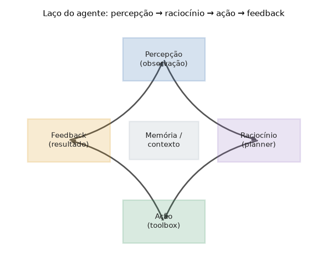

# Lição 062 — Arquitetura de agentes

> **Módulo:** M08 — Agentes Autônomos · **Ordem de estudo:** 62 · **Tempo:** ~50 min
> **Pré-requisitos:** [053] Prompt engineering avançado · [057] Pipeline RAG básico
> **Classificação:** coberto pela ementa

> **Convenção de formatação:** matemática em LaTeX (`$...$` inline, `$$...$$` em
> destaque, render nativo na pré-visualização do VS Code); figuras reprodutíveis
> geradas por `tools/figuras/gerar_figuras_m08.py` e incorporadas por caminho
> relativo `assets/<NNN>-<slug>/<nome>.png`; blocos ```python só para código e
> saída.

## Seção_Teórica

### Motivação

Um LLM, sozinho, é uma função sem estado: recebe um prompt e devolve texto. Mas
muitas tarefas reais — "pesquise o saldo, calcule o reajuste e gere o relatório" —
exigem **vários passos**, **uso de ferramentas externas** (calculadora, busca,
banco de dados) e **decisões condicionais** que dependem de resultados
intermediários. Um **agente** é o programa que envolve o modelo (ou qualquer
política de decisão) em um **laço de controle**: ele observa o ambiente, decide o
que fazer, age, observa o resultado e repete até concluir a tarefa. Entender essa
arquitetura é o pré-requisito de tudo que vem no módulo (ReAct, Plan-Execute,
memória, orquestração). Nesta lição construímos o esqueleto de um agente em Python
puro e **determinístico** — sem chamar nenhum modelo de verdade — para isolar a
**mecânica do laço**.

### Princípio de funcionamento

O agente é um laço com quatro fases que se repetem:

$$\text{percepção} \rightarrow \text{raciocínio} \rightarrow \text{ação} \rightarrow \text{feedback} \rightarrow \cdots$$

Na **percepção** o agente lê o estado atual (o que ainda falta para o objetivo).
No **raciocínio** uma política — o *planner* — decide a próxima ação. Na **ação** o
*executor* despacha a ferramenta escolhida da *toolbox*. No **feedback** o
resultado da ferramenta atualiza o estado e/ou a **memória**, fechando o ciclo.
Formalmente, sendo $s_t$ o estado no passo $t$, $\pi$ o planner e $f$ o executor:

$$a_t = \pi(s_t), \qquad s_{t+1} = f(a_t, s_t).$$

O laço repete enquanto a tarefa não estiver concluída. Como qualquer laço, ele
precisa de uma **condição de parada** clara — atingir o objetivo — e, por
segurança, de um **limite de iterações** que evita que um agente mal-comportado
rode para sempre (tema aprofundado na Lição 070).



*Figura 1 — O laço do agente: percepção → raciocínio → ação → feedback, com a memória/contexto no centro alimentando cada fase. Gerada por `tools/figuras/gerar_figuras_m08.py`.*

---

### Conceito central 1 — Laço de controle

O coração de um agente é o laço. No exemplo abaixo o "ambiente" é um acumulador, o
objetivo é atingir um número e as ações são incrementos. O planner decide entre um
passo grande (`+2`) e um pequeno (`+1`) conforme o quanto falta — a percepção
informa o raciocínio, que produz a ação, cujo efeito é o feedback.

#### Exemplo_Resolvido 1.1

```python
# Laco de controle minimo: percepcao -> raciocinio -> acao -> feedback.
objetivo = 7
estado = 0
passos = 0
while estado < objetivo:                       # condicao de continuacao
    restante = objetivo - estado               # PERCEPCAO
    acao = "+2" if restante >= 2 else "+1"      # RACIOCINIO (planner)
    estado += 2 if acao == "+2" else 1          # ACAO (executor)
    passos += 1                                 # FEEDBACK
    print(f"passo {passos}: acao={acao} estado={estado}")
print(f"objetivo atingido em {passos} passos")
```

**Explicação passo a passo:**
- **Bloco 1 (inicialização):** define o objetivo e o estado inicial; `passos` conta as iterações do laço.
- **Bloco 2 (`while`):** a condição `estado < objetivo` é o critério de continuação; enquanto verdadeira, o agente segue agindo.
- **Bloco 3 (corpo do laço):** percepção (`restante`), raciocínio (`acao`), ação (atualização de `estado`) e feedback (`print`) — as quatro fases em sequência.
- **Bloco 4 (`print` final):** ao sair do laço, o objetivo foi atingido; reporta quantos passos foram necessários.

**Saída esperada:**
```
passo 1: acao=+2 estado=2
passo 2: acao=+2 estado=4
passo 3: acao=+2 estado=6
passo 4: acao=+1 estado=7
objetivo atingido em 4 passos
```

---

### Conceito central 2 — Componentes do agente

Um agente bem organizado separa responsabilidades em quatro componentes: a
**toolbox** (o conjunto de ações disponíveis), o **planner** (a política que
escolhe a ação), o **executor** (que despacha a ação escolhida) e a **memória**
(que registra o que aconteceu). Essa separação deixa cada parte testável e
substituível.

#### Exemplo_Resolvido 2.1

```python
# Quatro componentes: toolbox (acoes), planner (decide), executor (despacha), memory (registra).
toolbox = {
    "dobrar": lambda x: x * 2,
    "incrementar": lambda x: x + 1,
}

def planner(estado, objetivo):
    return "dobrar" if estado * 2 <= objetivo else "incrementar"

def executor(acao, estado):
    return toolbox[acao](estado)

memory = []
estado, objetivo = 1, 10
for _ in range(20):
    if estado >= objetivo:
        break
    acao = planner(estado, objetivo)
    novo = executor(acao, estado)
    memory.append((acao, novo))
    estado = novo

print("trajetoria:", memory)
print("estado final:", estado)
```

**Explicação passo a passo:**
- **Bloco 1 (`toolbox`):** um dicionário de ferramentas nomeadas; cada valor é uma função que transforma o estado.
- **Bloco 2 (`planner`):** a política de decisão — dobra enquanto não ultrapassar o objetivo, senão incrementa.
- **Bloco 3 (`executor`):** despacha a ação escolhida buscando a função na toolbox por nome.
- **Bloco 4 (laço + `memory`):** integra os componentes e guarda a trajetória `(acao, estado)` na memória, evidenciando o histórico das decisões.

**Saída esperada:**
```
trajetoria: [('dobrar', 2), ('dobrar', 4), ('dobrar', 8), ('incrementar', 9), ('incrementar', 10)]
estado final: 10
```

---

### Conceito central 3 — Condição de parada

Todo agente precisa saber **quando parar**. Há dois critérios complementares:
sucesso (atingiu o objetivo) e segurança (atingiu o limite de iterações). Sem o
segundo, uma política mal definida ou um objetivo inalcançável produziria um laço
infinito — um risco real em agentes autônomos.

#### Exemplo_Resolvido 3.1

```python
# Condicao de parada: objetivo atingido OU limite de iteracoes (evita laco infinito).
def agente(objetivo, max_passos):
    estado, passos = 0, 0
    while estado != objetivo and passos < max_passos:
        estado += 2          # acao fixa: soma 2 (nunca atinge impar)
        passos += 1
    atingiu = estado == objetivo
    return estado, passos, atingiu

for objetivo in [6, 5]:
    estado, passos, ok = agente(objetivo, max_passos=10)
    status = "sucesso" if ok else "parou no limite"
    print(f"objetivo={objetivo}: estado={estado} passos={passos} -> {status}")
```

**Explicação passo a passo:**
- **Bloco 1 (`while` com duas guardas):** o laço só continua se o objetivo **não** foi atingido **e** ainda há orçamento de passos — as duas condições de parada juntas.
- **Bloco 2 (`atingiu`):** distingue parada por sucesso de parada por limite.
- **Bloco 3 (laço de teste):** o objetivo 6 (par) é atingível somando 2; o objetivo 5 (ímpar) nunca é alcançado, então o agente para ao esgotar os 10 passos — sem travar.

**Saída esperada:**
```
objetivo=6: estado=6 passos=3 -> sucesso
objetivo=5: estado=20 passos=10 -> parou no limite
```

## Seção_Prática

> **Como reproduzir:** execute cada solução de referência com
> `python trilha/solucoes/062-arquitetura-de-agentes/solucao_<n>.py` e compare a
> saída com o arquivo `.saida.txt` correspondente. Os enunciados/esqueletos ficam
> em `trilha/pratica/062-arquitetura-de-agentes/exercicio_<n>.py`.

### Exercício 1 — Implementar o laço de controle
- **Entrada inicial / setup:** `objetivo = 10`, `estado = 0`, ações `"+3"` e `"+1"`.
- **Passos de execução:** a cada iteração calcule `restante = objetivo - estado`; se `restante >= 3`, a ação é `"+3"`, senão `"+1"`. Aplique a ação, conte os passos e imprima `passo {n}: acao={acao} estado={estado}`; ao final imprima `objetivo atingido em {passos} passos`.
- **Critério de conclusão (binário):** a saída é **exatamente** igual a `solucao_1.saida.txt` (termina em `objetivo atingido em 4 passos`); qualquer divergência reprova.
- **Solução de referência:** `trilha/solucoes/062-arquitetura-de-agentes/solucao_1.py`
- **Saída esperada:** `trilha/solucoes/062-arquitetura-de-agentes/solucao_1.saida.txt`

### Exercício 2 — Toolbox e executor de um plano
- **Entrada inicial / setup:** `toolbox = {"incrementar": lambda x: x + 1, "dobrar": lambda x: x * 2}`, `plano = ["incrementar", "dobrar", "incrementar"]`, `estado = 2`.
- **Passos de execução:** implemente `executor(acao, estado)`; percorra o plano aplicando cada ação, registre `(acao, estado)` em `memory` e imprima `acao={acao} -> estado={estado}` por passo; ao final imprima `memoria: {memory}` e `estado final: {estado}`.
- **Critério de conclusão (binário):** a saída é **exatamente** igual a `solucao_2.saida.txt` (`estado final: 7`); qualquer divergência reprova.
- **Solução de referência:** `trilha/solucoes/062-arquitetura-de-agentes/solucao_2.py`
- **Saída esperada:** `trilha/solucoes/062-arquitetura-de-agentes/solucao_2.saida.txt`

### Exercício 3 — Condição de parada com limite de iterações
- **Entrada inicial / setup:** ação fixa que soma 2 ao `estado` (começa em 0); objetivos `[8, 7]`; `max_passos = 6`.
- **Passos de execução:** implemente `agente(objetivo, max_passos)` iterando enquanto `estado != objetivo` **e** `passos < max_passos`; retorne `(estado, passos, atingiu)` e imprima `objetivo={objetivo}: estado={estado} passos={passos} -> {status}` com `sucesso` ou `parou no limite`.
- **Critério de conclusão (binário):** a saída é **exatamente** igual a `solucao_3.saida.txt` (objetivo 7 → `parou no limite`); qualquer divergência reprova.
- **Solução de referência:** `trilha/solucoes/062-arquitetura-de-agentes/solucao_3.py`
- **Saída esperada:** `trilha/solucoes/062-arquitetura-de-agentes/solucao_3.saida.txt`
