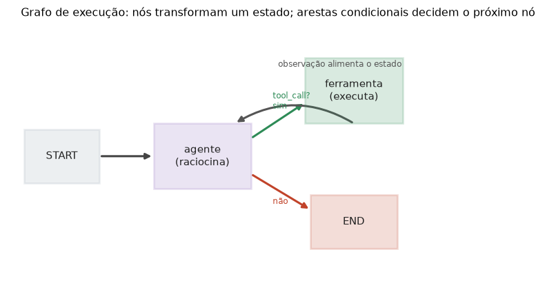

# Lição 069 — Orquestração com LangGraph

> **Módulo:** M08 — Agentes Autônomos · **Ordem de estudo:** 69 · **Tempo:** ~55 min
> **Pré-requisitos:** [063] Padrão ReAct · [064] Padrão Plan-Execute · [066] Function calling / tool use
> **Classificação:** coberto pela ementa

> **Convenção de formatação:** matemática em LaTeX (`$...$` inline, `$$...$$` em
> destaque, render nativo na pré-visualização do VS Code); figuras reprodutíveis
> geradas por `tools/figuras/gerar_figuras_m08.py` e incorporadas por caminho
> relativo `assets/<NNN>-<slug>/<nome>.png`; blocos ```python só para código e
> saída.

## Seção_Teórica

### Motivação

Os padrões das lições anteriores (ReAct, Plan-Execute, Reflection) são, no fundo,
**fluxos de controle**: "se o modelo pediu uma ferramenta, execute-a e volte; senão,
termine". Escrever esses fluxos como `if/while` soltos funciona para um agente
simples, mas vira um emaranhado quando há vários caminhos, laços e ramificações.
**LangGraph** propõe organizar o agente como um **grafo de estado**: cada **nó** é uma
função que transforma um **estado compartilhado**, e cada **aresta** define qual nó
roda em seguida — inclusive de forma **condicional**. Essa estrutura torna o fluxo
**explícito, inspecionável e testável**: dá para desenhar o grafo, ver os caminhos
possíveis e raciocinar sobre terminação. Aqui construímos um **motor de grafo
didático** em Python puro, capturando a essência do LangGraph sem dependências.

### Princípio de funcionamento

O modelo tem três peças. O **estado** $s$ é um dicionário que carrega tudo que o
agente sabe (contadores, histórico, resultados). Um **nó** é uma função pura
$n: s \mapsto s'$ que lê o estado e devolve um **novo** estado — manter os nós puros
(sem mutar o original) facilita depurar e testar. As **arestas** dizem qual nó vem
depois de qual:

$$\text{START} \rightarrow n_1 \rightarrow n_2 \rightarrow \cdots \rightarrow \text{END}.$$

O **motor** começa no nó indicado por `START`, aplica o nó ao estado, consulta a
aresta de saída e repete até chegar em `END`. A peça que dá poder ao grafo é a
**aresta condicional**: em vez de um destino fixo, uma **função de roteamento**
$r(s)$ olha o estado atual e escolhe o próximo nó. É assim que se expressa o laço do
ReAct ("volte ao agente enquanto houver ferramentas a chamar") e qualquer
ramificação de decisão.



*Figura 1 — Um grafo de execução no estilo LangGraph: o nó `agente` decide, por uma aresta condicional, se chama a `ferramenta` (que realimenta o estado e volta) ou se vai para `END`. Gerada por `tools/figuras/gerar_figuras_m08.py`.*

---

### Conceito central 1 — Estado compartilhado

O estado é o dicionário que flui pelo grafo. Cada nó o transforma sem mutar o
original — devolve uma cópia atualizada. Isso mantém o histórico claro e evita
efeitos colaterais surpresa.

#### Exemplo_Resolvido 1.1

```python
# Estado compartilhado: cada no e uma funcao que transforma o estado (dict).
def no_incrementar(estado):
    novo = dict(estado)
    novo["contador"] = estado["contador"] + 1
    novo["log"] = estado["log"] + ["incrementou"]
    return novo

estado = {"contador": 0, "log": []}
estado = no_incrementar(estado)
estado = no_incrementar(estado)
print("contador:", estado["contador"])
print("log:", estado["log"])
```

**Explicação passo a passo:**
- **Bloco 1 (`no_incrementar`):** copia o estado (`dict(estado)`), atualiza o contador e acrescenta uma entrada ao log — sem mutar o estado de entrada.
- **Bloco 2 (aplicações):** aplica o nó duas vezes, encadeando o estado.
- **Bloco 3 (`print`):** o contador chega a 2 e o log registra as duas passagens — o estado acumula a história da execução.

**Saída esperada:**
```
contador: 2
log: ['incrementou', 'incrementou']
```

---

### Conceito central 2 — Nós e arestas

Um grafo é um conjunto de nós nomeados mais um mapa de arestas. O motor percorre as
arestas do `START` ao `END`, aplicando cada nó ao estado.

#### Exemplo_Resolvido 2.1

```python
# Grafo: nos nomeados + arestas; o motor executa do START ao END.
def no_a(estado):
    estado = dict(estado); estado["valor"] += 1; estado["rota"] = estado["rota"] + ["A"]; return estado
def no_b(estado):
    estado = dict(estado); estado["valor"] *= 3; estado["rota"] = estado["rota"] + ["B"]; return estado

nos = {"A": no_a, "B": no_b}
arestas = {"START": "A", "A": "B", "B": "END"}

estado = {"valor": 2, "rota": []}
atual = arestas["START"]
while atual != "END":
    estado = nos[atual](estado)
    atual = arestas[atual]
print("valor:", estado["valor"])
print("rota:", estado["rota"])
```

**Explicação passo a passo:**
- **Bloco 1 (`no_a`/`no_b`):** dois nós que transformam `valor` e registram por onde passaram em `rota`.
- **Bloco 2 (`nos`/`arestas`):** o grafo — quem são os nós e quem segue quem (`START → A → B → END`).
- **Bloco 3 (motor):** parte do nó após `START`, executa e segue a aresta até `END`; o valor 2 vira 3 (em A) e depois 9 (em B).

**Saída esperada:**
```
valor: 9
rota: ['A', 'B']
```

---

### Conceito central 3 — Arestas condicionais

A aresta condicional troca o destino fixo por uma **função de roteamento** que decide
com base no estado. É o que permite laços (voltar a um nó) e ramificações — o coração
do controle de um agente.

#### Exemplo_Resolvido 3.1

```python
# Arestas condicionais: uma funcao de roteamento decide o proximo no.
def agente(estado):
    estado = dict(estado)
    estado["passos"] += 1
    estado["rota"] = estado["rota"] + ["agente"]
    return estado

def ferramenta(estado):
    estado = dict(estado)
    estado["coletado"] += 1
    estado["rota"] = estado["rota"] + ["ferramenta"]
    return estado

def rotear(estado):
    return "ferramenta" if estado["coletado"] < 2 else "END"

nos = {"agente": agente, "ferramenta": ferramenta}
estado = {"passos": 0, "coletado": 0, "rota": []}
atual = "agente"
while atual != "END":
    estado = nos[atual](estado)
    if atual == "agente":
        atual = rotear(estado)
    else:
        atual = "agente"
print("rota:", estado["rota"])
print("passos do agente:", estado["passos"])
```

**Explicação passo a passo:**
- **Bloco 1 (`agente`/`ferramenta`):** dois nós — o agente conta passos; a ferramenta coleta itens.
- **Bloco 2 (`rotear`):** a aresta condicional após o agente — chama a ferramenta enquanto faltam itens, senão vai para `END`.
- **Bloco 3 (motor):** a ferramenta sempre volta ao agente; o laço `agente → ferramenta → agente` repete até coletar 2 itens, terminando no agente após 3 passos.

**Saída esperada:**
```
rota: ['agente', 'ferramenta', 'agente', 'ferramenta', 'agente']
passos do agente: 3
```

## Seção_Prática

> **Como reproduzir:** execute cada solução de referência com
> `python trilha/solucoes/069-orquestracao-langgraph/solucao_<n>.py` e compare a
> saída com o arquivo `.saida.txt` correspondente. Os enunciados/esqueletos ficam
> em `trilha/pratica/069-orquestracao-langgraph/exercicio_<n>.py`.

### Exercício 1 — Estado compartilhado e nó
- **Entrada inicial / setup:** estado `{"valor": 3, "log": []}`.
- **Passos de execução:** implemente `no_dobrar(estado)` (novo estado com `valor` dobrado e `"dobrou"` no log, sem mutar o original); aplique duas vezes; imprima `valor:` e `log:`.
- **Critério de conclusão (binário):** a saída é **exatamente** igual a `solucao_1.saida.txt` (`valor: 12`); qualquer divergência reprova.
- **Solução de referência:** `trilha/solucoes/069-orquestracao-langgraph/solucao_1.py`
- **Saída esperada:** `trilha/solucoes/069-orquestracao-langgraph/solucao_1.saida.txt`

### Exercício 2 — Grafo linear e motor
- **Entrada inicial / setup:** nós `A` (`valor += 5`) e `B` (`valor -= 2`); `arestas = {"START": "A", "A": "B", "B": "END"}`; estado `{"valor": 10, "rota": []}`.
- **Passos de execução:** implemente os nós e o motor que percorre do `START` ao `END`; imprima `valor:` e `rota:`.
- **Critério de conclusão (binário):** a saída é **exatamente** igual a `solucao_2.saida.txt` (`valor: 13`); qualquer divergência reprova.
- **Solução de referência:** `trilha/solucoes/069-orquestracao-langgraph/solucao_2.py`
- **Saída esperada:** `trilha/solucoes/069-orquestracao-langgraph/solucao_2.saida.txt`

### Exercício 3 — Arestas condicionais
- **Entrada inicial / setup:** nós `agente` e `ferramenta`; `rotear` devolve `"ferramenta"` enquanto `coletado < 3`, senão `"END"`; a ferramenta sempre volta ao agente; estado `{"passos": 0, "coletado": 0, "rota": []}`.
- **Passos de execução:** implemente o motor com roteamento condicional após o agente; imprima `rota:` e `passos do agente:`.
- **Critério de conclusão (binário):** a saída é **exatamente** igual a `solucao_3.saida.txt` (`passos do agente: 4`); qualquer divergência reprova.
- **Solução de referência:** `trilha/solucoes/069-orquestracao-langgraph/solucao_3.py`
- **Saída esperada:** `trilha/solucoes/069-orquestracao-langgraph/solucao_3.saida.txt`
