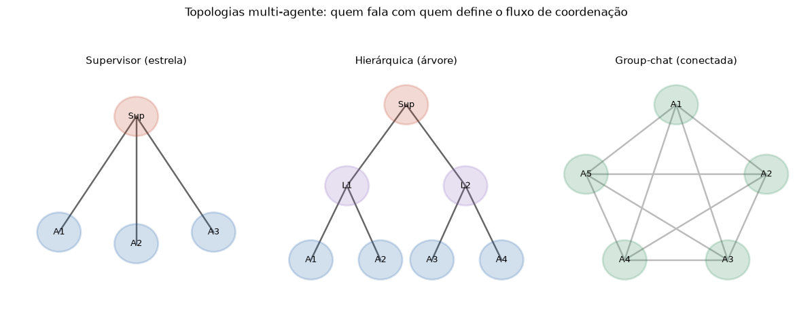

# Lição 071 — Sistemas multi-agente

> **Módulo:** M08 — Agentes Autônomos · **Ordem de estudo:** 71 · **Tempo:** ~55 min
> **Pré-requisitos:** [069] Orquestração com LangGraph
> **Classificação:** coberto pela ementa

> **Convenção de formatação:** matemática em LaTeX (`$...$` inline, `$$...$$` em
> destaque, render nativo na pré-visualização do VS Code); figuras reprodutíveis
> geradas por `tools/figuras/gerar_figuras_m08.py` e incorporadas por caminho
> relativo `assets/<NNN>-<slug>/<nome>.png`; blocos ```python só para código e
> saída.

## Seção_Teórica

### Motivação

Um único agente — mesmo com memória, ferramentas e um bom laço de raciocínio —
esbarra em limites quando a tarefa é grande e heterogênea: escrever código,
revisá-lo, testá-lo e documentá-lo exige **competências distintas** e **contextos
distintos**. Empilhar tudo num só prompt sobrecarrega o contexto (Lição 068) e
mistura responsabilidades. A alternativa é **dividir para conquistar**: vários
agentes **especializados**, cada um com seu papel, coordenados por uma estrutura
explícita. Isso é um **sistema multi-agente**. O ganho é o mesmo da engenharia de
software — modularidade, especialização e paralelismo — mas o desafio também é o
mesmo: **quem decide o quê**, **quem fala com quem** e **como combinar** as
respostas sem caos. Esta lição organiza esses três eixos (coordenação, topologia e
agregação) sobre o motor de grafo da Lição 069.

### Princípio de funcionamento

Um sistema multi-agente é um conjunto de agentes $\{A_1, \dots, A_n\}$ mais um
**protocolo de coordenação** que define o fluxo de controle e de mensagens. Três
decisões de projeto o caracterizam.

A primeira é a **orquestração**: como o trabalho é dividido e despachado. No padrão
**Supervisor**, um agente central recebe a tarefa, escolhe o trabalhador adequado e
o aciona (delegação). No padrão **Hierárquico**, supervisores de supervisores formam
uma **árvore** de responsabilidade. No padrão **Group-chat**, todos os agentes
compartilham um canal comum e contribuem em rodadas.

A segunda é a **topologia de comunicação** — o grafo de "quem fala com quem". Para
$n$ agentes, ela determina o número de **canais**: uma estrela (supervisor) usa $n$
arestas para $n$ trabalhadores; uma árvore com $V$ nós usa $V - 1$ arestas; um
group-chat totalmente conectado usa

$$\binom{n}{2} = \frac{n(n-1)}{2}$$

canais. Menos canais significam coordenação mais simples e barata; mais canais
permitem colaboração rica, ao custo de complexidade quadrática.

A terceira é a **agregação** (ou **negociação**): como combinar as saídas parciais
num resultado final — concatenação ordenada, voto majoritário ou consenso. Como os
agentes podem trabalhar de forma **assíncrona**, a agregação precisa ser
**determinística** em relação a uma ordem fixa, para que o resultado não dependa de
qual agente respondeu primeiro.



*Figura 1 — Topologias multi-agente: a estrela (Supervisor) centraliza a coordenação; a árvore (Hierárquica) distribui em níveis; a malha (Group-chat) conecta todos. A topologia define o número de canais e o estilo de coordenação. Gerada por `tools/figuras/gerar_figuras_m08.py`.*

---

### Conceito central 1 — Coordenação e delegação

No padrão **Supervisor**, um coordenador central recebe cada subtarefa, identifica o
**tipo** de trabalho e **delega** ao agente especializado correspondente. O
supervisor não executa o trabalho — ele apenas **roteia**, exatamente como uma
aresta condicional escolhe o próximo nó (Lição 069). Um registro `tipo → agente`
torna o despacho direto e determinístico.

#### Exemplo_Resolvido 1.1

```python
# Supervisor: delega cada subtarefa ao agente especializado pelo seu tipo.
trabalhadores = {
    "codigo":  lambda t: f"implementei {t}",
    "revisao": lambda t: f"revisei {t}",
    "teste":   lambda t: f"testei {t}",
}

def supervisor(tipo, tarefa):
    agente = trabalhadores[tipo]   # roteia pelo tipo (delegação)
    return agente(tarefa)

plano = [("codigo", "login"), ("teste", "login"), ("revisao", "PR")]
for tipo, tarefa in plano:
    print(f"{tipo}: {supervisor(tipo, tarefa)}")
```

**Explicação passo a passo:**
- **Bloco 1 (`trabalhadores`):** o registro mapeia cada tipo de tarefa ao agente especializado que sabe executá-la.
- **Bloco 2 (`supervisor`):** o coordenador busca o agente pelo `tipo` e delega a `tarefa` — ele decide *quem*, não *como*.
- **Bloco 3 (laço sobre `plano`):** o supervisor despacha três subtarefas em ordem; cada uma é resolvida pelo especialista certo.

**Saída esperada:**
```
codigo: implementei login
teste: testei login
revisao: revisei PR
```

---

### Conceito central 2 — Topologias de comunicação

A **topologia** é o grafo de canais entre agentes. Representá-la por uma **matriz de
adjacência** simétrica deixa explícito quem fala com quem, e o número de **canais**
(arestas não-direcionadas) é metade da soma da matriz. Comparar topologias mostra o
*trade-off*: a estrela (Supervisor) cresce linearmente em canais; a malha completa
(Group-chat) cresce como $\binom{n}{2}$.

#### Exemplo_Resolvido 2.1

```python
import numpy as np
# Topologias como matrizes de adjacencia; canais = arestas nao-direcionadas.
def n_canais(adj):
    return int(adj.sum() // 2)   # matriz simetrica => soma conta cada aresta 2x

# 4 agentes (indices 0..3); no padrao estrela, o no 0 e o supervisor.
estrela = np.array([
    [0, 1, 1, 1],
    [1, 0, 0, 0],
    [1, 0, 0, 0],
    [1, 0, 0, 0],
])
completa = np.ones((4, 4), dtype=int) - np.eye(4, dtype=int)
print("estrela (supervisor):", n_canais(estrela))
print("completa (group-chat):", n_canais(completa))
print("formula grupo n=4:", 4 * (4 - 1) // 2)
```

**Explicação passo a passo:**
- **Bloco 1 (`n_canais`):** numa matriz simétrica cada aresta é contada duas vezes, então o número de canais é a soma dividida por 2.
- **Bloco 2 (`estrela`):** o supervisor (linha 0) liga-se aos 3 trabalhadores e nada mais — 3 canais.
- **Bloco 3 (`completa`/`print`):** a malha completa de 4 agentes tem $\binom{4}{2} = 6$ canais, batendo com a fórmula — a colaboração total custa o dobro de canais da estrela.

**Saída esperada:**
```
estrela (supervisor): 3
completa (group-chat): 6
formula grupo n=4: 6
```

---

### Conceito central 3 — Agregação e negociação

Como os agentes podem responder de forma **assíncrona**, o resultado final precisa
ser combinado por uma regra **determinística**. Uma forma robusta de reconciliar
opiniões divergentes é o **voto majoritário**: cada agente vota e a decisão segue a
maioria. Em `numpy`, isso é uma soma por coluna seguida de um limiar — independente
da ordem em que os votos chegaram.

#### Exemplo_Resolvido 3.1

```python
import numpy as np
# Negociacao por voto majoritario: 3 agentes classificam 4 itens (0/1).
votos = np.array([
    [1, 0, 1, 1],   # agente A
    [1, 1, 0, 1],   # agente B
    [0, 0, 1, 1],   # agente C
])
soma = votos.sum(axis=0)            # votos a favor por item
decisao = (soma >= 2).astype(int)   # maioria de 3 => limiar 2
print("soma por item:", soma.tolist())
print("decisao majoritaria:", decisao.tolist())
```

**Explicação passo a passo:**
- **Bloco 1 (`votos`):** cada linha é o voto de um agente sobre os 4 itens; é a saída assíncrona que o agregador recebe.
- **Bloco 2 (`soma`/`decisao`):** soma os votos por item (coluna) e aplica o limiar de maioria (≥ 2 entre 3 agentes).
- **Bloco 3 (`print`):** o item 2 (soma 1) é rejeitado e os demais aceitos; o resultado independe da ordem dos votos — agregação determinística.

**Saída esperada:**
```
soma por item: [2, 1, 2, 3]
decisao majoritaria: [1, 0, 1, 1]
```

## Seção_Prática

> **Como reproduzir:** execute cada solução de referência com
> `python trilha/solucoes/071-multi-agente/solucao_<n>.py` e compare a saída com o
> arquivo `.saida.txt` correspondente. Os enunciados/esqueletos ficam em
> `trilha/pratica/071-multi-agente/exercicio_<n>.py`.

### Exercício 1 — Supervisor que delega tarefas
- **Entrada inicial / setup:** `trabalhadores = {"codigo": lambda t: f"implementei {t}", "revisao": lambda t: f"revisei {t}"}`.
- **Passos de execução:** implemente `supervisor(tipo, tarefa)` que escolhe o trabalhador pelo `tipo` e o executa sobre a `tarefa`; imprima `supervisor("codigo", "login")` e `supervisor("revisao", "PR")`.
- **Critério de conclusão (binário):** a saída é **exatamente** igual a `solucao_1.saida.txt` (`implementei login` / `revisei PR`); qualquer divergência reprova.
- **Solução de referência:** `trilha/solucoes/071-multi-agente/solucao_1.py`
- **Saída esperada:** `trilha/solucoes/071-multi-agente/solucao_1.saida.txt`

### Exercício 2 — Canais por topologia
- **Entrada inicial / setup:** os valores `n ∈ [3, 5]` e as três topologias (supervisor/estrela, hierárquica/árvore, group-chat/completa).
- **Passos de execução:** implemente `arestas_supervisor(n) = n`, `arestas_hierarquica(nos) = nos - 1` e `arestas_grupo(n) = n * (n - 1) // 2`; para cada `n`, imprima `n={n}: supervisor={...} hierarquica={...} grupo={...}`.
- **Critério de conclusão (binário):** a saída é **exatamente** igual a `solucao_2.saida.txt` (`n=5: supervisor=5 hierarquica=4 grupo=10`); qualquer divergência reprova.
- **Solução de referência:** `trilha/solucoes/071-multi-agente/solucao_2.py`
- **Saída esperada:** `trilha/solucoes/071-multi-agente/solucao_2.saida.txt`

### Exercício 3 — Agregação ordenada de resultados
- **Entrada inicial / setup:** `resultados = {"dados": "ok", "modelo": "treinado", "relatorio": "enviado"}` e `ordem = ["dados", "modelo", "relatorio"]`.
- **Passos de execução:** combine os resultados numa string final juntando `chave=valor` por `" | "` na ordem dada; imprima `partes: {n}` e `final: {string}`.
- **Critério de conclusão (binário):** a saída é **exatamente** igual a `solucao_3.saida.txt` (`final: dados=ok | modelo=treinado | relatorio=enviado`); qualquer divergência reprova.
- **Solução de referência:** `trilha/solucoes/071-multi-agente/solucao_3.py`
- **Saída esperada:** `trilha/solucoes/071-multi-agente/solucao_3.saida.txt`
