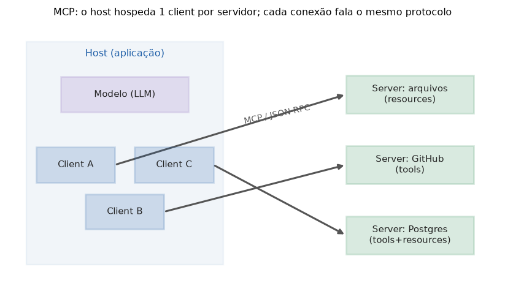

# Lição 072 — MCP: motivação e arquitetura cliente-servidor

> **Módulo:** M09 — MCP · **Ordem de estudo:** 72 · **Tempo:** ~50 min
> **Pré-requisitos:** [066] Function calling / tool use
> **Classificação:** coberto pela ementa

> **Convenção de formatação:** matemática em LaTeX (`$...$` inline, `$$...$$` em
> destaque, render nativo na pré-visualização do VS Code); figuras reprodutíveis
> geradas por `tools/figuras/gerar_figuras_m09.py` e incorporadas por caminho
> relativo `assets/<NNN>-<slug>/<nome>.png`; blocos ```python só para código e
> saída.

## Seção_Teórica

### Motivação

Na Lição 066 vimos que um modelo só age no mundo quando o nosso código expõe
**ferramentas** para ele chamar. O problema aparece quando queremos plugar **muitas
aplicações** (uma IDE, um chat, um agente) em **muitas fontes** (sistema de
arquivos, GitHub, banco de dados, APIs internas). Sem um padrão, cada aplicação
precisa de um conector **sob medida** para cada fonte: com $M$ aplicações e $N$
fontes, isso dá $M \times N$ integrações para escrever e manter. Cada nova fonte
obriga a tocar em todas as aplicações, e vice-versa.

O **Model Context Protocol (MCP)** ataca exatamente essa explosão combinatória. Ele
define um **protocolo único** pelo qual qualquer aplicação fala com qualquer fonte.
Cada aplicação implementa o protocolo **uma vez**; cada fonte também. As integrações
caem de $M \times N$ para $M + N$. É o mesmo papel que um padrão como o USB cumpre
para periféricos: um conector comum em vez de um cabo proprietário por dispositivo.

### Princípio de funcionamento

O MCP organiza a comunicação em três papéis. O **host** é a aplicação que o usuário
opera (a IDE, o chat) e que hospeda o modelo. Dentro do host vivem os **clients**:
um client para **cada** servidor, numa relação **1:1**. Cada **server** é um
processo separado que expõe capacidades (dados e ações) de uma fonte específica. O
client e o server conversam por um **protocolo comum** (que detalharemos como
JSON-RPC na Lição 074).

$$\underbrace{M \times N}_{\text{conectores sob medida}} \;\longrightarrow\;
\underbrace{M + N}_{\text{com um protocolo padrão}}$$

Antes de trocar mensagens úteis, client e server fazem um **handshake**: cada lado
**anuncia suas capacidades** (o que sabe fazer) e a sessão passa a valer apenas o
que **ambos** suportam — formalmente, a **interseção** dos dois conjuntos de
capacidades. Isso deixa o protocolo extensível: lados mais novos podem oferecer mais
sem quebrar os mais antigos.


*Figura 1 — O host hospeda um client por servidor (relação 1:1); cada conexão fala o mesmo protocolo MCP (gerada por `tools/figuras/gerar_figuras_m09.py`).*

---

### Conceito central 1 — O problema M×N de integração

Sem um padrão, conectar $M$ aplicações a $N$ fontes custa $M \times N$ conectores
distintos. Com o MCP, cada lado implementa o protocolo uma vez, e o custo vira
$M + N$. A diferença cresce rápido conforme o ecossistema aumenta.

#### Exemplo_Resolvido 1.1

```python
# Quantidade de conectores: sob medida (M x N) vs. com um protocolo padrao (M + N).
def integracoes_sem_padrao(m_hosts, n_servidores):
    return m_hosts * n_servidores

def integracoes_com_mcp(m_hosts, n_servidores):
    # Cada host implementa o protocolo uma vez; cada servidor tambem.
    return m_hosts + n_servidores

for m, n in [(3, 4), (5, 10)]:
    sem = integracoes_sem_padrao(m, n)
    com = integracoes_com_mcp(m, n)
    print(f"M={m} N={n}: sem padrao={sem} conectores, com MCP={com} conectores")
```

**Explicação passo a passo:**
- **Bloco 1 (`integracoes_sem_padrao`):** sem protocolo comum, cada aplicação precisa de um conector dedicado por fonte — daí o produto $M \times N$.
- **Bloco 2 (`integracoes_com_mcp`):** com o MCP, cada lado fala o protocolo uma única vez, somando esforços em vez de multiplicá-los: $M + N$.
- **Bloco 3 (laço):** compara dois cenários; a economia salta de 12 → 7 e de 50 → 15 conectores conforme o ecossistema cresce.

**Saída esperada:**
```
M=3 N=4: sem padrao=12 conectores, com MCP=7 conectores
M=5 N=10: sem padrao=50 conectores, com MCP=15 conectores
```

---

### Conceito central 2 — Arquitetura host / client / server

O host é a aplicação que o usuário opera; dentro dele há **um client por servidor**
(relação 1:1). Modelar isso como um dicionário deixa explícita a correspondência
entre cada client e o servidor a que ele se conecta.

#### Exemplo_Resolvido 2.1

```python
# Um host mantem 1 client por servidor (relacao 1:1).
host = {
    "nome": "IDE",
    "clients": {
        "arquivos": "server-fs",
        "github": "server-gh",
        "postgres": "server-pg",
    },
}

print("host:", host["nome"])
print("num clients:", len(host["clients"]))
for servidor, client in sorted(host["clients"].items()):
    print(f"  client -> {servidor} (conecta a {client})")
print("relacao 1:1?", len(host["clients"]) == len(set(host["clients"].values())))
```

**Explicação passo a passo:**
- **Bloco 1 (`host`):** o host declara um client para cada servidor que pretende usar; a chave é a fonte e o valor é o processo servidor.
- **Bloco 2 (`print`/laço):** lista os clients em ordem alfabética para uma saída determinística.
- **Bloco 3 (`relacao 1:1?`):** confirma que não há dois clients apontando para o mesmo servidor — cada conexão é única (`True`).

**Saída esperada:**
```
host: IDE
num clients: 3
  client -> arquivos (conecta a server-fs)
  client -> github (conecta a server-gh)
  client -> postgres (conecta a server-pg)
relacao 1:1? True
```

---

### Conceito central 3 — Negociação de capacidades (handshake)

No início da sessão, client e server trocam o que cada um sabe fazer. O que vale
para a sessão é a **interseção** dos dois conjuntos: só usamos uma capacidade se
**ambos** os lados a suportam. Isso mantém o protocolo extensível e
retrocompatível.

#### Exemplo_Resolvido 3.1

```python
# No handshake "initialize", cliente e servidor anunciam capacidades; valem as
# que ambos suportam (intersecao dos conjuntos).
cap_cliente = {"resources", "tools", "sampling"}
cap_servidor = {"resources", "tools", "prompts"}

negociadas = cap_cliente & cap_servidor

print("cliente:", sorted(cap_cliente))
print("servidor:", sorted(cap_servidor))
print("negociadas:", sorted(negociadas))
print("usa tools?", "tools" in negociadas)
print("usa sampling?", "sampling" in negociadas)
```

**Explicação passo a passo:**
- **Bloco 1 (conjuntos):** cada lado anuncia suas capacidades; o cliente oferece `sampling`, o servidor oferece `prompts`.
- **Bloco 2 (`&`):** a interseção retém apenas `resources` e `tools`, presentes nos dois.
- **Bloco 3 (`print`):** `sampling` fica de fora porque o servidor não o suporta; logo `usa sampling?` é `False`, enquanto `usa tools?` é `True`.

**Saída esperada:**
```
cliente: ['resources', 'sampling', 'tools']
servidor: ['prompts', 'resources', 'tools']
negociadas: ['resources', 'tools']
usa tools? True
usa sampling? False
```

## Seção_Prática

> **Como reproduzir:** execute cada solução de referência com
> `python trilha/solucoes/072-mcp-fundamentos/solucao_<n>.py` e compare a saída
> com o arquivo `.saida.txt` correspondente. Os enunciados/esqueletos ficam em
> `trilha/pratica/072-mcp-fundamentos/exercicio_<n>.py`.

### Exercício 1 — Economia de conectores M×N
- **Entrada inicial / setup:** $M = 4$ aplicações e $N = 6$ fontes.
- **Passos de execução:** calcule `sem_padrao = M * N` e `com_mcp = M + N`; imprima `sem padrao: {sem_padrao}`, `com mcp: {com_mcp}` e `reducao: {sem_padrao - com_mcp}`.
- **Critério de conclusão (binário):** a saída é **exatamente** igual a `solucao_1.saida.txt` (`reducao: 14`); qualquer divergência reprova.
- **Solução de referência:** `trilha/solucoes/072-mcp-fundamentos/solucao_1.py`
- **Saída esperada:** `trilha/solucoes/072-mcp-fundamentos/solucao_1.saida.txt`

### Exercício 2 — Mapa host → clients
- **Entrada inicial / setup:** o dicionário `clients = {"slack": "server-slack", "drive": "server-drive", "jira": "server-jira"}`.
- **Passos de execução:** imprima `num clients: {n}`, depois cada par `{servidor} -> {client}` em ordem alfabética da chave, e por fim `relacao 1:1? {True/False}` (comparando o número de clients ao de servidores distintos).
- **Critério de conclusão (binário):** a saída é **exatamente** igual a `solucao_2.saida.txt`; qualquer divergência reprova.
- **Solução de referência:** `trilha/solucoes/072-mcp-fundamentos/solucao_2.py`
- **Saída esperada:** `trilha/solucoes/072-mcp-fundamentos/solucao_2.saida.txt`

### Exercício 3 — Negociar capacidades por interseção
- **Entrada inicial / setup:** `cap_cliente = {"resources", "tools", "roots"}` e `cap_servidor = {"tools", "prompts", "resources"}`.
- **Passos de execução:** calcule a interseção `negociadas`; imprima `negociadas: {lista ordenada}`, `usa resources? {True/False}` e `usa roots? {True/False}`.
- **Critério de conclusão (binário):** a saída é **exatamente** igual a `solucao_3.saida.txt` (`usa roots? False`); qualquer divergência reprova.
- **Solução de referência:** `trilha/solucoes/072-mcp-fundamentos/solucao_3.py`
- **Saída esperada:** `trilha/solucoes/072-mcp-fundamentos/solucao_3.saida.txt`
