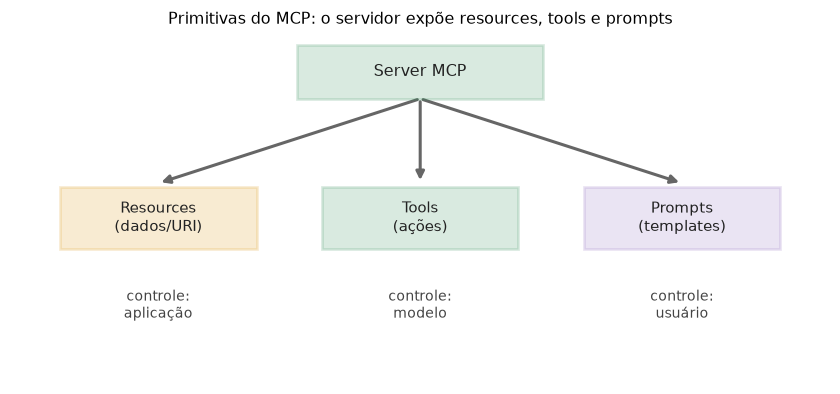

# Lição 073 — Primitivas do MCP: resources, tools e prompts

> **Módulo:** M09 — MCP · **Ordem de estudo:** 73 · **Tempo:** ~50 min
> **Pré-requisitos:** [072] MCP: motivação e arquitetura cliente-servidor
> **Classificação:** complemento de aprofundamento à ementa

> **Convenção de formatação:** matemática em LaTeX (`$...$` inline, `$$...$$` em
> destaque, render nativo na pré-visualização do VS Code); figuras reprodutíveis
> geradas por `tools/figuras/gerar_figuras_m09.py` e incorporadas por caminho
> relativo `assets/<NNN>-<slug>/<nome>.png`; blocos ```python só para código e
> saída.

## Seção_Teórica

### Motivação

Na Lição 072 vimos que um server MCP **expõe capacidades** de uma fonte. Mas que
tipos de capacidade existem? Se houvesse apenas "ferramentas", o protocolo seria
pobre: ler um arquivo, oferecer um modelo de prompt e executar uma ação são
necessidades **diferentes**, com donos diferentes do controle. Misturar tudo num
único conceito leva a APIs confusas e a decisões de segurança erradas (por exemplo,
deixar o modelo apagar um banco "sem querer").

O MCP resolve isso com **três primitivas** bem separadas — **resources**, **tools** e
**prompts** — e, crucialmente, cada uma tem um **controlador** distinto. Saber qual
primitiva usar e quem manda nela é o que torna um servidor MCP previsível e seguro.

### Princípio de funcionamento

As três primitivas se distinguem por **o que expõem** e **quem decide usá-las**:

- **Resources** — *dados* expostos pelo servidor, identificados por uma **URI**
  (ex.: `file:///leiame.txt`). São **controlados pela aplicação** (o host decide o
  que carregar como contexto). São de leitura e não têm efeitos colaterais.
- **Tools** — *ações* executáveis, descritas por um **schema de entrada**. São
  **controladas pelo modelo**: é o LLM que decide chamá-las (como na Lição 066).
  Podem ter efeitos colaterais (escrever, enviar, calcular).
- **Prompts** — *templates* reutilizáveis com argumentos, **controlados pelo
  usuário** (ex.: um comando de barra "/revisar"). Produzem texto pronto para
  alimentar o modelo.

$$\text{primitiva} \;\mapsto\; \text{controlador} = \begin{cases}
\text{aplicação} & \text{resources}\\
\text{modelo} & \text{tools}\\
\text{usuário} & \text{prompts}
\end{cases}$$


*Figura 1 — O servidor expõe resources (controle da aplicação), tools (controle do modelo) e prompts (controle do usuário) (gerada por `tools/figuras/gerar_figuras_m09.py`).*

---

### Conceito central 1 — Resources

Resources são **dados** anunciados pelo servidor e endereçados por **URI**. O
cliente pode **listar** as URIs disponíveis e **ler** o conteúdo de uma delas. A
leitura é determinística e sem efeitos colaterais.

#### Exemplo_Resolvido 1.1

```python
# Resources: dados expostos pelo servidor, identificados por URI.
resources = {
    "file:///leiame.txt": "Bem-vindo ao projeto.",
    "file:///dados/vendas.csv": "mes,total\njan,100",
}

def ler_resource(uri):
    return resources[uri]

print("resources disponiveis:", len(resources))
for uri in sorted(resources):
    print(" -", uri)
print("conteudo:", repr(ler_resource("file:///leiame.txt")))
```

**Explicação passo a passo:**
- **Bloco 1 (`resources`):** um dicionário URI → conteúdo simula o catálogo de dados do servidor.
- **Bloco 2 (`ler_resource`):** dada uma URI, devolve o conteúdo — equivalente ao método `resources/read`.
- **Bloco 3 (`print`):** lista as URIs em ordem alfabética (saída determinística) e lê o conteúdo do `leiame.txt`.

**Saída esperada:**
```
resources disponiveis: 2
 - file:///dados/vendas.csv
 - file:///leiame.txt
conteudo: 'Bem-vindo ao projeto.'
```

---

### Conceito central 2 — Tools

Tools são **ações** com um **schema** que descreve os argumentos. O modelo decide
**quando** chamá-las; o servidor as **executa**. Um registro nome → função torna o
despacho direto, exatamente como na Lição 066.

#### Exemplo_Resolvido 2.1

```python
# Tools: acoes executaveis, descritas por um schema de entrada.
def somar(a, b):
    return a + b

def converter_c_para_f(celsius):
    return celsius * 9 / 5 + 32

tools = {
    "somar": {"fn": somar, "schema": {"a": "number", "b": "number"}},
    "c_para_f": {"fn": converter_c_para_f, "schema": {"celsius": "number"}},
}

def chamar_tool(nome, argumentos):
    return tools[nome]["fn"](**argumentos)

print("tools:", sorted(tools))
print("somar(2,3) =", chamar_tool("somar", {"a": 2, "b": 3}))
print("c_para_f(100) =", chamar_tool("c_para_f", {"celsius": 100}))
```

**Explicação passo a passo:**
- **Bloco 1 (funções):** as implementações reais das ações que o servidor oferece.
- **Bloco 2 (`tools`):** cada tool guarda sua função e seu schema de argumentos tipados — o contrato anunciado ao modelo.
- **Bloco 3 (`chamar_tool`/`print`):** despacha pelo nome, expandindo os argumentos nomeados; a conversão devolve `212.0` (float, por causa da divisão).

**Saída esperada:**
```
tools: ['c_para_f', 'somar']
somar(2,3) = 5
c_para_f(100) = 212.0
```

---

### Conceito central 3 — Prompts

Prompts são **templates** com lacunas a preencher. O usuário escolhe um prompt e
fornece os argumentos; o servidor devolve o texto final. É um modo padronizado de
reaproveitar instruções boas.

#### Exemplo_Resolvido 3.1

```python
# Prompts: templates reutilizaveis com argumentos, escolhidos pelo usuario.
prompts = {
    "revisar_codigo": "Revise o codigo em {linguagem} e aponte {n} melhorias.",
    "resumir": "Resuma o texto a seguir em {n} frases.",
}

def renderizar_prompt(nome, argumentos):
    return prompts[nome].format(**argumentos)

print(renderizar_prompt("revisar_codigo", {"linguagem": "Python", "n": 3}))
print(renderizar_prompt("resumir", {"n": 2}))
```

**Explicação passo a passo:**
- **Bloco 1 (`prompts`):** dois templates com campos entre chaves (`{...}`) a serem preenchidos.
- **Bloco 2 (`renderizar_prompt`):** usa `str.format(**argumentos)` para substituir os campos pelos valores fornecidos.
- **Bloco 3 (`print`):** renderiza os dois prompts; o usuário fornece `linguagem` e `n`, e o texto sai pronto para o modelo.

**Saída esperada:**
```
Revise o codigo em Python e aponte 3 melhorias.
Resuma o texto a seguir em 2 frases.
```

## Seção_Prática

> **Como reproduzir:** execute cada solução de referência com
> `python trilha/solucoes/073-mcp-primitivas/solucao_<n>.py` e compare a saída
> com o arquivo `.saida.txt` correspondente. Os enunciados/esqueletos ficam em
> `trilha/pratica/073-mcp-primitivas/exercicio_<n>.py`.

### Exercício 1 — Listar e ler resources
- **Entrada inicial / setup:** `resources = {"file:///config.yaml": "modo: prod", "file:///notas.md": "# Notas"}`.
- **Passos de execução:** imprima `total: {n}`, depois cada URI em ordem alfabética prefixada por `- `, e por fim `config: {conteúdo de file:///config.yaml}`.
- **Critério de conclusão (binário):** a saída é **exatamente** igual a `solucao_1.saida.txt`; qualquer divergência reprova.
- **Solução de referência:** `trilha/solucoes/073-mcp-primitivas/solucao_1.py`
- **Saída esperada:** `trilha/solucoes/073-mcp-primitivas/solucao_1.saida.txt`

### Exercício 2 — Despachar tools por nome
- **Entrada inicial / setup:** as tools `dobro` (parâmetro `x`) e `concatenar` (parâmetros `a`, `b`), num registro nome → função.
- **Passos de execução:** implemente `chamar_tool(nome, argumentos)` que despacha pelo nome com `**argumentos`; imprima `tools: {lista ordenada}`, `dobro(21) = {...}` e `concatenar = {...}` para `{"a": "mc", "b": "p"}`.
- **Critério de conclusão (binário):** a saída é **exatamente** igual a `solucao_2.saida.txt` (`concatenar = mcp`); qualquer divergência reprova.
- **Solução de referência:** `trilha/solucoes/073-mcp-primitivas/solucao_2.py`
- **Saída esperada:** `trilha/solucoes/073-mcp-primitivas/solucao_2.saida.txt`

### Exercício 3 — Renderizar um prompt
- **Entrada inicial / setup:** o template `prompts = {"traduzir": "Traduza para {idioma}: {texto}"}`.
- **Passos de execução:** implemente `renderizar_prompt(nome, argumentos)` com `str.format(**argumentos)` e imprima o resultado para `{"idioma": "ingles", "texto": "bom dia"}`.
- **Critério de conclusão (binário):** a saída é **exatamente** igual a `solucao_3.saida.txt` (`Traduza para ingles: bom dia`); qualquer divergência reprova.
- **Solução de referência:** `trilha/solucoes/073-mcp-primitivas/solucao_3.py`
- **Saída esperada:** `trilha/solucoes/073-mcp-primitivas/solucao_3.saida.txt`
