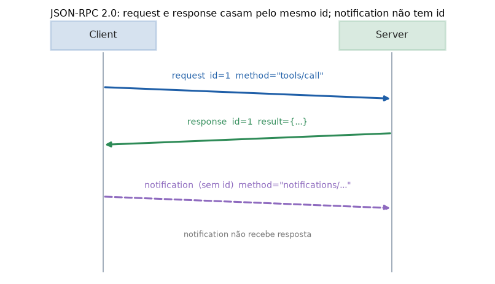

# Lição 074 — O protocolo MCP sobre JSON-RPC 2.0

> **Módulo:** M09 — MCP · **Ordem de estudo:** 74 · **Tempo:** ~55 min
> **Pré-requisitos:** [054] Saídas estruturadas e JSON mode · [073] Primitivas do MCP
> **Classificação:** complemento de aprofundamento à ementa

> **Convenção de formatação:** matemática em LaTeX (`$...$` inline, `$$...$$` em
> destaque, render nativo na pré-visualização do VS Code); figuras reprodutíveis
> geradas por `tools/figuras/gerar_figuras_m09.py` e incorporadas por caminho
> relativo `assets/<NNN>-<slug>/<nome>.png`; blocos ```python só para código e
> saída.

## Seção_Teórica

### Motivação

Já temos os papéis (Lição 072) e as primitivas (Lição 073). Falta a **linguagem
comum** com que client e server trocam mensagens. Se cada servidor inventasse seu
próprio formato, voltaríamos ao caos $M \times N$ da Lição 072. O MCP evita isso
adotando um padrão já consagrado: o **JSON-RPC 2.0**, um formato simples para
**chamar procedimentos remotos** trocando objetos JSON.

A escolha conecta diretamente a Lição 054 (saídas estruturadas) e a Lição 066
(round-trip de tool-calls): as mensagens precisam **sobreviver à serialização**
sem perder nada. Uma chave trocada, um tipo alterado (`True` virar `"true"`) e o
servidor do outro lado entende a coisa errada. Por isso, dominar a estrutura
JSON-RPC e o **round-trip exato** é o que torna a comunicação confiável.

### Princípio de funcionamento

Toda mensagem JSON-RPC 2.0 é um objeto JSON com o campo `"jsonrpc": "2.0"`. Há três
tipos:

- **Request:** tem `id`, `method` e (opcionalmente) `params`. Espera resposta.
- **Response:** tem o **mesmo** `id` da request e **ou** `result` (sucesso) **ou**
  `error` (falha) — nunca os dois. O `error` traz `code` e `message`.
- **Notification:** uma request **sem** `id`. Não recebe resposta.

O `id` é a cola que **casa** cada response à sua request:

$$\text{response.id} = \text{request.id}.$$

Para comparar e transmitir mensagens com segurança, serializamos de forma
**canônica** com `json.dumps(..., sort_keys=True)`. Sendo $S$ a serialização e $P$
o parsing, exigimos o **round-trip exato**, exatamente como na Lição 066:

$$P(S(x)) = x \quad\text{e}\quad S(P(S(x))) = S(x).$$


*Figura 1 — O client emite uma request com `id`; o server responde com o mesmo `id`. Uma notification não tem `id` e não recebe resposta (gerada por `tools/figuras/gerar_figuras_m09.py`).*

---

### Conceito central 1 — Estrutura da request JSON-RPC

Uma request carrega `jsonrpc`, `id`, `method` e `params`. Serializá-la com
`sort_keys=True` produz uma string **canônica**, comparável por igualdade.

#### Exemplo_Resolvido 1.1

```python
import json
# Uma request JSON-RPC 2.0: jsonrpc, id, method e params.
request = {
    "jsonrpc": "2.0",
    "id": 1,
    "method": "tools/call",
    "params": {"name": "somar", "arguments": {"a": 2, "b": 3}},
}
print(json.dumps(request, ensure_ascii=False, sort_keys=True))
```

**Explicação passo a passo:**
- **Bloco 1 (`request`):** os quatro campos de uma chamada — aqui, pedindo a execução da tool `somar` com argumentos `a=2`, `b=3`.
- **Bloco 2 (`json.dumps`):** com `sort_keys=True`, as chaves saem em ordem alfabética em todos os níveis, tornando a linha canônica e reproduzível.

**Saída esperada:**
```
{"id": 1, "jsonrpc": "2.0", "method": "tools/call", "params": {"arguments": {"a": 2, "b": 3}, "name": "somar"}}
```

---

### Conceito central 2 — Response e error

Para cada request com `id`, o servidor devolve **ou** um `result` (sucesso) **ou**
um `error` (falha), nunca ambos, sempre com o **mesmo** `id`. O `error` traz um
`code` numérico e uma `message`.

#### Exemplo_Resolvido 2.1

```python
import json
# Para cada request com id, o servidor devolve result OU error (nunca os dois).
def resposta_ok(id_, resultado):
    return {"jsonrpc": "2.0", "id": id_, "result": resultado}

def resposta_erro(id_, codigo, mensagem):
    return {"jsonrpc": "2.0", "id": id_, "error": {"code": codigo, "message": mensagem}}

ok = resposta_ok(1, {"valor": 5})
erro = resposta_erro(2, -32601, "Method not found")

print(json.dumps(ok, ensure_ascii=False, sort_keys=True))
print(json.dumps(erro, ensure_ascii=False, sort_keys=True))
print("ok tem result?", "result" in ok and "error" not in ok)
print("erro tem error?", "error" in erro and "result" not in erro)
```

**Explicação passo a passo:**
- **Bloco 1 (funções):** `resposta_ok` embala o `result`; `resposta_erro` embala um objeto `error` com `code` e `message`.
- **Bloco 2 (chamadas):** uma resposta de sucesso (id 1) e uma de erro padrão `-32601` ("método não encontrado", id 2).
- **Bloco 3 (`print`):** confirma a exclusividade — a de sucesso só tem `result`, a de erro só tem `error`.

**Saída esperada:**
```
{"id": 1, "jsonrpc": "2.0", "result": {"valor": 5}}
{"error": {"code": -32601, "message": "Method not found"}, "id": 2, "jsonrpc": "2.0"}
ok tem result? True
erro tem error? True
```

---

### Conceito central 3 — Round-trip request → JSON → request

A request trafega como **uma linha de texto JSON**. A propriedade de corretude é o
**round-trip exato**: serializar e re-parsear devolve uma estrutura **idêntica** à
original, inclusive os tipos. Com `sort_keys=True`, a re-serialização reproduz
**a mesma** string.

#### Exemplo_Resolvido 3.1

```python
import json
# Round-trip: request dict -> string JSON -> dict, com IGUALDADE EXATA.
request = {
    "jsonrpc": "2.0",
    "id": 7,
    "method": "resources/read",
    "params": {"uri": "file:///leiame.txt"},
}
linha = json.dumps(request, ensure_ascii=False, sort_keys=True)
volta = json.loads(linha)
print("linha:", linha)
print("igual?", volta == request)
print("re-serializa identico?",
      json.dumps(volta, ensure_ascii=False, sort_keys=True) == linha)
```

**Explicação passo a passo:**
- **Bloco 1 (`request`):** uma chamada a `resources/read` com a URI a ler nos `params`.
- **Bloco 2 (`linha`/`volta`):** serializa de forma canônica e parseia de volta para um dict.
- **Bloco 3 (`print`):** `igual?` é `True` (nada se perdeu) e a re-serialização reproduz a mesma string — o round-trip é exato.

**Saída esperada:**
```
linha: {"id": 7, "jsonrpc": "2.0", "method": "resources/read", "params": {"uri": "file:///leiame.txt"}}
igual? True
re-serializa identico? True
```

## Seção_Prática

> **Como reproduzir:** execute cada solução de referência com
> `python trilha/solucoes/074-mcp-jsonrpc/solucao_<n>.py` e compare a saída
> com o arquivo `.saida.txt` correspondente. Os enunciados/esqueletos ficam em
> `trilha/pratica/074-mcp-jsonrpc/exercicio_<n>.py`.

### Exercício 1 — Montar uma request JSON-RPC
- **Entrada inicial / setup:** uma chamada ao método `tools/call` da tool `multiplicar` com argumentos `{"a": 6, "b": 7}`, `id = 10`.
- **Passos de execução:** monte o dicionário `request` com `jsonrpc`, `id`, `method` e `params`; imprima `json.dumps(request, ensure_ascii=False, sort_keys=True)`.
- **Critério de conclusão (binário):** a saída é **exatamente** igual a `solucao_1.saida.txt`; qualquer divergência reprova.
- **Solução de referência:** `trilha/solucoes/074-mcp-jsonrpc/solucao_1.py`
- **Saída esperada:** `trilha/solucoes/074-mcp-jsonrpc/solucao_1.saida.txt`

### Exercício 2 — Sucesso e erro
- **Entrada inicial / setup:** uma response de sucesso com `id = 1` e `result = {"valor": 42}`, e uma de erro com `id = 2`, `code = -32602`, `message = "Invalid params"`.
- **Passos de execução:** monte os dois dicionários; imprima cada um com `json.dumps(..., ensure_ascii=False, sort_keys=True)` e depois `exclusivo? {True/False}` checando que a de sucesso tem `result` (e não `error`) e a de erro tem `error` (e não `result`).
- **Critério de conclusão (binário):** a saída é **exatamente** igual a `solucao_2.saida.txt` (`exclusivo? True`); qualquer divergência reprova.
- **Solução de referência:** `trilha/solucoes/074-mcp-jsonrpc/solucao_2.py`
- **Saída esperada:** `trilha/solucoes/074-mcp-jsonrpc/solucao_2.saida.txt`

### Exercício 3 — Round-trip request → JSON → request (ida-e-volta com igualdade exata)
- **Entrada inicial / setup:** a request `request = {"jsonrpc": "2.0", "id": 3, "method": "prompts/get", "params": {"name": "resumir", "arguments": {"n": 2}}}`.
- **Passos de execução:** serialize com `json.dumps(..., ensure_ascii=False, sort_keys=True)`, parseie de volta com `json.loads` e verifique a **igualdade exata** (`volta == request`); imprima `linha:`, `igual?` e `re-serializa identico?`.
- **Critério de conclusão (binário):** a saída é **exatamente** igual a `solucao_3.saida.txt` e, em particular, `igual? True` (round-trip sem perda); qualquer divergência reprova.
- **Solução de referência:** `trilha/solucoes/074-mcp-jsonrpc/solucao_3.py`
- **Saída esperada:** `trilha/solucoes/074-mcp-jsonrpc/solucao_3.saida.txt`
