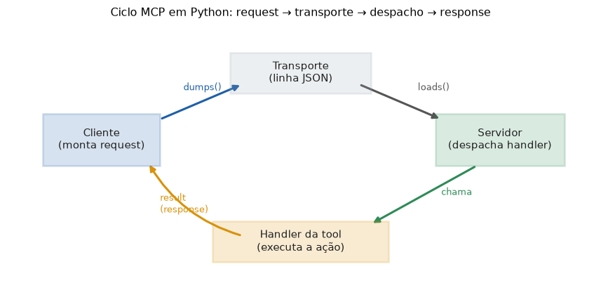

# Lição 075 — Construindo servidores e clientes MCP em Python (simulado)

> **Módulo:** M09 — MCP · **Ordem de estudo:** 75 · **Tempo:** ~55 min
> **Pré-requisitos:** [073] Primitivas do MCP · [074] O protocolo MCP sobre JSON-RPC 2.0
> **Classificação:** coberto pela ementa

> **Convenção de formatação:** matemática em LaTeX (`$...$` inline, `$$...$$` em
> destaque, render nativo na pré-visualização do VS Code); figuras reprodutíveis
> geradas por `tools/figuras/gerar_figuras_m09.py` e incorporadas por caminho
> relativo `assets/<NNN>-<slug>/<nome>.png`; blocos ```python só para código e
> saída.

## Seção_Teórica

### Motivação

Reunimos as peças: papéis (072), primitivas (073) e o formato das mensagens (074).
Agora montamos o **mecanismo** que as faz funcionar — um servidor e um cliente MCP,
em Python puro e **simulado** (sem rede). O objetivo não é reimplementar um SDK de
produção, e sim **enxergar o ciclo completo**: como uma chamada sai do cliente,
trafega como JSON, é despachada pelo servidor e volta como resposta.

Construir os dois lados deixa claras as duas garantias de corretude que vimos: o
servidor precisa **achar o handler certo** pelo `method`, e o cliente precisa
**casar a resposta** pelo `id`. Com isso no lugar, plugar uma tool nova é só
registrar mais um handler.

### Princípio de funcionamento

O **servidor** mantém um registro `method → handler`. Ao receber uma request, ele
busca o handler pelo `method`, executa com os `params` e devolve uma response com o
**mesmo** `id`:

$$\text{tratar}(\text{req}) = \{\,\text{id}: \text{req.id},\; \text{result}:
\text{handler}_{\text{req.method}}(\text{req.params})\,\}.$$

O **cliente** numera as requests com um contador crescente (`id` 1, 2, 3, ...),
serializa cada uma como uma **linha JSON** (o "transporte"), entrega ao servidor,
lê a resposta e **confere** que `response.id == request.id` antes de devolver o
`result`. Esse contador garante que cada chamada tem um `id` único na sessão.

Na prática do MCP, o cliente costuma primeiro **descobrir** o que existe
(`tools/list`) e só depois **executar** (`tools/call`) — o mesmo par
listar-então-chamar das primitivas da Lição 073.


*Figura 1 — O cliente serializa a request; o transporte entrega a linha JSON; o servidor desserializa, despacha o handler e devolve a response serializada (gerada por `tools/figuras/gerar_figuras_m09.py`).*

---

### Conceito central 1 — Servidor que despacha por método

O servidor é, no fundo, um **registro de handlers** indexado pelo nome do método.
Tratar uma request é localizar o handler e devolver seu resultado embrulhado numa
response com o mesmo `id`.

#### Exemplo_Resolvido 1.1

```python
# Um servidor MCP minimo: registra handlers por nome de metodo e despacha.
class ServidorMCP:
    def __init__(self):
        self.handlers = {}

    def registrar(self, metodo, fn):
        self.handlers[metodo] = fn

    def tratar(self, request):
        fn = self.handlers[request["method"]]
        resultado = fn(request.get("params", {}))
        return {"jsonrpc": "2.0", "id": request["id"], "result": resultado}

srv = ServidorMCP()
srv.registrar("ping", lambda p: {"pong": True})
resp = srv.tratar({"jsonrpc": "2.0", "id": 1, "method": "ping", "params": {}})
print("metodos:", sorted(srv.handlers))
print("resposta:", resp)
```

**Explicação passo a passo:**
- **Bloco 1 (`ServidorMCP`):** `registrar` adiciona um handler ao dicionário; `tratar` busca pelo `method` e devolve uma response com o mesmo `id`.
- **Bloco 2 (uso):** registra o método `ping` e o trata; o handler ignora os params e devolve `{"pong": True}`.
- **Bloco 3 (`print`):** lista os métodos registrados e mostra a response montada, já com `id=1`.

**Saída esperada:**
```
metodos: ['ping']
resposta: {'jsonrpc': '2.0', 'id': 1, 'result': {'pong': True}}
```

---

### Conceito central 2 — Cliente que casa por id

O cliente numera as requests, serializa cada uma como uma linha JSON, entrega ao
servidor e **confere o `id`** da resposta antes de devolver o `result`. O contador
garante `id`s únicos e crescentes.

#### Exemplo_Resolvido 2.1

```python
import json
# Cliente MCP: numera requests e fala com o servidor por uma "linha" JSON.
class ServidorMCP:
    def __init__(self):
        self.handlers = {}

    def registrar(self, metodo, fn):
        self.handlers[metodo] = fn

    def tratar_linha(self, linha):
        req = json.loads(linha)
        res = self.handlers[req["method"]](req.get("params", {}))
        return json.dumps({"jsonrpc": "2.0", "id": req["id"], "result": res},
                          ensure_ascii=False, sort_keys=True)

class ClienteMCP:
    def __init__(self, servidor):
        self.servidor = servidor
        self.proximo_id = 1

    def chamar(self, metodo, params):
        req = {"jsonrpc": "2.0", "id": self.proximo_id,
               "method": metodo, "params": params}
        self.proximo_id += 1
        linha = json.dumps(req, ensure_ascii=False, sort_keys=True)
        resposta = json.loads(self.servidor.tratar_linha(linha))
        assert resposta["id"] == req["id"]   # casa pelo id
        return resposta["result"]

srv = ServidorMCP()
srv.registrar("somar", lambda p: {"valor": p["a"] + p["b"]})
cli = ClienteMCP(srv)
print("1a chamada:", cli.chamar("somar", {"a": 2, "b": 3}))
print("2a chamada:", cli.chamar("somar", {"a": 10, "b": 20}))
print("proximo id:", cli.proximo_id)
```

**Explicação passo a passo:**
- **Bloco 1 (`ServidorMCP`):** agora fala por **linhas JSON** — desserializa a request, despacha e re-serializa a response (o "transporte").
- **Bloco 2 (`ClienteMCP`):** mantém `proximo_id`; cada `chamar` monta a request, incrementa o contador, troca linhas com o servidor e **confere o `id`** (`assert`).
- **Bloco 3 (uso):** duas chamadas a `somar` devolvem `5` e `30`; o contador termina em `3` (já pronto para a próxima request).

**Saída esperada:**
```
1a chamada: {'valor': 5}
2a chamada: {'valor': 30}
proximo id: 3
```

---

### Conceito central 3 — Ciclo tools/list e tools/call

O fluxo típico do MCP é **descobrir** as tools (`tools/list`) e depois **executar**
uma (`tools/call`). Um único handler de servidor pode atender aos dois métodos,
decidindo pelo campo `method`.

#### Exemplo_Resolvido 3.1

```python
# Ciclo completo: o cliente descobre tools (tools/list) e depois executa (tools/call).
def construir_servidor():
    ferramentas = {
        "somar": lambda a, b: a + b,
        "multiplicar": lambda a, b: a * b,
    }
    schemas = {
        "somar": {"a": "number", "b": "number"},
        "multiplicar": {"a": "number", "b": "number"},
    }

    def tratar(req):
        m = req["method"]
        if m == "tools/list":
            res = {"tools": sorted(schemas)}
        elif m == "tools/call":
            nome = req["params"]["name"]
            args = req["params"]["arguments"]
            res = {"valor": ferramentas[nome](**args)}
        return {"jsonrpc": "2.0", "id": req["id"], "result": res}

    return tratar

servidor = construir_servidor()
lista = servidor({"jsonrpc": "2.0", "id": 1, "method": "tools/list", "params": {}})
print("tools disponiveis:", lista["result"]["tools"])
chamada = servidor({"jsonrpc": "2.0", "id": 2, "method": "tools/call",
                    "params": {"name": "multiplicar", "arguments": {"a": 6, "b": 7}}})
print("multiplicar(6,7) =", chamada["result"]["valor"])
```

**Explicação passo a passo:**
- **Bloco 1 (`construir_servidor`):** fecha sobre as `ferramentas` e seus `schemas`; o `tratar` ramifica pelo `method`.
- **Bloco 2 (`tools/list`):** devolve os nomes das tools em ordem alfabética — a etapa de descoberta.
- **Bloco 3 (`tools/call`):** executa `multiplicar` com `a=6`, `b=7`, devolvendo `42` no campo `valor`.

**Saída esperada:**
```
tools disponiveis: ['multiplicar', 'somar']
multiplicar(6,7) = 42
```

## Seção_Prática

> **Como reproduzir:** execute cada solução de referência com
> `python trilha/solucoes/075-mcp-servidores-clientes-python/solucao_<n>.py` e
> compare a saída com o arquivo `.saida.txt` correspondente. Os
> enunciados/esqueletos ficam em
> `trilha/pratica/075-mcp-servidores-clientes-python/exercicio_<n>.py`.

### Exercício 1 — Servidor que despacha por método
- **Entrada inicial / setup:** um `ServidorMCP` com registro `method → handler`; registre `eco`, que devolve `{"texto": params["msg"]}`.
- **Passos de execução:** trate a request `{"jsonrpc": "2.0", "id": 5, "method": "eco", "params": {"msg": "oi"}}`; imprima `metodos: {lista ordenada}` e `resposta: {response}`.
- **Critério de conclusão (binário):** a saída é **exatamente** igual a `solucao_1.saida.txt` (a response tem `id` 5 e `result` `{'texto': 'oi'}`); qualquer divergência reprova.
- **Solução de referência:** `trilha/solucoes/075-mcp-servidores-clientes-python/solucao_1.py`
- **Saída esperada:** `trilha/solucoes/075-mcp-servidores-clientes-python/solucao_1.saida.txt`

### Exercício 2 — Cliente que casa por id
- **Entrada inicial / setup:** o `ServidorMCP` (por linhas JSON) e o `ClienteMCP` (contador de id) dos exemplos; registre `maior`, que devolve `{"valor": max(p["a"], p["b"])}`.
- **Passos de execução:** faça duas chamadas a `maior` (`{"a": 7, "b": 4}` e `{"a": 1, "b": 9}`); imprima `1a: {result}`, `2a: {result}` e `proximo id: {n}`.
- **Critério de conclusão (binário):** a saída é **exatamente** igual a `solucao_2.saida.txt` (`proximo id: 3`); qualquer divergência reprova.
- **Solução de referência:** `trilha/solucoes/075-mcp-servidores-clientes-python/solucao_2.py`
- **Saída esperada:** `trilha/solucoes/075-mcp-servidores-clientes-python/solucao_2.saida.txt`

### Exercício 3 — Ciclo tools/list + tools/call
- **Entrada inicial / setup:** um servidor com as tools `subtrair` (a − b) e `dividir` (a / b), atendendo a `tools/list` e `tools/call`.
- **Passos de execução:** chame `tools/list` e imprima `tools: {lista ordenada}`; depois chame `tools/call` para `subtrair` com `{"a": 10, "b": 4}` e imprima `subtrair(10,4) = {valor}`.
- **Critério de conclusão (binário):** a saída é **exatamente** igual a `solucao_3.saida.txt` (`subtrair(10,4) = 6`); qualquer divergência reprova.
- **Solução de referência:** `trilha/solucoes/075-mcp-servidores-clientes-python/solucao_3.py`
- **Saída esperada:** `trilha/solucoes/075-mcp-servidores-clientes-python/solucao_3.saida.txt`
