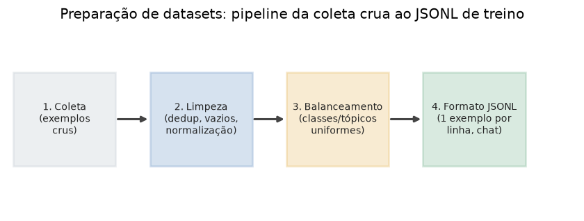

# Lição 076 — Preparação de datasets para fine-tuning

> **Módulo:** M10 — Fine-Tuning e Processamento de Dados · **Ordem de estudo:** 76 · **Tempo:** ~50 min
> **Pré-requisitos:** [046] Instruction tuning e SFT
> **Classificação:** coberto pela ementa

> **Convenção de formatação:** matemática em LaTeX (`$...$` inline, `$$...$$` em
> destaque, render nativo na pré-visualização do VS Code); figuras reprodutíveis
> geradas por `tools/figuras/gerar_figuras_m10.py` e incorporadas por caminho
> relativo `assets/<NNN>-<slug>/<nome>.png`; blocos ```python só para código e
> saída.

## Seção_Teórica

### Motivação

O resultado de um fine-tuning é tão bom quanto o **dataset** que o alimenta. Você
pode escolher o melhor modelo base e os melhores hiperparâmetros, mas se os dados
tiverem exemplos duplicados, campos vazios, ruído de formatação ou classes
desbalanceadas, o modelo vai **memorizar o lixo** ou **enviesar para a classe
majoritária**. Na prática, engenheiros de IA gastam a maior parte do esforço de um
projeto de fine-tuning **preparando dados**, não treinando. Esta lição cobre as
três etapas que transformam exemplos crus em um dataset confiável: **limpeza**,
**balanceamento** e **formatação** no padrão **JSONL** que as plataformas de
treino esperam.

### Princípio de funcionamento

A preparação de dados é uma **pipeline determinística**: cada exemplo cru passa por
estágios que o transformam ou o descartam, e o resultado é uma coleção pronta para
treino. Primeiro, a **limpeza** normaliza o texto (colapsa espaços, apara bordas),
remove exemplos com campos vazios e elimina **duplicatas**, que inflariam
artificialmente o peso de certos exemplos. Em seguida, o **balanceamento** corrige
a distribuição de classes: se uma classe tem muito mais exemplos que outra, o
modelo aprende a "chutar" a majoritária. A subamostragem reduz todas as classes ao
tamanho da menor, $n_{\min} = \min_c n_c$, removendo o viés de frequência. Por fim,
a **serialização** grava cada exemplo como uma linha JSON independente (JSONL), o
formato que ferramentas de fine-tuning consomem.



*Figura 1 — A preparação como pipeline: exemplos crus passam por limpeza e balanceamento até virarem um arquivo JSONL de treino. Gerada por `tools/figuras/gerar_figuras_m10.py`.*

---

### Conceito central 1 — Limpeza e deduplicação

A limpeza padroniza o texto e remove o que prejudica o treino. Normalizar espaços
(`" ".join(texto.split())`) garante que `"  O que e  X "` e `"O que e X"` sejam
tratados como **iguais** — o que é essencial para detectar duplicatas. Um exemplo
com pergunta ou resposta vazia não ensina nada e deve sair. Duplicatas exatas
fazem o modelo ver o mesmo par várias vezes, distorcendo a perda.

#### Exemplo_Resolvido 1.1

```python
# Limpeza: normaliza espacos, descarta vazios e remove duplicatas exatas.
brutos = [
    {"pergunta": "  O que e overfitting? ", "resposta": "Memorizar o treino."},
    {"pergunta": "O que e overfitting?", "resposta": "Memorizar o treino."},
    {"pergunta": "Defina RAG.", "resposta": ""},
    {"pergunta": "", "resposta": "resposta orfa"},
    {"pergunta": "Defina RAG.", "resposta": "Recuperar + gerar."},
]

def normalizar(texto):
    return " ".join(texto.split())

vistos = set()
limpos = []
for ex in brutos:
    p = normalizar(ex["pergunta"])
    r = normalizar(ex["resposta"])
    if not p or not r:            # descarta campos vazios
        continue
    if (p, r) in vistos:          # descarta duplicata exata
        continue
    vistos.add((p, r))
    limpos.append({"pergunta": p, "resposta": r})

print("brutos:", len(brutos))
print("limpos:", len(limpos))
for ex in limpos:
    print(f"- {ex['pergunta']} -> {ex['resposta']}")
```

**Explicação passo a passo:**
- **Bloco 1 (`brutos`):** cinco exemplos crus com um espaçamento irregular, um vazio na resposta, um vazio na pergunta e uma duplicata da primeira pergunta.
- **Bloco 2 (`normalizar`):** colapsa espaços repetidos e apara as bordas, condição para comparar textos de forma justa.
- **Bloco 3 (laço):** descarta vazios, usa um `set` de pares `(p, r)` para detectar duplicatas e acumula só os exemplos válidos e únicos.
- **Bloco 4 (`print`):** dos 5 crus, sobram 2 — a duplicata e os dois vazios saíram.

**Saída esperada:**
```
brutos: 5
limpos: 2
- O que e overfitting? -> Memorizar o treino.
- Defina RAG. -> Recuperar + gerar.
```

---

### Conceito central 2 — Balanceamento de classes

Quando uma classe domina o dataset, o modelo aprende a prever a majoritária por
padrão. O **balanceamento por subamostragem** corta cada classe até o tamanho da
menor, $n_{\min}$, igualando as frequências. Para ser **reprodutível**, o
embaralhamento usa uma semente fixa: a mesma execução sempre produz o mesmo
subconjunto.

#### Exemplo_Resolvido 2.1

```python
from collections import Counter
import random

exemplos = [
    ("positivo", "adorei o produto"),
    ("positivo", "excelente atendimento"),
    ("positivo", "voltarei a comprar"),
    ("positivo", "recomendo a todos"),
    ("negativo", "chegou quebrado"),
    ("negativo", "demorou demais"),
]

contagem = Counter(rotulo for rotulo, _ in exemplos)
minimo = min(contagem.values())
print("antes :", dict(contagem))
print("minimo:", minimo)

rng = random.Random(42)
por_classe = {}
for rotulo, texto in exemplos:
    por_classe.setdefault(rotulo, []).append((rotulo, texto))

balanceado = []
for rotulo in sorted(por_classe):
    grupo = list(por_classe[rotulo])
    rng.shuffle(grupo)
    balanceado.extend(grupo[:minimo])

print("depois:", dict(Counter(rotulo for rotulo, _ in balanceado)))
print("total :", len(balanceado))
```

**Explicação passo a passo:**
- **Bloco 1 (`exemplos`):** dataset com 4 positivos e 2 negativos — desbalanceado 2:1.
- **Bloco 2 (`Counter`/`minimo`):** conta por classe e descobre que a menor classe tem 2 exemplos.
- **Bloco 3 (agrupar + `random.Random(42)`):** agrupa por classe e embaralha de forma reprodutível antes de cortar.
- **Bloco 4 (subamostragem):** mantém os 2 primeiros de cada classe; o resultado fica `2 + 2 = 4`, perfeitamente balanceado.

**Saída esperada:**
```
antes : {'positivo': 4, 'negativo': 2}
minimo: 2
depois: {'negativo': 2, 'positivo': 2}
total : 4
```

---

### Conceito central 3 — Formato JSONL

O **JSONL** (JSON Lines) grava **um exemplo por linha**, cada um um objeto JSON
independente. É o formato padrão das plataformas de fine-tuning porque permite
streaming linha a linha sem carregar o arquivo inteiro. Para datasets de chat,
cada linha costuma ter a chave `messages` com a lista de turnos. Usar
`sort_keys=True` torna a serialização **determinística** e o ciclo
parse → serialize → parse **exato**.

#### Exemplo_Resolvido 3.1

```python
import json

registros = [
    {"messages": [
        {"role": "user", "content": "Some 2 e 3."},
        {"role": "assistant", "content": "5"},
    ]},
    {"messages": [
        {"role": "user", "content": "Capital da Franca?"},
        {"role": "assistant", "content": "Paris"},
    ]},
]

def para_jsonl(regs):
    return "\n".join(json.dumps(r, ensure_ascii=False, sort_keys=True) for r in regs)

def de_jsonl(texto):
    return [json.loads(linha) for linha in texto.splitlines() if linha.strip()]

jsonl = para_jsonl(registros)
print(jsonl)
volta = de_jsonl(jsonl)
print("linhas:", len(volta))
print("round-trip exato:", volta == registros)
```

**Explicação passo a passo:**
- **Bloco 1 (`registros`):** dois exemplos de chat, cada um com turnos `user`/`assistant`.
- **Bloco 2 (`para_jsonl`):** serializa cada registro em uma linha JSON com `sort_keys=True` (chaves ordenadas: `content` antes de `role`).
- **Bloco 3 (`de_jsonl`):** parseia de volta, ignorando linhas em branco.
- **Bloco 4 (`print`):** o JSONL tem 2 linhas e o round-trip recupera exatamente os registros originais (`True`).

**Saída esperada:**
```
{"messages": [{"content": "Some 2 e 3.", "role": "user"}, {"content": "5", "role": "assistant"}]}
{"messages": [{"content": "Capital da Franca?", "role": "user"}, {"content": "Paris", "role": "assistant"}]}
linhas: 2
round-trip exato: True
```

## Seção_Prática

> **Como reproduzir:** execute cada solução de referência com
> `python trilha/solucoes/076-preparacao-datasets-fine-tuning/solucao_<n>.py` e
> compare a saída com o arquivo `.saida.txt` correspondente. Os
> enunciados/esqueletos ficam em
> `trilha/pratica/076-preparacao-datasets-fine-tuning/exercicio_<n>.py`.

### Exercício 1 — Limpar um dataset cru
- **Entrada inicial / setup:** a lista `brutos` com 6 exemplos (em `exercicio_1.py`), incluindo espaçamento irregular, um campo só com espaços, uma pergunta vazia e uma duplicata.
- **Passos de execução:** normalize os espaços de cada campo, descarte exemplos com qualquer campo vazio, remova duplicatas exatas `(pergunta, resposta)` e imprima `brutos`, `limpos`, `removidos` e a lista final no formato `- pergunta | resposta`.
- **Critério de conclusão (binário):** a saída é **exatamente** igual a `solucao_1.saida.txt` (`limpos: 2` e `removidos: 4`); qualquer divergência reprova.
- **Solução de referência:** `trilha/solucoes/076-preparacao-datasets-fine-tuning/solucao_1.py`
- **Saída esperada:** `trilha/solucoes/076-preparacao-datasets-fine-tuning/solucao_1.saida.txt`

### Exercício 2 — Balancear por subamostragem
- **Entrada inicial / setup:** a lista `exemplos` com 5 `spam` e 2 `ham` (em `exercicio_2.py`).
- **Passos de execução:** conte por classe, ache o `minimo`, embaralhe com `random.Random(7)`, percorra as classes em ordem alfabética (`sorted`) e mantenha os `minimo` primeiros de cada uma; imprima `antes`, `minimo`, `depois` e `total`.
- **Critério de conclusão (binário):** a saída é **exatamente** igual a `solucao_2.saida.txt` (`depois: {'ham': 2, 'spam': 2}` e `total : 4`); qualquer divergência reprova.
- **Solução de referência:** `trilha/solucoes/076-preparacao-datasets-fine-tuning/solucao_2.py`
- **Saída esperada:** `trilha/solucoes/076-preparacao-datasets-fine-tuning/solucao_2.saida.txt`

### Exercício 3 — Round-trip (ida-e-volta) de JSONL
- **Entrada inicial / setup:** a lista `registros` com 2 exemplos de chat (em `exercicio_3.py`).
- **Passos de execução:** implemente `serializar` (uma linha JSON por registro, `ensure_ascii=False, sort_keys=True`) e `parsear` (ignora linhas em branco); aplique o ciclo parse → serialize → parse duas vezes e imprima `linhas`, se o round-trip é exato e se o resultado iguala o original.
- **Critério de conclusão (binário):** a saída é **exatamente** igual a `solucao_3.saida.txt` (`round-trip parse->serialize->parse exato: True` e `igual ao original: True`); qualquer divergência reprova.
- **Solução de referência:** `trilha/solucoes/076-preparacao-datasets-fine-tuning/solucao_3.py`
- **Saída esperada:** `trilha/solucoes/076-preparacao-datasets-fine-tuning/solucao_3.saida.txt`
