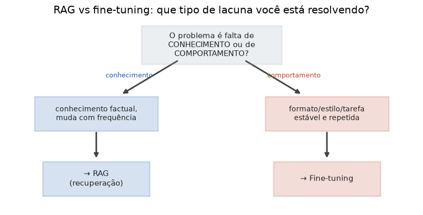

# Lição 077 — Fine-tuning completo: quando e por quê

> **Módulo:** M10 — Fine-Tuning e Processamento de Dados · **Ordem de estudo:** 77 · **Tempo:** ~50 min
> **Pré-requisitos:** [046] Instruction tuning e SFT · [076] Preparação de datasets para fine-tuning
> **Classificação:** coberto pela ementa

> **Convenção de formatação:** matemática em LaTeX (`$...$` inline, `$$...$$` em
> destaque, render nativo na pré-visualização do VS Code); figuras reprodutíveis
> geradas por `tools/figuras/gerar_figuras_m10.py` e incorporadas por caminho
> relativo `assets/<NNN>-<slug>/<nome>.png`; blocos ```python só para código e
> saída.

## Seção_Teórica

### Motivação

"Vamos fazer fine-tuning" é uma das frases mais caras em um projeto de IA — e,
muitas vezes, a errada. Antes de treinar, a pergunta é: **o problema é falta de
conhecimento ou falta de comportamento?** Se o modelo precisa de **fatos** que
mudam (catálogo, políticas, documentação), **RAG** resolve sem treinar nada. Se o
modelo precisa adotar um **formato, estilo ou tarefa** de forma estável e repetida,
**fine-tuning** é a ferramenta certa. Escolher errado custa tempo, dinheiro de GPU
e frustração. Esta lição dá um arcabouço de decisão e mostra, com números, por que
o **fine-tuning completo** (atualizar todos os pesos) é tão pesado — o que motiva o
LoRA/PEFT da próxima lição.

### Princípio de funcionamento

O fine-tuning completo continua o mesmo objetivo de treino do SFT (cross-entropy
do próximo token), mas **atualiza todos os $N$ parâmetros** do modelo. O custo de
memória não é só guardar os pesos: para cada parâmetro, o otimizador Adam mantém
**gradientes** e dois **estados** ($m$ e $v$). Uma conta padrão é

$$ \text{memória} \approx N \,\big( b_{\text{peso}} + b_{\text{grad}} + b_{\text{otim}} \big), $$

com pesos e gradientes em 2 bytes (bf16) e estados do Adam em fp32 (8 bytes no
total), ou seja $\approx 12$ bytes por parâmetro. Para um modelo de 7 bilhões de
parâmetros, isso já passa de 80 GB — sem contar ativações. A decisão RAG vs
fine-tuning, por sua vez, pode ser estruturada como uma **matriz de decisão**:
listam-se critérios com pesos, pontua-se cada abordagem e compara-se o total
ponderado.



*Figura 1 — Se a lacuna é de conhecimento dinâmico, RAG; se é de comportamento/formato estável, fine-tuning. Gerada por `tools/figuras/gerar_figuras_m10.py`.*

---

### Conceito central 1 — RAG vs fine-tuning

A regra prática: **RAG injeta conhecimento; fine-tuning molda comportamento**. Se o
conhecimento muda com frequência, treinar o modelo o tornaria desatualizado no dia
seguinte — RAG recupera a informação fresca em tempo de consulta. Se o que falta é
seguir um formato/estilo/tarefa de forma consistente, fine-tuning grava esse
comportamento nos pesos. Os dois se combinam quando ambas as lacunas existem.

#### Exemplo_Resolvido 1.1

```python
def recomendar(conhecimento_dinamico, precisa_formato_fixo, orcamento_treino):
    if conhecimento_dinamico and precisa_formato_fixo:
        return "RAG + fine-tuning"
    if conhecimento_dinamico:
        return "RAG"
    if precisa_formato_fixo and orcamento_treino:
        return "fine-tuning"
    return "prompt engineering"

casos = [
    ("FAQ que muda toda semana",
     dict(conhecimento_dinamico=True, precisa_formato_fixo=False, orcamento_treino=True)),
    ("Responder sempre em JSON valido",
     dict(conhecimento_dinamico=False, precisa_formato_fixo=True, orcamento_treino=True)),
    ("Base juridica enorme + estilo fixo",
     dict(conhecimento_dinamico=True, precisa_formato_fixo=True, orcamento_treino=True)),
    ("Tarefa simples, poucos exemplos",
     dict(conhecimento_dinamico=False, precisa_formato_fixo=False, orcamento_treino=False)),
]
for descricao, flags in casos:
    print(f"{recomendar(**flags):>18}  <-  {descricao}")
```

**Explicação passo a passo:**
- **Bloco 1 (`recomendar`):** codifica a regra de decisão em ordem de prioridade — o caso "ambos" vem primeiro para não ser ofuscado pelos demais.
- **Bloco 2 (`casos`):** quatro situações típicas, cada uma com suas flags.
- **Bloco 3 (laço):** imprime a recomendação alinhada; conhecimento dinâmico puxa para RAG, formato fixo puxa para fine-tuning, e a ausência de ambos sugere apenas prompt engineering.

**Saída esperada:**
```
               RAG  <-  FAQ que muda toda semana
       fine-tuning  <-  Responder sempre em JSON valido
 RAG + fine-tuning  <-  Base juridica enorme + estilo fixo
prompt engineering  <-  Tarefa simples, poucos exemplos
```

---

### Conceito central 2 — Custo do fine-tuning completo

O fine-tuning completo é caro porque cada parâmetro carrega **quatro** custos de
memória durante o treino: o peso, seu gradiente e os dois estados do Adam. Estimar
esse custo antes de treinar evita a surpresa de um "out of memory" na GPU e
justifica métodos parameter-efficient.

#### Exemplo_Resolvido 2.1

```python
def memoria_treino_gb(n_params_bilhoes, bytes_param=2, bytes_grad=2, bytes_otimizador=8):
    n = n_params_bilhoes * 1e9
    total_bytes = n * (bytes_param + bytes_grad + bytes_otimizador)
    return total_bytes / 1e9

for b in [0.5, 7, 13]:
    gb = memoria_treino_gb(b)
    print(f"modelo {b:>4}B  ->  {gb:6.1f} GB de memoria de treino")
```

**Explicação passo a passo:**
- **Bloco 1 (`memoria_treino_gb`):** soma os bytes por parâmetro ($2 + 2 + 8 = 12$) e multiplica pelo número de parâmetros, convertendo para GB.
- **Bloco 2 (laço):** aplica a fórmula a três tamanhos; note o crescimento **linear** — 7B já exige 84 GB só para o estado de treino, acima da memória de uma única GPU típica.

**Saída esperada:**
```
modelo  0.5B  ->     6.0 GB de memoria de treino
modelo    7B  ->    84.0 GB de memoria de treino
modelo   13B  ->   156.0 GB de memoria de treino
```

---

### Conceito central 3 — Matriz de decisão

Quando a escolha não é óbvia, uma **matriz de decisão** torna o raciocínio
explícito e auditável: cada critério recebe um **peso** (importância) e uma **nota**
(0..5) para cada abordagem. O total ponderado $\sum_c w_c \, s_c$ resume a
comparação em um número por abordagem.

#### Exemplo_Resolvido 3.1

```python
criterios = [
    # (nome, peso, score_rag, score_ft)  scores em 0..5
    ("conhecimento dinamico", 3, 5, 1),
    ("formato/comportamento fixo", 3, 1, 5),
    ("custo de manutencao baixo", 2, 4, 2),
    ("latencia baixa", 2, 2, 5),
]

total_rag = sum(peso * s for _, peso, s, _ in criterios)
total_ft = sum(peso * s for _, peso, _, s in criterios)

print(f"{'criterio':<28}{'peso':>5}{'RAG':>5}{'FT':>5}")
for nome, peso, sr, sf in criterios:
    print(f"{nome:<28}{peso:>5}{sr:>5}{sf:>5}")
print("-" * 43)
print(f"{'TOTAL ponderado':<28}{'':>5}{total_rag:>5}{total_ft:>5}")
print("vencedor:", "RAG" if total_rag > total_ft else "fine-tuning" if total_ft > total_rag else "empate")
```

**Explicação passo a passo:**
- **Bloco 1 (`criterios`):** quatro critérios com pesos e notas para RAG e fine-tuning.
- **Bloco 2 (`total_rag`/`total_ft`):** soma ponderada de cada abordagem ($30$ vs $32$).
- **Bloco 3 (impressão):** imprime a tabela formatada, o separador e o vencedor — aqui, fine-tuning vence por margem estreita, sinal de que o resultado é sensível aos pesos.

**Saída esperada:**
```
criterio                     peso  RAG   FT
conhecimento dinamico           3    5    1
formato/comportamento fixo      3    1    5
custo de manutencao baixo       2    4    2
latencia baixa                  2    2    5
-------------------------------------------
TOTAL ponderado                     30   32
vencedor: fine-tuning
```

## Seção_Prática

> **Como reproduzir:** execute cada solução de referência com
> `python trilha/solucoes/077-fine-tuning-completo/solucao_<n>.py` e compare a
> saída com o arquivo `.saida.txt` correspondente. Os enunciados/esqueletos
> ficam em `trilha/pratica/077-fine-tuning-completo/exercicio_<n>.py`.

### Exercício 1 — Recomendar a abordagem
- **Entrada inicial / setup:** a lista `casos` (em `exercicio_1.py`) com 4 situações e suas flags `conhecimento_dinamico`, `precisa_formato_fixo`, `orcamento_treino`.
- **Passos de execução:** implemente `recomendar(...)` com a regra de prioridade (ambos → RAG → fine-tuning → prompt) e imprima cada recomendação alinhada à direita (largura 18) seguida de `  <-  ` e a descrição.
- **Critério de conclusão (binário):** a saída é **exatamente** igual a `solucao_1.saida.txt` (primeira linha `RAG`, terceira `RAG + fine-tuning`); qualquer divergência reprova.
- **Solução de referência:** `trilha/solucoes/077-fine-tuning-completo/solucao_1.py`
- **Saída esperada:** `trilha/solucoes/077-fine-tuning-completo/solucao_1.saida.txt`

### Exercício 2 — Estimar a memória de treino
- **Entrada inicial / setup:** os tamanhos `1`, `8` e `70` (bilhões de parâmetros).
- **Passos de execução:** implemente `memoria_treino_gb(...)` somando pesos + gradientes + estados do Adam ($12$ bytes/parâmetro) e imprima `modelo {b:>3}B  ->  {gb:7.1f} GB` para cada tamanho.
- **Critério de conclusão (binário):** a saída é **exatamente** igual a `solucao_2.saida.txt` (`modelo  70B  ->    840.0 GB`); qualquer divergência reprova.
- **Solução de referência:** `trilha/solucoes/077-fine-tuning-completo/solucao_2.py`
- **Saída esperada:** `trilha/solucoes/077-fine-tuning-completo/solucao_2.saida.txt`

### Exercício 3 — Matriz de decisão ponderada
- **Entrada inicial / setup:** a lista `criterios` (em `exercicio_3.py`) com 4 critérios `(nome, peso, nota_rag, nota_ft)`.
- **Passos de execução:** calcule os totais ponderados, imprima cabeçalho, uma linha por critério, separador de 43 traços, a linha TOTAL e o vencedor (`empate` se iguais).
- **Critério de conclusão (binário):** a saída é **exatamente** igual a `solucao_3.saida.txt` (`TOTAL ... 32 25` e `vencedor: RAG`); qualquer divergência reprova.
- **Solução de referência:** `trilha/solucoes/077-fine-tuning-completo/solucao_3.py`
- **Saída esperada:** `trilha/solucoes/077-fine-tuning-completo/solucao_3.saida.txt`
