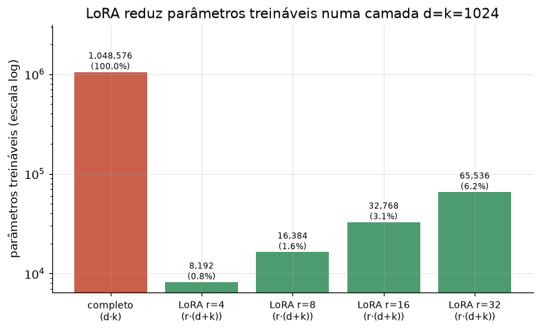

# Lição 078 — LoRA e PEFT: adaptação de baixo posto

> **Módulo:** M10 — Fine-Tuning e Processamento de Dados · **Ordem de estudo:** 78 · **Tempo:** ~55 min
> **Pré-requisitos:** [077] Fine-tuning completo: quando e por quê
> **Classificação:** complemento de aprofundamento à ementa

> **Convenção de formatação:** matemática em LaTeX (`$...$` inline, `$$...$$` em
> destaque, render nativo na pré-visualização do VS Code); figuras reprodutíveis
> geradas por `tools/figuras/gerar_figuras_m10.py` e incorporadas por caminho
> relativo `assets/<NNN>-<slug>/<nome>.png`; blocos ```python só para código e
> saída.

## Seção_Teórica

### Motivação

A lição anterior mostrou o problema: fine-tuning completo de um modelo de 7B exige
mais de 80 GB só para o estado de treino. O **PEFT** (*Parameter-Efficient
Fine-Tuning*) resolve isso treinando **poucos** parâmetros novos e **congelando** o
modelo original. O método mais usado é o **LoRA** (*Low-Rank Adaptation*): em vez
de atualizar uma matriz de pesos $W \in \mathbb{R}^{d \times k}$ inteira, ele
aprende uma **correção de baixo posto** $\Delta W = B A$, com $B \in \mathbb{R}^{d
\times r}$ e $A \in \mathbb{R}^{r \times k}$ e $r \ll \min(d, k)$. Com $r$ pequeno,
o número de parâmetros treináveis despenca — frequentemente para menos de 1% do
total — viabilizando fine-tuning em uma única GPU e o armazenamento de dezenas de
"adaptadores" leves para um mesmo modelo base.

### Princípio de funcionamento

A ideia central é que a **atualização** de pesos durante o fine-tuning tem
**posto intrínseco baixo**: ela pode ser bem aproximada por um produto de duas
matrizes finas. O LoRA congela $W_0$ e parametriza a camada como

$$ W = W_0 + \Delta W = W_0 + \frac{\alpha}{r}\, B A, $$

onde só $B$ e $A$ são treinados. O produto $BA$ tem posto no máximo $r$, então
$\Delta W$ vive num subespaço de dimensão $r$. A contagem de parâmetros cai de
$d \cdot k$ (matriz cheia) para $r \cdot (d + k)$ (as duas matrizes finas). O fator
$\alpha/r$ é um **ganho de escala** que desacopla a magnitude da atualização da
escolha de $r$, permitindo variar o posto sem reajustar a taxa de aprendizado. No
início do treino $B = 0$, de modo que $\Delta W = 0$ e o modelo parte exatamente do
comportamento pré-treinado.



*Figura 1 — Numa camada d=k=1024, LoRA com r pequeno treina uma fração mínima dos pesos da matriz cheia. Gerada por `tools/figuras/gerar_figuras_m10.py`.*

---

### Conceito central 1 — Decomposição de baixo posto

A correção $\Delta W = B A$ é, por construção, de **posto baixo**: como $B$ tem $r$
colunas e $A$ tem $r$ linhas, o produto não pode ter posto maior que $r$. É isso
que permite representar uma matriz $d \times k$ com apenas $r(d+k)$ números.

#### Exemplo_Resolvido 1.1

```python
import numpy as np

rng = np.random.default_rng(0)
d, k, r = 6, 4, 2
B = rng.normal(size=(d, r))      # d x r
A = rng.normal(size=(r, k))      # r x k
delta_W = B @ A                  # d x k, posto <= r

print("shape B:", B.shape, "shape A:", A.shape)
print("shape delta_W:", delta_W.shape)
print("posto de delta_W:", int(np.linalg.matrix_rank(delta_W)))
print("posto maximo possivel (min(d,k)):", min(d, k))
```

**Explicação passo a passo:**
- **Bloco 1 (`B`/`A`):** duas matrizes finas com a dimensão compartilhada $r = 2$.
- **Bloco 2 (`delta_W`):** o produto $B A$ tem formato $6 \times 4$, igual ao da matriz cheia que ele corrige.
- **Bloco 3 (`print`):** `matrix_rank` confirma que o posto é $2$ (limitado por $r$), bem abaixo do máximo possível $\min(6, 4) = 4$ — a essência da compressão do LoRA.

**Saída esperada:**
```
shape B: (6, 2) shape A: (2, 4)
shape delta_W: (6, 4)
posto de delta_W: 2
posto maximo possivel (min(d,k)): 4
```

---

### Conceito central 2 — Contagem de parâmetros

O ganho do LoRA é direto na contagem: de $d \cdot k$ para $r \cdot (d + k)$. Para
camadas grandes (onde $d$ e $k$ são milhares) e $r$ pequeno (4 a 64), isso costuma
ser **menos de 1%** dos pesos originais.

#### Exemplo_Resolvido 2.1

```python
def parametros(d, k, r):
    completo = d * k
    lora = r * (d + k)
    return completo, lora

d = k = 1024
for r in [1, 4, 8, 16]:
    completo, lora = parametros(d, k, r)
    pct = 100.0 * lora / completo
    print(f"r={r:>2}: completo={completo:>9} lora={lora:>7} ({pct:5.2f}% dos pesos)")
```

**Explicação passo a passo:**
- **Bloco 1 (`parametros`):** devolve os dois custos — $d k$ da matriz cheia e $r(d+k)$ do LoRA.
- **Bloco 2 (laço):** para uma camada $1024 \times 1024$ (mais de 1 milhão de pesos), até $r = 16$ usa apenas ~3% dos parâmetros; $r = 1$ usa 0,20%.

**Saída esperada:**
```
r= 1: completo=  1048576 lora=   2048 ( 0.20% dos pesos)
r= 4: completo=  1048576 lora=   8192 ( 0.78% dos pesos)
r= 8: completo=  1048576 lora=  16384 ( 1.56% dos pesos)
r=16: completo=  1048576 lora=  32768 ( 3.12% dos pesos)
```

---

### Conceito central 3 — Fator de escala alpha

O termo $\alpha/r$ escala a contribuição de $BA$. Aumentar $\alpha$ amplifica a
correção aplicada a $W_0$; manter $\alpha$ fixo enquanto se varia $r$ mantém a
magnitude da atualização aproximadamente estável. Ver o efeito na **norma da
saída** $y = x W$ torna isso concreto.

#### Exemplo_Resolvido 3.1

```python
import numpy as np

rng = np.random.default_rng(1)
d, k, r = 4, 3, 2
W0 = rng.normal(size=(d, k))
B = rng.normal(size=(d, r))
A = rng.normal(size=(r, k))
x = np.ones(d)

for alpha in [1, 2, 8]:
    escala = alpha / r
    W = W0 + escala * (B @ A)
    y = x @ W
    print(f"alpha={alpha}: escala={escala:.1f} ||y||={np.linalg.norm(y):.4f}")
```

**Explicação passo a passo:**
- **Bloco 1 (setup):** matriz congelada $W_0$ e as matrizes LoRA $B$, $A$; a entrada $x$ é um vetor de uns.
- **Bloco 2 (laço de `alpha`):** a escala $\alpha/r$ cresce de $0.5$ a $4.0$; quanto maior, mais a saída $y$ se afasta da resposta de $W_0$, evidenciado pela norma crescente.

**Saída esperada:**
```
alpha=1: escala=0.5 ||y||=3.0825
alpha=2: escala=1.0 ||y||=3.5099
alpha=8: escala=4.0 ||y||=9.6750
```

## Seção_Prática

> **Como reproduzir:** execute cada solução de referência com
> `python trilha/solucoes/078-lora-peft/solucao_<n>.py` e compare a saída com o
> arquivo `.saida.txt` correspondente. Os enunciados/esqueletos ficam em
> `trilha/pratica/078-lora-peft/exercicio_<n>.py`.

### Exercício 1 — Atualização de baixo posto
- **Entrada inicial / setup:** numpy com `rng = np.random.default_rng(7)`, d=8, k=5, r=3.
- **Passos de execução:** sorteie B (d×r), A (r×k), forme `delta = B@A`, sorteie W0 (d×k) **depois** de B e A; imprima o shape de delta, o posto de delta, o posto de W0 e o número de parâmetros de (B,A) e de W0.
- **Critério de conclusão (binário):** a saída é **exatamente** igual a `solucao_1.saida.txt` (`posto de delta (BA): 3`, `parametros LoRA (B,A): 39`); qualquer divergência reprova.
- **Solução de referência:** `trilha/solucoes/078-lora-peft/solucao_1.py`
- **Saída esperada:** `trilha/solucoes/078-lora-peft/solucao_1.saida.txt`

### Exercício 2 — Contagem de parâmetros
- **Entrada inicial / setup:** d=k=4096 e postos r em [4, 8, 16, 64].
- **Passos de execução:** implemente `economia(d, k, r)` retornando (completo, lora, pct) e imprima `r={r:>3}: lora={lora:>8} de {completo:>9} ({pct:5.2f}%)` por posto.
- **Critério de conclusão (binário):** a saída é **exatamente** igual a `solucao_2.saida.txt` (`r= 64: lora=  524288 de  16777216 ( 3.12%)`); qualquer divergência reprova.
- **Solução de referência:** `trilha/solucoes/078-lora-peft/solucao_2.py`
- **Saída esperada:** `trilha/solucoes/078-lora-peft/solucao_2.saida.txt`

### Exercício 3 — Fator de escala alpha/r
- **Entrada inicial / setup:** numpy com `rng = np.random.default_rng(3)`, d=5, k=4, r=2, x = vetor de uns; sorteie W0, B, A nessa ordem.
- **Passos de execução:** imprima a norma de `x @ W0`; depois, para alpha em [2, 4, 16], calcule a escala alpha/r e a norma de `x @ (W0 + escala*(B@A))`.
- **Critério de conclusão (binário):** a saída é **exatamente** igual a `solucao_3.saida.txt` (`alpha=16: escala=8.0 ||y||=49.5014`); qualquer divergência reprova.
- **Solução de referência:** `trilha/solucoes/078-lora-peft/solucao_3.py`
- **Saída esperada:** `trilha/solucoes/078-lora-peft/solucao_3.saida.txt`
