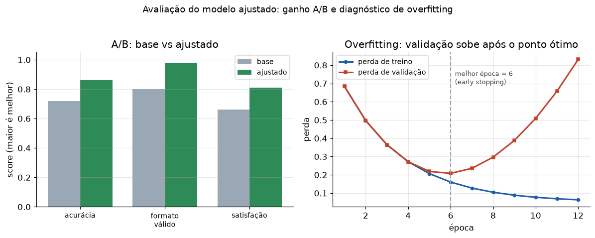

# Lição 080 — Avaliação do modelo ajustado e modelo de domínio

> **Módulo:** M10 — Fine-Tuning e Processamento de Dados · **Ordem de estudo:** 80 · **Tempo:** ~50 min
> **Pré-requisitos:** [077] Fine-tuning completo: quando e por quê
> **Classificação:** coberto pela ementa

> **Convenção de formatação:** matemática em LaTeX (`$...$` inline, `$$...$$` em
> destaque, render nativo na pré-visualização do VS Code); figuras reprodutíveis
> geradas por `tools/figuras/gerar_figuras_m10.py` e incorporadas por caminho
> relativo `assets/<NNN>-<slug>/<nome>.png`; blocos ```python só para código e
> saída.

## Seção_Teórica

### Motivação

Treinar é metade do trabalho; a outra metade é **provar que o modelo ajustado é de
fato melhor**. Um fine-tuning pode parecer bem-sucedido (a perda de treino caiu),
mas estar **pior** que o modelo base em dados reais — seja por **overfitting** (o
modelo decorou o dataset), seja porque a tarefa não precisava de fine-tuning. A
avaliação rigorosa responde a três perguntas: o modelo acerta num **conjunto de
teste** que ele nunca viu? Ele é **melhor que o base** numa comparação direta
(A/B)? E ele **generaliza**, ou apenas memorizou o treino? Esta lição fecha o
módulo conectando métricas, comparação A/B e diagnóstico de overfitting — o que
sustenta a construção de um **modelo de domínio** confiável.

### Princípio de funcionamento

A avaliação acontece sobre um **conjunto de teste** (*held-out*) separado antes do
treino, para medir generalização e não memorização. Calculam-se **métricas** como
acurácia (fração de acertos exatos) e taxa de **formato válido** (fração de saídas
no formato esperado). Para decidir se o fine-tuning valeu a pena, faz-se um **teste
A/B**: roda-se o modelo base e o ajustado no mesmo conjunto e compara-se o
desempenho, medindo o **lift** (ganho absoluto e relativo). Por fim, o
**overfitting** é diagnosticado comparando a perda de **treino** com a de
**validação** ao longo das épocas: enquanto ambas caem, o modelo aprende; quando a
validação **sobe** enquanto a de treino continua caindo, o modelo passou a
**memorizar**, e a melhor época é o ponto de mínimo da validação (early stopping).



*Figura 1 — À esquerda, o ganho A/B do modelo ajustado sobre o base; à direita, a validação subindo após a melhor época indica overfitting. Gerada por `tools/figuras/gerar_figuras_m10.py`.*

---

### Conceito central 1 — Métricas de avaliação

A primeira pergunta é objetiva: **quantos acertos** o modelo faz num conjunto que
não viu? A **acurácia** (exact-match) mede isso. Para modelos que devem produzir
saídas estruturadas, a **taxa de formato válido** complementa: de nada adianta o
conteúdo certo num formato que o sistema downstream não consegue parsear.

#### Exemplo_Resolvido 1.1

```python
# Avaliacao: acuracia e taxa de formato valido num conjunto de teste.
gold      = ["positivo", "negativo", "positivo", "neutro", "negativo"]
predicoes = ["positivo", "negativo", "neutro", "neutro", "negativo"]
rotulos_validos = {"positivo", "negativo", "neutro"}

acertos = sum(1 for g, p in zip(gold, predicoes) if g == p)
acuracia = acertos / len(gold)
formato_ok = sum(1 for p in predicoes if p in rotulos_validos) / len(predicoes)
print(f"acertos: {acertos}/{len(gold)}")
print(f"acuracia: {acuracia:.2f}")
print(f"formato valido: {formato_ok:.2f}")
```

**Explicação passo a passo:**
- **Bloco 1 (`gold`/`predicoes`):** os rótulos verdadeiros e as predições do modelo; uma das predições (`neutro` no lugar de `positivo`) está errada.
- **Bloco 2 (`acertos`/`acuracia`):** conta os acertos exatos — 4 de 5 — e divide pelo total.
- **Bloco 3 (`formato_ok`):** todas as predições estão entre os rótulos válidos, então o formato é 100% — o erro foi de conteúdo, não de formato.

**Saída esperada:**
```
acertos: 4/5
acuracia: 0.80
formato valido: 1.00
```

---

### Conceito central 2 — Teste A/B

Uma métrica isolada não diz se o fine-tuning **valeu a pena**. O **teste A/B** roda
base e ajustado no mesmo conjunto e mede o **lift**: o ajustado precisa superar o
base por uma margem que justifique o custo. Comparar lado a lado evita a falácia de
celebrar um número alto que o modelo base já alcançava.

#### Exemplo_Resolvido 2.1

```python
def acuracia(gold, pred):
    return sum(1 for g, p in zip(gold, pred) if g == p) / len(gold)

gold     = ["a", "b", "a", "c", "b", "a"]
base     = ["a", "c", "a", "c", "a", "a"]
ajustado = ["a", "b", "a", "c", "b", "b"]

acc_base = acuracia(gold, base)
acc_aj = acuracia(gold, ajustado)
lift = acc_aj - acc_base
print(f"acuracia base    : {acc_base:.3f}")
print(f"acuracia ajustado: {acc_aj:.3f}")
print(f"lift absoluto    : {lift:+.3f}")
print("vencedor:", "ajustado" if acc_aj > acc_base else "base" if acc_base > acc_aj else "empate")
```

**Explicação passo a passo:**
- **Bloco 1 (`acuracia`):** função reutilizável de exact-match.
- **Bloco 2 (dados):** o mesmo conjunto de teste avaliado pelos dois modelos.
- **Bloco 3 (comparação):** o ajustado acerta 5/6 contra 4/6 do base; o lift de `+0.167` confirma o ajustado como vencedor.

**Saída esperada:**
```
acuracia base    : 0.667
acuracia ajustado: 0.833
lift absoluto    : +0.167
vencedor: ajustado
```

---

### Conceito central 3 — Detecção de overfitting

O risco maior do fine-tuning é o modelo **memorizar** o dataset em vez de aprender
o padrão. O sintoma clássico: a perda de **treino** continua caindo, mas a de
**validação** começa a **subir**. O ponto de mínimo da validação marca a **melhor
época** — treinar além dela piora a generalização (early stopping).

#### Exemplo_Resolvido 3.1

```python
treino     = [0.90, 0.62, 0.45, 0.33, 0.25, 0.20]
validacao  = [0.95, 0.70, 0.55, 0.52, 0.58, 0.66]

melhor_epoca = min(range(len(validacao)), key=lambda i: validacao[i])
gap = validacao[melhor_epoca] - treino[melhor_epoca]
overfitting = any(validacao[i+1] > validacao[i] for i in range(melhor_epoca, len(validacao)-1))
print("melhor epoca (min val):", melhor_epoca)
print(f"val minima: {validacao[melhor_epoca]:.2f}")
print(f"gap treino-val: {gap:.2f}")
print("overfitting apos o minimo:", overfitting)
```

**Explicação passo a passo:**
- **Bloco 1 (curvas):** perdas de treino e validação por época; a validação atinge o mínimo na época 3 e depois sobe.
- **Bloco 2 (`melhor_epoca`/`gap`):** localiza o mínimo da validação e mede o gap treino-validação (0.19) nesse ponto.
- **Bloco 3 (`overfitting`):** detecta que a validação sobe após o mínimo (`True`), sinalizando que treinar mais memorizaria — pare na época 3.

**Saída esperada:**
```
melhor epoca (min val): 3
val minima: 0.52
gap treino-val: 0.19
overfitting apos o minimo: True
```

## Seção_Prática

> **Como reproduzir:** execute cada solução de referência com
> `python trilha/solucoes/080-avaliacao-modelo-ajustado/solucao_<n>.py` e
> compare a saída com o arquivo `.saida.txt` correspondente. Os
> enunciados/esqueletos ficam em
> `trilha/pratica/080-avaliacao-modelo-ajustado/exercicio_<n>.py`.

### Exercício 1 — Métricas no conjunto de teste
- **Entrada inicial / setup:** as listas `gold` e `predicoes` (em `exercicio_1.py`) e o conjunto `rotulos_validos = {"spam", "ham"}` (a predição `lixo` é inválida).
- **Passos de execução:** calcule acertos, acurácia (`{:.3f}`) e taxa de formato válido (`{:.3f}`) e imprima as três linhas.
- **Critério de conclusão (binário):** a saída é **exatamente** igual a `solucao_1.saida.txt` (`acuracia: 0.667` e `formato valido: 0.833`); qualquer divergência reprova.
- **Solução de referência:** `trilha/solucoes/080-avaliacao-modelo-ajustado/solucao_1.py`
- **Saída esperada:** `trilha/solucoes/080-avaliacao-modelo-ajustado/solucao_1.saida.txt`

### Exercício 2 — Teste A/B base vs ajustado
- **Entrada inicial / setup:** as listas `gold`, `base` e `ajustado` (em `exercicio_2.py`).
- **Passos de execução:** implemente `acuracia(...)`, calcule lift absoluto (`{:+.3f}`) e relativo (`{:+.1f}%`) e o vencedor; imprima as cinco linhas no formato do enunciado.
- **Critério de conclusão (binário):** a saída é **exatamente** igual a `solucao_2.saida.txt` (`lift absoluto    : +0.375`, `lift relativo    : +60.0%`); qualquer divergência reprova.
- **Solução de referência:** `trilha/solucoes/080-avaliacao-modelo-ajustado/solucao_2.py`
- **Saída esperada:** `trilha/solucoes/080-avaliacao-modelo-ajustado/solucao_2.saida.txt`

### Exercício 3 — Detectar overfitting e indicar early stopping
- **Entrada inicial / setup:** as listas `treino` e `validacao` (7 épocas, em `exercicio_3.py`).
- **Passos de execução:** ache a melhor época (mínimo da validação), o gap treino-validação nessa época e detecte overfitting (alguma subida após o mínimo); imprima `epocas`, `melhor epoca`, `val minima` (`{:.2f}`), `gap` (`{:.2f}`), `overfitting detectado` e a recomendação de early stopping.
- **Critério de conclusão (binário):** a saída é **exatamente** igual a `solucao_3.saida.txt` (`melhor epoca (min val): 3`, `overfitting detectado: True`); qualquer divergência reprova.
- **Solução de referência:** `trilha/solucoes/080-avaliacao-modelo-ajustado/solucao_3.py`
- **Saída esperada:** `trilha/solucoes/080-avaliacao-modelo-ajustado/solucao_3.saida.txt`
