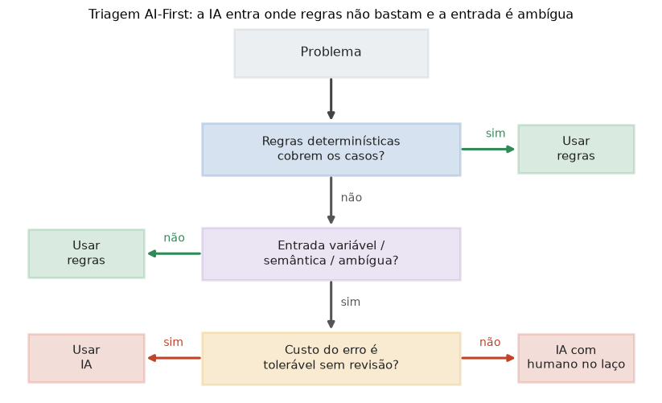

# Lição 081 — Design AI-First

> **Módulo:** M11 — Arquitetura de Sistemas com IA · **Ordem de estudo:** 81 · **Tempo:** ~55 min
> **Pré-requisitos:** [057] Pipeline RAG básico · [062] Arquitetura de agentes
> **Classificação:** complemento de aprofundamento à ementa

> **Convenção de formatação:** matemática em LaTeX (`$...$` inline, `$$...$$` em
> destaque, render nativo na pré-visualização do VS Code); figuras reprodutíveis
> geradas por `tools/figuras/gerar_figuras_m11.py` e incorporadas por caminho
> relativo `assets/<NNN>-<slug>/<nome>.png`; blocos ```python só para código e
> saída.

## Seção_Teórica

### Motivação

Quando começamos a projetar um produto, a tentação é tratar IA como um ingrediente
mágico que resolve tudo. Na prática, **nem todo problema merece um modelo**: validar
um CPF, converter moeda ou aplicar uma tabela de preços são tarefas onde **regras
determinísticas** são mais baratas, mais rápidas e mais auditáveis do que qualquer
LLM. Um design **AI-first** não significa "IA em tudo"; significa **partir da
pergunta certa**: este problema tem entrada ambígua, semântica ou aberta o
suficiente para que valha a pena pagar o custo (latência, dinheiro, imprevisibilidade)
de um modelo? Errar essa decisão custa caro nos dois sentidos — usar regras onde só
a IA resolve trava o produto; usar IA onde regras bastam queima orçamento e adiciona
latência e risco sem retorno. Esta lição dá um arcabouço para **tomar essa decisão
de forma explícita** e para **projetar o sistema sabendo que o modelo vai falhar**
parte do tempo.

### Princípio de funcionamento

Um design AI-first organiza a solução em torno de três decisões encadeadas.

A primeira é a **triagem IA vs regras**. Antes de escrever qualquer prompt,
respondemos a três perguntas: (1) *regras determinísticas cobrem os casos?* Se sim,
use regras. (2) *A entrada é variável, ambígua ou semântica?* Se não, regras ainda
bastam. (3) *O custo de um erro é tolerável sem revisão?* Se não, a IA entra **com
um humano no laço**. Só quando regras não bastam **e** a entrada é ambígua é que a
IA é a ferramenta certa.

A segunda decisão é o **trade-off de solução**. Cada candidato (uma regra, um modelo
leve, um modelo forte) tem três atributos mensuráveis: **precisão** $p$, **latência**
$\ell$ e **custo** $c$. Para comparar maçãs com maçãs, normalizamos latência e custo
(quanto menor, melhor) e combinamos tudo numa **utilidade** ponderada:

$$U = w_p\,p - w_\ell\,\tilde{\ell} - w_c\,\tilde{c}, \qquad
\tilde{\ell} = \frac{\ell}{\ell_{\max}}, \quad \tilde{c} = \frac{c}{c_{\max}}$$

onde $w_p, w_\ell, w_c$ refletem as prioridades do produto. A solução escolhida é a
de maior $U$ — e a fórmula deixa explícito que "o modelo mais preciso" nem sempre
vence quando latência e custo pesam.

A terceira decisão é a **degradação graciosa**. Como o modelo erra, o sistema expõe
uma **confiança** e define um **limiar** $\tau$: acima de $\tau$, aceita a saída da
IA; abaixo, cai para um **fallback determinístico** (uma regra simples) ou para
revisão humana. Isso transforma "a IA falhou" em "o sistema degradou de forma
controlada".



*Figura 1 — Triagem AI-First: a IA entra apenas onde regras não bastam e a entrada é ambígua; quando o custo do erro é alto, ela opera com um humano no laço. Gerada por `tools/figuras/gerar_figuras_m11.py`.*

---

### Conceito central 1 — IA versus regras

A decisão de usar IA ou regras é **estrutural**, não estética. Codificá-la como uma
função explícita de três perguntas binárias força o time a justificar cada escolha e
torna o resultado **auditável**. A regra de ouro: prefira o determinismo de regras
sempre que ele cobrir o problema; reserve a IA para entradas ambíguas; e exija humano
no laço quando o erro for caro.

#### Exemplo_Resolvido 1.1

```python
# Triagem AI-First: decide entre "regras", "ia" e "ia+humano" por 3 perguntas.
def decidir_abordagem(regras_cobrem, entrada_ambigua, custo_erro_alto):
    if regras_cobrem:
        return "regras"
    if not entrada_ambigua:
        return "regras"
    return "ia+humano" if custo_erro_alto else "ia"

problemas = [
    ("validar CPF", True, False, False),
    ("classificar sentimento", False, True, False),
    ("aprovar credito", False, True, True),
    ("converter moeda", True, False, False),
]
for nome, cobrem, ambigua, custo in problemas:
    print(f"{nome:>22}: {decidir_abordagem(cobrem, ambigua, custo)}")
```

**Explicação passo a passo:**
- **Bloco 1 (`decidir_abordagem`):** aplica as três perguntas na ordem da triagem — regras cobrem? entrada ambígua? custo do erro alto? — e devolve a abordagem.
- **Bloco 2 (`problemas`):** quatro problemas reais, cada um descrito pelas três respostas binárias.
- **Bloco 3 (laço):** classifica cada problema; `validar CPF` e `converter moeda` caem em regras, `classificar sentimento` em IA pura e `aprovar credito` em IA com humano no laço (erro caro).

**Saída esperada:**
```
           validar CPF: regras
classificar sentimento: ia
       aprovar credito: ia+humano
       converter moeda: regras
```

---

### Conceito central 2 — Trade-off precisão/latência/custo

A solução "melhor" depende das prioridades. Modelar a escolha como uma **utilidade
ponderada** sobre precisão, latência e custo normalizados torna o trade-off
quantitativo: mudar os pesos muda o vencedor. Com `numpy`, normalizamos cada coluna e
calculamos $U$ para todos os candidatos de uma vez.

#### Exemplo_Resolvido 2.1

```python
import numpy as np
# Candidatos: [precisao(0-1), latencia_ms, custo_relativo]. Maior utilidade vence.
nomes = ["regra", "modelo-leve", "modelo-forte"]
M = np.array([
    [0.72, 5.0, 0.1],
    [0.88, 120.0, 1.0],
    [0.95, 800.0, 6.0],
])
prec = M[:, 0]
lat_norm = M[:, 1] / M[:, 1].max()      # latencia normalizada (menor e melhor)
custo_norm = M[:, 2] / M[:, 2].max()    # custo normalizado (menor e melhor)
utilidade = 0.6 * prec - 0.25 * lat_norm - 0.15 * custo_norm
for nome, u in zip(nomes, utilidade):
    print(f"{nome:>12}: utilidade={u:.3f}")
melhor = nomes[int(np.argmax(utilidade))]
print("escolhido:", melhor)
```

**Explicação passo a passo:**
- **Bloco 1 (`M`):** cada linha é um candidato com precisão, latência e custo; a matriz deixa os três atributos lado a lado.
- **Bloco 2 (normalização):** divide latência e custo pelos seus máximos, trazendo tudo para a mesma escala $[0, 1]$ antes de ponderar.
- **Bloco 3 (`utilidade`):** aplica $U = 0.6\,p - 0.25\,\tilde{\ell} - 0.15\,\tilde{c}$; o `modelo-forte` é o mais preciso, mas a latência e o custo altos derrubam sua utilidade.
- **Bloco 4 (`argmax`):** o `modelo-leve` vence — bom equilíbrio entre precisão e custo, exatamente o que pesos voltados a produto premiam.

**Saída esperada:**
```
       regra: utilidade=0.428
 modelo-leve: utilidade=0.466
modelo-forte: utilidade=0.170
escolhido: modelo-leve
```

---

### Conceito central 3 — Degradação graciosa e fallback

Um sistema AI-first maduro assume que o modelo **vai errar** e expõe uma medida de
**confiança**. Acima de um limiar $\tau$, confia na IA; abaixo, cai para um
**fallback determinístico**. Isso limita o estrago de previsões ruins e dá uma
métrica clara — a **cobertura** — de quantas decisões a IA tomou sozinha.

#### Exemplo_Resolvido 3.1

```python
# Degradacao graciosa: usa a IA se a confianca >= limiar; senao, cai para a regra.
def regra_fallback(x):
    return "positivo" if x >= 0 else "negativo"

def predizer(x, conf, limiar=0.7):
    if conf >= limiar:
        return ("ia", "positivo" if x >= 0 else "negativo")
    return ("fallback", regra_fallback(x))

entradas = [(1.2, 0.92), (-0.4, 0.55), (0.3, 0.81), (-2.0, 0.40)]
n_ia = 0
for x, conf in entradas:
    origem, pred = predizer(x, conf)
    n_ia += origem == "ia"
    print(f"x={x:+.1f} conf={conf:.2f} -> {origem}:{pred}")
print(f"cobertura IA: {n_ia}/{len(entradas)}")
```

**Explicação passo a passo:**
- **Bloco 1 (`regra_fallback`):** a rede de segurança determinística — uma regra simples que sempre devolve uma resposta.
- **Bloco 2 (`predizer`):** compara a confiança com o limiar $\tau = 0.7$; acima, usa a IA; abaixo, delega ao fallback.
- **Bloco 3 (laço):** processa quatro entradas e marca a origem de cada decisão; duas têm confiança alta (IA) e duas caem no fallback.
- **Bloco 4 (`print`):** a **cobertura** mostra que a IA decidiu 2 das 4 entradas; as outras degradaram de forma controlada.

**Saída esperada:**
```
x=+1.2 conf=0.92 -> ia:positivo
x=-0.4 conf=0.55 -> fallback:negativo
x=+0.3 conf=0.81 -> ia:positivo
x=-2.0 conf=0.40 -> fallback:negativo
cobertura IA: 2/4
```

## Seção_Prática

> **Como reproduzir:** execute cada solução de referência com
> `python trilha/solucoes/081-design-ai-first/solucao_<n>.py` e compare a saída com o
> arquivo `.saida.txt` correspondente. Os enunciados/esqueletos ficam em
> `trilha/pratica/081-design-ai-first/exercicio_<n>.py`.

### Exercício 1 — Triagem IA vs regras
- **Entrada inicial / setup:** a lista `problemas = [("checar CEP", True, False, False), ("resumir contrato", False, True, True), ("traduzir frase", False, True, False), ("somar valores", True, False, False)]`, onde cada tupla é `(nome, regras_cobrem, entrada_ambigua, custo_erro_alto)`.
- **Passos de execução:** implemente `decidir_abordagem(regras_cobrem, entrada_ambigua, custo_erro_alto)` seguindo a triagem (regras → IA → IA+humano) e imprima `{nome:>18}: {decisao}` para cada problema.
- **Critério de conclusão (binário):** a saída é **exatamente** igual a `solucao_1.saida.txt` (`resumir contrato: ia+humano`, `traduzir frase: ia`, `checar CEP`/`somar valores`: `regras`); qualquer divergência reprova.
- **Solução de referência:** `trilha/solucoes/081-design-ai-first/solucao_1.py`
- **Saída esperada:** `trilha/solucoes/081-design-ai-first/solucao_1.saida.txt`

### Exercício 2 — Escolher solução por utilidade ponderada
- **Entrada inicial / setup:** `nomes = ["regra", "leve", "forte"]` e a matriz `M = [[0.70, 8, 0.2], [0.90, 200, 1.5], [0.97, 900, 7.0]]` (colunas: precisão, latência ms, custo relativo); pesos `w_p=0.6`, `w_l=0.25`, `w_c=0.15`.
- **Passos de execução:** normalize latência e custo pelos seus máximos, calcule `utilidade = 0.6*prec - 0.25*lat_norm - 0.15*custo_norm`, imprima `{nome:>6}: utilidade={u:.3f}` para cada um e, na última linha, `escolhido: {melhor}`.
- **Critério de conclusão (binário):** a saída é **exatamente** igual a `solucao_2.saida.txt` (vencedor `leve`); qualquer divergência reprova.
- **Solução de referência:** `trilha/solucoes/081-design-ai-first/solucao_2.py`
- **Saída esperada:** `trilha/solucoes/081-design-ai-first/solucao_2.saida.txt`

### Exercício 3 — Cobertura com limiar de confiança
- **Entrada inicial / setup:** `entradas = [(0.8, 0.95), (-1.5, 0.60), (2.0, 0.88), (-0.2, 0.50), (0.1, 0.80)]` (pares `(x, confianca)`) e `limiar = 0.75`.
- **Passos de execução:** implemente `predizer(x, conf, limiar)` que devolve `("ia", ...)` se `conf >= limiar` (sinal de `x` decide `positivo`/`negativo`) e `("fallback", ...)` caso contrário; imprima `x={x:+.1f} conf={conf:.2f} -> {origem}:{pred}` e, ao final, `cobertura IA: {n_ia}/{total}`.
- **Critério de conclusão (binário):** a saída é **exatamente** igual a `solucao_3.saida.txt` (`cobertura IA: 3/5`); qualquer divergência reprova.
- **Solução de referência:** `trilha/solucoes/081-design-ai-first/solucao_3.py`
- **Saída esperada:** `trilha/solucoes/081-design-ai-first/solucao_3.saida.txt`
