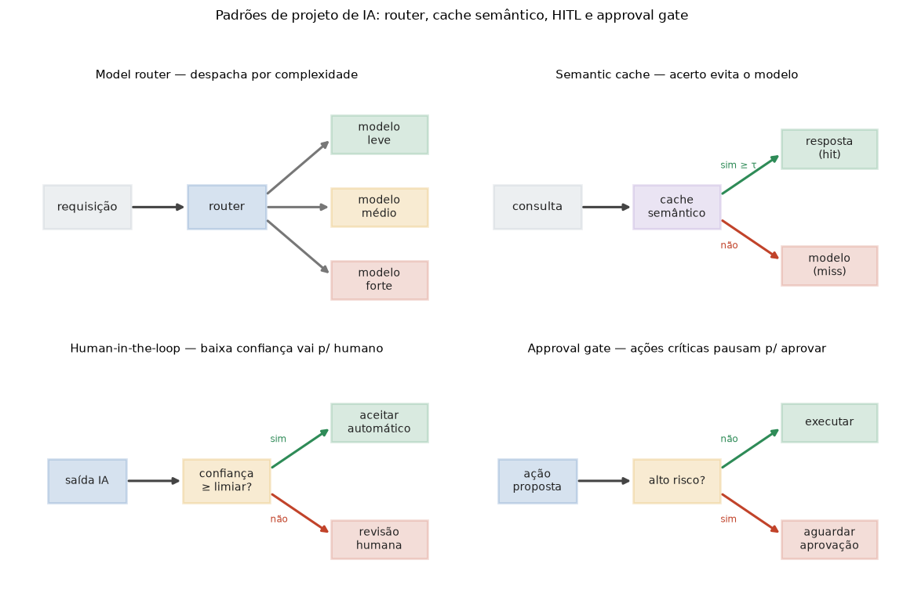

# Lição 083 — Padrões de projeto de IA

> **Módulo:** M11 — Arquitetura de Sistemas com IA · **Ordem de estudo:** 83 · **Tempo:** ~55 min
> **Pré-requisitos:** [082] Single-agent vs multi-agente
> **Classificação:** complemento de aprofundamento à ementa

> **Convenção de formatação:** matemática em LaTeX (`$...$` inline, `$$...$$` em
> destaque, render nativo na pré-visualização do VS Code); figuras reprodutíveis
> geradas por `tools/figuras/gerar_figuras_m11.py` e incorporadas por caminho
> relativo `assets/<NNN>-<slug>/<nome>.png`; blocos ```python só para código e
> saída.

## Seção_Teórica

### Motivação

Assim como a engenharia de software tem padrões de projeto (Strategy, Observer,
Factory), sistemas de IA em produção convergiram para um punhado de **padrões
recorrentes** que resolvem problemas que aparecem em quase todo produto: *como não
pagar pelo modelo mais caro quando o leve resolve?* (**model router**); *como não
chamar o modelo de novo para uma pergunta praticamente idêntica?* (**semantic
cache**); *como deixar a IA agir sozinha onde é seguro, mas exigir um humano onde o
erro é caro?* (**human-in-the-loop** e **approval gates**). Reconhecer esses padrões
poupa reinvenção e dá um vocabulário comum de arquitetura. Cada um deles ataca
diretamente custo, latência ou risco — os três eixos que vêm guiando este módulo.

### Princípio de funcionamento

Os padrões compartilham uma ideia: **interpor uma decisão barata antes de uma ação
cara**.

O **model router** olha características da requisição (tamanho, se exige raciocínio,
domínio) e escolhe o **tier** mínimo capaz de atendê-la — leve, médio ou forte.
Como o custo por tier cresce rápido (tipicamente uma ordem de grandeza), rotear bem
reduz o custo médio sem sacrificar qualidade onde ela importa.

O **semantic cache** guarda pares (embedding da consulta → resposta). Uma nova
consulta vira um vetor $q$ e o cache mede a **similaridade de cosseno** com cada
entrada $e_i$:

$$\cos(q, e_i) = \frac{q \cdot e_i}{\lVert q\rVert\,\lVert e_i\rVert}$$

Se a maior similaridade ultrapassa um **limiar** $\tau$, devolve a resposta cacheada
(*hit*) — sem chamar o modelo; senão, é *miss* e a requisição segue. Diferente de um
cache exato por chave, o cache **semântico** acerta paráfrases ("qual o horário?" ≈
"que horas abre?").

O **human-in-the-loop (HITL)** e o **approval gate** controlam **quando a IA pode
agir sozinha**. O HITL usa a **confiança**: saídas confiantes seguem automáticas, as
duvidosas vão para revisão. O approval gate usa o **risco da ação**: operações
críticas (emitir reembolso, encerrar conta) pausam para aprovação humana,
**independentemente da confiança**. Combinados, eles formam uma política
risco × confiança que decide o destino de cada decisão.



*Figura 1 — Padrões de projeto de IA: o router despacha por complexidade; o cache semântico evita o modelo quando há acerto; o HITL manda baixa confiança para humano; o approval gate pausa ações de alto risco. Gerada por `tools/figuras/gerar_figuras_m11.py`.*

---

### Conceito central 1 — Model router

O **model router** é um despachante: a partir de características baratas de calcular
(número de tokens, necessidade de raciocínio), escolhe o tier mínimo suficiente.
Como cada tier tem um custo, rotear bem é uma alavanca direta sobre o custo médio de
inferência — exatamente o ganho que justifica o padrão.

#### Exemplo_Resolvido 1.1

```python
# Model router: despacha pela complexidade estimada e soma o custo por tier.
def rotear(tokens, precisa_raciocinio):
    if precisa_raciocinio:
        return "forte"
    if tokens <= 64:
        return "leve"
    return "medio"

reqs = [(20, False), (200, False), (500, True), (40, True)]
custo = {"leve": 1, "medio": 3, "forte": 10}
total = 0
for tk, raciocinio in reqs:
    tier = rotear(tk, raciocinio)
    total += custo[tier]
    print(f"tokens={tk:>3} raciocinio={raciocinio!s:>5} -> {tier} (custo {custo[tier]})")
print("custo total:", total)
```

**Explicação passo a passo:**
- **Bloco 1 (`rotear`):** a política de roteamento — raciocínio exige o tier forte; senão, requisições curtas vão para o leve e o resto para o médio.
- **Bloco 2 (`reqs`/`custo`):** quatro requisições e a tabela de custo relativo por tier (o forte custa 10× o leve).
- **Bloco 3 (laço):** despacha cada requisição e acumula o custo; as duas que exigem raciocínio vão para o forte, dominando o gasto.
- **Bloco 4 (`print`):** o custo total (24) seria 40 se tudo fosse para o forte — o router economiza ao usar tiers menores onde dá.

**Saída esperada:**
```
tokens= 20 raciocinio=False -> leve (custo 1)
tokens=200 raciocinio=False -> medio (custo 3)
tokens=500 raciocinio= True -> forte (custo 10)
tokens= 40 raciocinio= True -> forte (custo 10)
custo total: 24
```

---

### Conceito central 2 — Semantic cache

O **semantic cache** evita chamadas redundantes ao modelo respondendo consultas
semanticamente próximas a algo já visto. A chave é a **similaridade de cosseno**: se
a consulta nova se parece o suficiente (acima do limiar $\tau$) com uma entrada
cacheada, é um *hit*. Com `numpy`, calcular o cosseno é um produto interno
normalizado.

#### Exemplo_Resolvido 2.1

```python
import numpy as np
# Semantic cache: hit quando a maior similaridade de cosseno >= limiar.
cache_emb = np.array([
    [1.0, 0.0, 0.0],   # "qual o horario de funcionamento"
    [0.0, 1.0, 0.0],   # "como redefinir a senha"
])
cache_resp = ["8h as 18h", "use o link 'esqueci a senha'"]

def cosseno(a, b):
    return float(a @ b / (np.linalg.norm(a) * np.linalg.norm(b)))

def consultar(q, limiar=0.9):
    sims = [cosseno(q, e) for e in cache_emb]
    i = int(np.argmax(sims))
    if sims[i] >= limiar:
        return "hit", cache_resp[i], round(sims[i], 3)
    return "miss", None, round(sims[i], 3)

consultas = [
    np.array([0.98, 0.10, 0.0]),
    np.array([0.10, 0.99, 0.0]),
    np.array([0.40, 0.40, 0.82]),
]
for q in consultas:
    estado, resp, sim = consultar(q)
    print(f"sim={sim} -> {estado} | {resp}")
```

**Explicação passo a passo:**
- **Bloco 1 (`cache_emb`/`cache_resp`):** o cache guarda os embeddings de duas perguntas frequentes e suas respostas.
- **Bloco 2 (`cosseno`):** mede a similaridade angular entre dois vetores via produto interno normalizado.
- **Bloco 3 (`consultar`):** pega a maior similaridade; se passa do limiar 0.9, é *hit* e devolve a resposta cacheada; senão, *miss*.
- **Bloco 4 (laço):** as duas primeiras consultas são paráfrases próximas (hit); a terceira é distante de ambas (sim ≈ 0.402 → miss, seguiria para o modelo).

**Saída esperada:**
```
sim=0.995 -> hit | 8h as 18h
sim=0.995 -> hit | use o link 'esqueci a senha'
sim=0.402 -> miss | None
```

---

### Conceito central 3 — HITL e approval gates

O **human-in-the-loop** e o **approval gate** decidem **quando a IA age sozinha**. O
risco da ação tem prioridade: ações de **alto risco** sempre pausam para aprovação,
não importa a confiança. Entre as de baixo risco, a **confiança** decide entre
automático e revisão humana. A ordem das checagens (risco primeiro) é o que torna a
política segura.

#### Exemplo_Resolvido 3.1

```python
# HITL + approval gate: risco tem prioridade; senao, a confianca decide.
def rotear_acao(confianca, risco_alto, limiar=0.8):
    if risco_alto:
        return "aprovacao"
    if confianca >= limiar:
        return "automatico"
    return "revisao_humana"

acoes = [
    ("responder FAQ", 0.95, False),
    ("emitir reembolso", 0.97, True),
    ("classificar ticket", 0.62, False),
    ("encerrar conta", 0.99, True),
]
contagem = {"automatico": 0, "revisao_humana": 0, "aprovacao": 0}
for nome, conf, risco in acoes:
    via = rotear_acao(conf, risco)
    contagem[via] += 1
    print(f"{nome:>20}: {via}")
print("contagem:", contagem)
```

**Explicação passo a passo:**
- **Bloco 1 (`rotear_acao`):** checa o risco **primeiro** (alto risco → aprovação) e só então usa a confiança para separar automático de revisão humana.
- **Bloco 2 (`acoes`):** quatro ações com confiança e flag de risco; reembolso e encerramento de conta são de alto risco mesmo com confiança altíssima.
- **Bloco 3 (laço):** roteia cada ação e conta os destinos; as duas de alto risco vão para aprovação apesar da confiança ~0.99.
- **Bloco 4 (`print`):** a contagem final (2 aprovações, 1 automático, 1 revisão) resume a política risco × confiança.

**Saída esperada:**
```
       responder FAQ: automatico
    emitir reembolso: aprovacao
  classificar ticket: revisao_humana
      encerrar conta: aprovacao
contagem: {'automatico': 1, 'revisao_humana': 1, 'aprovacao': 2}
```

## Seção_Prática

> **Como reproduzir:** execute cada solução de referência com
> `python trilha/solucoes/083-padroes-design-ia/solucao_<n>.py` e compare a saída com
> o arquivo `.saida.txt` correspondente. Os enunciados/esqueletos ficam em
> `trilha/pratica/083-padroes-design-ia/exercicio_<n>.py`.

### Exercício 1 — Model router por orçamento de tokens
- **Entrada inicial / setup:** `reqs = [(10, False), (80, False), (300, False), (50, True)]` (pares `(tokens, precisa_raciocinio)`) e `custo = {"leve": 1, "medio": 3, "forte": 10}`; limiar de tokens do tier leve = 64.
- **Passos de execução:** implemente `rotear(tokens, precisa_raciocinio)` (raciocínio → `forte`; senão `tokens <= 64` → `leve`, senão `medio`), acumule o custo e imprima `tokens={tk:>3} raciocinio={raciocinio!s:>5} -> {tier} (custo {c})` e, por fim, `custo total: {total}`.
- **Critério de conclusão (binário):** a saída é **exatamente** igual a `solucao_1.saida.txt` (`custo total: 17`); qualquer divergência reprova.
- **Solução de referência:** `trilha/solucoes/083-padroes-design-ia/solucao_1.py`
- **Saída esperada:** `trilha/solucoes/083-padroes-design-ia/solucao_1.saida.txt`

### Exercício 2 — Semantic cache por cosseno
- **Entrada inicial / setup:** `cache_emb = [[1, 0, 0], [0, 1, 0], [0, 0, 1]]` com respostas `["A", "B", "C"]`; `limiar = 0.9`; consultas `[[0.95, 0.05, 0], [0.0, 0.30, 0.95], [0.6, 0.6, 0.0]]`.
- **Passos de execução:** implemente `cosseno(a, b)` e `consultar(q, limiar)` que devolve `("hit", resposta, sim_arredondada_em_3)` se a maior similaridade ≥ limiar, senão `("miss", None, sim)`; imprima `sim={sim} -> {estado} | {resp}` para cada consulta.
- **Critério de conclusão (binário):** a saída é **exatamente** igual a `solucao_2.saida.txt` (1ª `hit | A`, 2ª `hit | C`, 3ª `miss | None`); qualquer divergência reprova.
- **Solução de referência:** `trilha/solucoes/083-padroes-design-ia/solucao_2.py`
- **Saída esperada:** `trilha/solucoes/083-padroes-design-ia/solucao_2.saida.txt`

### Exercício 3 — Política HITL + approval gate
- **Entrada inicial / setup:** `acoes = [("ler documento", 0.70, False), ("excluir base", 0.99, True), ("sugerir resposta", 0.91, False), ("alterar permissao", 0.40, True)]` (campos `nome, confianca, risco_alto`); `limiar = 0.8`.
- **Passos de execução:** implemente `rotear_acao(confianca, risco_alto, limiar)` (risco alto → `aprovacao`; senão confiança ≥ limiar → `automatico`, senão `revisao_humana`); imprima `{nome:>18}: {via}` e, ao final, `contagem: {dict}` com as chaves na ordem `automatico, revisao_humana, aprovacao`.
- **Critério de conclusão (binário):** a saída é **exatamente** igual a `solucao_3.saida.txt` (`contagem: {'automatico': 1, 'revisao_humana': 1, 'aprovacao': 2}`); qualquer divergência reprova.
- **Solução de referência:** `trilha/solucoes/083-padroes-design-ia/solucao_3.py`
- **Saída esperada:** `trilha/solucoes/083-padroes-design-ia/solucao_3.saida.txt`
