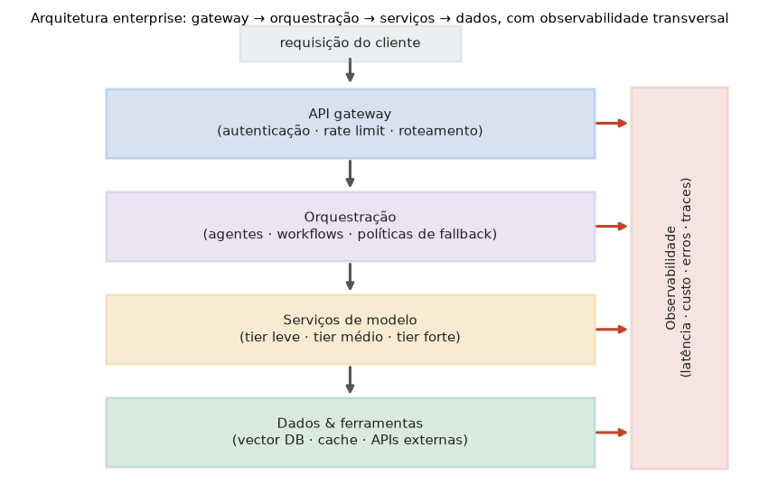

# Lição 084 — Arquitetura enterprise

> **Módulo:** M11 — Arquitetura de Sistemas com IA · **Ordem de estudo:** 84 · **Tempo:** ~55 min
> **Pré-requisitos:** [075] MCP: servidores e clientes em Python · [083] Padrões de projeto de IA
> **Classificação:** complemento de aprofundamento à ementa

> **Convenção de formatação:** matemática em LaTeX (`$...$` inline, `$$...$$` em
> destaque, render nativo na pré-visualização do VS Code); figuras reprodutíveis
> geradas por `tools/figuras/gerar_figuras_m11.py` e incorporadas por caminho
> relativo `assets/<NNN>-<slug>/<nome>.png`; blocos ```python só para código e
> saída.

## Seção_Teórica

### Motivação

Um protótipo de IA é um notebook que chama uma API. Um **sistema enterprise** é outra
coisa: precisa autenticar milhares de clientes, controlar gastos, escolher modelos por
custo e SLA, integrar ferramentas externas (Lição 075) e — acima de tudo — ser
**observável**, porque ninguém opera em produção o que não consegue medir. A diferença
entre os dois não é o modelo; é a **arquitetura ao redor do modelo**. Empresas
convergiram para uma pilha em **camadas** com responsabilidades separadas, exatamente
como a web convergiu para gateway/aplicação/banco. Esta lição mostra essa pilha como
**código executável**: como a requisição flui pelas camadas, como o **model tiering**
escolhe o motor certo dentro do orçamento de latência, e como a **observabilidade**
condensa milhares de requisições em três números que dizem se o sistema está saudável.

### Princípio de funcionamento

A arquitetura enterprise organiza o sistema em **camadas com contratos claros**, e a
requisição **desce** por elas.

A primeira é o **API gateway**: autenticação, *rate limiting* e roteamento de entrada.
Nada chega às camadas internas sem passar por ele. A segunda é a **orquestração**:
decide o fluxo (resposta direta, RAG, agente), aplica políticas de fallback e
coordena agentes — é onde vivem os padrões da Lição 083. A terceira é a de
**serviços de modelo**: os modelos em diferentes **tiers** de custo/capacidade, mais
dados e ferramentas (vector DB, cache, APIs). Modelar cada camada como uma **função
que anota a requisição** e compor as funções em pipeline deixa o fluxo explícito e
testável.

Dentro dos serviços, o **model tiering** escolhe o motor. Dado um **SLA de latência**
$S$, o sistema seleciona, entre os tiers cuja latência cabe no SLA, o **mais forte**:

$$\text{tier}^\* = \arg\max_{i\ :\ \ell_i \le S}\ \text{capacidade}_i$$

Se nenhum tier cabe no SLA, a requisição é rejeitada ou degrada. Isso entrega a melhor
qualidade possível **sem violar a latência prometida**.

Transversal a tudo está a **observabilidade**. Ela agrega medições de uma janela de
requisições em estatísticas: a latência **mediana** ($p_{50}$), a **cauda** ($p_{95}$
— a experiência dos 5% piores) e a **taxa de erro**. Percentis, e não a média, porque
a média esconde a cauda — e é a cauda que os usuários sentem. Esses três números são o
painel mínimo para operar um sistema de IA em produção.



*Figura 1 — Arquitetura enterprise: a requisição desce do API gateway para a orquestração, os serviços de modelo e os dados/ferramentas; a observabilidade instrumenta todas as camadas. Gerada por `tools/figuras/gerar_figuras_m11.py`.*

---

### Conceito central 1 — Camadas e fluxo da requisição

Cada camada tem uma **responsabilidade única** e transforma a requisição antes de
passá-la adiante. Representar cada camada como uma função que recebe e devolve um
dicionário (anotando-o) torna o pipeline explícito: compor `gateway → orquestração →
serviços` é só aplicar as funções em ordem. Copiar o dicionário em cada etapa mantém
as camadas isoladas (sem efeitos colaterais escondidos).

#### Exemplo_Resolvido 1.1

```python
# Pilha enterprise: cada camada anota a requisicao e a passa adiante.
def gateway(req):
    req = dict(req)
    req["autenticado"] = req.get("token") == "ok"
    return req

def orquestracao(req):
    req = dict(req)
    req["rota"] = "fluxo_rag" if req.get("precisa_contexto") else "fluxo_direto"
    return req

def servicos(req):
    req = dict(req)
    req["modelo"] = "forte" if req["rota"] == "fluxo_rag" else "leve"
    return req

camadas = [gateway, orquestracao, servicos]
req = {"token": "ok", "precisa_contexto": True}
for camada in camadas:
    req = camada(req)
print("autenticado:", req["autenticado"])
print("rota:", req["rota"])
print("modelo:", req["modelo"])
```

**Explicação passo a passo:**
- **Bloco 1 (`gateway`):** valida o token e marca `autenticado` — a porta de entrada do sistema.
- **Bloco 2 (`orquestracao`):** escolhe o fluxo; como a requisição precisa de contexto, roteia para `fluxo_rag`.
- **Bloco 3 (`servicos`):** o fluxo RAG exige um modelo `forte`; um fluxo direto usaria o `leve`.
- **Bloco 4 (pipeline):** aplicar as camadas em ordem faz a requisição descer pela pilha, acumulando as anotações de cada etapa.

**Saída esperada:**
```
autenticado: True
rota: fluxo_rag
modelo: forte
```

---

### Conceito central 2 — Model tiering

O **model tiering** escolhe, dentro do orçamento de latência (SLA), o tier **mais
forte** que ainda cabe. Tiers mais fortes são mais lentos; quanto mais folga no SLA,
melhor o modelo que podemos usar. Com `numpy`, filtramos os tiers viáveis (latência ≤
SLA) e pegamos o de maior índice (mais forte).

#### Exemplo_Resolvido 2.1

```python
import numpy as np
# Model tiering: escolhe o tier mais forte cuja latencia cabe no SLA.
tiers = ["leve", "medio", "forte"]
latencia = np.array([50, 150, 600])   # ms (p95) por tier
custo = np.array([1, 3, 10])          # custo relativo por tier

def escolher_tier(sla_ms):
    viaveis = np.where(latencia <= sla_ms)[0]
    if len(viaveis) == 0:
        return "nenhum"
    return tiers[int(viaveis.max())]   # entre os viaveis, o mais forte

for sla in [40, 100, 300, 1000]:
    t = escolher_tier(sla)
    c = int(custo[tiers.index(t)]) if t != "nenhum" else 0
    print(f"SLA={sla:>4}ms -> {t} (custo {c})")
```

**Explicação passo a passo:**
- **Bloco 1 (`tiers`/`latencia`/`custo`):** três tiers com latência crescente; o forte é o mais lento e mais caro.
- **Bloco 2 (`escolher_tier`):** filtra os tiers que cabem no SLA e devolve o de maior índice — o mais capaz dentro do orçamento.
- **Bloco 3 (laço):** com SLA de 40 ms nenhum tier cabe; 100 ms só o leve; 300 ms libera o médio; 1000 ms permite o forte. Mais folga de latência ⇒ modelo mais forte.

**Saída esperada:**
```
SLA=  40ms -> nenhum (custo 0)
SLA= 100ms -> leve (custo 1)
SLA= 300ms -> medio (custo 3)
SLA=1000ms -> forte (custo 10)
```

---

### Conceito central 3 — Observabilidade

Operar em produção exige **medir**. A observabilidade agrega uma janela de
requisições em poucos números: a latência mediana $p_{50}$, a cauda $p_{95}$ (os 5%
piores) e a **taxa de erro**. Usamos percentis em vez da média porque a média mascara
*outliers* lentos — e é a cauda que define a experiência percebida. `numpy.percentile`
faz o trabalho pesado.

#### Exemplo_Resolvido 3.1

```python
import numpy as np
# Observabilidade: agrega latencias e erros de uma janela de requisicoes.
latencias = np.array([90, 110, 95, 800, 105, 98, 102, 120, 88, 130])
erros     = np.array([0,  0,   0,  1,   0,   0,  0,   1,   0,  0])

p50 = float(np.percentile(latencias, 50))
p95 = float(np.percentile(latencias, 95))
taxa_erro = float(erros.mean())
print(f"p50 = {p50:.1f} ms")
print(f"p95 = {p95:.1f} ms")
print(f"taxa de erro = {taxa_erro:.1%}")
```

**Explicação passo a passo:**
- **Bloco 1 (`latencias`/`erros`):** a janela de 10 requisições; uma delas levou 800 ms (um *outlier* de cauda) e duas falharam.
- **Bloco 2 (percentis):** $p_{50}$ resume o caso típico (≈ 103 ms), enquanto $p_{95}$ captura a cauda (≈ 499 ms) — a média esconderia esse contraste.
- **Bloco 3 (`print`):** os três números (p50, p95 e taxa de erro de 20%) são o painel mínimo de saúde do sistema.

**Saída esperada:**
```
p50 = 103.5 ms
p95 = 498.5 ms
taxa de erro = 20.0%
```

## Seção_Prática

> **Como reproduzir:** execute cada solução de referência com
> `python trilha/solucoes/084-arquitetura-enterprise/solucao_<n>.py` e compare a saída
> com o arquivo `.saida.txt` correspondente. Os enunciados/esqueletos ficam em
> `trilha/pratica/084-arquitetura-enterprise/exercicio_<n>.py`.

### Exercício 1 — Fluxo da requisição pelas camadas
- **Entrada inicial / setup:** as três camadas `gateway`, `orquestracao` e `servicos` (cada uma anota e devolve uma cópia do dicionário) e a requisição `req = {"token": "ruim", "precisa_contexto": False}`.
- **Passos de execução:** `gateway` marca `autenticado = (token == "ok")`; `orquestracao` define `rota = "fluxo_rag"` se `precisa_contexto` senão `"fluxo_direto"`; `servicos` define `modelo = "forte"` se a rota for RAG senão `"leve"`. Aplique as camadas em ordem e imprima `autenticado:`, `rota:` e `modelo:`.
- **Critério de conclusão (binário):** a saída é **exatamente** igual a `solucao_1.saida.txt` (`autenticado: False`, `rota: fluxo_direto`, `modelo: leve`); qualquer divergência reprova.
- **Solução de referência:** `trilha/solucoes/084-arquitetura-enterprise/solucao_1.py`
- **Saída esperada:** `trilha/solucoes/084-arquitetura-enterprise/solucao_1.saida.txt`

### Exercício 2 — Model tiering por SLA
- **Entrada inicial / setup:** `tiers = ["leve", "medio", "forte"]`, `latencia = [60, 200, 700]` (ms), `custo = [1, 4, 12]` e os SLAs `[50, 120, 400, 800]`.
- **Passos de execução:** implemente `escolher_tier(sla_ms)` que devolve o tier **mais forte** com `latencia <= sla_ms` (ou `"nenhum"`); imprima `SLA={sla:>4}ms -> {t} (custo {c})`, com `c = 0` quando nenhum tier cabe.
- **Critério de conclusão (binário):** a saída é **exatamente** igual a `solucao_2.saida.txt` (`SLA=  50ms -> nenhum (custo 0)`, `SLA= 800ms -> forte (custo 12)`); qualquer divergência reprova.
- **Solução de referência:** `trilha/solucoes/084-arquitetura-enterprise/solucao_2.py`
- **Saída esperada:** `trilha/solucoes/084-arquitetura-enterprise/solucao_2.saida.txt`

### Exercício 3 — Painel de observabilidade
- **Entrada inicial / setup:** `latencias = [70, 65, 80, 500, 72, 68, 90, 75, 60, 400]` (ms) e `erros = [0, 0, 0, 1, 0, 0, 0, 0, 0, 1]`.
- **Passos de execução:** calcule `p50` e `p95` com `numpy.percentile` e `taxa_erro` como a média de `erros`; imprima `p50 = {p50:.1f} ms`, `p95 = {p95:.1f} ms` e `taxa de erro = {taxa_erro:.1%}`.
- **Critério de conclusão (binário):** a saída é **exatamente** igual a `solucao_3.saida.txt` (`taxa de erro = 20.0%`); qualquer divergência reprova.
- **Solução de referência:** `trilha/solucoes/084-arquitetura-enterprise/solucao_3.py`
- **Saída esperada:** `trilha/solucoes/084-arquitetura-enterprise/solucao_3.saida.txt`
