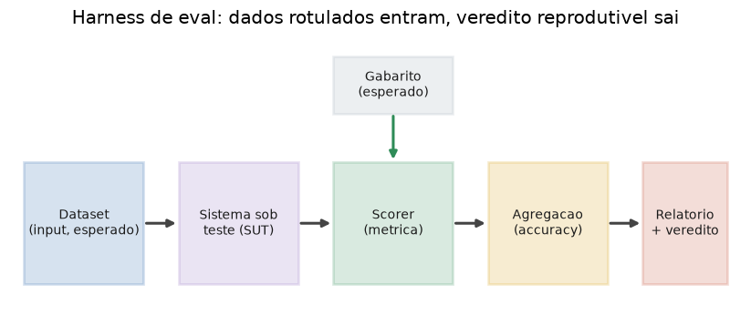

# Lição 085 — Metodologia de avaliação e evals para sistemas LLM

> **Módulo:** M12 — Avaliação, Custo/Latência e MLOps/LLMOps · **Ordem de estudo:** 85 · **Tempo:** ~55 min
> **Pré-requisitos:** [057] Pipeline RAG básico · [062] Arquitetura de agentes
> **Classificação:** complemento de aprofundamento à ementa

> **Convenção de formatação:** matemática em LaTeX (`$...$` inline, `$$...$$` em
> destaque, render nativo na pré-visualização do VS Code); figuras reprodutíveis
> geradas por `tools/figuras/gerar_figuras_m12.py` e incorporadas por caminho
> relativo `assets/<NNN>-<slug>/<nome>.png`; blocos ```python só para código e
> saída.

## Seção_Teórica

### Motivação

Já construímos sistemas que **fazem** coisas: um pipeline RAG (Lição 057) e um
agente (Lição 062). A pergunta que decide se eles vão para produção é outra: **eles
funcionam bem?** Sem uma resposta medida, otimizamos no escuro — trocamos um prompt,
"parece melhor", e descobrimos semanas depois que pioramos um caso importante. Pior:
LLMs são **não-determinísticos** e sensíveis a mudanças minúsculas, então a intuição
engana com frequência.

Um **eval** é um experimento repetível que transforma "parece melhor" em um número
que dá para comparar. É o instrumento que permite responder, com evidência: *esta
versão é melhor que a anterior?* e *podemos fazer o deploy sem regressão?* Esta lição
estabelece a **metodologia**: o que é um eval, como ele é montado e como usá-lo para
decidir entre versões. As métricas específicas (precisão, F1, LLM-as-judge) vêm na
Lição 086.

### Princípio de funcionamento

Um eval tem quatro peças, sempre as mesmas:

1. **Dataset** — uma coleção de casos $(x_i, y_i^\*)$, onde $x_i$ é a entrada e
   $y_i^\*$ é a resposta de referência (o gabarito).
2. **Sistema sob teste (SUT)** — a função $f$ que queremos avaliar; produz
   $\hat{y}_i = f(x_i)$.
3. **Scorer** — uma métrica $s(\hat{y}_i, y_i^\*)$ que pontua cada caso (por exemplo,
   1 se acertou, 0 se errou).
4. **Agregação** — combina os scores individuais num número de resumo. A mais comum
   é a **accuracy**:

$$\text{accuracy} = \frac{1}{N}\sum_{i=1}^{N} s(\hat{y}_i, y_i^\*)$$

O ponto-chave é o **determinismo do harness**: dado o mesmo dataset, o mesmo SUT e o
mesmo scorer, o resultado é sempre o mesmo. A aleatoriedade do LLM fica isolada dentro
de $f$ (e é controlada por temperatura, *seed* ou amostragem múltipla); a régua que
mede permanece fixa. É isso que torna duas medições **comparáveis** — e comparação é o
único uso honesto de um eval: *versão B contra versão A*, *com retrieval contra sem*.



*Figura 1 — As quatro peças de um eval: o dataset rotulado entra, o sistema sob teste produz saídas, o scorer compara com o gabarito e a agregação devolve um veredito reprodutível. Gerada por `tools/figuras/gerar_figuras_m12.py`.*

---

### Conceito central 1 — Anatomia de um eval

Um eval mínimo é literalmente as quatro peças acima costuradas num laço. Comecemos
pela métrica mais simples possível, o **exact match**: o score é 1 quando a saída,
normalizada, é idêntica ao gabarito normalizado. A normalização (baixar caixa, tirar
espaços nas pontas) evita reprovar uma resposta certa só por diferença de formatação.

#### Exemplo_Resolvido 1.1

```python
def normalizar(s):
    return s.strip().lower()

def sistema(pergunta):
    tabela = {
        "capital do brasil": "Brasilia",
        "capital da franca": "Paris",
        "capital do japao": "Toquio",
    }
    return tabela.get(normalizar(pergunta), "nao sei")

dataset = [
    ("Capital do Brasil", "Brasilia"),
    ("Capital da Franca", "Paris"),
    ("Capital do Japao", "Toquio"),
    ("Capital da Italia", "Roma"),
]

def exact_match(previsto, esperado):
    return normalizar(previsto) == normalizar(esperado)

acertos = 0
for pergunta, esperado in dataset:
    previsto = sistema(pergunta)
    ok = exact_match(previsto, esperado)
    acertos += int(ok)
    print(f"{pergunta!r}: previsto={previsto!r} ok={ok}")
acc = acertos / len(dataset)
print(f"accuracy: {acc:.4f} ({acertos}/{len(dataset)})")
```

**Explicação passo a passo:**
- **Bloco 1 (`normalizar`):** canonicaliza strings para que o scorer não puna formatação.
- **Bloco 2 (`sistema`):** o SUT, um stub determinístico que conhece três capitais e responde `"nao sei"` para o resto.
- **Bloco 3 (`dataset`):** quatro casos rotulados; o quarto (`Itália`) está fora do conhecimento do stub.
- **Bloco 4 (`exact_match`):** o scorer — compara saída e gabarito já normalizados.
- **Bloco 5 (laço + `print`):** percorre o dataset, pontua cada caso e agrega em accuracy; o caso da Itália falha, levando a 3 de 4 (0.75).

**Saída esperada:**
```
'Capital do Brasil': previsto='Brasilia' ok=True
'Capital da Franca': previsto='Paris' ok=True
'Capital do Japao': previsto='Toquio' ok=True
'Capital da Italia': previsto='nao sei' ok=False
accuracy: 0.7500 (3/4)
```

---

### Conceito central 2 — Agregação: accuracy e taxa de aprovação

Nem todo scorer é binário. Quando o score é **contínuo** (uma similaridade em
$[0,1]$, uma nota de 0 a 1 de um juiz), a média ainda resume o conjunto, mas costuma
ser pouco acionável: uma média 0.73 não diz *quantas* respostas ficaram boas o
bastante. A **taxa de aprovação** (pass rate) responde isso: fixamos um **limiar**
$\tau$ e medimos a fração de amostras com score $\geq \tau$:

$$\text{taxa} = \frac{1}{N}\sum_{i=1}^{N} \mathbf{1}[s_i \geq \tau]$$

Média e taxa contam histórias diferentes do mesmo dado, e olhar as duas evita
conclusões enganosas (uma média alta puxada por poucos acertos excelentes pode
esconder muitos casos medianos).

#### Exemplo_Resolvido 2.1

```python
scores = [0.95, 0.80, 0.62, 0.71, 0.40, 0.88]
limiar = 0.70
media = sum(scores) / len(scores)
aprovados = sum(1 for s in scores if s >= limiar)
taxa = aprovados / len(scores)
print(f"media: {media:.4f}")
print(f"aprovados (>= {limiar}): {aprovados}/{len(scores)}")
print(f"taxa de aprovacao: {taxa:.4f}")
```

**Explicação passo a passo:**
- **Bloco 1 (`scores`/`limiar`):** seis scores contínuos e o corte de qualidade $\tau = 0.70$.
- **Bloco 2 (`media`):** a média aritmética, 0.7267 — parece "ok".
- **Bloco 3 (`aprovados`/`taxa`):** conta quantos passam o limiar (quatro: 0.95, 0.80, 0.71, 0.88) e divide por seis, revelando que só 0.6667 das amostras atinge o nível desejado.
- **Conclusão:** a média sugere um sistema melhor do que a taxa de aprovação; reportar as duas é mais honesto.

**Saída esperada:**
```
media: 0.7267
aprovados (>= 0.7): 4/6
taxa de aprovacao: 0.6667
```

---

### Conceito central 3 — Comparação pareada e detecção de regressão

O uso mais valioso de um eval é **comparar duas versões** sobre o *mesmo* dataset. A
comparação **pareada** olha caso a caso: para cada amostra, B venceu, empatou ou
perdeu de A? Isso é mais informativo que comparar só as médias, porque mostra a
*distribuição* da mudança. Para a decisão de deploy, definimos uma regra binária de
**regressão**: B regride se sua média cai em relação a A,

$$\Delta = \bar{s}_B - \bar{s}_A, \qquad \text{regressão} \iff \Delta < 0.$$

Em produção essa regra ganha uma **margem** (só aceita B se $\Delta$ supera o ruído),
mas o princípio — uma porta binária que protege a versão atual — é exatamente este.

#### Exemplo_Resolvido 3.1

```python
scores_a = [0.80, 0.65, 0.90, 0.55, 0.70]
scores_b = [0.85, 0.60, 0.92, 0.50, 0.75]
vitorias = empates = derrotas = 0
for a, b in zip(scores_a, scores_b):
    if b > a:
        vitorias += 1
    elif b < a:
        derrotas += 1
    else:
        empates += 1
media_a = sum(scores_a) / len(scores_a)
media_b = sum(scores_b) / len(scores_b)
print(f"B vence: {vitorias} | empata: {empates} | perde: {derrotas}")
print(f"media A: {media_a:.4f} | media B: {media_b:.4f}")
delta = media_b - media_a
regrediu = delta < 0
print(f"delta (B - A): {delta:+.4f}")
print(f"regressao: {regrediu}")
```

**Explicação passo a passo:**
- **Bloco 1 (`scores_a`/`scores_b`):** os scores das duas versões sobre os mesmos cinco casos.
- **Bloco 2 (laço pareado):** conta, caso a caso, vitórias/empates/derrotas de B — três vitórias e duas derrotas.
- **Bloco 3 (`media_*`):** as médias agregadas (0.7200 e 0.7240).
- **Bloco 4 (`delta`/`regrediu`):** o delta é positivo (+0.0040), então **não há regressão**; note que B vence na maioria dos casos *e* na média, um cenário coerente para promover B.

**Saída esperada:**
```
B vence: 3 | empata: 0 | perde: 2
media A: 0.7200 | media B: 0.7240
delta (B - A): +0.0040
regressao: False
```

## Seção_Prática

> **Como reproduzir:** execute cada solução de referência com
> `python trilha/solucoes/085-evals-metodologia/solucao_<n>.py` e compare a saída
> com o arquivo `.saida.txt` correspondente. Os enunciados/esqueletos ficam em
> `trilha/pratica/085-evals-metodologia/exercicio_<n>.py`.

### Exercício 1 — Harness de eval com exact match
- **Entrada inicial / setup:** o `dataset` de 5 expressões aritméticas e o stub `sistema(expr)` (dados no esqueleto), em que `"5 / 2"` retorna `"2"` (bug de divisão inteira).
- **Passos de execução:** implemente `normalizar(s)` e `exact_match(previsto, esperado)`, rode o harness e imprima, por caso, `"<expr>: previsto=<repr> esperado=<repr> ok=<bool>"` e ao final `"accuracy: <4 casas> (<acertos>/<total>)"`.
- **Critério de conclusão (binário):** a saída é **exatamente** igual a `solucao_1.saida.txt` (`accuracy: 0.8000 (4/5)`, com o caso `5 / 2` reprovado); qualquer divergência reprova.
- **Solução de referência:** `trilha/solucoes/085-evals-metodologia/solucao_1.py`
- **Saída esperada:** `trilha/solucoes/085-evals-metodologia/solucao_1.saida.txt`

### Exercício 2 — Agregação por média e taxa de aprovação
- **Entrada inicial / setup:** `scores = [0.91, 0.74, 0.55, 0.69, 0.83, 0.78, 0.45]` e `limiar = 0.70` (dados no esqueleto).
- **Passos de execução:** calcule a média e a taxa de aprovação (fração de scores $\geq$ limiar); imprima `"n amostras: <n>"`, `"media: <4 casas>"`, `"aprovados (>= <limiar>): <contagem>"` e `"taxa de aprovacao: <4 casas>"`.
- **Critério de conclusão (binário):** a saída é **exatamente** igual a `solucao_2.saida.txt` (`media: 0.7071` e `taxa de aprovacao: 0.5714`); qualquer divergência reprova.
- **Solução de referência:** `trilha/solucoes/085-evals-metodologia/solucao_2.py`
- **Saída esperada:** `trilha/solucoes/085-evals-metodologia/solucao_2.saida.txt`

### Exercício 3 — Comparação pareada e veredito de regressão
- **Entrada inicial / setup:** `scores_a = [0.88, 0.72, 0.91, 0.66, 0.80, 0.77]` e `scores_b = [0.80, 0.70, 0.85, 0.60, 0.82, 0.71]` (dados no esqueleto).
- **Passos de execução:** conte vitórias/empates/derrotas de B contra A, calcule as médias e o delta `media_b - media_a`, e declare regressão quando `delta < 0`; imprima `"B vence: <v> | empata: <e> | perde: <d>"`, `"media A: <4 casas> | media B: <4 casas>"`, `"delta (B - A): <sinal+4 casas>"` e `"regressao: <bool>"`.
- **Critério de conclusão (binário):** a saída é **exatamente** igual a `solucao_3.saida.txt` (`delta (B - A): -0.0433` e `regressao: True`); qualquer divergência reprova.
- **Solução de referência:** `trilha/solucoes/085-evals-metodologia/solucao_3.py`
- **Saída esperada:** `trilha/solucoes/085-evals-metodologia/solucao_3.saida.txt`
