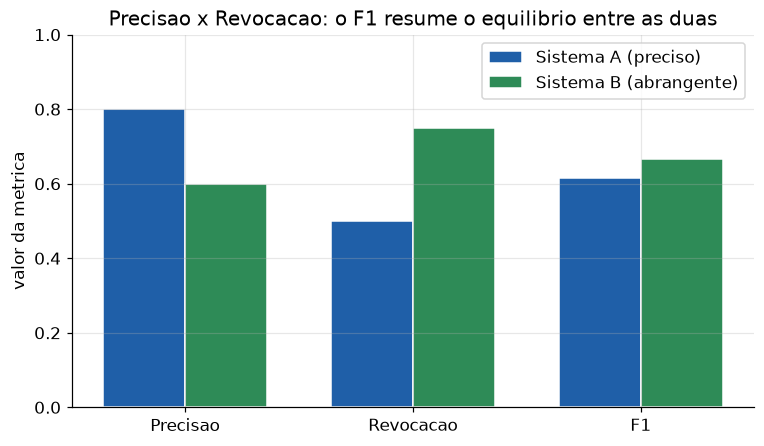

# Lição 086 — Métricas e datasets de avaliação (offline/online) e LLM-as-judge

> **Módulo:** M12 — Avaliação, Custo/Latência e MLOps/LLMOps · **Ordem de estudo:** 86 · **Tempo:** ~55 min
> **Pré-requisitos:** [085] Metodologia de avaliação e evals
> **Classificação:** complemento de aprofundamento à ementa

> **Convenção de formatação:** matemática em LaTeX (`$...$` inline, `$$...$$` em
> destaque, render nativo na pré-visualização do VS Code); figuras reprodutíveis
> geradas por `tools/figuras/gerar_figuras_m12.py` e incorporadas por caminho
> relativo `assets/<NNN>-<slug>/<nome>.png`; blocos ```python só para código e
> saída.

## Seção_Teórica

### Motivação

A Lição 085 deu o **esqueleto** do eval (dataset, SUT, scorer, agregação) usando o
scorer mais simples possível, o exact match. Mas a maioria das tarefas reais não
cabe num "acertou/errou". Recuperação de documentos tem o problema de *trazer o
relevante sem trazer lixo junto*; respostas abertas de um chatbot não têm gabarito
único; e o que medimos no laboratório (offline) nem sempre prevê o que acontece com
usuários reais (online).

Esta lição preenche o scorer com as métricas que de fato usamos: **precisão,
revocação e F1** para quando há um conjunto de itens certos; **LLM-as-judge** para
quando a resposta é texto livre e precisamos de um avaliador automático com critério;
e a distinção **offline vs online**, que evita a armadilha de comemorar um número de
laboratório que não se traduz em satisfação do usuário.

### Princípio de funcionamento

Quando a tarefa é decidir *quais* itens entre muitos são relevantes (recuperação no
RAG da Lição 057, classificação), três contagens organizam tudo: **verdadeiros
positivos** (TP, trouxe e era relevante), **falsos positivos** (FP, trouxe mas não
era) e **falsos negativos** (FN, era relevante mas não trouxe). Delas saem:

$$\text{precisão} = \frac{TP}{TP + FP}, \qquad \text{revocação} = \frac{TP}{TP + FN}, \qquad F_1 = \frac{2\,\text{P}\cdot\text{R}}{\text{P} + \text{R}}.$$

Precisão pergunta "do que eu trouxe, quanto presta?"; revocação pergunta "do que
prestava, quanto eu trouxe?". Há um **trade-off**: trazer mais itens aumenta a
revocação e tende a baixar a precisão. O $F_1$ é a média harmônica das duas — alto só
quando *ambas* são altas.

Para respostas em texto livre, não há conjunto de itens; usamos um **LLM-as-judge**:
outro modelo (ou, aqui, uma **rubrica determinística** que simula o juiz) pontua a
resposta segundo critérios explícitos. A rubrica fixa é o que torna o juiz auditável
e reprodutível. Por fim, separamos **offline** (métrica num dataset rotulado, barata
e repetível) de **online** (sinal de usuários reais: polegar para cima, cliques,
retenção). As duas raramente coincidem, e a **lacuna** entre elas é informação, não
erro.



*Figura 1 — Um sistema "preciso" e um "abrangente" trocam precisão por revocação; o $F_1$ resume qual deles equilibra melhor as duas. Gerada por `tools/figuras/gerar_figuras_m12.py`.*

---

### Conceito central 1 — Precisão, revocação e F1

As três métricas saem de TP/FP/FN, e estes saem de **operações de conjunto** entre o
gabarito (itens relevantes) e a saída do sistema (itens recuperados). Modelar como
conjuntos deixa o cálculo curto e à prova de erros de contagem.

#### Exemplo_Resolvido 1.1

```python
relevantes = {"d1", "d3", "d5", "d7", "d9"}
recuperados = {"d1", "d2", "d3", "d4", "d5", "d6"}
tp = len(relevantes & recuperados)
fp = len(recuperados - relevantes)
fn = len(relevantes - recuperados)
precisao = tp / (tp + fp)
revocacao = tp / (tp + fn)
f1 = 2 * precisao * revocacao / (precisao + revocacao)
print(f"TP={tp} FP={fp} FN={fn}")
print(f"precisao: {precisao:.4f}")
print(f"revocacao: {revocacao:.4f}")
print(f"f1: {f1:.4f}")
```

**Explicação passo a passo:**
- **Bloco 1 (conjuntos):** `relevantes` é o gabarito (5 itens), `recuperados` é o que o sistema trouxe (6 itens).
- **Bloco 2 (TP/FP/FN):** interseção dá TP=3; recuperados que não eram relevantes dão FP=3; relevantes não trazidos dão FN=2.
- **Bloco 3 (métricas):** precisão 3/6=0.5, revocação 3/5=0.6; o $F_1$ fica em 0.5455, entre as duas.
- **Conclusão:** o sistema tem revocação melhor que precisão — trouxe a maioria dos relevantes, mas com metade de lixo junto.

**Saída esperada:**
```
TP=3 FP=3 FN=2
precisao: 0.5000
revocacao: 0.6000
f1: 0.5455
```

---

### Conceito central 2 — LLM-as-judge por rubrica

Quando a resposta é texto livre, um **juiz automático** pontua segundo critérios
explícitos. Em produção o juiz costuma ser outro LLM, mas a parte que importa para a
*reprodutibilidade* é a **rubrica**: a lista de critérios objetivos. Aqui simulamos o
juiz com uma rubrica determinística (a nota é a fração de critérios atendidos), o que
mantém o exemplo executável e auditável. A lição vale para o juiz-LLM real: rubrica
clara, nota agregada, e atenção a **vieses do juiz** (posição, verbosidade) que pedem
controles como embaralhar a ordem das respostas.

#### Exemplo_Resolvido 2.1

```python
def juiz(resposta, criterios):
    presentes = sum(1 for c in criterios if c in resposta.lower())
    return presentes / len(criterios)

casos = [
    ("O Python e uma linguagem interpretada e dinamica", ["python", "interpretada", "dinamica"]),
    ("Java e compilada", ["java", "compilada", "jvm"]),
    ("RAG combina recuperacao e geracao", ["recuperacao", "geracao"]),
]
notas = []
for resp, crit in casos:
    n = juiz(resp, crit)
    notas.append(n)
    print(f"nota={n:.4f} <- {resp!r}")
media = sum(notas) / len(notas)
limiar = 0.8
aprovados = sum(1 for n in notas if n >= limiar)
print(f"media do juiz: {media:.4f}")
print(f"aprovados (>= {limiar}): {aprovados}/{len(notas)}")
```

**Explicação passo a passo:**
- **Bloco 1 (`juiz`):** a rubrica determinística — nota = fração dos critérios presentes no texto.
- **Bloco 2 (`casos`):** três respostas, cada uma com sua lista de critérios esperados.
- **Bloco 3 (laço):** o primeiro e o terceiro caso atendem todos os critérios (1.0); o segundo só dois de três (`jvm` ausente, 0.6667).
- **Bloco 4 (agregação):** média 0.8889, mas só 2 de 3 passam o limiar 0.8 — a taxa de aprovação flagra o caso fraco que a média suaviza.

**Saída esperada:**
```
nota=1.0000 <- 'O Python e uma linguagem interpretada e dinamica'
nota=0.6667 <- 'Java e compilada'
nota=1.0000 <- 'RAG combina recuperacao e geracao'
media do juiz: 0.8889
aprovados (>= 0.8): 2/3
```

---

### Conceito central 3 — Métricas offline vs online

Um eval **offline** roda sobre um dataset rotulado: é barato, repetível e ótimo para
*comparar versões* (Lição 085). Mas ele só mede o que o dataset captura. Um eval
**online** mede o comportamento real: satisfação (polegar para cima), cliques,
conclusão de tarefa. A **lacuna** entre os dois é esperada — o offline costuma
superestimar, porque o usuário se importa com coisas que o dataset não modela (tom,
latência, contexto). A prática madura usa offline como *portão rápido* e online como
*verdade final*.

#### Exemplo_Resolvido 3.1

```python
offline_total = 8
offline_acertos = 7
offline_acc = offline_acertos / offline_total
online_total = 200
online_positivos = 130
online_sat = online_positivos / online_total
print(f"offline accuracy: {offline_acc:.4f} ({offline_acertos}/{offline_total})")
print(f"online satisfacao: {online_sat:.4f} ({online_positivos}/{online_total})")
lacuna = offline_acc - online_sat
print(f"lacuna offline-online: {lacuna:+.4f}")
```

**Explicação passo a passo:**
- **Bloco 1 (offline):** accuracy de 7 em 8 casos rotulados — 0.875, um número de laboratório animador.
- **Bloco 2 (online):** 130 polegares para cima em 200 interações reais — só 0.65 de satisfação.
- **Bloco 3 (`lacuna`):** a diferença +0.2250 mostra que o offline superestima a experiência real; o sinal positivo é o alerta de que o dataset não cobre o que os usuários valorizam.

**Saída esperada:**
```
offline accuracy: 0.8750 (7/8)
online satisfacao: 0.6500 (130/200)
lacuna offline-online: +0.2250
```

## Seção_Prática

> **Como reproduzir:** execute cada solução de referência com
> `python trilha/solucoes/086-metricas-datasets-avaliacao/solucao_<n>.py` e compare a
> saída com o arquivo `.saida.txt` correspondente. Os enunciados/esqueletos ficam em
> `trilha/pratica/086-metricas-datasets-avaliacao/exercicio_<n>.py`.

### Exercício 1 — Precisão, revocação e F1
- **Entrada inicial / setup:** `relevantes = {"d2", "d4", "d6"}` e `recuperados = {"d1", "d2", "d3", "d4"}` (dados no esqueleto).
- **Passos de execução:** calcule TP/FP/FN por operações de conjunto e então precisão, revocação e $F_1$; imprima `"TP=<n> FP=<n> FN=<n>"`, `"precisao: <4 casas>"`, `"revocacao: <4 casas>"` e `"f1: <4 casas>"`.
- **Critério de conclusão (binário):** a saída é **exatamente** igual a `solucao_1.saida.txt` (`precisao: 0.5000`, `revocacao: 0.6667`, `f1: 0.5714`); qualquer divergência reprova.
- **Solução de referência:** `trilha/solucoes/086-metricas-datasets-avaliacao/solucao_1.py`
- **Saída esperada:** `trilha/solucoes/086-metricas-datasets-avaliacao/solucao_1.saida.txt`

### Exercício 2 — LLM-as-judge por rubrica
- **Entrada inicial / setup:** a lista `casos` de 4 respostas com seus critérios e `limiar = 0.75` (dados no esqueleto).
- **Passos de execução:** implemente `juiz(resposta, criterios)` como a fração de critérios presentes (em minúsculas); imprima `"nota=<4 casas> <- <repr>"` por caso e, ao final, `"media do juiz: <4 casas>"` e `"aprovados (>= <limiar>): <contagem>/<total>"`.
- **Critério de conclusão (binário):** a saída é **exatamente** igual a `solucao_2.saida.txt` (`media do juiz: 0.9167` e `aprovados (>= 0.75): 3/4`); qualquer divergência reprova.
- **Solução de referência:** `trilha/solucoes/086-metricas-datasets-avaliacao/solucao_2.py`
- **Saída esperada:** `trilha/solucoes/086-metricas-datasets-avaliacao/solucao_2.saida.txt`

### Exercício 3 — Métrica offline vs online
- **Entrada inicial / setup:** `offline_total = 10`, `offline_acertos = 9`, `online_total = 500`, `online_positivos = 310` (dados no esqueleto).
- **Passos de execução:** calcule a accuracy offline, a satisfação online e a lacuna `offline_acc - online_sat`; imprima `"offline accuracy: <4 casas> (<acertos>/<total>)"`, `"online satisfacao: <4 casas> (<positivos>/<total>)"` e `"lacuna offline-online: <sinal+4 casas>"`.
- **Critério de conclusão (binário):** a saída é **exatamente** igual a `solucao_3.saida.txt` (`offline accuracy: 0.9000`, `online satisfacao: 0.6200`, `lacuna offline-online: +0.2800`); qualquer divergência reprova.
- **Solução de referência:** `trilha/solucoes/086-metricas-datasets-avaliacao/solucao_3.py`
- **Saída esperada:** `trilha/solucoes/086-metricas-datasets-avaliacao/solucao_3.saida.txt`
