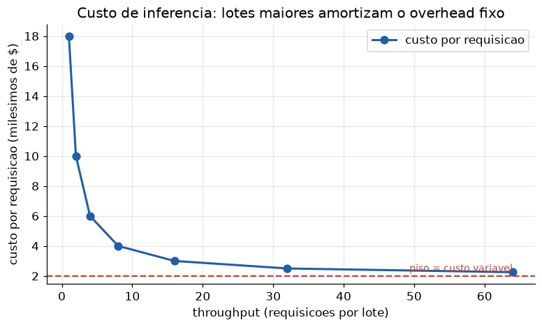

# Lição 087 — Otimização de custo de inferência (alto volume e concorrência)

> **Módulo:** M12 — Avaliação, Custo/Latência e MLOps/LLMOps · **Ordem de estudo:** 87 · **Tempo:** ~55 min
> **Pré-requisitos:** [051] APIs de provedores de LLM · [085] Metodologia de avaliação e evals
> **Classificação:** complemento de aprofundamento à ementa

> **Convenção de formatação:** matemática em LaTeX (`$...$` inline, `$$...$$` em
> destaque, render nativo na pré-visualização do VS Code); figuras reprodutíveis
> geradas por `tools/figuras/gerar_figuras_m12.py` e incorporadas por caminho
> relativo `assets/<NNN>-<slug>/<nome>.png`; blocos ```python só para código e
> saída.

## Seção_Teórica

### Motivação

Uma demo de LLM custa centavos. Um produto com **alto volume** custa contas que
chegam a dezenas de milhares de dólares por mês — e o que era irrelevante no
protótipo vira a maior linha do orçamento em produção. As APIs (Lição 051) cobram
por **token**, então o custo escala com tráfego *e* com o tamanho de cada prompt e
resposta. Saber medir e prever esse custo é parte do trabalho de engenharia, não uma
preocupação de fim de mês.

A boa notícia: as duas alavancas mais poderosas são puramente de engenharia e não
mexem na qualidade. **Caching** elimina o custo de requisições repetidas; **batching**
dilui o overhead fixo de cada chamada entre muitas requisições. Esta lição constrói os
modelos numéricos dessas alavancas para que você consiga estimar economia *antes* de
implementar e justificar a decisão com números (no espírito de medir do M12, Lição 085).

### Princípio de funcionamento

O custo de uma requisição é linear nos tokens:

$$C_{\text{req}} = n_{\text{in}}\,p_{\text{in}} + n_{\text{out}}\,p_{\text{out}},$$

onde $n_{\text{in}}, n_{\text{out}}$ são as contagens de tokens de entrada e saída e
$p_{\text{in}}, p_{\text{out}}$ seus preços por token (a saída costuma ser mais cara).
Sob um volume de $V$ requisições, o custo total é $V \cdot C_{\text{req}}$ — escala
linear que torna qualquer redução por requisição valiosa.

**Caching:** se uma fração $h$ das requisições é repetida e respondida do cache a
custo ~0, o custo efetivo cai por $(1-h)$:

$$C_{\text{efetivo}} = (1 - h)\,C_{\text{req}}.$$

**Batching:** cada chamada à infra tem um overhead fixo $O$ (rede, agendamento, *cold
start*). Processando $b$ requisições por lote, esse overhead é dividido:

$$C_{\text{por req}} = c_{\text{var}} + \frac{O}{b},$$

onde $c_{\text{var}}$ é o custo variável (tokens) de uma requisição. Conforme $b$
cresce, $C_{\text{por req}} \to c_{\text{var}}$: o overhead some, mas existe um piso.
Batching troca um pouco de latência (esperar formar o lote — tema da Lição 088) por
custo menor, e em cenários **concorrentes** de alto volume essa troca quase sempre
compensa.



*Figura 1 — Lotes maiores amortizam o overhead fixo: o custo por requisição cai rápido e satura no piso dado pelo custo variável (tokens). Gerada por `tools/figuras/gerar_figuras_m12.py`.*

---

### Conceito central 1 — Modelo de custo por tokens

Tudo começa pelo custo unitário. Com os preços por token e a contagem de tokens de
entrada e saída, o custo por requisição é uma soma; multiplicando pelo volume, chega-se
à projeção diária e mensal que aparece no orçamento.

#### Exemplo_Resolvido 1.1

```python
preco_entrada = 0.50 / 1_000_000   # $ por token de entrada
preco_saida = 1.50 / 1_000_000     # $ por token de saida
tokens_entrada = 800
tokens_saida = 200
custo_req = tokens_entrada * preco_entrada + tokens_saida * preco_saida
req_por_dia = 50_000
custo_mensal = custo_req * req_por_dia * 30
print(f"custo por requisicao: ${custo_req:.6f}")
print(f"custo diario: ${custo_req * req_por_dia:.2f}")
print(f"custo mensal (30 dias): ${custo_mensal:.2f}")
```

**Explicação passo a passo:**
- **Bloco 1 (preços):** $0.50 por milhão de tokens de entrada e $1.50 por milhão de saída — a saída é 3x mais cara.
- **Bloco 2 (`custo_req`):** 800 tokens de entrada e 200 de saída dão $0.000700 por requisição.
- **Bloco 3 (projeções):** a 50 mil requisições/dia, isso vira $35.00 por dia e $1050.00 por mês — um número pequeno por requisição que escala para uma conta relevante.

**Saída esperada:**
```
custo por requisicao: $0.000700
custo diario: $35.00
custo mensal (30 dias): $1050.00
```

---

### Conceito central 2 — Caching e taxa de acerto

Muitas cargas de trabalho têm repetição: as mesmas perguntas, os mesmos documentos, os
mesmos prefixos de prompt. Um cache (exato ou semântico) responde essas requisições sem
chamar o modelo, a custo praticamente nulo. O ganho é direto: com taxa de acerto $h$, o
custo cai por $(1-h)$. A economia depende inteiramente de quão repetitiva é a carga —
medir o $h$ real é o primeiro passo.

#### Exemplo_Resolvido 2.1

```python
custo_req = 0.0007
hit_rate = 0.40
req_por_dia = 50_000
custo_sem_cache = custo_req * req_por_dia
custo_com_cache = custo_req * req_por_dia * (1 - hit_rate)
economia = custo_sem_cache - custo_com_cache
print(f"custo/dia sem cache: ${custo_sem_cache:.2f}")
print(f"custo/dia com cache (hit {hit_rate:.0%}): ${custo_com_cache:.2f}")
print(f"economia diaria: ${economia:.2f} ({economia / custo_sem_cache:.0%})")
```

**Explicação passo a passo:**
- **Bloco 1 (parâmetros):** custo por requisição de $0.0007, taxa de acerto de 40% e 50 mil requisições/dia.
- **Bloco 2 (custos):** sem cache, $35.00/dia; com 40% de acerto, paga-se só por 60% das requisições, $21.00/dia.
- **Bloco 3 (`economia`):** $14.00/dia economizados — exatamente 40%, igual à taxa de acerto, como o modelo $(1-h)$ prevê.

**Saída esperada:**
```
custo/dia sem cache: $35.00
custo/dia com cache (hit 40%): $21.00
economia diaria: $14.00 (40%)
```

---

### Conceito central 3 — Batching e amortização de overhead

Cada chamada à API/infra carrega um custo fixo independente do conteúdo. Agrupar
requisições em **lotes** dilui esse fixo: com $b$ requisições por chamada, cada uma
arca com apenas $O/b$ do overhead. O custo por requisição cai rápido no início e
**satura** no custo variável — há retornos decrescentes, então lotes gigantes não
compensam (e pioram a latência).

#### Exemplo_Resolvido 3.1

```python
custo_variavel = 0.0007        # $ por requisicao (tokens)
overhead_chamada = 0.0040      # $ fixo por chamada/lote
for lote in [1, 4, 16, 64]:
    custo_por_req = custo_variavel + overhead_chamada / lote
    print(f"lote={lote:>2}: custo/req=${custo_por_req:.6f}")
```

**Explicação passo a passo:**
- **Bloco 1 (parâmetros):** custo variável de $0.0007/req e overhead fixo de $0.0040 por chamada.
- **Bloco 2 (laço):** com lote 1, o overhead inteiro recai sobre uma requisição ($0.004700); com lote 4 cai para $0.001700; lote 16, $0.000950; lote 64, $0.000762.
- **Conclusão:** o custo se aproxima do piso $0.0007 (o custo variável), evidenciando os retornos decrescentes — dobrar o lote de 16 para 64 economiza muito menos que ir de 1 para 4.

**Saída esperada:**
```
lote= 1: custo/req=$0.004700
lote= 4: custo/req=$0.001700
lote=16: custo/req=$0.000950
lote=64: custo/req=$0.000762
```

## Seção_Prática

> **Como reproduzir:** execute cada solução de referência com
> `python trilha/solucoes/087-custo-inferencia/solucao_<n>.py` e compare a saída
> com o arquivo `.saida.txt` correspondente. Os enunciados/esqueletos ficam em
> `trilha/pratica/087-custo-inferencia/exercicio_<n>.py`.

### Exercício 1 — Modelo de custo por tokens
- **Entrada inicial / setup:** `preco_entrada = 1.00/1_000_000`, `preco_saida = 3.00/1_000_000`, `tokens_entrada = 1200`, `tokens_saida = 300`, `req_por_dia = 20_000` (dados no esqueleto).
- **Passos de execução:** calcule o custo por requisição e projete o custo diário e mensal (×30); imprima `"custo por requisicao: $<6 casas>"`, `"custo diario: $<2 casas>"` e `"custo mensal (30 dias): $<2 casas>"`.
- **Critério de conclusão (binário):** a saída é **exatamente** igual a `solucao_1.saida.txt` (`custo por requisicao: $0.002100`, `custo mensal (30 dias): $1260.00`); qualquer divergência reprova.
- **Solução de referência:** `trilha/solucoes/087-custo-inferencia/solucao_1.py`
- **Saída esperada:** `trilha/solucoes/087-custo-inferencia/solucao_1.saida.txt`

### Exercício 2 — Economia por caching
- **Entrada inicial / setup:** `custo_req = 0.0021`, `hit_rate = 0.30`, `req_por_dia = 20_000` (dados no esqueleto).
- **Passos de execução:** calcule o custo/dia sem cache, com cache (× `(1 - hit_rate)`) e a economia; imprima `"custo/dia sem cache: $<2 casas>"`, `"custo/dia com cache (hit <%>): $<2 casas>"` e `"economia diaria: $<2 casas> (<% da economia>)"`.
- **Critério de conclusão (binário):** a saída é **exatamente** igual a `solucao_2.saida.txt` (`custo/dia com cache (hit 30%): $29.40` e `economia diaria: $12.60 (30%)`); qualquer divergência reprova.
- **Solução de referência:** `trilha/solucoes/087-custo-inferencia/solucao_2.py`
- **Saída esperada:** `trilha/solucoes/087-custo-inferencia/solucao_2.saida.txt`

### Exercício 3 — Amortização de overhead por batching
- **Entrada inicial / setup:** `custo_variavel = 0.0021`, `overhead_chamada = 0.0090`, `lotes = [1, 5, 10, 50]` (dados no esqueleto).
- **Passos de execução:** para cada lote, calcule `custo_variavel + overhead_chamada / lote` e imprima `"lote=<lote alinhado em 2>: custo/req=$<6 casas>"`.
- **Critério de conclusão (binário):** a saída é **exatamente** igual a `solucao_3.saida.txt` (de `lote= 1: custo/req=$0.011100` a `lote=50: custo/req=$0.002280`); qualquer divergência reprova.
- **Solução de referência:** `trilha/solucoes/087-custo-inferencia/solucao_3.py`
- **Saída esperada:** `trilha/solucoes/087-custo-inferencia/solucao_3.saida.txt`
