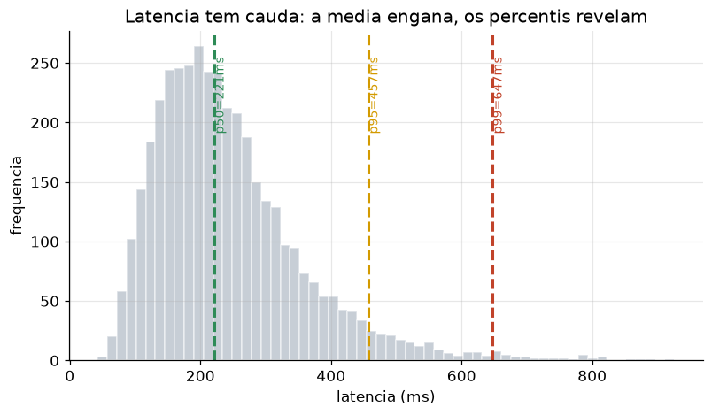

# Lição 088 — Otimização de latência de inferência (streaming, percentis, Little's law)

> **Módulo:** M12 — Avaliação, Custo/Latência e MLOps/LLMOps · **Ordem de estudo:** 88 · **Tempo:** ~55 min
> **Pré-requisitos:** [087] Otimização de custo de inferência
> **Classificação:** complemento de aprofundamento à ementa

> **Convenção de formatação:** matemática em LaTeX (`$...$` inline, `$$...$$` em
> destaque, render nativo na pré-visualização do VS Code); figuras reprodutíveis
> geradas por `tools/figuras/gerar_figuras_m12.py` e incorporadas por caminho
> relativo `assets/<NNN>-<slug>/<nome>.png`; blocos ```python só para código e
> saída.

## Seção_Teórica

### Motivação

Custo (Lição 087) e latência são as duas dimensões operacionais de um sistema LLM, e
elas **competem**: o batching que barateia a inferência faz requisições esperarem o
lote formar, aumentando a latência. Latência alta esvazia produtos — um assistente que
demora 5 segundos para começar a responder parece quebrado, mesmo que a resposta seja
ótima.

Otimizar latência exige três ferramentas que esta lição constrói. Primeiro, entender de
onde vem o tempo: o **streaming** explora o fato de que o usuário só precisa ver o
*primeiro* token rápido. Segundo, medir certo: a **média de latência mente**, porque uma
cauda de requisições lentas (causada por concorrência, *cold starts*, prompts grandes)
não aparece nela — por isso reportamos **percentis** p50/p95/p99. Terceiro, dimensionar:
a **Lei de Little** liga taxa de chegada, tempo de serviço e concorrência, dizendo
quantos *slots* paralelos o sistema precisa.

### Princípio de funcionamento

A geração autoregressiva produz um token por vez, então a latência total é

$$T_{\text{total}} = \text{TTFT} + n_{\text{out}} \cdot t_{\text{tok}},$$

onde TTFT (*time to first token*) é o tempo até o primeiro token e $t_{\text{tok}}$ é o
tempo por token subsequente. Com **streaming**, exibimos cada token ao chegar, então a
latência *percebida* é só o TTFT — o usuário começa a ler enquanto o resto é gerado.

Para medir latência num conjunto de requisições, o **percentil** $p$ é o valor abaixo
do qual caem $p\%$ das amostras. Pelo método **nearest-rank**, ordenamos as $n$ amostras
e pegamos a posição

$$\text{rank} = \left\lceil \frac{p}{100}\,n \right\rceil,$$

(limitada a $[1, n]$). O p50 é a mediana; o p95/p99 capturam a **cauda** — exatamente o
que a média esconde quando há poucos casos muito lentos.

Por fim, a **Lei de Little** descreve qualquer sistema estável em regime:

$$L = \lambda \cdot W,$$

onde $\lambda$ é a taxa de chegada (req/s), $W$ é o tempo médio que cada requisição
passa no sistema (s) e $L$ é o número médio de requisições simultâneas. $L$ diz a
**concorrência** mínima de que precisamos: para sustentar $\lambda$ requisições por
segundo, cada uma demorando $W$, é preciso atender $\lceil L \rceil$ em paralelo, ou a
fila cresce sem limite.



*Figura 1 — A distribuição de latência tem cauda longa à direita: a média fica puxada pelos casos lentos, enquanto p50, p95 e p99 descrevem honestamente a experiência típica e a de pior caso. Gerada por `tools/figuras/gerar_figuras_m12.py`.*

---

### Conceito central 1 — TTFT e streaming

A latência total soma um custo fixo de partida (TTFT) e um custo proporcional ao número
de tokens gerados. O streaming não muda o tempo total de geração, mas muda **o que o
usuário espera**: em vez de aguardar a resposta inteira, ele vê o primeiro token quase
imediatamente. Em respostas longas, a redução da latência percebida é enorme.

#### Exemplo_Resolvido 1.1

```python
ttft_ms = 300
tempo_por_token_ms = 20
tokens_saida = 120
latencia_total = ttft_ms + tokens_saida * tempo_por_token_ms
print(f"TTFT: {ttft_ms} ms")
print(f"latencia total (sem streaming): {latencia_total} ms")
print(f"latencia percebida (streaming, ate 1o token): {ttft_ms} ms")
print(f"reducao percebida: {(1 - ttft_ms / latencia_total) * 100:.1f}%")
```

**Explicação passo a passo:**
- **Bloco 1 (parâmetros):** TTFT de 300 ms, 20 ms por token e 120 tokens de saída.
- **Bloco 2 (`latencia_total`):** 300 + 120×20 = 2700 ms para a resposta completa.
- **Bloco 3 (`print`):** sem streaming o usuário espera 2700 ms; com streaming, percebe 300 ms — uma redução de 88.9% no tempo até "algo na tela".
- **Conclusão:** streaming é a otimização de latência de maior impacto e menor custo, porque ataca a *percepção* sem mudar a computação.

**Saída esperada:**
```
TTFT: 300 ms
latencia total (sem streaming): 2700 ms
latencia percebida (streaming, ate 1o token): 300 ms
reducao percebida: 88.9%
```

---

### Conceito central 2 — Percentis p50/p95/p99

Reportar latência pela média é um erro clássico: uma única requisição de 900 ms entre
dez de ~130 ms infla a média sem descrever nem o caso típico nem o pior caso. Os
percentis resolvem isso. O **p50** (mediana) é a experiência típica; o **p95/p99**
mostram a cauda que afeta os 5%/1% mais lentos — e em escala, 1% é muita gente. SLAs de
latência quase sempre são escritos sobre p95 ou p99, não sobre a média.

#### Exemplo_Resolvido 2.1

```python
import math

def percentil(amostras, p):
    ordenado = sorted(amostras)
    n = len(ordenado)
    rank = math.ceil(p / 100 * n)
    rank = max(1, min(rank, n))
    return ordenado[rank - 1]

latencias = [120, 130, 110, 150, 900, 140, 125, 135, 160, 145]
for p in [50, 95, 99]:
    print(f"p{p}: {percentil(latencias, p)} ms")
media = sum(latencias) / len(latencias)
print(f"media: {media:.1f} ms")
print(f"max: {max(latencias)} ms")
```

**Explicação passo a passo:**
- **Bloco 1 (`percentil`):** método nearest-rank — ordena e seleciona a posição $\lceil p/100 \cdot n\rceil$.
- **Bloco 2 (`latencias`):** dez medições, com uma outlier de 900 ms.
- **Bloco 3 (laço):** p50 = 135 ms (experiência típica), mas p95 = p99 = 900 ms (a cauda domina os percentis altos com $n$ pequeno).
- **Bloco 4 (`media`/`max`):** a média (211.5 ms) fica entre o típico e a cauda, descrevendo *nenhum* caso real — é por isso que percentis são preferidos.

**Saída esperada:**
```
p50: 135 ms
p95: 900 ms
p99: 900 ms
media: 211.5 ms
max: 900 ms
```

---

### Conceito central 3 — Lei de Little e concorrência

Quanta concorrência o sistema precisa para aguentar o tráfego? A Lei de Little responde
sem suposições sobre a distribuição das chegadas: $L = \lambda \cdot W$. Se chegam
$\lambda$ requisições por segundo e cada uma fica $W$ segundos no sistema, então em
média $L$ estão sendo processadas ao mesmo tempo. Para não formar fila crescente,
precisamos de pelo menos $\lceil L \rceil$ slots de processamento paralelo. É a conta
que dimensiona réplicas, conexões e limites de concorrência.

#### Exemplo_Resolvido 3.1

```python
import math

taxa_chegada = 50.0       # req/s (lambda)
tempo_servico_s = 0.8     # s por requisicao (W)
concorrencia_media = taxa_chegada * tempo_servico_s
slots_necessarios = math.ceil(concorrencia_media)
vazao_por_slot = 1 / tempo_servico_s
print(f"concorrencia media (L = lambda*W): {concorrencia_media:.1f}")
print(f"slots necessarios (teto): {slots_necessarios}")
print(f"vazao por slot: {vazao_por_slot:.2f} req/s")
```

**Explicação passo a passo:**
- **Bloco 1 (parâmetros):** 50 requisições/s chegando, cada uma levando 0.8 s para ser servida.
- **Bloco 2 (`concorrencia_media`):** $L = 50 \times 0.8 = 40$ requisições simultâneas em média.
- **Bloco 3 (`slots_necessarios`):** são necessários ao menos 40 slots paralelos; com menos, a fila cresce sem limite.
- **Bloco 4 (`vazao_por_slot`):** cada slot processa $1/0.8 = 1.25$ req/s, e $40 \times 1.25 = 50$ fecha a conta com a taxa de chegada.

**Saída esperada:**
```
concorrencia media (L = lambda*W): 40.0
slots necessarios (teto): 40
vazao por slot: 1.25 req/s
```

## Seção_Prática

> **Como reproduzir:** execute cada solução de referência com
> `python trilha/solucoes/088-latencia-inferencia/solucao_<n>.py` e compare a saída
> com o arquivo `.saida.txt` correspondente. Os enunciados/esqueletos ficam em
> `trilha/pratica/088-latencia-inferencia/exercicio_<n>.py`.

### Exercício 1 — Decomposição de latência e streaming
- **Entrada inicial / setup:** `ttft_ms = 250`, `tempo_por_token_ms = 15`, `tokens_saida = 200` (dados no esqueleto).
- **Passos de execução:** calcule a latência total (`ttft + tokens * tempo_por_token`) e a redução percebida (`(1 - ttft/total)*100`); imprima `"TTFT: <n> ms"`, `"latencia total (sem streaming): <n> ms"`, `"latencia percebida (streaming, ate 1o token): <n> ms"` e `"reducao percebida: <1 casa>%"`.
- **Critério de conclusão (binário):** a saída é **exatamente** igual a `solucao_1.saida.txt` (`latencia total (sem streaming): 3250 ms` e `reducao percebida: 92.3%`); qualquer divergência reprova.
- **Solução de referência:** `trilha/solucoes/088-latencia-inferencia/solucao_1.py`
- **Saída esperada:** `trilha/solucoes/088-latencia-inferencia/solucao_1.saida.txt`

### Exercício 2 — Percentis de latência (p50/p95/p99)
- **Entrada inicial / setup:** `latencias = [200, 210, 190, 205, 195, 800, 215, 198, 202, 207, 199, 700]` (dados no esqueleto).
- **Passos de execução:** implemente `percentil(amostras, p)` por nearest-rank (`rank = ceil(p/100*n)`, limitado a `[1, n]`); imprima `"p50: <n> ms"`, `"p95: <n> ms"`, `"p99: <n> ms"`, depois `"media: <1 casa> ms"` e `"max: <n> ms"`.
- **Critério de conclusão (binário):** a saída é **exatamente** igual a `solucao_2.saida.txt` (`p50: 202 ms`, `p95: 800 ms`, `media: 293.4 ms`); qualquer divergência reprova.
- **Solução de referência:** `trilha/solucoes/088-latencia-inferencia/solucao_2.py`
- **Saída esperada:** `trilha/solucoes/088-latencia-inferencia/solucao_2.saida.txt`

### Exercício 3 — Lei de Little e concorrência
- **Entrada inicial / setup:** `taxa_chegada = 120.0` (req/s) e `tempo_servico_s = 0.5` (s) (dados no esqueleto).
- **Passos de execução:** aplique `L = taxa_chegada * tempo_servico_s`, calcule `slots_necessarios = ceil(L)` e `vazao_por_slot = 1/tempo_servico_s`; imprima `"concorrencia media (L = lambda*W): <1 casa>"`, `"slots necessarios (teto): <n>"` e `"vazao por slot: <2 casas> req/s"`.
- **Critério de conclusão (binário):** a saída é **exatamente** igual a `solucao_3.saida.txt` (`concorrencia media (L = lambda*W): 60.0`, `slots necessarios (teto): 60`, `vazao por slot: 2.00 req/s`); qualquer divergência reprova.
- **Solução de referência:** `trilha/solucoes/088-latencia-inferencia/solucao_3.py`
- **Saída esperada:** `trilha/solucoes/088-latencia-inferencia/solucao_3.saida.txt`
