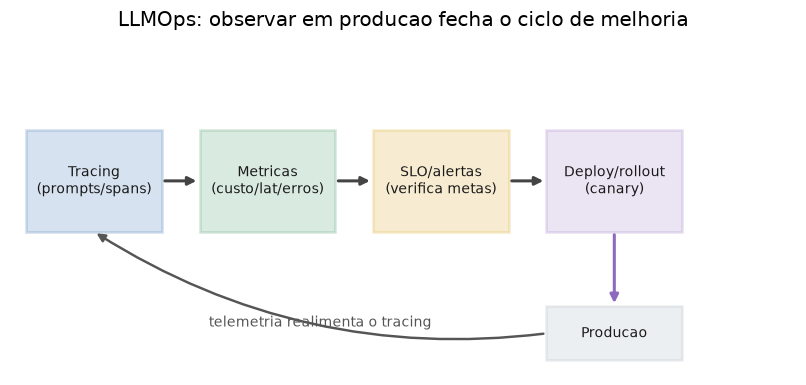

# Lição 089 — MLOps/LLMOps e observabilidade (tracing, SLOs e rollout canary)

> **Módulo:** M12 — Avaliação, Custo/Latência e MLOps/LLMOps · **Ordem de estudo:** 89 · **Tempo:** ~55 min
> **Pré-requisitos:** [070] Observabilidade e limites · [086] Métricas e datasets de avaliação
> **Classificação:** complemento de aprofundamento à ementa

> **Convenção de formatação:** matemática em LaTeX (`$...$` inline, `$$...$$` em
> destaque, render nativo na pré-visualização do VS Code); figuras reprodutíveis
> geradas por `tools/figuras/gerar_figuras_m12.py` e incorporadas por caminho
> relativo `assets/<NNN>-<slug>/<nome>.png`; blocos ```python só para código e
> saída.

## Seção_Teórica

### Motivação

Já sabemos avaliar (Lições 085–086), custear (087) e acelerar (088) um sistema LLM.
Falta a peça que mantém tudo isso **vivo em produção**: quando o sistema está
atendendo usuários reais, como sabemos que continua bom? Um eval offline mede uma
foto; produção é um filme — o tráfego muda, um provedor fica lento, um prompt novo
regride silenciosamente. Sem instrumentação, a primeira notícia de um problema vem
do usuário reclamando, tarde demais.

**MLOps/LLMOps** é a disciplina que fecha esse ciclo: instrumentar, medir, alertar e
promover mudanças com segurança. A **observabilidade** (Lição 070) é a base — só
podemos agir sobre o que conseguimos enxergar. Esta lição constrói três ferramentas
operacionais e determinísticas: o **tracing** de uma requisição (de onde vêm latência
e custo), as **métricas de janela** confrontadas com **SLOs** (a meta que dispara
alertas) e a **decisão de rollout canary** (o portão automático que promove ou reverte
uma nova versão sem intervenção manual).

### Princípio de funcionamento

Uma requisição a um pipeline LLM passa por várias etapas (embed, busca, geração,
validação). O **trace** registra cada etapa como um **span** com sua latência e custo;
agregar o trace dá o total da requisição e revela o **gargalo** — o span que mais pesa.
Se a latência total é a soma dos spans, $T = \sum_k t_k$, o gargalo é
$\arg\max_k t_k$, e otimizar qualquer outro span quase não move o total.

Sobre uma **janela** de requisições, resumimos a saúde do sistema com poucas métricas.
Duas bastam para a maioria dos alertas: a **taxa de erro**

$$\text{erro} = \frac{\#\{\text{requisições com falha}\}}{N}$$

e um percentil alto de latência, tipicamente o **p95** (Lição 088). Cada métrica é
comparada a um **SLO** (*service level objective*) — o valor-alvo acordado. A regra de
violação é binária: a métrica viola o SLO quando o excede estritamente
($\text{erro} > \text{SLO}_{\text{erro}}$ ou $p95 > \text{SLO}_{p95}$). É esse teste
que dispara alertas e bloqueia deploys.

Por fim, mudanças entram em produção via **rollout canary**: a nova versão recebe uma
fatia do tráfego e suas métricas são comparadas às do **baseline** (a versão atual). A
nova versão só é **promovida** se não piora as métricas além de uma **margem** de
tolerância; caso contrário, faz-se **rollback**. Formalmente, promovemos o canary
quando

$$\text{erro}_{c} \le \text{erro}_{b} + \varepsilon \quad\text{e}\quad p95_{c} \le p95_{b} + \delta,$$

com margens $\varepsilon, \delta \ge 0$ que absorvem o ruído natural entre medições.



*Figura 1 — O ciclo de LLMOps: o tracing alimenta as métricas, que são checadas contra SLOs; o deploy/rollout entra em produção, cuja telemetria realimenta o tracing e fecha o laço de melhoria contínua. Gerada por `tools/figuras/gerar_figuras_m12.py`.*

---

### Conceito central 1 — Tracing de prompts

Um **trace** é a decomposição de uma requisição em **spans** — as etapas que ela
percorre, cada uma com sua latência e custo. Agregar o trace responde a duas perguntas
operacionais: *quanto* a requisição custou (em tempo e em dinheiro) e *onde* o tempo foi
gasto. O **gargalo** é o span de maior latência; é nele, e só nele, que uma otimização
de latência tem impacto material no total.

#### Exemplo_Resolvido 1.1

```python
trace = [
    {"span": "retrieve", "latencia_ms": 80, "custo": 0.0000},
    {"span": "rerank", "latencia_ms": 60, "custo": 0.0002},
    {"span": "generate", "latencia_ms": 540, "custo": 0.0034},
    {"span": "validate", "latencia_ms": 20, "custo": 0.0001},
]
lat_total = sum(s["latencia_ms"] for s in trace)
custo_total = sum(s["custo"] for s in trace)
for s in trace:
    print(f"{s['span']:>9}: {s['latencia_ms']:>4} ms  ${s['custo']:.4f}")
print(f"{'TOTAL':>9}: {lat_total:>4} ms  ${custo_total:.4f}")
gargalo = max(trace, key=lambda s: s["latencia_ms"])
frac = gargalo["latencia_ms"] / lat_total * 100
print(f"gargalo: {gargalo['span']} ({frac:.1f}% da latencia)")
```

**Explicação passo a passo:**
- **Bloco 1 (`trace`):** quatro spans de um pipeline RAG com guarda; cada um traz latência (ms) e custo ($).
- **Bloco 2 (`lat_total`/`custo_total`):** soma das latências (700 ms) e dos custos ($0.0037) — o total da requisição.
- **Bloco 3 (laço + `TOTAL`):** imprime cada span alinhado e a linha de total, o relatório típico de um trace.
- **Bloco 4 (`gargalo`):** o span de maior latência é `generate`, responsável por 77.1% do tempo; otimizar `retrieve` ou `validate` quase não moveria o total.

**Saída esperada:**
```
 retrieve:   80 ms  $0.0000
   rerank:   60 ms  $0.0002
 generate:  540 ms  $0.0034
 validate:   20 ms  $0.0001
    TOTAL:  700 ms  $0.0037
gargalo: generate (77.1% da latencia)
```

---

### Conceito central 2 — Métricas operacionais e SLO

Em produção não olhamos requisições isoladas, e sim uma **janela** delas, resumida por
poucas métricas. A **taxa de erro** (fração de falhas) e o **p95 de latência**
(Lição 088) cobrem a maioria dos incidentes. Cada métrica tem um **SLO**: o alvo que,
quando ultrapassado, indica degradação. A verificação é uma porta binária — viola se a
métrica excede estritamente o SLO — e é exatamente o sinal que dispara um alerta ou
bloqueia um deploy.

#### Exemplo_Resolvido 2.1

```python
import math

requisicoes = [
    {"ok": True, "latencia_ms": 180},
    {"ok": True, "latencia_ms": 220},
    {"ok": True, "latencia_ms": 200},
    {"ok": False, "latencia_ms": 260},
    {"ok": True, "latencia_ms": 210},
    {"ok": True, "latencia_ms": 195},
    {"ok": True, "latencia_ms": 205},
    {"ok": True, "latencia_ms": 640},
]
total = len(requisicoes)
erros = sum(1 for r in requisicoes if not r["ok"])
taxa_erro = erros / total
lat = sorted(r["latencia_ms"] for r in requisicoes)
rank = max(1, min(math.ceil(0.95 * total), total))
p95 = lat[rank - 1]
slo_erro = 0.10
slo_p95 = 500
print(f"requisicoes: {total}")
print(f"taxa de erro: {taxa_erro:.4f} (SLO <= {slo_erro:.2f})")
print(f"p95 latencia: {p95} ms (SLO <= {slo_p95} ms)")
print(f"viola SLO erro: {taxa_erro > slo_erro}")
print(f"viola SLO p95: {p95 > slo_p95}")
```

**Explicação passo a passo:**
- **Bloco 1 (`requisicoes`):** janela de oito requisições, uma com falha e uma muito lenta (640 ms).
- **Bloco 2 (`taxa_erro`):** uma falha em oito dá 0.1250, acima do SLO de 0.10.
- **Bloco 3 (`p95`):** pelo nearest-rank, `rank = ceil(0.95*8) = 8`, então o p95 é a maior amostra, 640 ms, acima do SLO de 500 ms.
- **Bloco 4 (`print` de violação):** ambas as portas binárias acendem (`True`/`True`) — esta janela violaria os dois SLOs e dispararia alerta.

**Saída esperada:**
```
requisicoes: 8
taxa de erro: 0.1250 (SLO <= 0.10)
p95 latencia: 640 ms (SLO <= 500 ms)
viola SLO erro: True
viola SLO p95: True
```

---

### Conceito central 3 — Rollout canary e rollback

Promover uma nova versão direto para 100% do tráfego é arriscado: se ela regride, todos
sentem. O **rollout canary** mitiga isso enviando uma fatia do tráfego à versão nova
(*canary*) e comparando suas métricas às do **baseline**. A decisão é automática e
conservadora: só **promove** se o canary não piora taxa de erro nem p95 além de uma
**margem**; caso contrário, **rollback**. A margem absorve a variação natural entre
medições, evitando reverter por ruído — mas exige que *ambos* os critérios passem.

#### Exemplo_Resolvido 3.1

```python
baseline = {"taxa_erro": 0.04, "p95_ms": 480}
canary = {"taxa_erro": 0.07, "p95_ms": 470}
margem_erro = 0.01
margem_p95 = 50
erro_ok = canary["taxa_erro"] <= baseline["taxa_erro"] + margem_erro
p95_ok = canary["p95_ms"] <= baseline["p95_ms"] + margem_p95
promover = erro_ok and p95_ok
print(f"erro: baseline={baseline['taxa_erro']:.2f} canary={canary['taxa_erro']:.2f} ok={erro_ok}")
print(f"p95: baseline={baseline['p95_ms']} canary={canary['p95_ms']} ok={p95_ok}")
print(f"decisao: {'promover' if promover else 'rollback'}")
```

**Explicação passo a passo:**
- **Bloco 1 (`baseline`/`canary`):** o canary melhora a latência (470 vs 480 ms) mas piora muito a taxa de erro (0.07 vs 0.04).
- **Bloco 2 (`erro_ok`):** o limite tolerado é $0.04 + 0.01 = 0.05$; como $0.07 > 0.05$, o critério de erro **falha**.
- **Bloco 3 (`p95_ok`):** o limite é $480 + 50 = 530$; como $470 \le 530$, o critério de latência passa.
- **Bloco 4 (`promover`/`print`):** a decisão exige os dois critérios; com o erro reprovado, o resultado é **rollback** — o ganho de latência não compensa a regressão de qualidade.

**Saída esperada:**
```
erro: baseline=0.04 canary=0.07 ok=False
p95: baseline=480 canary=470 ok=True
decisao: rollback
```

## Seção_Prática

> **Como reproduzir:** execute cada solução de referência com
> `python trilha/solucoes/089-mlops-llmops-observabilidade/solucao_<n>.py` e compare a
> saída com o arquivo `.saida.txt` correspondente. Os enunciados/esqueletos ficam em
> `trilha/pratica/089-mlops-llmops-observabilidade/exercicio_<n>.py`.

### Exercício 1 — Tracing de prompts e agregação do trace
- **Entrada inicial / setup:** o `trace` de 4 spans (`embed` 50 ms/$0.0001, `search` 30 ms/$0.0000, `generate` 420 ms/$0.0021, `guard` 25 ms/$0.0003), dado no esqueleto.
- **Passos de execução:** some latência e custo de todos os spans; imprima uma linha por span no formato `"<span alinhado em 9>: <latência em 4> ms  $<custo 4 casas>"`, depois a linha `TOTAL` no mesmo formato e por fim `"gargalo: <span> (<latência> ms)"` (o span de maior latência).
- **Critério de conclusão (binário):** a saída é **exatamente** igual a `solucao_1.saida.txt` (`TOTAL:  525 ms  $0.0025` e `gargalo: generate (420 ms)`); qualquer divergência reprova.
- **Solução de referência:** `trilha/solucoes/089-mlops-llmops-observabilidade/solucao_1.py`
- **Saída esperada:** `trilha/solucoes/089-mlops-llmops-observabilidade/solucao_1.saida.txt`

### Exercício 2 — Métricas operacionais e verificação de SLO
- **Entrada inicial / setup:** a lista `requisicoes` de 10 itens (uma falha; latências de 120 a 480 ms) e os SLOs `slo_erro = 0.10` e `slo_p95 = 500`, dados no esqueleto.
- **Passos de execução:** calcule a taxa de erro e o p95 (nearest-rank, `rank = ceil(0.95*n)`); marque violação quando a métrica for estritamente maior que o SLO; imprima `"requisicoes: <n>"`, `"taxa de erro: <4 casas> (SLO <= <2 casas>)"`, `"p95 latencia: <n> ms (SLO <= <n> ms)"`, `"viola SLO erro: <bool>"` e `"viola SLO p95: <bool>"`.
- **Critério de conclusão (binário):** a saída é **exatamente** igual a `solucao_2.saida.txt` (`taxa de erro: 0.1000`, `p95 latencia: 480 ms`, ambas as violações `False`); qualquer divergência reprova.
- **Solução de referência:** `trilha/solucoes/089-mlops-llmops-observabilidade/solucao_2.py`
- **Saída esperada:** `trilha/solucoes/089-mlops-llmops-observabilidade/solucao_2.saida.txt`

### Exercício 3 — Decisão de rollout canary
- **Entrada inicial / setup:** `baseline = {"taxa_erro": 0.03, "p95_ms": 500}`, `canary = {"taxa_erro": 0.02, "p95_ms": 510}`, `margem_erro = 0.01` e `margem_p95 = 50` (dados no esqueleto).
- **Passos de execução:** promova o canary apenas se `taxa_erro <= baseline + margem_erro` **e** `p95 <= baseline + margem_p95`; caso contrário, rollback; imprima `"erro: baseline=<2 casas> canary=<2 casas> ok=<bool>"`, `"p95: baseline=<n> canary=<n> ok=<bool>"` e `"decisao: <promover|rollback>"`.
- **Critério de conclusão (binário):** a saída é **exatamente** igual a `solucao_3.saida.txt` (ambos os critérios `True` e `decisao: promover`); qualquer divergência reprova.
- **Solução de referência:** `trilha/solucoes/089-mlops-llmops-observabilidade/solucao_3.py`
- **Saída esperada:** `trilha/solucoes/089-mlops-llmops-observabilidade/solucao_3.saida.txt`
