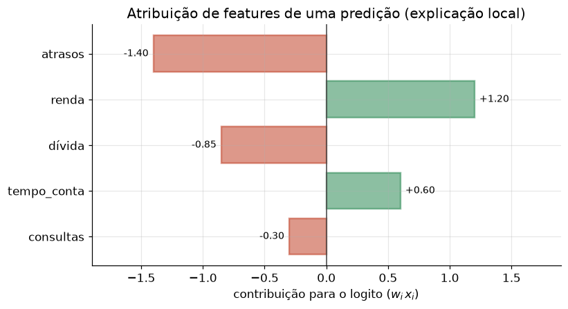

# Lição 090 — Interpretabilidade e explicabilidade

> **Módulo:** M13 — Segurança e Governança em IA · **Ordem de estudo:** 90 · **Tempo:** ~55 min
> **Pré-requisitos:** [031] Arquiteturas profundas e transfer learning · [085] Metodologia de avaliação e evals
> **Classificação:** complemento de aprofundamento à ementa

> **Convenção de formatação:** matemática em LaTeX (`$...$` inline, `$$...$$` em
> destaque, render nativo na pré-visualização do VS Code); figuras reprodutíveis
> geradas por `tools/figuras/gerar_figuras_m13.py` e incorporadas por caminho
> relativo `assets/<NNN>-<slug>/<nome>.png`; blocos ```python só para código e
> saída.

## Seção_Teórica

### Motivação

Um modelo que acerta não basta: em crédito, saúde e contratação, é preciso
**explicar por quê**. Reguladores exigem justificativa para decisões automatizadas,
times de produto precisam confiar nas predições e engenheiros precisam **depurar**
o que o modelo aprendeu. Um classificador que nega um empréstimo sem dizer o motivo
é, ao mesmo tempo, um risco legal e uma caixa-preta impossível de validar.

**Interpretabilidade** é o grau em que conseguimos entender o mecanismo interno de
um modelo; **explicabilidade** é a capacidade de produzir, para uma decisão
específica, uma justificativa compreensível. As duas se apoiam em uma pergunta
quantitativa: **quanto cada feature contribuiu para esta saída?** Esta lição
constrói, em Python puro e NumPy, três respostas determinísticas a essa pergunta —
todas verificáveis com saída exata, no espírito de medir do M12 (Lição 085).

### Princípio de funcionamento

Em um modelo **linear**, a explicação é exata e barata. A saída (logito) é

$$z = b + \sum_{i=1}^{d} w_i\,x_i,$$

então a **atribuição** da feature $i$ àquela predição é simplesmente o termo
$w_i\,x_i$: positivo empurra a decisão para cima, negativo para baixo, e a soma das
atribuições mais o viés reconstrói $z$ exatamente. Essa decomposição aditiva é a
ideia central por trás de métodos modernos (como valores de Shapley): atribuir a
saída às partes que a compõem.

Quando o modelo **não** é linear (ou não temos seus pesos), medimos a importância
de uma feature **perturbando-a** e observando o efeito. Na **importância por
permutação**, embaralhamos os valores de uma coluna — destruindo sua relação com o
alvo — e medimos o **aumento do erro**:

$$\text{imp}_j = L(\text{dados com coluna } j \text{ embaralhada}) - L(\text{dados originais}).$$

Se embaralhar a feature $j$ piora muito o erro, ela era importante; se não muda
nada, era irrelevante. Por fim, distinguimos a explicação **local** (por que *esta*
instância recebeu *esta* saída) da **global** (quais features importam, em média,
para o modelo todo). A figura abaixo mostra uma explicação local típica.



*Figura 1 — Atribuição local $w_i x_i$ de uma predição: features verdes empurram a decisão para cima, vermelhas para baixo; o comprimento é a magnitude da contribuição. Gerada por `tools/figuras/gerar_figuras_m13.py`.*

---

### Conceito central 1 — Atribuição de features

Em um modelo linear, a contribuição de cada feature para a predição é o produto
$w_i\,x_i$. Ordenar essas contribuições por magnitude revela, de relance, **o que
pesou** naquela decisão específica — a forma mais direta de explicação local.

#### Exemplo_Resolvido 1.1

```python
import numpy as np
# Pesos de um modelo linear de risco de credito e uma instancia (features ja normalizadas).
nomes = ["renda", "divida", "atrasos", "tempo_conta", "consultas"]
w = np.array([1.5, -1.7, -2.0, 0.8, -0.5])
b = 0.3
x = np.array([0.8, 0.5, 0.7, 0.75, 0.6])

contrib = w * x                      # atribuicao por feature: w_i * x_i
logito = b + float(contrib.sum())
for nome, c in zip(nomes, contrib):
    print(f"{nome:>11}: {c:+.3f}")
print(f"{'vies':>11}: {b:+.3f}")
print(f"logito total: {logito:+.3f}")
```

**Explicação passo a passo:**
- **Bloco 1 (`w`/`b`/`x`):** os pesos do modelo e uma instância já normalizada; o sinal do peso diz se a feature empurra o risco para cima ou para baixo.
- **Bloco 2 (`contrib`):** a atribuição de cada feature é o produto $w_i x_i$ — `atrasos` ($-1.400$) puxa mais para baixo e `renda` ($+1.200$) mais para cima.
- **Bloco 3 (`print`):** as contribuições mais o viés somam exatamente o logito ($-0.450$), confirmando a decomposição aditiva.

**Saída esperada:**
```
      renda: +1.200
     divida: -0.850
    atrasos: -1.400
tempo_conta: +0.600
  consultas: -0.300
       vies: +0.300
logito total: -0.450
```

---

### Conceito central 2 — Importância por permutação

Quando não dispomos dos pesos (ou o modelo é não linear), medimos a importância
**perturbando** uma feature de cada vez. Embaralhar uma coluna quebra sua relação
com o alvo; o **aumento do erro** resultante é a importância daquela feature. É um
método agnóstico ao modelo — só precisa de predições.

#### Exemplo_Resolvido 2.1

```python
import numpy as np
rng = np.random.default_rng(0)
n = 200
X = rng.normal(size=(n, 3))
# alvo depende fortemente de x0, moderadamente de x1, nada de x2
y = 3.0 * X[:, 0] + 1.0 * X[:, 1] + rng.normal(scale=0.1, size=n)
w = np.array([3.0, 1.0, 0.0])           # modelo "treinado" (coeficientes conhecidos)

def mse(Xm):
    pred = Xm @ w
    return float(np.mean((pred - y) ** 2))

base = mse(X)
print(f"mse base: {base:.3f}")
for j in range(3):
    Xp = X.copy()
    Xp[:, j] = rng.permutation(X[:, j])
    imp = mse(Xp) - base
    print(f"feature x{j}: importancia={imp:.3f}")
```

**Explicação passo a passo:**
- **Bloco 1 (dados):** o alvo `y` depende fortemente de `x0`, pouco de `x1` e nada de `x2`; a semente fixa torna tudo reprodutível.
- **Bloco 2 (`mse`):** o erro quadrático médio do modelo de coeficientes conhecidos sobre os dados fornecidos.
- **Bloco 3 (laço):** embaralhar `x0` dispara o erro (importância ~17.98), `x1` o aumenta pouco (~1.97) e `x2` não o altera (0.000) — exatamente a ordem de dependência embutida no alvo.

**Saída esperada:**
```
mse base: 0.010
feature x0: importancia=17.981
feature x1: importancia=1.973
feature x2: importancia=0.000
```

---

### Conceito central 3 — Explicação local vs global

A mesma atribuição $w_i x_i$ responde a duas perguntas diferentes. A explicação
**local** é a atribuição de **uma** instância: por que *este* caso recebeu *esta*
saída. A explicação **global** agrega sobre o conjunto — por exemplo, a média de
$|w_i x_i|$ — revelando quais features o modelo usa **no geral**. Local e global
podem discordar: uma feature pouco importante na média pode dominar um caso atípico.

#### Exemplo_Resolvido 3.1

```python
import numpy as np
rng = np.random.default_rng(7)
w = np.array([1.5, -1.7, -2.0])
X = rng.uniform(0.0, 1.0, size=(500, 3))
attrib = X * w                       # atribuicao local por instancia
global_imp = np.mean(np.abs(attrib), axis=0)   # importancia global (media)
local = attrib[0]                              # explicacao de UMA instancia
nomes = ["f0", "f1", "f2"]
for nome, g, l in zip(nomes, global_imp, local):
    print(f"{nome}: global={g:.3f} local[0]={l:+.3f}")
```

**Explicação passo a passo:**
- **Bloco 1 (dados):** 500 instâncias com features em $[0,1]$ e os pesos do modelo linear; semente fixa.
- **Bloco 2 (`attrib`/`global_imp`):** `attrib` guarda a atribuição local de cada instância; a média de seus valores absolutos por coluna é a importância global.
- **Bloco 3 (`print`):** globalmente `f2` é a mais importante (0.982), mas a explicação local da instância 0 mostra magnitudes próprias daquele caso — local e global são leituras distintas da mesma decomposição.

**Saída esperada:**
```
f0: global=0.745 local[0]=+0.938
f1: global=0.866 local[0]=-1.525
f2: global=0.982 local[0]=-1.551
```

## Seção_Prática

> **Como reproduzir:** execute cada solução de referência com
> `python trilha/solucoes/090-interpretabilidade-explicabilidade/solucao_<n>.py` e
> compare a saída com o arquivo `.saida.txt` correspondente. Os enunciados/esqueletos
> ficam em `trilha/pratica/090-interpretabilidade-explicabilidade/exercicio_<n>.py`.

### Exercício 1 — Atribuição de features de uma predição
- **Entrada inicial / setup:** modelo linear com `b = 0.5`, `nomes = ["valor", "prazo", "historico", "garantia"]`, `w = np.array([2.0, -1.2, 1.5, -0.8])`, `x = np.array([0.9, 0.4, 0.6, 0.7])` (dados no esqueleto).
- **Passos de execução:** calcule `contrib = w * x` e `logito = b + contrib.sum()`; imprima cada feature em ordem **decrescente de |contribuição|** no formato `"{nome:>9}: {contrib:+.3f}"` e, ao final, `"logito total: {logito:+.3f}"`.
- **Critério de conclusão (binário):** a saída é **exatamente** igual a `solucao_1.saida.txt` (`valor: +1.800` primeiro e `logito total: +2.160`); qualquer divergência reprova.
- **Solução de referência:** `trilha/solucoes/090-interpretabilidade-explicabilidade/solucao_1.py`
- **Saída esperada:** `trilha/solucoes/090-interpretabilidade-explicabilidade/solucao_1.saida.txt`

### Exercício 2 — Importância por permutação
- **Entrada inicial / setup:** `rng = np.random.default_rng(42)`, `n = 300`, `X = rng.normal(size=(n, 3))`, `y = 2.0*X[:,0] - 1.0*X[:,2] + rng.normal(scale=0.1, size=n)`, `w = np.array([2.0, 0.0, -1.0])` (dados no esqueleto).
- **Passos de execução:** defina `mse(Xm)` (média de `(Xm @ w - y)**2`), imprima `"mse base: {base:.3f}"` e, para cada coluna `j`, embaralhe-a com `rng.permutation(X[:, j])` e imprima `"feature x{j}: importancia={mse(Xp) - base:.3f}"`.
- **Critério de conclusão (binário):** a saída é **exatamente** igual a `solucao_2.saida.txt` (`feature x0: importancia=8.243`, `feature x1: importancia=0.000`, `feature x2: importancia=1.893`); qualquer divergência reprova.
- **Solução de referência:** `trilha/solucoes/090-interpretabilidade-explicabilidade/solucao_2.py`
- **Saída esperada:** `trilha/solucoes/090-interpretabilidade-explicabilidade/solucao_2.saida.txt`

### Exercício 3 — Explicação global vs local
- **Entrada inicial / setup:** `rng = np.random.default_rng(3)`, `w = np.array([1.0, -2.0, 0.5])`, `X = rng.uniform(0.0, 1.0, size=(400, 3))` (dados no esqueleto).
- **Passos de execução:** calcule `attrib = X * w`, `global_imp = np.mean(np.abs(attrib), axis=0)` e `local = attrib[0]`; imprima por feature `"{nome}: global={g:.3f} local[0]={l:+.3f}"` e, ao final, `"feature mais importante (global): {nome do maior global}"`.
- **Critério de conclusão (binário):** a saída é **exatamente** igual a `solucao_3.saida.txt` (`feature mais importante (global): f1`); qualquer divergência reprova.
- **Solução de referência:** `trilha/solucoes/090-interpretabilidade-explicabilidade/solucao_3.py`
- **Saída esperada:** `trilha/solucoes/090-interpretabilidade-explicabilidade/solucao_3.saida.txt`
