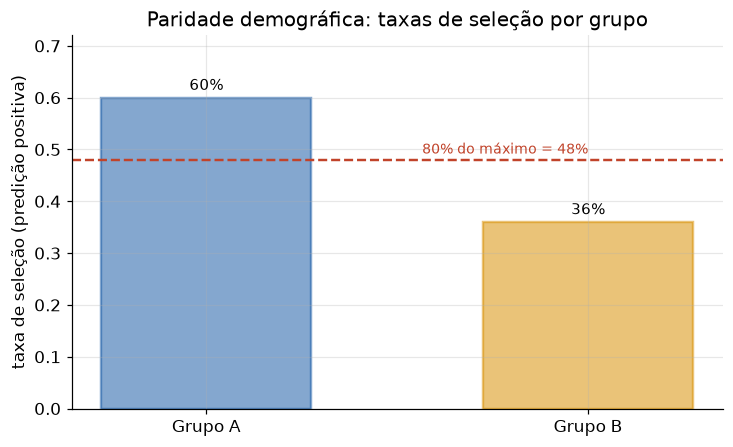

# Lição 091 — Vieses e fairness em IA

> **Módulo:** M13 — Segurança e Governança em IA · **Ordem de estudo:** 91 · **Tempo:** ~55 min
> **Pré-requisitos:** [090] Interpretabilidade e explicabilidade
> **Classificação:** complemento de aprofundamento à ementa

> **Convenção de formatação:** matemática em LaTeX (`$...$` inline, `$$...$$` em
> destaque, render nativo na pré-visualização do VS Code); figuras reprodutíveis
> geradas por `tools/figuras/gerar_figuras_m13.py` e incorporadas por caminho
> relativo `assets/<NNN>-<slug>/<nome>.png`; blocos ```python só para código e
> saída.

## Seção_Teórica

### Motivação

Um modelo aprende a partir de dados históricos — e a história carrega
desigualdades. Se um conjunto de treino reflete decisões enviesadas de crédito,
contratação ou policiamento, o modelo **reproduz e amplifica** esse viés, agora com
o verniz de objetividade de um número. O resultado é discriminação automatizada,
muitas vezes contra grupos já vulneráveis, e exposição legal direta sob leis
antidiscriminação.

A dificuldade é que **"justo" não tem uma única definição**. Tratar todos da mesma
forma (mesma taxa de aprovação por grupo) pode conflitar com tratar erros de forma
equânime (mesma taxa de acerto por grupo). Por isso, fairness em IA é antes de tudo
um exercício de **medição**: escolher uma métrica explícita, calculá-la sobre os
grupos protegidos e verificar a disparidade. Esta lição implementa três métricas
canônicas em Python puro e NumPy, todas com saída exata e auditável — apoiando-se na
explicabilidade da Lição 090 para entender *por que* o viés aparece.

### Princípio de funcionamento

Seja $\hat{y}$ a predição binária, $y$ o rótulo verdadeiro e $A \in \{0,1\}$ o grupo
protegido. As três métricas medem disparidade sob óticas diferentes.

**Paridade demográfica** compara a **taxa de seleção** (fração de predições
positivas) entre grupos, ignorando o rótulo:

$$\Delta_{\text{DP}} = P(\hat{y}=1 \mid A=0) - P(\hat{y}=1 \mid A=1).$$

Idealmente $\Delta_{\text{DP}} \approx 0$.

**Equalized odds** exige que os **erros** sejam equilibrados: a taxa de verdadeiros
positivos e a de falsos positivos devem ser próximas entre grupos,

$$\text{TPR} = \frac{\text{TP}}{\text{TP}+\text{FN}}, \qquad \text{FPR} = \frac{\text{FP}}{\text{FP}+\text{TN}},$$

medidas separadamente em cada grupo. **Disparate impact** olha a **razão** das taxas
de seleção e aplica um limiar prático — a **regra dos 80%**:

$$\text{DI} = \frac{\min(\text{taxa}_A, \text{taxa}_B)}{\max(\text{taxa}_A, \text{taxa}_B)} \ge 0.8.$$

Razões abaixo de $0.8$ sinalizam impacto adverso. A figura ilustra a paridade como a
distância entre as taxas de seleção dos grupos.



*Figura 1 — Paridade demográfica: a diferença entre as barras é $\Delta_{\text{DP}}$; a linha tracejada marca 80% da maior taxa (limiar do disparate impact). Gerada por `tools/figuras/gerar_figuras_m13.py`.*

---

### Conceito central 1 — Paridade demográfica

A paridade demográfica mede se os grupos recebem decisões positivas na **mesma
proporção**, sem olhar para o rótulo verdadeiro. É a métrica mais simples: a taxa de
seleção de cada grupo e a diferença entre elas. Uma diferença grande indica que o
modelo favorece um grupo na concessão de resultados positivos.

#### Exemplo_Resolvido 1.1

```python
import numpy as np
# Predicoes binarias (1 = aprovado) de um modelo e o grupo protegido de cada pessoa.
grupo = np.array([0, 0, 0, 0, 0, 1, 1, 1, 1, 1])
pred = np.array([1, 1, 1, 0, 0, 1, 0, 0, 0, 0])
taxa_a = float(pred[grupo == 0].mean())
taxa_b = float(pred[grupo == 1].mean())
print(f"taxa selecao grupo A: {taxa_a:.2f}")
print(f"taxa selecao grupo B: {taxa_b:.2f}")
print(f"diferenca de paridade: {taxa_a - taxa_b:+.2f}")
```

**Explicação passo a passo:**
- **Bloco 1 (`grupo`/`pred`):** cinco pessoas por grupo; `pred == 1` é a decisão positiva (aprovado).
- **Bloco 2 (`taxa_a`/`taxa_b`):** a taxa de seleção é a média das predições de cada grupo — 0.60 para A e 0.20 para B.
- **Bloco 3 (`print`):** a diferença de paridade é $+0.40$, uma disparidade grande: o grupo A é aprovado três vezes mais que o B.

**Saída esperada:**
```
taxa selecao grupo A: 0.60
taxa selecao grupo B: 0.20
diferenca de paridade: +0.40
```

---

### Conceito central 2 — Equalized odds

Paridade demográfica ignora se as decisões estão **corretas**. Equalized odds
corrige isso exigindo que os **erros** sejam equilibrados: grupos diferentes devem
ter taxas de verdadeiros positivos (TPR) e falsos positivos (FPR) parecidas. Assim,
o modelo não pode acertar mais para um grupo às custas do outro.

#### Exemplo_Resolvido 2.1

```python
import numpy as np
y = np.array([1, 1, 0, 0, 1, 1, 0, 0])     # rotulo verdadeiro
pred = np.array([1, 0, 0, 0, 1, 1, 1, 0])  # predicao do modelo
grp = np.array([0, 0, 0, 0, 1, 1, 1, 1])   # grupo protegido

def taxas(yv, pv):
    tp = int(((pv == 1) & (yv == 1)).sum())
    fn = int(((pv == 0) & (yv == 1)).sum())
    fp = int(((pv == 1) & (yv == 0)).sum())
    tn = int(((pv == 0) & (yv == 0)).sum())
    tpr = tp / (tp + fn) if (tp + fn) else 0.0
    fpr = fp / (fp + tn) if (fp + tn) else 0.0
    return tpr, fpr

for g, nome in [(0, "A"), (1, "B")]:
    tpr, fpr = taxas(y[grp == g], pred[grp == g])
    print(f"grupo {nome}: TPR={tpr:.2f} FPR={fpr:.2f}")
```

**Explicação passo a passo:**
- **Bloco 1 (dados):** rótulo verdadeiro, predição e grupo de oito pessoas (quatro por grupo).
- **Bloco 2 (`taxas`):** conta TP, FN, FP, TN do grupo e deriva TPR (acertos entre os positivos) e FPR (alarmes falsos entre os negativos).
- **Bloco 3 (laço):** o grupo A tem TPR=0.50 e FPR=0.00; o B, TPR=1.00 e FPR=0.50 — equalized odds é violada, pois ambos os erros diferem entre grupos.

**Saída esperada:**
```
grupo A: TPR=0.50 FPR=0.00
grupo B: TPR=1.00 FPR=0.50
```

---

### Conceito central 3 — Disparate impact (regra dos 80%)

Disparate impact transforma a paridade em um teste binário usado em contextos
legais. Em vez da diferença, usa a **razão** entre a menor e a maior taxa de
seleção, e aplica o limiar de $0.8$: razões abaixo disso indicam **impacto adverso**
sobre o grupo desfavorecido. É a tradução operacional da "regra dos 80%".

#### Exemplo_Resolvido 3.1

```python
taxa_a = 0.60   # taxa de selecao do grupo A
taxa_b = 0.36   # taxa de selecao do grupo B
favorecida = max(taxa_a, taxa_b)
desfavorecida = min(taxa_a, taxa_b)
ratio = desfavorecida / favorecida   # disparate impact
passa = ratio >= 0.8
print(f"razao de impacto: {ratio:.2f}")
print(f"regra dos 80%: {'passa' if passa else 'reprova'}")
```

**Explicação passo a passo:**
- **Bloco 1 (taxas):** as taxas de seleção dos dois grupos (0.60 e 0.36).
- **Bloco 2 (`ratio`):** a razão entre a menor e a maior taxa é $0.36/0.60 = 0.60$.
- **Bloco 3 (`print`):** como $0.60 < 0.80$, a decisão **reprova** na regra dos 80% — há impacto adverso contra o grupo B.

**Saída esperada:**
```
razao de impacto: 0.60
regra dos 80%: reprova
```

## Seção_Prática

> **Como reproduzir:** execute cada solução de referência com
> `python trilha/solucoes/091-vieses-fairness/solucao_<n>.py` e compare a saída com
> o arquivo `.saida.txt` correspondente. Os enunciados/esqueletos ficam em
> `trilha/pratica/091-vieses-fairness/exercicio_<n>.py`.

### Exercício 1 — Paridade demográfica
- **Entrada inicial / setup:** `grupo = np.array([0,0,0,0,0,0,1,1,1,1,1,1])` e `pred = np.array([1,1,1,1,0,0,1,1,0,0,0,0])` (dados no esqueleto).
- **Passos de execução:** calcule a taxa de seleção de cada grupo (`pred[grupo == g].mean()`) e a diferença A − B; imprima `"taxa selecao grupo A: {taxa_a:.2f}"`, `"taxa selecao grupo B: {taxa_b:.2f}"` e `"diferenca de paridade: {dif:+.2f}"`.
- **Critério de conclusão (binário):** a saída é **exatamente** igual a `solucao_1.saida.txt` (`taxa selecao grupo A: 0.67`, `diferenca de paridade: +0.33`); qualquer divergência reprova.
- **Solução de referência:** `trilha/solucoes/091-vieses-fairness/solucao_1.py`
- **Saída esperada:** `trilha/solucoes/091-vieses-fairness/solucao_1.saida.txt`

### Exercício 2 — Equalized odds
- **Entrada inicial / setup:** `y = np.array([1,1,1,0,0,1,1,0,0,0])`, `pred = np.array([1,1,0,0,0,1,1,1,1,0])`, `grp = np.array([0,0,0,0,0,1,1,1,1,1])` (dados no esqueleto).
- **Passos de execução:** implemente `taxas(yv, pv)` devolvendo `(TPR, FPR)` a partir de TP/FN/FP/TN; para cada grupo (A=0, B=1) imprima `"grupo {nome}: TPR={tpr:.2f} FPR={fpr:.2f}"`.
- **Critério de conclusão (binário):** a saída é **exatamente** igual a `solucao_2.saida.txt` (`grupo A: TPR=0.67 FPR=0.00`, `grupo B: TPR=1.00 FPR=0.67`); qualquer divergência reprova.
- **Solução de referência:** `trilha/solucoes/091-vieses-fairness/solucao_2.py`
- **Saída esperada:** `trilha/solucoes/091-vieses-fairness/solucao_2.saida.txt`

### Exercício 3 — Disparate impact (regra dos 80%)
- **Entrada inicial / setup:** `taxa_a = 0.50` e `taxa_b = 0.45` (dados no esqueleto).
- **Passos de execução:** calcule `ratio = min(taxa_a, taxa_b) / max(taxa_a, taxa_b)`, aplique a regra dos 80% (`ratio >= 0.8`) e imprima `"razao de impacto: {ratio:.2f}"` e `"regra dos 80%: {passa|reprova}"`.
- **Critério de conclusão (binário):** a saída é **exatamente** igual a `solucao_3.saida.txt` (`razao de impacto: 0.90`, `regra dos 80%: passa`); qualquer divergência reprova.
- **Solução de referência:** `trilha/solucoes/091-vieses-fairness/solucao_3.py`
- **Saída esperada:** `trilha/solucoes/091-vieses-fairness/solucao_3.saida.txt`
