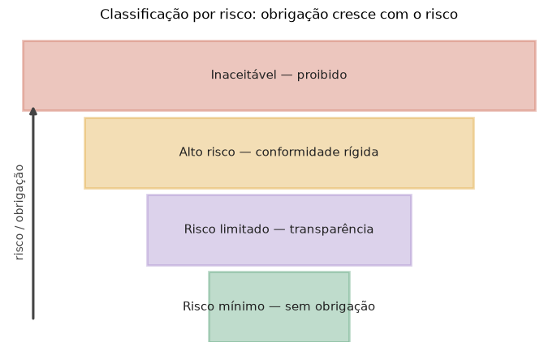

# Lição 093 — Legal, regulatório e IA responsável

> **Módulo:** M13 — Segurança e Governança em IA · **Ordem de estudo:** 93 · **Tempo:** ~55 min
> **Pré-requisitos:** [091] Vieses e fairness em IA · [092] Riscos e segurança
> **Classificação:** complemento de aprofundamento à ementa

> **Convenção de formatação:** matemática em LaTeX (`$...$` inline, `$$...$$` em
> destaque, render nativo na pré-visualização do VS Code); figuras reprodutíveis
> geradas por `tools/figuras/gerar_figuras_m13.py` e incorporadas por caminho
> relativo `assets/<NNN>-<slug>/<nome>.png`; blocos ```python só para código e
> saída.

## Seção_Teórica

### Motivação

Construir IA hoje é construir sob **regras**. O AI Act da União Europeia, a LGPD no
Brasil, leis setoriais de crédito e saúde — todas impõem obrigações que dependem do
**quão arriscado** é o sistema e de **quanta evidência** de cuidado você consegue
apresentar. Ignorar isso não é só risco ético: é risco de multa, embargo do produto e
responsabilização. Para o engenheiro, "IA responsável" deixa de ser um discurso e
vira um conjunto de **verificações concretas** que rodam antes do deploy.

A boa notícia é que muito disso é **decidível por regras**: dá para classificar o
risco de um sistema, pontuar sua conformidade contra um checklist e checar se a
documentação obrigatória está completa — tudo de forma determinística e auditável.
Esta lição implementa essas três verificações em Python puro, conectando o que você
mediu sobre fairness (Lição 091) e segurança (Lição 092) a um processo de governança
que produz um veredito claro: pode ou não pode ir para produção.

### Princípio de funcionamento

As três verificações são funções puras sobre a descrição de um sistema.

**Classificação por risco** segue a lógica em camadas do AI Act: avalia condições da
mais grave para a mais branda e retorna o **primeiro** nível que se aplica —
*inaceitável* (proibido), *alto* (domínio crítico como saúde ou contratação),
*limitado* (interage com pessoas, exige transparência) ou *mínimo*. É uma cadeia de
guardas:

$$\text{nível} = \begin{cases} \text{inaceitável} & \text{se proibido} \\ \text{alto} & \text{se domínio crítico} \\ \text{limitado} & \text{se interage com usuário} \\ \text{mínimo} & \text{caso contrário} \end{cases}$$

**Checklist de conformidade** reduz um conjunto de requisitos a uma fração e a compara
com um limiar:

$$\text{conformidade} = \frac{\#\{\text{requisitos atendidos}\}}{\#\{\text{requisitos}\}}, \qquad \text{conforme} \iff \text{conformidade} \ge 0.8.$$

**Governança via model card** verifica que a documentação obrigatória (uso pretendido,
dados, métricas, limitações, vieses conhecidos) está **completa**: qualquer campo
vazio bloqueia a publicação. A figura mostra como o nível de risco governa a
intensidade da obrigação.



*Figura 1 — Classificação por risco no estilo do AI Act: quanto mais alto o nível, mais rígida a obrigação regulatória. Gerada por `tools/figuras/gerar_figuras_m13.py`.*

---

### Conceito central 1 — Classificação por risco

A regulação trata sistemas de IA de forma proporcional ao risco. A classificação é
uma cadeia de condições avaliadas da mais grave para a mais branda; a primeira que se
aplica define o nível. Isso garante que, por exemplo, um sistema proibido nunca seja
rotulado apenas como "alto risco".

#### Exemplo_Resolvido 1.1

```python
def classificar(sistema):
    if sistema["proibido"]:
        return "inaceitavel"
    if sistema["dominio_critico"]:
        return "alto"
    if sistema["interage_com_usuario"]:
        return "limitado"
    return "minimo"

sistemas = [
    {"nome": "scoring social", "proibido": True, "dominio_critico": False, "interage_com_usuario": False},
    {"nome": "triagem de curriculos", "proibido": False, "dominio_critico": True, "interage_com_usuario": True},
    {"nome": "chatbot de FAQ", "proibido": False, "dominio_critico": False, "interage_com_usuario": True},
    {"nome": "filtro de spam", "proibido": False, "dominio_critico": False, "interage_com_usuario": False},
]
for s in sistemas:
    print(f"{s['nome']:>22}: {classificar(s)}")
```

**Explicação passo a passo:**
- **Bloco 1 (`classificar`):** uma cadeia de `if` da condição mais grave (proibido) à mais branda; retorna no primeiro acerto.
- **Bloco 2 (`sistemas`):** quatro sistemas com perfis de risco distintos.
- **Bloco 3 (laço):** o scoring social é `inaceitavel`, a triagem de currículos é `alto` (domínio crítico), o chatbot é `limitado` e o filtro de spam é `minimo` — exatamente a escada de risco.

**Saída esperada:**
```
        scoring social: inaceitavel
 triagem de curriculos: alto
        chatbot de FAQ: limitado
        filtro de spam: minimo
```

---

### Conceito central 2 — Checklist de conformidade

Para sistemas de alto risco, a regulação exige um conjunto de salvaguardas
(documentação, supervisão humana, logs, avaliação de risco, transparência). Pontuar a
**fração atendida** e compará-la a um limiar transforma a conformidade em um número
acionável — e mostra exatamente o que falta para liberar o deploy.

#### Exemplo_Resolvido 2.1

```python
requisitos = {
    "documentacao_tecnica": True,
    "supervisao_humana": True,
    "registro_de_logs": False,
    "avaliacao_de_risco": True,
    "transparencia_ao_usuario": False,
}
atendidos = sum(1 for v in requisitos.values() if v)
total = len(requisitos)
score = atendidos / total
print(f"requisitos atendidos: {atendidos}/{total}")
print(f"conformidade: {score:.0%}")
print(f"status: {'conforme' if score >= 0.8 else 'pendente'}")
```

**Explicação passo a passo:**
- **Bloco 1 (`requisitos`):** cinco salvaguardas, das quais três estão atendidas.
- **Bloco 2 (`score`):** a conformidade é a fração atendida, $3/5 = 0.60$.
- **Bloco 3 (`print`):** como $0.60 < 0.80$, o status é `pendente` — faltam logs e transparência ao usuário para liberar.

**Saída esperada:**
```
requisitos atendidos: 3/5
conformidade: 60%
status: pendente
```

---

### Conceito central 3 — Governança e model cards

Um **model card** documenta o que o modelo faz, com que dados foi treinado, como se
sai e onde falha. É o artefato de governança que torna o sistema **auditável**. Uma
regra simples de governança: campos obrigatórios vazios impedem a publicação, forçando
o time a explicitar limitações e vieses antes de expor o modelo.

#### Exemplo_Resolvido 3.1

```python
campos_obrigatorios = ["uso_pretendido", "dados_treino", "metricas", "limitacoes", "vieses_conhecidos"]
model_card = {
    "uso_pretendido": "classificacao de tickets",
    "dados_treino": "10k tickets rotulados",
    "metricas": "F1=0.88",
    "limitacoes": "",
    "vieses_conhecidos": "subrepresentacao de idioma",
}
faltando = [c for c in campos_obrigatorios if not model_card.get(c)]
preenchidos = len(campos_obrigatorios) - len(faltando)
print(f"campos preenchidos: {preenchidos}/{len(campos_obrigatorios)}")
print(f"faltando: {faltando}")
print(f"publicavel: {not faltando}")
```

**Explicação passo a passo:**
- **Bloco 1 (`campos_obrigatorios`/`model_card`):** os cinco campos exigidos e o card preenchido, com `limitacoes` em branco.
- **Bloco 2 (`faltando`):** lista os campos vazios ou ausentes — aqui, apenas `limitacoes`.
- **Bloco 3 (`print`):** 4 de 5 campos preenchidos; como há um campo faltando, `publicavel` é `False` — a documentação precisa ser completada antes do deploy.

**Saída esperada:**
```
campos preenchidos: 4/5
faltando: ['limitacoes']
publicavel: False
```

## Seção_Prática

> **Como reproduzir:** execute cada solução de referência com
> `python trilha/solucoes/093-legal-regulatorio-ia-responsavel/solucao_<n>.py` e
> compare a saída com o arquivo `.saida.txt` correspondente. Os enunciados/esqueletos
> ficam em `trilha/pratica/093-legal-regulatorio-ia-responsavel/exercicio_<n>.py`.

### Exercício 1 — Classificação por risco
- **Entrada inicial / setup:** a lista `sistemas` (identificacao biometrica em massa, diagnostico medico, assistente de escrita, recomendacao de musica) com as flags `proibido`, `dominio_critico` e `interage_com_usuario` (dados no esqueleto).
- **Passos de execução:** implemente `classificar(sistema)` (cadeia inaceitavel → alto → limitado → minimo) e imprima `"{nome:>34}: {nivel}"` por sistema.
- **Critério de conclusão (binário):** a saída é **exatamente** igual a `solucao_1.saida.txt` (`identificacao biometrica em massa: inaceitavel`, `recomendacao de musica: minimo`); qualquer divergência reprova.
- **Solução de referência:** `trilha/solucoes/093-legal-regulatorio-ia-responsavel/solucao_1.py`
- **Saída esperada:** `trilha/solucoes/093-legal-regulatorio-ia-responsavel/solucao_1.saida.txt`

### Exercício 2 — Checklist de conformidade
- **Entrada inicial / setup:** `requisitos` com cinco itens, quatro atendidos (`transparencia_ao_usuario=False`), no esqueleto.
- **Passos de execução:** conte os atendidos, calcule `score = atendidos / total` e o status (`conforme` se `score >= 0.8`); imprima `"requisitos atendidos: {a}/{t}"`, `"conformidade: {score:.0%}"` e `"status: {conforme|pendente}"`.
- **Critério de conclusão (binário):** a saída é **exatamente** igual a `solucao_2.saida.txt` (`conformidade: 80%`, `status: conforme`); qualquer divergência reprova.
- **Solução de referência:** `trilha/solucoes/093-legal-regulatorio-ia-responsavel/solucao_2.py`
- **Saída esperada:** `trilha/solucoes/093-legal-regulatorio-ia-responsavel/solucao_2.saida.txt`

### Exercício 3 — Completude de model card
- **Entrada inicial / setup:** `campos_obrigatorios` (5 campos) e `model_card` com `vieses_conhecidos` em branco (no esqueleto).
- **Passos de execução:** determine os campos `faltando` (vazios/ausentes) e os `preenchidos`; imprima `"campos preenchidos: {p}/{total}"`, `"faltando: {lista}"` e `"publicavel: {bool}"`.
- **Critério de conclusão (binário):** a saída é **exatamente** igual a `solucao_3.saida.txt` (`faltando: ['vieses_conhecidos']`, `publicavel: False`); qualquer divergência reprova.
- **Solução de referência:** `trilha/solucoes/093-legal-regulatorio-ia-responsavel/solucao_3.py`
- **Saída esperada:** `trilha/solucoes/093-legal-regulatorio-ia-responsavel/solucao_3.saida.txt`
