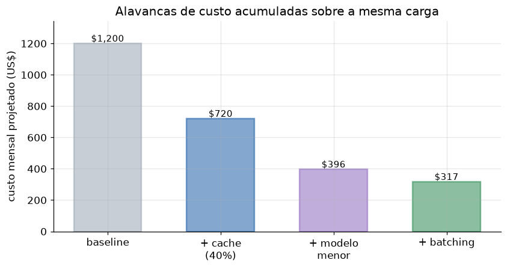

# Lição 094 — Gestão de custos e sustentabilidade de IA

> **Módulo:** M13 — Segurança e Governança em IA · **Ordem de estudo:** 94 · **Tempo:** ~50 min
> **Pré-requisitos:** [087] Otimização de custo de inferência (alto volume e concorrência)
> **Classificação:** complemento de aprofundamento à ementa

> **Convenção de formatação:** matemática em LaTeX (`$...$` inline, `$$...$$` em
> destaque, render nativo na pré-visualização do VS Code); figuras reprodutíveis
> geradas por `tools/figuras/gerar_figuras_m13.py` e incorporadas por caminho
> relativo `assets/<NNN>-<slug>/<nome>.png`; blocos ```python só para código e
> saída.

## Seção_Teórica

### Motivação

Custo e impacto ambiental são duas faces da mesma conta. Cada token gerado consome
**computação**, e computação custa **dinheiro** e queima **energia**. A Lição 087
mostrou como modelar o custo por requisição e as alavancas de caching e batching;
aqui subimos um nível para a visão de **governança** (FinOps + sustentabilidade): o
custo mensal agregado da operação, a pegada de carbono associada e o efeito
**combinado** das otimizações no orçamento.

Isso importa porque, em escala, a escolha do modelo é uma decisão de orçamento e de
sustentabilidade tanto quanto de qualidade. Um modelo grande pode custar 5x mais e
emitir 5x mais CO₂ que um menor que resolve a mesma tarefa. Saber transformar volume
de tokens em dólares e em quilos de CO₂ — e mostrar quanto cada alavanca economiza —
é o que permite defender uma arquitetura com números, não com intuição.

### Princípio de funcionamento

Tudo parte do **volume de tokens** mensal $T$. A **projeção de custo** de um modelo
com preço $p$ por mil tokens é linear:

$$C_{\text{mês}} = \frac{T}{1000}\,p,$$

o que torna a comparação entre níveis de modelo imediata: a economia relativa de
trocar um modelo caro $p_{\text{alto}}$ por um barato $p_{\text{baixo}}$ é
$(p_{\text{alto}} - p_{\text{baixo}})/p_{\text{alto}}$, independente do volume.

A **pegada energética** usa um consumo $e$ (Wh por mil tokens) e a **intensidade de
carbono** da rede $I$ (g CO₂ por kWh):

$$E_{\text{kWh}} = \frac{T/1000 \cdot e}{1000}, \qquad \text{CO}_2^{\text{kg}} = \frac{E_{\text{kWh}}\,I}{1000}.$$

Por fim, as **alavancas de otimização** (cache, modelo menor, batching) agem de forma
**multiplicativa** sobre o custo: aplicar fatores $f_1, f_2, \dots$ em sequência dá
custo final $C_0\prod_i f_i$, e a redução total é $1 - \prod_i f_i$. Como os fatores
se multiplicam, a economia composta é maior que a de qualquer alavanca isolada — mas
com retornos decrescentes. A figura mostra esse empilhamento.



*Figura 1 — Cada alavanca multiplica o custo mensal por um fator; o efeito combinado (cache → modelo menor → batching) reduz o custo bem além de qualquer alavanca isolada. Gerada por `tools/figuras/gerar_figuras_m13.py`.*

---

### Conceito central 1 — Projeção de custo mensal

O custo mensal é linear no volume de tokens, então comparar modelos é direto: aplique
o mesmo volume aos preços de cada nível. A economia relativa de trocar um modelo caro
por um mais barato não depende do volume — é determinada apenas pelos preços, o que
torna a decisão robusta a flutuações de tráfego.

#### Exemplo_Resolvido 1.1

```python
# Custo por 1k tokens de dois modelos e volume mensal de tokens.
modelos = {"grande": 0.030, "pequeno": 0.004}   # $ por 1k tokens
tokens_mes = 200_000_000                          # 200M tokens/mes
for nome, preco_1k in modelos.items():
    custo = tokens_mes / 1000 * preco_1k
    print(f"{nome:>8}: ${custo:,.2f}/mes")
economia = (modelos["grande"] - modelos["pequeno"]) / modelos["grande"]
print(f"economia ao trocar para o pequeno: {economia:.0%}")
```

**Explicação passo a passo:**
- **Bloco 1 (`modelos`/`tokens_mes`):** preços por mil tokens de dois níveis e um volume de 200M tokens/mês.
- **Bloco 2 (laço):** o custo mensal é linear no volume — $6,000.00 para o grande e $800.00 para o pequeno.
- **Bloco 3 (`economia`):** trocar o grande pelo pequeno economiza 87%, valor que depende só dos preços, não do volume.

**Saída esperada:**
```
  grande: $6,000.00/mes
 pequeno: $800.00/mes
economia ao trocar para o pequeno: 87%
```

---

### Conceito central 2 — Pegada energética e de CO₂

O mesmo volume de tokens que gera custo também gera consumo de energia e emissão de
carbono. Convertendo tokens em Wh, depois em kWh, e multiplicando pela intensidade de
carbono da rede, chega-se à pegada de CO₂ da operação — um número cada vez mais exigido
em relatórios de sustentabilidade.

#### Exemplo_Resolvido 2.1

```python
# Energia por 1k tokens (Wh) e intensidade de carbono da rede (g CO2/kWh).
energia_wh_por_1k = 0.4          # Wh por 1k tokens
tokens_mes = 200_000_000
intensidade = 400.0              # g CO2 por kWh
energia_kwh = (tokens_mes / 1000 * energia_wh_por_1k) / 1000
co2_kg = energia_kwh * intensidade / 1000
print(f"energia: {energia_kwh:.1f} kWh/mes")
print(f"emissao: {co2_kg:.1f} kg CO2/mes")
```

**Explicação passo a passo:**
- **Bloco 1 (parâmetros):** consumo de 0.4 Wh por mil tokens, 200M tokens/mês e rede a 400 g CO₂/kWh.
- **Bloco 2 (`energia_kwh`):** 200M tokens × 0.4 Wh/1k = 80.000 Wh = 80.0 kWh/mês.
- **Bloco 3 (`co2_kg`/`print`):** 80 kWh × 400 g/kWh = 32.000 g = 32.0 kg de CO₂/mês — a pegada da carga.

**Saída esperada:**
```
energia: 80.0 kWh/mes
emissao: 32.0 kg CO2/mes
```

---

### Conceito central 3 — Alavancas de otimização acumuladas

As alavancas de redução de custo agem multiplicativamente: aplicar uma após a outra
compõe os fatores. Acompanhar o custo a cada passo mostra a economia incremental e
deixa claro o efeito combinado — maior que o de qualquer alavanca isolada, mas com
retornos decrescentes conforme o custo se aproxima do piso.

#### Exemplo_Resolvido 3.1

```python
base = 6000.0
alavancas = [("cache 40%", 0.60), ("modelo menor", 0.55), ("batching", 0.80)]
custo = base
print(f"baseline: ${custo:,.2f}")
for nome, fator in alavancas:
    custo *= fator
    print(f"+ {nome:>13}: ${custo:,.2f}")
print(f"reducao total: {(1 - custo / base):.0%}")
```

**Explicação passo a passo:**
- **Bloco 1 (`base`/`alavancas`):** custo mensal inicial de $6,000.00 e três alavancas, cada uma com seu fator multiplicativo.
- **Bloco 2 (laço):** o custo é multiplicado por cada fator em sequência — $3,600.00, depois $1,980.00, depois $1,584.00.
- **Bloco 3 (`reducao total`):** o efeito combinado reduz o custo em 74%, mais do que qualquer alavanca sozinha graças à composição multiplicativa.

**Saída esperada:**
```
baseline: $6,000.00
+     cache 40%: $3,600.00
+  modelo menor: $1,980.00
+      batching: $1,584.00
reducao total: 74%
```

## Seção_Prática

> **Como reproduzir:** execute cada solução de referência com
> `python trilha/solucoes/094-custos-sustentabilidade/solucao_<n>.py` e compare a
> saída com o arquivo `.saida.txt` correspondente. Os enunciados/esqueletos ficam em
> `trilha/pratica/094-custos-sustentabilidade/exercicio_<n>.py`.

### Exercício 1 — Comparação de custo entre níveis de modelo
- **Entrada inicial / setup:** `modelos = {"grande": 0.030, "pequeno": 0.006}` ($/1k tokens) e `tokens_mes = 150_000_000` (dados no esqueleto).
- **Passos de execução:** para cada modelo calcule `tokens_mes / 1000 * preco_1k` e imprima `"{nome:>8}: ${custo:,.2f}/mes"`; calcule a economia relativa e imprima `"economia ao trocar para o pequeno: {economia:.0%}"`.
- **Critério de conclusão (binário):** a saída é **exatamente** igual a `solucao_1.saida.txt` (`grande: $4,500.00/mes`, `economia ao trocar para o pequeno: 80%`); qualquer divergência reprova.
- **Solução de referência:** `trilha/solucoes/094-custos-sustentabilidade/solucao_1.py`
- **Saída esperada:** `trilha/solucoes/094-custos-sustentabilidade/solucao_1.saida.txt`

### Exercício 2 — Pegada energética e de carbono
- **Entrada inicial / setup:** `energia_wh_por_1k = 0.5`, `tokens_mes = 300_000_000`, `intensidade = 300.0` (g CO₂/kWh) (dados no esqueleto).
- **Passos de execução:** calcule `energia_kwh = (tokens_mes / 1000 * energia_wh_por_1k) / 1000` e `co2_kg = energia_kwh * intensidade / 1000`; imprima `"energia: {energia_kwh:.1f} kWh/mes"` e `"emissao: {co2_kg:.1f} kg CO2/mes"`.
- **Critério de conclusão (binário):** a saída é **exatamente** igual a `solucao_2.saida.txt` (`energia: 150.0 kWh/mes`, `emissao: 45.0 kg CO2/mes`); qualquer divergência reprova.
- **Solução de referência:** `trilha/solucoes/094-custos-sustentabilidade/solucao_2.py`
- **Saída esperada:** `trilha/solucoes/094-custos-sustentabilidade/solucao_2.saida.txt`

### Exercício 3 — Alavancas de otimização acumuladas
- **Entrada inicial / setup:** `base = 4500.0` e `alavancas = [("cache 30%", 0.70), ("modelo menor", 0.50), ("batching", 0.90)]` (dados no esqueleto).
- **Passos de execução:** começando em `custo = base`, imprima `"baseline: ${custo:,.2f}"`, aplique cada fator e imprima `"+ {nome:>13}: ${custo:,.2f}"`, e ao final `"reducao total: {(1 - custo / base):.0%}"`.
- **Critério de conclusão (binário):** a saída é **exatamente** igual a `solucao_3.saida.txt` (`baseline: $4,500.00`, `reducao total: 68%`); qualquer divergência reprova.
- **Solução de referência:** `trilha/solucoes/094-custos-sustentabilidade/solucao_3.py`
- **Saída esperada:** `trilha/solucoes/094-custos-sustentabilidade/solucao_3.saida.txt`
