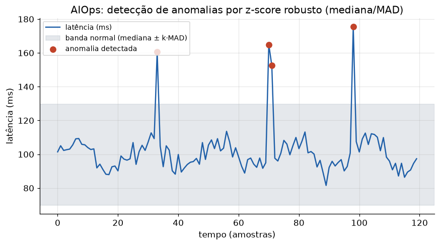

# Lição 095 — IA para DevOps I: copiloto de IaC, agentes para Kubernetes, troubleshooting, AIOps e ChatOps

> **Módulo:** M14 — Ferramentas de IA Aplicadas · **Ordem de estudo:** 95 · **Tempo:** ~55 min
> **Pré-requisitos:** [069] Orquestração com LangGraph
> **Classificação:** coberto pela ementa

> **Convenção de formatação:** matemática em LaTeX (`$...$` inline, `$$...$$` em
> destaque, render nativo na pré-visualização do VS Code); figuras reprodutíveis
> geradas por `tools/figuras/gerar_figuras_m14.py` e incorporadas por caminho
> relativo `assets/<NNN>-<slug>/<nome>.png`; blocos ```python só para código e
> saída.

## Seção_Teórica

### Motivação

DevOps é, antes de tudo, um problema de **escala cognitiva**: um time pequeno
precisa operar dezenas de serviços, manifestos de infraestrutura, pipelines e
painéis de telemetria. O gargalo raramente é executar um comando — é **decidir**
qual comando, com base em sinais ruidosos e documentação dispersa. É exatamente
aqui que a IA aplicada agrega valor, e em cinco frentes complementares que esta
lição cobre: o **copiloto de Infraestrutura como Código (IaC)**, que traduz
intenção em configuração e a confronta com políticas; os **agentes para
Kubernetes**, que raciocinam sobre o estado de um cluster e propõem ações; o
**troubleshooting** assistido, que estrutura o diagnóstico como um laço de
raciocínio e ação; o **AIOps**, que aplica estatística e aprendizado para
detectar anomalias em métricas antes que virem incidentes; e o **ChatOps**, que
expõe tudo isso por uma interface conversacional auditável.

O "porquê" teórico é o que separa um brinquedo de uma ferramenta confiável. Gerar
um YAML plausível é fácil; **garantir** que ele respeita invariantes (alta
disponibilidade, portas válidas, limites de recurso) exige um validador
determinístico. Apontar um pico em um gráfico é fácil; **definir** o que é
anômalo de forma robusta a ruído e a outliers exige uma estatística bem escolhida.
Esta lição trata a IA como **gerador de hipóteses** e a verificação determinística
como **guarda de qualidade** — o padrão recorrente de toda IA aplicada a operações.

### Princípio de funcionamento

As cinco frentes compartilham um mesmo esqueleto: um **modelo** propõe, um
**verificador** filtra e um **executor** (ou humano) decide. No copiloto de IaC, a
proposta é um manifesto $m$ e o verificador é um conjunto de predicados de
política $P = \{p_1, \dots, p_k\}$; o manifesto só é aceito quando
$\bigwedge_i p_i(m)$ é verdadeiro. Um **agente para Kubernetes** é o padrão de
agente das lições anteriores aplicado a um espaço de ações de cluster (escalar,
reiniciar, drenar nó), com o estado observado via API e cada ação sujeita a
verificação antes de ser aplicada.

No **troubleshooting**, organizamos o diagnóstico como o padrão **ReAct**
(*Reason + Act*): a cada passo o agente observa o estado $s$, raciocina e escolhe
uma ação $a$ que o leva a um novo estado $s'$, repetindo até alcançar um estado
resolvido. No **AIOps**, a detecção de anomalias parte de um **baseline** estimado
dos próprios dados. Em vez da média e do desvio-padrão (sensíveis a outliers),
usamos a **mediana** e o **MAD** (*median absolute deviation*), e sinalizamos
como anomalia todo ponto cujo escore robusto

$$z_i = \frac{\lvert x_i - \tilde{x}\rvert}{1.4826 \cdot \operatorname{MAD}}$$

excede um limiar $k$ (tipicamente $k = 3.5$), onde $\tilde{x}$ é a mediana e o
fator $1.4826$ torna o MAD um estimador consistente do desvio-padrão sob
normalidade. Por fim, o **ChatOps** é a camada de interação: comandos e alertas
fluem por um canal de chat, o que dá **auditoria** (tudo fica registrado) e
**controle** (humanos no laço) — propriedades que tornam as outras quatro frentes
seguras de operar.



*Figura 1 — AIOps na prática: a banda cinza é o intervalo normal estimado pelos próprios dados (mediana ± $k\cdot$MAD) e os pontos vermelhos são as anomalias detectadas pelo escore robusto. Gerada por `tools/figuras/gerar_figuras_m14.py`.*

---

### Conceito central 1 — Copiloto de IaC

Um copiloto de IaC transforma uma **intenção** de alto nível ("um serviço web com
3 réplicas na porta 8080") em um **manifesto** estruturado e, crucialmente, o
**valida** contra políticas antes de qualquer aplicação. A geração é a parte
"criativa"; a validação determinística é a parte que dá confiança.

#### Exemplo_Resolvido 1.1

```python
# Copiloto de IaC: gera um manifesto a partir da intencao e valida por politicas.
def gerar_manifesto(intencao):
    return {
        "kind": "Deployment",
        "name": intencao["servico"],
        "replicas": intencao.get("replicas", 1),
        "port": intencao.get("porta", 80),
        "limits": {"cpu": intencao.get("cpu", "500m"), "mem": intencao.get("mem", "256Mi")},
    }

def validar(manifesto):
    erros = []
    if manifesto["replicas"] < 2:
        erros.append("replicas<2 (sem alta disponibilidade)")
    if not (1024 <= manifesto["port"] <= 65535):
        erros.append("porta fora da faixa [1024, 65535]")
    if not manifesto["limits"]["cpu"]:
        erros.append("limite de cpu ausente")
    return erros

intencao = {"servico": "api-web", "replicas": 3, "porta": 8080}
manifesto = gerar_manifesto(intencao)
erros = validar(manifesto)
print("manifesto:", manifesto["kind"], manifesto["name"], f"x{manifesto['replicas']}")
print("porta:", manifesto["port"])
print("erros:", erros if erros else "nenhum")
```

**Explicação passo a passo:**
- **Bloco 1 (`gerar_manifesto`):** materializa a intenção num dicionário com padrões seguros (limites de CPU/memória sempre presentes) — é a etapa de "geração" do copiloto.
- **Bloco 2 (`validar`):** aplica os predicados de política $p_i$ (alta disponibilidade, faixa de portas, presença de limites); devolve a lista de violações.
- **Bloco 3 (uso):** uma intenção bem formada (3 réplicas, porta 8080) passa por todas as políticas, então a lista de erros é vazia e imprimimos `nenhum`.

**Saída esperada:**
```
manifesto: Deployment api-web x3
porta: 8080
erros: nenhum
```

---

### Conceito central 2 — AIOps: detecção de anomalias

AIOps aplica estatística e aprendizado às métricas de operação. O coração de uma
detecção simples e confiável é um **baseline robusto**: usar mediana e MAD em vez
de média e desvio-padrão evita que um único pico contamine o próprio limiar que
deveria detectá-lo.

#### Exemplo_Resolvido 2.1

```python
# AIOps: deteccao de anomalias por z-score robusto (mediana e MAD).
def mediana(xs):
    s = sorted(xs)
    n = len(s)
    m = n // 2
    return s[m] if n % 2 else (s[m - 1] + s[m]) / 2.0

def detectar(serie, k=3.5):
    med = mediana(serie)
    mad = mediana([abs(x - med) for x in serie]) * 1.4826
    anomalias = []
    for i, x in enumerate(serie):
        if mad > 0 and abs(x - med) / mad > k:
            anomalias.append(i)
    return anomalias

serie = [100, 102, 99, 101, 100, 175, 98, 103, 101, 99]
print("mediana:", mediana(serie))
print("anomalias (indices):", detectar(serie))
```

**Explicação passo a passo:**
- **Bloco 1 (`mediana`):** mediana em Python puro — o valor central da amostra ordenada (média dos dois centrais quando $n$ é par).
- **Bloco 2 (`detectar`):** estima o baseline (mediana) e a dispersão robusta (MAD escalado por $1.4826$) e sinaliza todo índice cujo escore $z_i$ excede $k$.
- **Bloco 3 (uso):** a série é estável perto de 100, com um pico isolado de 175 no índice 5; o detector retorna exatamente esse índice, sem falsos positivos.

**Saída esperada:**
```
mediana: 100.5
anomalias (indices): [5]
```

---

### Conceito central 3 — Troubleshooting estilo ReAct

Diagnosticar um incidente é uma busca: a partir de um sintoma, escolher uma ação
que revele mais informação ou corrija a causa, observar o efeito e repetir. O
padrão **ReAct** dá estrutura a esse laço — observar, raciocinar, agir — até
alcançar um estado resolvido, com terminação garantida por um teto de passos.

#### Exemplo_Resolvido 3.1

```python
# Troubleshooting estilo ReAct: observar -> pensar -> agir, ate resolver.
base = {
    "5xx_alto": ("reiniciar_pods", "erros_5xx"),
    "erros_5xx": ("escalar_replicas", "latencia_alta"),
    "latencia_alta": ("aumentar_cpu", "ok"),
}

def diagnosticar(sintoma_inicial, max_passos=5):
    estado = sintoma_inicial
    trilha = []
    for _ in range(max_passos):
        if estado == "ok":
            break
        acao, proximo = base[estado]
        trilha.append(f"{estado} -> {acao}")
        estado = proximo
    return trilha, estado

trilha, final = diagnosticar("5xx_alto")
for passo in trilha:
    print(passo)
print("estado final:", final)
```

**Explicação passo a passo:**
- **Bloco 1 (`base`):** a base de conhecimento mapeia cada estado observado a um par `(ação, próximo estado)` — é o "playbook" que o agente consulta.
- **Bloco 2 (`diagnosticar`):** implementa o laço ReAct com terminação garantida por `max_passos`; cada iteração registra a transição `estado -> ação`.
- **Bloco 3 (uso):** partindo de `5xx_alto`, o agente encadeia reiniciar → escalar → aumentar CPU até o estado `ok`, deixando uma trilha auditável (útil em ChatOps).

**Saída esperada:**
```
5xx_alto -> reiniciar_pods
erros_5xx -> escalar_replicas
latencia_alta -> aumentar_cpu
estado final: ok
```

## Seção_Prática

> **Como reproduzir:** execute cada solução de referência com
> `python trilha/solucoes/095-ia-devops-i/solucao_<n>.py` e compare a saída com o
> arquivo `.saida.txt` correspondente. Os enunciados/esqueletos ficam em
> `trilha/pratica/095-ia-devops-i/exercicio_<n>.py`.

### Exercício 1 — Copiloto de IaC: gerar e validar
- **Entrada inicial / setup:** `intencao = {"servico": "cache", "replicas": 1, "porta": 80}`.
- **Passos de execução:** implemente `gerar_manifesto` e `validar` (acrescenta `"replicas<2"` se réplicas < 2 e `"porta fora da faixa"` se a porta não estiver em [1024, 65535]); imprima `servico:` e `erros:`.
- **Critério de conclusão (binário):** a saída é **exatamente** igual a `solucao_1.saida.txt` (`erros: ['replicas<2', 'porta fora da faixa']`); qualquer divergência reprova.
- **Solução de referência:** `trilha/solucoes/095-ia-devops-i/solucao_1.py`
- **Saída esperada:** `trilha/solucoes/095-ia-devops-i/solucao_1.saida.txt`

### Exercício 2 — AIOps: detector de anomalias robusto
- **Entrada inicial / setup:** `serie = [50, 52, 51, 49, 50, 51, 120, 50, 49, 51]`, limiar `k = 3.5`.
- **Passos de execução:** implemente `mediana` e `detectar` (escore robusto com mediana e MAD escalado por 1.4826); imprima `mediana:` e `anomalias:` (lista de índices).
- **Critério de conclusão (binário):** a saída é **exatamente** igual a `solucao_2.saida.txt` (`anomalias: [6]`); qualquer divergência reprova.
- **Solução de referência:** `trilha/solucoes/095-ia-devops-i/solucao_2.py`
- **Saída esperada:** `trilha/solucoes/095-ia-devops-i/solucao_2.saida.txt`

### Exercício 3 — Troubleshooting estilo ReAct
- **Entrada inicial / setup:** `base = {"fila_cheia": ("escalar_workers", "cpu_alta"), "cpu_alta": ("otimizar_query", "ok")}`, sintoma inicial `"fila_cheia"`.
- **Passos de execução:** implemente `diagnosticar` (laço observar→raciocinar→agir com teto de passos); imprima cada `estado -> ação` e o `estado final:`.
- **Critério de conclusão (binário):** a saída é **exatamente** igual a `solucao_3.saida.txt` (`estado final: ok`); qualquer divergência reprova.
- **Solução de referência:** `trilha/solucoes/095-ia-devops-i/solucao_3.py`
- **Saída esperada:** `trilha/solucoes/095-ia-devops-i/solucao_3.saida.txt`
