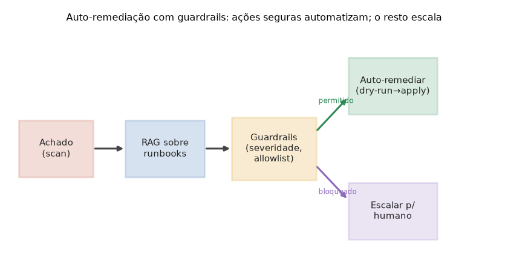

# Lição 096 — IA para DevOps II: segurança/compliance, CI/CD, FinOps, RAG sobre runbooks e auto-remediação

> **Módulo:** M14 — Ferramentas de IA Aplicadas · **Ordem de estudo:** 96 · **Tempo:** ~55 min
> **Pré-requisitos:** [057] Pipeline RAG básico · [095] IA para DevOps I
> **Classificação:** coberto pela ementa

> **Convenção de formatação:** matemática em LaTeX (`$...$` inline, `$$...$$` em
> destaque, render nativo na pré-visualização do VS Code); figuras reprodutíveis
> geradas por `tools/figuras/gerar_figuras_m14.py` e incorporadas por caminho
> relativo `assets/<NNN>-<slug>/<nome>.png`; blocos ```python só para código e
> saída.

## Seção_Teórica

### Motivação

A Lição 095 mostrou a IA propondo configuração e diagnosticando incidentes. Esta
lição fecha o ciclo de DevOps com as frentes que governam **risco** e **custo** em
produção: **segurança e compliance** (varrer configurações em busca de
más-configurações antes que virem brechas), **CI/CD copilot** (gerar e revisar
passos de pipeline), **FinOps** (prever e controlar gasto de nuvem), **RAG sobre
runbooks** (recuperar o procedimento certo na hora do incidente) e
**auto-remediação com guardrails** (automatizar a correção sem abrir mão do
controle humano).

O fio condutor teórico é a tensão entre **autonomia** e **segurança**. Quanto mais
um sistema age sozinho, mais rápido ele resolve — e mais caro fica um erro. A
resposta de engenharia não é "confiar mais no modelo", e sim **restringir o espaço
de ações**: severidade, allowlist de ações reversíveis, *dry-run* obrigatório e
escalonamento para humano. É a mesma ideia da validação de IaC da lição anterior,
agora aplicada a ações que **mudam o mundo**. Sem essa disciplina, auto-remediação
é um amplificador de incidentes; com ela, é uma alavanca de confiabilidade.

### Princípio de funcionamento

**Compliance** é avaliação de predicados sobre uma configuração: cada regra
$r_j(c)$ inspeciona a config $c$ e, se violada, produz um **achado** com uma
**severidade** $\sigma \in \{\text{LOW}, \text{MEDIUM}, \text{HIGH}\}$. A
severidade é o que prioriza a fila de correção e, mais adiante, decide o que pode
ser automatizado.

**FinOps** projeta custo futuro a partir do histórico. Com observações
$(x_i, y_i)$ — mês e gasto — ajustamos uma reta por **mínimos quadrados**, cuja
inclinação e intercepto têm forma fechada:

$$a = \frac{\sum_i (x_i - \bar{x})(y_i - \bar{y})}{\sum_i (x_i - \bar{x})^2}, \qquad b = \bar{y} - a\,\bar{x}.$$

A previsão do próximo período é $\hat{y} = a\,x_{\text{novo}} + b$. É um modelo
simples, mas explicável e suficiente para alertas de orçamento — o "porquê" importa
mais que sofisticação aqui.

**RAG sobre runbooks** trata a documentação operacional como uma base recuperável:
dado um sintoma, recuperamos o procedimento correspondente (no caso didático, por
chave; na prática, por similaridade de embeddings, como na Lição 057). Esse
procedimento alimenta a **auto-remediação**, que é uma função de decisão sujeita a
**guardrails**: a ação só é aplicada automaticamente se a severidade é baixa **e** a
ação pertence à allowlist de operações seguras (reversíveis); caso contrário, ela
**escala** para aprovação humana. Um **CI/CD copilot** segue o mesmo princípio:
sugere passos de pipeline que só são promovidos após passar por verificações
automáticas e revisão.



*Figura 1 — Auto-remediação com guardrails: o achado recupera o runbook (RAG); os guardrails (severidade e allowlist) decidem se a ação é aplicada em dry-run ou escalada a um humano. Gerada por `tools/figuras/gerar_figuras_m14.py`.*

---

### Conceito central 1 — Segurança e compliance (scan)

Um scan de compliance é um conjunto de regras determinísticas que inspecionam uma
configuração e emitem achados rotulados por severidade. A severidade não é
decorativa: ela ordena a fila de correção e governa o que pode ser automatizado
mais adiante.

#### Exemplo_Resolvido 1.1

```python
# Scan de compliance: regras detectam mas-configuracoes e atribuem severidade.
def scan(config):
    achados = []
    if config.get("public", False):
        achados.append(("HIGH", "recurso exposto publicamente"))
    if not config.get("encryption", False):
        achados.append(("MEDIUM", "armazenamento sem criptografia"))
    if config.get("user") == "root":
        achados.append(("HIGH", "execucao como root"))
    return achados

config = {"public": True, "encryption": False, "user": "root"}
achados = scan(config)
for sev, msg in achados:
    print(f"[{sev}] {msg}")
print("total:", len(achados))
```

**Explicação passo a passo:**
- **Bloco 1 (`scan`):** cada `if` é uma regra de compliance $r_j$ que, quando violada, anexa um achado `(severidade, mensagem)`.
- **Bloco 2 (config):** uma configuração propositalmente insegura — pública, sem criptografia e rodando como root.
- **Bloco 3 (impressão):** as três regras disparam; a saída lista os achados em ordem de avaliação e o total, pronto para priorização.

**Saída esperada:**
```
[HIGH] recurso exposto publicamente
[MEDIUM] armazenamento sem criptografia
[HIGH] execucao como root
total: 3
```

---

### Conceito central 2 — FinOps: previsão de custo

FinOps traz disciplina financeira para a nuvem. Uma previsão explicável de gasto a
partir do histórico permite alertas de orçamento antes do fim do mês. O ajuste
linear por mínimos quadrados dá inclinação (tendência) e intercepto em forma
fechada.

#### Exemplo_Resolvido 2.1

```python
# FinOps: previsao de custo por ajuste linear (minimos quadrados) sobre o historico.
def ajuste_linear(xs, ys):
    n = len(xs)
    mx = sum(xs) / n
    my = sum(ys) / n
    sxx = sum((x - mx) ** 2 for x in xs)
    sxy = sum((x - mx) * (y - my) for x, y in zip(xs, ys))
    a = sxy / sxx          # inclinacao
    b = my - a * mx        # intercepto
    return a, b

meses = [1, 2, 3, 4, 5, 6]
custo = [100, 120, 145, 160, 185, 205]
a, b = ajuste_linear(meses, custo)
previsao = a * 7 + b
print(f"inclinacao: {a:.2f} USD/mes")
print(f"previsao mes 7: {previsao:.2f} USD")
```

**Explicação passo a passo:**
- **Bloco 1 (`ajuste_linear`):** calcula médias, $S_{xx}$ e $S_{xy}$ e aplica as fórmulas fechadas de $a$ e $b$.
- **Bloco 2 (dados):** seis meses de custo crescente; o ajuste recupera a tendência de ~21 USD/mês.
- **Bloco 3 (previsão):** projeta o mês 7 em 226 USD — o número que dispararia (ou não) um alerta de orçamento.

**Saída esperada:**
```
inclinacao: 21.00 USD/mes
previsao mes 7: 226.00 USD
```

---

### Conceito central 3 — RAG sobre runbooks e auto-remediação com guardrails

Na hora do incidente, recuperar o procedimento certo (RAG sobre runbooks) e agir
com segurança é o que distingue automação útil de automação perigosa. Os
**guardrails** — severidade e allowlist de ações reversíveis — decidem o que roda
sozinho e o que escala para um humano.

#### Exemplo_Resolvido 3.1

```python
# RAG sobre runbooks + auto-remediacao com guardrails.
runbooks = {
    "disco_cheio": "limpar_logs_antigos",
    "memoria_alta": "reiniciar_servico",
    "cert_expirado": "rotacionar_certificado",
}
ACOES_SEGURAS = {"limpar_logs_antigos", "reiniciar_servico"}

def recuperar(sintoma):
    return runbooks.get(sintoma)

def remediar(sintoma, severidade):
    acao = recuperar(sintoma)
    if acao is None:
        return "sem_runbook -> escalar"
    if severidade == "HIGH" or acao not in ACOES_SEGURAS:
        return f"{acao} -> requer_aprovacao (escalar)"
    return f"{acao} -> aplicado (dry-run ok)"

print(remediar("disco_cheio", "LOW"))
print(remediar("cert_expirado", "HIGH"))
print(remediar("desconhecido", "LOW"))
```

**Explicação passo a passo:**
- **Bloco 1 (`runbooks`/`ACOES_SEGURAS`):** a base recuperável de procedimentos e a allowlist de ações reversíveis (o guardrail de segurança).
- **Bloco 2 (`recuperar`/`remediar`):** recupera o procedimento e aplica os portões — sem runbook escala; severidade alta ou ação fora da allowlist exige aprovação; o resto roda em dry-run.
- **Bloco 3 (casos):** uma limpeza de logs de baixa severidade é automatizada; a rotação de certificado (alta severidade) escala; um sintoma sem runbook também escala — exatamente o comportamento seguro desejado.

**Saída esperada:**
```
limpar_logs_antigos -> aplicado (dry-run ok)
rotacionar_certificado -> requer_aprovacao (escalar)
sem_runbook -> escalar
```

## Seção_Prática

> **Como reproduzir:** execute cada solução de referência com
> `python trilha/solucoes/096-ia-devops-ii/solucao_<n>.py` e compare a saída com o
> arquivo `.saida.txt` correspondente. Os enunciados/esqueletos ficam em
> `trilha/pratica/096-ia-devops-ii/exercicio_<n>.py`.

### Exercício 1 — Scan de compliance
- **Entrada inicial / setup:** `config = {"public": False, "encryption": False, "user": "admin"}`.
- **Passos de execução:** implemente `scan` (HIGH se `public`; MEDIUM se sem `encryption`; HIGH se `user == "root"`); imprima cada achado como `[SEV] mensagem` e o `total:`.
- **Critério de conclusão (binário):** a saída é **exatamente** igual a `solucao_1.saida.txt` (`total: 1`); qualquer divergência reprova.
- **Solução de referência:** `trilha/solucoes/096-ia-devops-ii/solucao_1.py`
- **Saída esperada:** `trilha/solucoes/096-ia-devops-ii/solucao_1.saida.txt`

### Exercício 2 — FinOps: previsão de custo
- **Entrada inicial / setup:** `meses = [1, 2, 3, 4, 5]`, `custo = [200, 230, 260, 290, 320]`.
- **Passos de execução:** implemente `ajuste_linear` (mínimos quadrados) e preveja o mês 6; imprima `inclinacao: {a:.2f} USD/mes` e `previsao mes 6: {valor:.2f} USD`.
- **Critério de conclusão (binário):** a saída é **exatamente** igual a `solucao_2.saida.txt` (`previsao mes 6: 350.00 USD`); qualquer divergência reprova.
- **Solução de referência:** `trilha/solucoes/096-ia-devops-ii/solucao_2.py`
- **Saída esperada:** `trilha/solucoes/096-ia-devops-ii/solucao_2.saida.txt`

### Exercício 3 — RAG sobre runbooks + auto-remediação
- **Entrada inicial / setup:** `runbooks` e `ACOES_SEGURAS` conforme o enunciado (`disco_cheio`, `memoria_alta`, `cert_expirado`).
- **Passos de execução:** implemente `recuperar` e `remediar` (guardrails de severidade e allowlist); imprima o resultado de `remediar("memoria_alta", "LOW")`, `remediar("disco_cheio", "HIGH")` e `remediar("api_lenta", "LOW")`.
- **Critério de conclusão (binário):** a saída é **exatamente** igual a `solucao_3.saida.txt` (`sem_runbook -> escalar` na última linha); qualquer divergência reprova.
- **Solução de referência:** `trilha/solucoes/096-ia-devops-ii/solucao_3.py`
- **Saída esperada:** `trilha/solucoes/096-ia-devops-ii/solucao_3.saida.txt`
