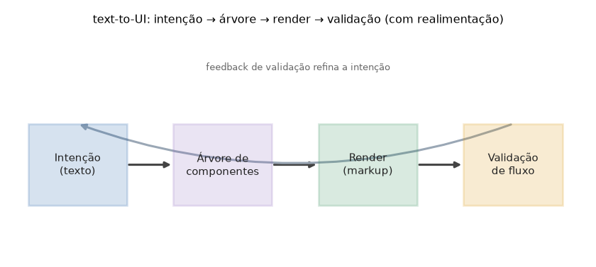

# Lição 097 — IA para UX & UI: geração de UI (text-to-UI), prototipação assistida e validação de fluxos

> **Módulo:** M14 — Ferramentas de IA Aplicadas · **Ordem de estudo:** 97 · **Tempo:** ~50 min
> **Pré-requisitos:** [050] GenAI multimodais
> **Classificação:** coberto pela ementa

> **Convenção de formatação:** matemática em LaTeX (`$...$` inline, `$$...$$` em
> destaque, render nativo na pré-visualização do VS Code); figuras reprodutíveis
> geradas por `tools/figuras/gerar_figuras_m14.py` e incorporadas por caminho
> relativo `assets/<NNN>-<slug>/<nome>.png`; blocos ```python só para código e
> saída.

## Seção_Teórica

### Motivação

Projetar interfaces é caro porque cada ideia precisa ser **materializada** antes de
ser avaliada: alguém escreve o markup, monta o protótipo e só então o time percebe
que o fluxo tem um beco sem saída. A IA aplicada a UX/UI ataca esse gargalo em três
frentes: **geração de UI (text-to-UI)**, que transforma uma descrição em linguagem
natural numa interface estruturada; **prototipação assistida**, que gera e compara
variantes de layout em segundos; e **validação de fluxos**, que verifica
automaticamente se o usuário consegue alcançar seus objetivos na navegação.

O ponto teórico — herdado das lições de multimodalidade (050) — é que uma boa
ferramenta de UI não para na geração. Uma UI é, no fundo, uma **estrutura de
dados**: uma árvore de componentes com uma navegação que é um **grafo** de telas.
Tratá-la assim permite verificações objetivas: a árvore é íntegra? O layout é
legível? O objetivo é alcançável a partir da tela inicial? A IA propõe; a estrutura
de dados permite **verificar** — o mesmo padrão "gerar + verificar" das lições de
DevOps, agora no domínio de produto.

### Princípio de funcionamento

**Text-to-UI** é um problema de **parsing**: a partir de uma especificação textual,
produzimos uma **árvore de componentes** — uma lista (ou árvore) de nós, cada um com
tipo (`input`, `button`, `checkbox`) e rótulo. Como toda representação estruturada,
ela admite **serialização** de volta para texto, e uma boa representação satisfaz a
propriedade de **ida-e-volta** (*round-trip*): `parse → serialize → parse` recupera
exatamente a mesma estrutura. Essa igualdade exata é um teste de sanidade poderoso —
se falhar, a representação está perdendo ou inventando informação.

**Prototipação assistida** gera um conjunto de variantes (por exemplo, o mesmo
conteúdo em 1, 2 ou 3 colunas) e as ordena por uma **função de pontuação** que
codifica heurísticas de usabilidade. Para $n$ componentes dispostos em $c$ colunas,
o número de linhas é $\lceil n/c \rceil$, e uma pontuação simples penaliza desvios
do número ideal de colunas e excesso de linhas:

$$\text{score}(c) = 10 - 2\,\lvert c - 2\rvert - \max(0,\ \lceil n/c \rceil - 3).$$

**Validação de fluxos** modela a navegação como um **grafo dirigido** $G = (V, E)$
em que os vértices são telas e as arestas são transições. Verificar se o usuário
alcança um objetivo é um problema clássico de **alcançabilidade**: o conjunto de
telas atingíveis a partir da inicial é o fecho de uma busca em largura (BFS); telas
fora desse conjunto são **inalcançáveis** (mortas), um defeito de UX a corrigir.



*Figura 1 — O pipeline text-to-UI trata a interface como estrutura de dados: a intenção vira árvore, a árvore vira render e a validação de fluxo realimenta a intenção. Gerada por `tools/figuras/gerar_figuras_m14.py`.*

---

### Conceito central 1 — Geração de UI (text-to-UI)

Text-to-UI é, na essência, parsing: cada linha da especificação textual vira um nó
tipado da árvore de componentes. Uma vez estruturada, a UI pode ser renderizada,
validada e versionada como qualquer outra estrutura de dados.

#### Exemplo_Resolvido 1.1

```python
# text-to-UI: converte uma especificacao textual em arvore de componentes.
def parse_ui(texto):
    arvore = []
    for linha in texto.strip().splitlines():
        tipo, _, rotulo = linha.partition(":")
        arvore.append({"tipo": tipo.strip(), "rotulo": rotulo.strip()})
    return arvore

spec = "input: Email\ninput: Senha\nbutton: Entrar"
arvore = parse_ui(spec)
for comp in arvore:
    print(f"{comp['tipo']} -> {comp['rotulo']}")
print("componentes:", len(arvore))
```

**Explicação passo a passo:**
- **Bloco 1 (`parse_ui`):** percorre cada linha, separa `tipo` e `rotulo` no primeiro `:` e produz um nó tipado — a representação estruturada da UI.
- **Bloco 2 (`spec`):** uma tela de login descrita em três linhas de texto.
- **Bloco 3 (impressão):** a árvore resultante tem três componentes (dois `input` e um `button`), prontos para render ou validação.

**Saída esperada:**
```
input -> Email
input -> Senha
button -> Entrar
componentes: 3
```

---

### Conceito central 2 — Prototipação assistida

A prototipação assistida gera variantes e as classifica por uma função de
pontuação. Isso transforma "achismo de layout" em uma comparação objetiva e
reprodutível, que o time pode auditar e ajustar mudando a heurística.

#### Exemplo_Resolvido 2.1

```python
# Prototipacao assistida: gera variantes de layout e pontua por heuristica.
def variantes(n_componentes):
    saida = []
    for colunas in (1, 2, 3):
        linhas = -(-n_componentes // colunas)  # teto da divisao
        score = 10 - abs(colunas - 2) * 2 - max(0, linhas - 3)
        saida.append((colunas, linhas, score))
    return saida

for colunas, linhas, score in variantes(6):
    print(f"colunas={colunas} linhas={linhas} score={score}")
```

**Explicação passo a passo:**
- **Bloco 1 (`variantes`):** para 1, 2 e 3 colunas, calcula as linhas ($\lceil n/c\rceil$) e aplica a função de pontuação que premia 2 colunas e penaliza muitas linhas.
- **Bloco 2 (impressão):** com 6 componentes, a variante de 2 colunas (3 linhas) vence com score 10, à frente de 3 colunas (8) e 1 coluna (5) — a ferramenta recomenda objetivamente o melhor layout.

**Saída esperada:**
```
colunas=1 linhas=6 score=5
colunas=2 linhas=3 score=10
colunas=3 linhas=2 score=8
```

---

### Conceito central 3 — Validação de fluxos

A navegação de um app é um grafo dirigido de telas. Validar o fluxo é checar
alcançabilidade: o objetivo é atingível a partir da tela inicial? Há telas
inalcançáveis (mortas)? Uma BFS responde a ambas as perguntas.

#### Exemplo_Resolvido 3.1

```python
# Validacao de fluxos: alcance do objetivo a partir da tela inicial (BFS).
def alcancaveis(grafo, inicio):
    vistos = set()
    fila = [inicio]
    while fila:
        atual = fila.pop(0)
        if atual in vistos:
            continue
        vistos.add(atual)
        for prox in grafo.get(atual, []):
            if prox not in vistos:
                fila.append(prox)
    return vistos

fluxo = {
    "login": ["home"],
    "home": ["busca", "perfil"],
    "busca": ["detalhe"],
    "perfil": [],
    "detalhe": ["checkout"],
    "checkout": [],
    "orfa": ["home"],
}
visiveis = alcancaveis(fluxo, "login")
mortas = sorted(t for t in fluxo if t not in visiveis)
print("checkout alcancavel:", "checkout" in visiveis)
print("telas inalcancaveis:", mortas)
```

**Explicação passo a passo:**
- **Bloco 1 (`alcancaveis`):** BFS clássico que devolve o conjunto de telas atingíveis a partir de `inicio`.
- **Bloco 2 (`fluxo`):** o grafo de navegação; `orfa` aponta para `home`, mas ninguém aponta para `orfa`.
- **Bloco 3 (impressão):** o objetivo `checkout` é alcançável (bom), e a tela `orfa` é detectada como inalcançável (defeito de UX a corrigir).

**Saída esperada:**
```
checkout alcancavel: True
telas inalcancaveis: ['orfa']
```

## Seção_Prática

> **Como reproduzir:** execute cada solução de referência com
> `python trilha/solucoes/097-ia-ux-ui/solucao_<n>.py` e compare a saída com o
> arquivo `.saida.txt` correspondente. Os enunciados/esqueletos ficam em
> `trilha/pratica/097-ia-ux-ui/exercicio_<n>.py`.

### Exercício 1 — text-to-UI: árvore de componentes
- **Entrada inicial / setup:** `spec = "checkbox: Lembrar\nbutton: Login"`.
- **Passos de execução:** implemente `parse_ui` (cada linha `tipo: rotulo` vira um nó com `partition(":")` e `strip`); imprima cada `tipo -> rotulo` e o total `componentes:`.
- **Critério de conclusão (binário):** a saída é **exatamente** igual a `solucao_1.saida.txt` (`componentes: 2`); qualquer divergência reprova.
- **Solução de referência:** `trilha/solucoes/097-ia-ux-ui/solucao_1.py`
- **Saída esperada:** `trilha/solucoes/097-ia-ux-ui/solucao_1.saida.txt`

### Exercício 2 — Prototipação assistida: pontuar layouts
- **Entrada inicial / setup:** `n_componentes = 4`.
- **Passos de execução:** implemente `variantes` (colunas 1, 2, 3; linhas $=\lceil n/c\rceil$; score $= 10 - 2|c-2| - \max(0, \text{linhas}-3)$); imprima `colunas=.. linhas=.. score=..`.
- **Critério de conclusão (binário):** a saída é **exatamente** igual a `solucao_2.saida.txt` (a variante de 2 colunas vence com score 10); qualquer divergência reprova.
- **Solução de referência:** `trilha/solucoes/097-ia-ux-ui/solucao_2.py`
- **Saída esperada:** `trilha/solucoes/097-ia-ux-ui/solucao_2.saida.txt`

### Exercício 3 — Ida-e-volta (round-trip) da especificação de UI
- **Entrada inicial / setup:** `spec = "input: Nome\nbutton: Ok"`.
- **Passos de execução:** implemente `parse_ui` e `serializar` de modo que `parse_ui(serializar(parse_ui(spec)))` recupere **exatamente** a mesma árvore; imprima `ida-e-volta exata:` (bool) e `componentes:`.
- **Critério de conclusão (binário):** a saída é **exatamente** igual a `solucao_3.saida.txt` (`ida-e-volta exata: True`); qualquer divergência reprova.
- **Solução de referência:** `trilha/solucoes/097-ia-ux-ui/solucao_3.py`
- **Saída esperada:** `trilha/solucoes/097-ia-ux-ui/solucao_3.saida.txt`
