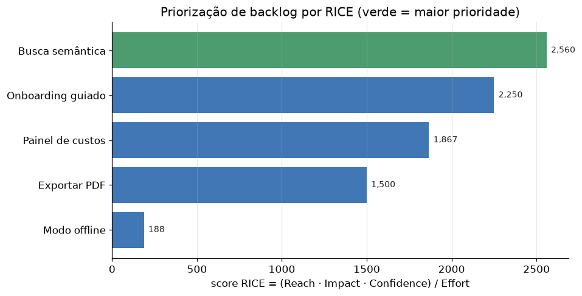

# Lição 098 — IA para Gestão de Projetos: requirements copilot, priorização (RICE/WSJF/MoSCoW), estimativas (Monte Carlo) e relatórios

> **Módulo:** M14 — Ferramentas de IA Aplicadas · **Ordem de estudo:** 98 · **Tempo:** ~55 min
> **Pré-requisitos:** [062] Arquitetura de agentes
> **Classificação:** coberto pela ementa

> **Convenção de formatação:** matemática em LaTeX (`$...$` inline, `$$...$$` em
> destaque, render nativo na pré-visualização do VS Code); figuras reprodutíveis
> geradas por `tools/figuras/gerar_figuras_m14.py` e incorporadas por caminho
> relativo `assets/<NNN>-<slug>/<nome>.png`; blocos ```python só para código e
> saída.

## Seção_Teórica

### Motivação

Gestão de projetos é, em boa medida, **tomada de decisão sob incerteza** com tempo
escasso: o que construir primeiro, quanto vai demorar, o que reportar a quem. A IA
aplicada a essa área não substitui o julgamento do gestor — ela **estrutura e
acelera** o trabalho repetitivo em quatro frentes: o **requirements copilot**, que
ajuda a transformar conversas e notas em requisitos bem formados; a **priorização**,
que converte critérios subjetivos em scores comparáveis (RICE, WSJF, MoSCoW); as
**estimativas**, que tratam prazos como distribuições e não como números mágicos
(Monte Carlo); e os **relatórios**, que agregam o estado do projeto automaticamente.

O fundamento teórico que dá seriedade a tudo isso é simples: **decisões precisam
ser explicáveis e reprodutíveis**. Um score RICE não é mais "verdadeiro" que a
intuição, mas é **auditável** — qualquer pessoa pode ver por que A veio antes de B
e questionar os inputs. Uma estimativa por Monte Carlo não prevê o futuro, mas
expõe **honestamente** o risco: "há 50% de chance de terminar em 13 dias e 85% em
16". Tratar prazos como pontos únicos esconde o risco; tratá-los como
**distribuições** o revela. Esse é o "porquê" que separa gestão baseada em dados de
gestão baseada em otimismo.

### Princípio de funcionamento

**Priorização** atribui a cada item um número e ordena por ele. O **RICE** combina
quatro fatores — alcance, impacto, confiança e esforço:

$$\text{RICE} = \frac{\text{Reach} \times \text{Impact} \times \text{Confidence}}{\text{Effort}}.$$

O **WSJF** (*Weighted Shortest Job First*) prioriza pelo custo do atraso por unidade
de esforço, $\text{WSJF} = \text{CoD}/\text{Effort}$, e o **MoSCoW** é uma
classificação categórica (Must, Should, Could, Won't) usada para escopo. Todos
compartilham a mesma ideia: tornar o critério **explícito** para que a ordenação
seja defensável.

**Estimativas por Monte Carlo** modelam cada tarefa como uma variável aleatória —
tipicamente uma **distribuição triangular** com parâmetros otimista $o$, provável
$m$ e pessimista $p$ — e somam as durações ao longo de muitas simulações. O
resultado não é um número, e sim uma **distribuição** do prazo total, da qual
extraímos **percentis**: o $p_{50}$ (mediana) e o $p_{85}$ (compromisso conservador
comum em planejamento). Como a simulação usa números pseudoaleatórios, fixar a
**semente** garante reprodutibilidade exata.

**Relatórios** são agregações sobre o backlog: contagem por classe MoSCoW,
percentual concluído, itens bloqueados. Combinados com um **requirements copilot**
(que padroniza a forma dos itens), eles fecham o ciclo: requisitos bem formados
entram, scores os priorizam, Monte Carlo estima o prazo e o relatório comunica o
estado — um pipeline de gestão explicável de ponta a ponta.



*Figura 1 — Priorização por RICE: cada barra é o score (Reach·Impact·Confidence)/Effort de um item; a ordenação resultante é explícita e auditável. Gerada por `tools/figuras/gerar_figuras_m14.py`.*

---

### Conceito central 1 — Priorização: RICE e WSJF

Priorizar é converter critérios em um número comparável. O RICE expõe os quatro
fatores que importam e os combina numa fração; ordenar por esse score torna a fila
de trabalho defensável e fácil de questionar (basta discutir os inputs).

#### Exemplo_Resolvido 1.1

```python
# Priorizacao: RICE = (Reach*Impact*Confidence)/Effort; ordena do maior ao menor.
def rice(reach, impact, confidence, effort):
    return (reach * impact * confidence) / effort

itens = [
    ("busca", 8000, 2.0, 0.8, 5.0),
    ("onboarding", 5000, 1.0, 0.9, 2.0),
    ("offline", 2000, 1.5, 0.5, 8.0),
]
ranking = sorted(itens, key=lambda it: rice(*it[1:]), reverse=True)
for nome, *args in ranking:
    print(f"{nome}: RICE={rice(*args):.0f}")
```

**Explicação passo a passo:**
- **Bloco 1 (`rice`):** a fórmula RICE como função pura dos quatro fatores.
- **Bloco 2 (`itens`):** três itens de backlog com seus parâmetros (alcance, impacto, confiança, esforço).
- **Bloco 3 (ranking):** ordena por score decrescente; `busca` (2560) vence `onboarding` (2250) e `offline` (188), uma fila de trabalho explícita.

**Saída esperada:**
```
busca: RICE=2560
onboarding: RICE=2250
offline: RICE=188
```

---

### Conceito central 2 — Estimativas por Monte Carlo

Estimar prazos com um número único esconde o risco. Monte Carlo trata cada tarefa
como uma distribuição e simula o total milhares de vezes, devolvendo percentis que
comunicam a incerteza honestamente. A semente fixa garante reprodutibilidade.

#### Exemplo_Resolvido 2.1

```python
# Estimativas por Monte Carlo: soma de duracoes triangulares (otim/provavel/pess).
import numpy as np

rng = np.random.default_rng(42)
tarefas = [(2, 4, 8), (1, 3, 5), (3, 5, 10)]
n = 20000
totais = np.zeros(n)
for (o, m, p) in tarefas:
    totais += rng.triangular(o, m, p, size=n)
p50 = np.percentile(totais, 50)
p85 = np.percentile(totais, 85)
print(f"p50: {p50:.1f} dias")
print(f"p85: {p85:.1f} dias")
```

**Explicação passo a passo:**
- **Bloco 1 (`rng`/`tarefas`):** gerador com semente fixa (42) e três tarefas com estimativas otimista/provável/pessimista.
- **Bloco 2 (laço):** soma 20 000 amostras triangulares por tarefa, formando a distribuição do prazo total.
- **Bloco 3 (percentis):** extrai o $p_{50}$ (~13.6 dias) e o $p_{85}$ (~15.9 dias) — a diferença entre eles é a margem de risco a comunicar.

**Saída esperada:**
```
p50: 13.6 dias
p85: 15.9 dias
```

---

### Conceito central 3 — Requirements copilot e relatórios (MoSCoW)

Um relatório útil agrega o backlog em números que comunicam estado: quantos itens
por classe MoSCoW e quanto já foi concluído. Padronizar os itens (requirements
copilot) torna essa agregação trivial e confiável.

#### Exemplo_Resolvido 3.1

```python
# Requirements copilot + relatorio: agrega backlog por MoSCoW e calcula progresso.
backlog = [
    {"titulo": "Login", "moscow": "Must", "feito": True},
    {"titulo": "Busca", "moscow": "Must", "feito": False},
    {"titulo": "Tema escuro", "moscow": "Could", "feito": True},
    {"titulo": "Exportar", "moscow": "Should", "feito": False},
]

def relatorio(backlog):
    por_classe = {}
    for item in backlog:
        por_classe[item["moscow"]] = por_classe.get(item["moscow"], 0) + 1
    feitos = sum(1 for i in backlog if i["feito"])
    pct = 100.0 * feitos / len(backlog)
    return por_classe, pct

classes, pct = relatorio(backlog)
for classe in ("Must", "Should", "Could"):
    print(f"{classe}: {classes.get(classe, 0)}")
print(f"progresso: {pct:.0f}%")
```

**Explicação passo a passo:**
- **Bloco 1 (`backlog`):** itens padronizados com título, classe MoSCoW e estado de conclusão.
- **Bloco 2 (`relatorio`):** conta itens por classe e calcula o percentual concluído.
- **Bloco 3 (impressão):** o relatório mostra 2 Must, 1 Should, 1 Could e 50% de progresso — um retrato objetivo do projeto para comunicar a stakeholders.

**Saída esperada:**
```
Must: 2
Should: 1
Could: 1
progresso: 50%
```

## Seção_Prática

> **Como reproduzir:** execute cada solução de referência com
> `python trilha/solucoes/098-ia-gestao-projetos/solucao_<n>.py` e compare a saída
> com o arquivo `.saida.txt` correspondente. Os enunciados/esqueletos ficam em
> `trilha/pratica/098-ia-gestao-projetos/exercicio_<n>.py`.

### Exercício 1 — Priorização por RICE
- **Entrada inicial / setup:** `itens = [("relatorios", 6000, 1.5, 0.9, 3.0), ("alertas", 4000, 2.0, 0.8, 4.0), ("temas", 1000, 0.5, 1.0, 1.0)]`.
- **Passos de execução:** implemente `rice` e ordene por score decrescente; imprima `nome: RICE={score:.0f}` para cada item.
- **Critério de conclusão (binário):** a saída é **exatamente** igual a `solucao_1.saida.txt` (`relatorios: RICE=2700` na primeira linha); qualquer divergência reprova.
- **Solução de referência:** `trilha/solucoes/098-ia-gestao-projetos/solucao_1.py`
- **Saída esperada:** `trilha/solucoes/098-ia-gestao-projetos/solucao_1.saida.txt`

### Exercício 2 — Estimativa por Monte Carlo
- **Entrada inicial / setup:** `rng = np.random.default_rng(7)`, `tarefas = [(1, 2, 4), (2, 4, 7)]`, `n = 10000`.
- **Passos de execução:** some `n` amostras triangulares por tarefa e imprima `p50: {valor:.1f} dias` e `p85: {valor:.1f} dias`.
- **Critério de conclusão (binário):** a saída é **exatamente** igual a `solucao_2.saida.txt` (`p50: 6.6 dias`, `p85: 8.0 dias`); qualquer divergência reprova.
- **Solução de referência:** `trilha/solucoes/098-ia-gestao-projetos/solucao_2.py`
- **Saída esperada:** `trilha/solucoes/098-ia-gestao-projetos/solucao_2.saida.txt`

### Exercício 3 — Relatório por MoSCoW
- **Entrada inicial / setup:** backlog com itens `API` (Must, feito), `Docs` (Should, feito), `i18n` (Could, não), `SSO` (Must, não), `Tema` (Could, não).
- **Passos de execução:** implemente `relatorio` (contagem por classe + percentual concluído); imprima `Must:`, `Should:`, `Could:` e `progresso:`.
- **Critério de conclusão (binário):** a saída é **exatamente** igual a `solucao_3.saida.txt` (`progresso: 40%`); qualquer divergência reprova.
- **Solução de referência:** `trilha/solucoes/098-ia-gestao-projetos/solucao_3.py`
- **Saída esperada:** `trilha/solucoes/098-ia-gestao-projetos/solucao_3.saida.txt`
