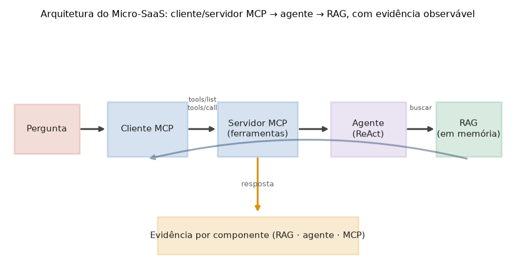

# Lição 099 — Capstone: planejamento e arquitetura do Micro-SaaS (RAG + agentes + MCP)

> **Módulo:** M15 — Capstone · **Ordem de estudo:** 99 · **Tempo:** ~55 min
> **Pré-requisitos:** [061] Agentic RAG · [071] Sistemas multi-agente · [075] Servidores e clientes MCP em Python · [084] Arquitetura enterprise
> **Classificação:** coberto pela ementa

> **Convenção de formatação:** matemática em LaTeX (`$...$` inline, `$$...$$` em
> destaque, render nativo na pré-visualização do VS Code); figuras reprodutíveis
> geradas por `tools/figuras/gerar_figuras_m15.py` e incorporadas por caminho
> relativo `assets/<NNN>-<slug>/<nome>.png`; blocos ```python só para código e
> saída.

## Seção_Teórica

### Motivação

O capstone é o momento em que tudo deixa de ser estudado em separado e passa a
**cooperar** num único produto: um **Micro-SaaS de suporte** que recupera
conhecimento (RAG), raciocina e usa ferramentas (agente) e expõe a capacidade
por um protocolo padronizado (MCP). O risco de um projeto integrador é começar a
codar antes de decidir **o que é "pronto"**. Sem critérios de conclusão
explícitos, a integração vira uma demo frágil: roda uma vez na máquina do autor e
ninguém sabe dizer, de forma objetiva, se cada parte realmente funcionou.

Planejar bem resolve esse risco com três decisões que tomamos **antes** de
escrever a lógica. Primeiro, **escopo e critérios de conclusão**: para cada
componente definimos resultados observáveis e binários ("passou / não passou").
Segundo, **arquitetura em camadas**: declaramos quem depende de quem, o que fixa
a ordem de montagem e o caminho que a requisição percorre. Terceiro, o **contrato
de evidência observável**: combinamos com cada componente que ele vai emitir um
sinal mensurável de que executou, de modo que a integração possa ser verificada
sem inspeção manual. Esta lição é sobre essas três decisões; a Lição 100
implementa o fluxo que elas descrevem.

### Princípio de funcionamento

A ideia que unifica o planejamento é tratar "concluído" como uma **propriedade
verificável**, não uma impressão. Para um conjunto de critérios binários
$c_1, \dots, c_n \in \{0,1\}$ de um componente, a conclusão do componente é a
conjunção

$$\text{concluido} = \bigwedge_{i=1}^{n} c_i,$$

e a conclusão do capstone inteiro é a conjunção sobre os componentes. Como
$\wedge$ é falso se qualquer termo for falso, **um único critério não atendido
reprova** o componente — exatamente o comportamento que queremos de um "definition
of done".

A **arquitetura** é um grafo dirigido acíclico (DAG) de dependências entre
componentes: uma aresta $A \rightarrow B$ significa "$A$ depende de $B$". A ordem
em que montamos o sistema é uma **ordenação topológica** desse grafo (dependências
primeiro); o **fluxo da requisição** em tempo de execução é a ordem inversa
(quem chama vem antes de quem é chamado). No nosso Micro-SaaS o grafo é uma cadeia
$\text{cliente\_mcp} \rightarrow \text{servidor\_mcp} \rightarrow \text{agente}
\rightarrow \text{rag}$, então a montagem começa pelo RAG e a requisição entra
pelo cliente MCP.

Por fim, o **contrato de evidência** transforma "executou?" numa medição. Cada
componente expõe um contador inteiro que só aumenta quando ele faz seu trabalho
(consultas do RAG, passos do agente, chamadas atendidas pelo MCP). O fluxo é
**completo** quando os três contadores são positivos:

$$\text{completo} = (\text{rag} > 0) \wedge (\text{agente} > 0) \wedge (\text{mcp} > 0).$$

Esse contrato é o que, na Lição 100, permite tanto provar que a integração
funcionou quanto **detectar a ausência** de um componente.



*Figura 1 — Arquitetura da solução: cliente/servidor MCP → agente → RAG, com coleta de evidência observável por componente. Gerada por `tools/figuras/gerar_figuras_m15.py`.*

---

### Conceito central 1 — Escopo e critérios de conclusão

Planejar o capstone começa por escrever, para cada componente, **o que significa
estar pronto** em termos binários. Modelar os critérios como um dicionário de
booleanos torna a conclusão uma simples conjunção: o componente está concluído
quando todos os seus critérios são verdadeiros, e o capstone quando todos os
componentes estão concluídos. Isso deixa o "definition of done" auditável.

#### Exemplo_Resolvido 1.1

```python
# Criterios de conclusao do capstone como checklist binario por componente.
criterios = {
    "RAG": {"recuperacao_relevante": True, "determinismo": True},
    "Agente": {"uso_de_ferramenta": True, "selecao_por_politica": True},
    "MCP": {"descoberta_e_invocacao": True, "erro_em_inexistente": True},
}

def concluido(componente):
    return all(componente.values())

for nome in ("RAG", "Agente", "MCP"):
    itens = criterios[nome]
    atendidos = sum(1 for v in itens.values() if v)
    print(f"{nome}: {atendidos}/{len(itens)} -> {'ok' if concluido(itens) else 'pendente'}")
print(f"capstone concluido: {all(concluido(c) for c in criterios.values())}")
```

**Explicação passo a passo:**
- **Bloco 1 (`criterios`):** dois critérios binários por componente — o que torna cada um verificável e comparável.
- **Bloco 2 (`concluido`):** a conclusão de um componente é a conjunção dos seus critérios (`all`), implementando $\bigwedge_i c_i$.
- **Bloco 3 (laço):** imprime quantos critérios foram atendidos por componente e, ao final, a conjunção sobre todos — com todos `True`, o capstone fica `concluido: True`.

**Saída esperada:**
```
RAG: 2/2 -> ok
Agente: 2/2 -> ok
MCP: 2/2 -> ok
capstone concluido: True
```

---

### Conceito central 2 — Arquitetura em camadas

A arquitetura é um DAG de dependências entre componentes. Ordená-lo
topologicamente (dependências primeiro) dá a **ordem de montagem**; invertê-lo dá
o **fluxo da requisição**. Como a nossa arquitetura é uma cadeia, a montagem
começa pelo RAG (não depende de ninguém) e termina no cliente MCP, enquanto a
requisição percorre o caminho oposto.

#### Exemplo_Resolvido 2.1

```python
# Arquitetura em camadas: ordena os componentes pela dependencia (quem chama quem).
# aresta A -> B significa "A depende de B" (A so executa apos B existir).
dependencias = {
    "cliente_mcp": ["servidor_mcp"],
    "servidor_mcp": ["agente"],
    "agente": ["rag"],
    "rag": [],
}

def ordem_de_montagem(deps):
    pendentes = dict(deps)
    ordem = []
    while pendentes:
        prontos = sorted(n for n, ds in pendentes.items()
                         if all(d not in pendentes for d in ds))
        for n in prontos:
            ordem.append(n)
            del pendentes[n]
    return ordem

ordem = ordem_de_montagem(dependencias)
print("ordem de montagem (dependencias primeiro):")
for i, n in enumerate(ordem, 1):
    print(f"  {i}. {n}")
print("fluxo da requisicao:", " -> ".join(reversed(ordem)))
```

**Explicação passo a passo:**
- **Bloco 1 (`dependencias`):** o grafo de dependências como uma cadeia cliente → servidor → agente → RAG.
- **Bloco 2 (`ordem_de_montagem`):** ordenação topológica de Kahn com desempate alfabético — a cada passo monta os componentes cujas dependências já saíram da fila.
- **Bloco 3 (impressão):** a montagem começa pelo `rag` e termina no `cliente_mcp`; o fluxo da requisição é a ordem inversa, exatamente o caminho da Figura 1.

**Saída esperada:**
```
ordem de montagem (dependencias primeiro):
  1. rag
  2. agente
  3. servidor_mcp
  4. cliente_mcp
fluxo da requisicao: cliente_mcp -> servidor_mcp -> agente -> rag
```

---

### Conceito central 3 — Contrato de evidência observável

Para que a integração seja verificável sem inspeção manual, cada componente
combina expor um **contador** que só cresce quando ele executa. O critério
`completo()` é a conjunção "todos os contadores > 0". Esse contrato tem um efeito
valioso: a **ausência** de um componente é observável — basta um contador zerado
para `completo()` reprovar e apontar o que faltou.

#### Exemplo_Resolvido 3.1

```python
# Contrato de evidencia: cada componente expoe um contador; o fluxo so e
# considerado completo quando os tres contadores sao > 0.
from dataclasses import dataclass

@dataclass
class Evidencia:
    rag: int = 0
    agente: int = 0
    mcp: int = 0
    def completo(self):
        return self.rag > 0 and self.agente > 0 and self.mcp > 0

planejado = Evidencia(rag=1, agente=1, mcp=2)
faltando_mcp = Evidencia(rag=1, agente=1, mcp=0)
print(f"planejado.completo()    = {planejado.completo()}")
print(f"faltando_mcp.completo() = {faltando_mcp.completo()}")
for nome, ev in [("planejado", planejado), ("faltando_mcp", faltando_mcp)]:
    ausentes = [c for c in ("rag", "agente", "mcp") if getattr(ev, c) == 0]
    print(f"{nome}: ausentes={ausentes}")
```

**Explicação passo a passo:**
- **Bloco 1 (`Evidencia`):** uma dataclass com um contador por componente e o método `completo()` que aplica a conjunção do contrato.
- **Bloco 2 (cenários):** um cenário planejado (os três contadores positivos) e um com o MCP zerado.
- **Bloco 3 (impressão):** `completo()` é `True` só no cenário planejado; no outro, a lista de `ausentes` aponta exatamente `['mcp']` — a ausência fica observável.

**Saída esperada:**
```
planejado.completo()    = True
faltando_mcp.completo() = False
planejado: ausentes=[]
faltando_mcp: ausentes=['mcp']
```

## Seção_Prática

> **Como reproduzir:** execute cada solução de referência com
> `python trilha/solucoes/099-capstone-planejamento-arquitetura/solucao_<n>.py` e
> compare a saída com o arquivo `.saida.txt` correspondente. Os
> enunciados/esqueletos ficam em
> `trilha/pratica/099-capstone-planejamento-arquitetura/exercicio_<n>.py`.

### Exercício 1 — Checklist de critérios de conclusão
- **Entrada inicial / setup:** `criterios = {"RAG": {"recuperacao_relevante": True, "determinismo": True}, "Agente": {"uso_de_ferramenta": True, "selecao_por_politica": False}, "MCP": {"descoberta_e_invocacao": True, "erro_em_inexistente": True}}`.
- **Passos de execução:** defina `concluido(componente)` (conjunção dos critérios); imprima, na ordem RAG, Agente, MCP, `nome: {atendidos}/{total} -> ok|pendente` e, ao final, `capstone concluido: {True|False}`.
- **Critério de conclusão (binário):** a saída é **exatamente** igual a `solucao_1.saida.txt` (com `Agente: 1/2 -> pendente` e `capstone concluido: False`); qualquer divergência reprova.
- **Solução de referência:** `trilha/solucoes/099-capstone-planejamento-arquitetura/solucao_1.py`
- **Saída esperada:** `trilha/solucoes/099-capstone-planejamento-arquitetura/solucao_1.saida.txt`

### Exercício 2 — Ordem de montagem e fluxo
- **Entrada inicial / setup:** `dependencias = {"cliente_mcp": ["servidor_mcp"], "servidor_mcp": ["agente"], "agente": ["rag"], "rag": []}` (aresta A → B = "A depende de B").
- **Passos de execução:** implemente `ordem_de_montagem(deps)` (ordenação topológica com desempate alfabético); imprima a ordem numerada e, ao final, `fluxo da requisicao: <ordem inversa unida por ' -> '>`.
- **Critério de conclusão (binário):** a saída é **exatamente** igual a `solucao_2.saida.txt` (montagem começando em `rag` e fluxo `cliente_mcp -> servidor_mcp -> agente -> rag`); qualquer divergência reprova.
- **Solução de referência:** `trilha/solucoes/099-capstone-planejamento-arquitetura/solucao_2.py`
- **Saída esperada:** `trilha/solucoes/099-capstone-planejamento-arquitetura/solucao_2.saida.txt`

### Exercício 3 — Contrato de evidência
- **Entrada inicial / setup:** cenários `completo = Evidencia(rag=1, agente=1, mcp=2)`, `sem_rag = Evidencia(rag=0, agente=1, mcp=2)` e `vazio = Evidencia()`.
- **Passos de execução:** crie a dataclass `Evidencia` (contadores `rag`/`agente`/`mcp` default 0) com `completo()` (os três > 0) e `ausentes()` (componentes zerados na ordem rag, agente, mcp); imprima, na ordem completo, sem_rag, vazio, `nome: completo={...} ausentes={...}`.
- **Critério de conclusão (binário):** a saída é **exatamente** igual a `solucao_3.saida.txt` (`vazio: completo=False ausentes=['rag', 'agente', 'mcp']`); qualquer divergência reprova.
- **Solução de referência:** `trilha/solucoes/099-capstone-planejamento-arquitetura/solucao_3.py`
- **Saída esperada:** `trilha/solucoes/099-capstone-planejamento-arquitetura/solucao_3.saida.txt`
