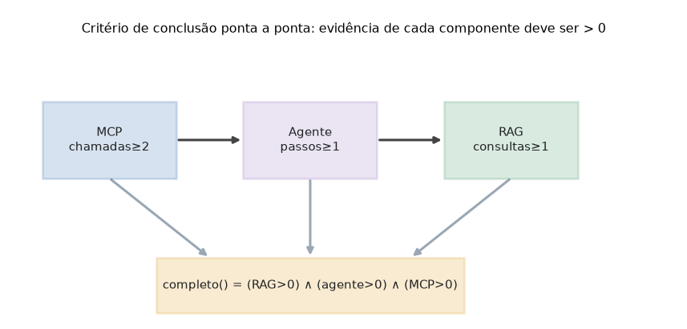

# Lição 100 — Capstone: implementação, fluxo ponta-a-ponta e critérios de conclusão

> **Módulo:** M15 — Capstone · **Ordem de estudo:** 100 · **Tempo:** ~60 min
> **Pré-requisitos:** [099] Capstone: planejamento e arquitetura do Micro-SaaS
> **Classificação:** coberto pela ementa

> **Convenção de formatação:** matemática em LaTeX (`$...$` inline, `$$...$$` em
> destaque, render nativo na pré-visualização do VS Code); figuras reprodutíveis
> geradas por `tools/figuras/gerar_figuras_m15.py` e incorporadas por caminho
> relativo `assets/<NNN>-<slug>/<nome>.png`; blocos ```python só para código e
> saída.

## Seção_Teórica

### Motivação

Com o plano da Lição 099 em mãos — escopo, arquitetura e contrato de evidência —
falta o que mais importa: **fazer funcionar de ponta a ponta**. Implementar o
Micro-SaaS expõe decisões que o diagrama esconde. Como o RAG decide qual documento
é relevante? Como o agente escolhe qual ferramenta usar? Como o cliente MCP
descobre e invoca a capacidade do servidor? E, no fim, como **provar** que os três
cooperaram numa única requisição?

Vamos implementar cada peça da forma mais simples que ainda seja honesta:
**determinística e offline**, sem rede e sem LLM, para que toda execução produza
exatamente o mesmo resultado e seja verificável. O RAG recupera por similaridade
de cosseno sobre um corpus minúsculo; o agente escolhe ferramentas por uma
política de palavras-chave; o MCP troca mensagens no estilo JSON-RPC em memória. O
fio que costura tudo é o **contrato de evidência**: ao final do fluxo conseguimos
afirmar, com um critério binário, que RAG, agente e MCP executaram — e, se algum
não executou, detectar a ausência. Essa é a diferença entre uma demo e um sistema
cuja conclusão é auditável.

### Princípio de funcionamento

O **RAG** representa cada documento e a consulta como vetores de **frequência de
termos** e os compara por **similaridade de cosseno**:

$$\text{sim}(\mathbf{q}, \mathbf{d}) = \frac{\mathbf{q} \cdot \mathbf{d}}{\lVert \mathbf{q} \rVert \, \lVert \mathbf{d} \rVert} = \frac{\sum_t q_t\, d_t}{\sqrt{\sum_t q_t^2}\;\sqrt{\sum_t d_t^2}}.$$

O documento de maior similaridade é o top-1. O desempate é determinístico (maior
score; em empate, `doc_id` em ordem lexicográfica), então a mesma consulta sempre
devolve o mesmo resultado.

O **agente** segue um laço de decisão explícito: a partir da pergunta, uma
**política** (aqui, baseada em palavras-chave) escolhe **qual ferramenta** chamar;
a ferramenta executa e devolve uma observação. Uma das ferramentas consulta o RAG,
ligando os dois componentes. Como a política é uma função pura, o trace
(pensamento → ação → observação) é reproduzível.

O **MCP** padroniza o acesso: o servidor mantém um registro de ferramentas e
atende mensagens `tools/list` (descoberta) e `tools/call` (invocação); o cliente
fala o mesmo dialeto. Cada componente incrementa um contador ao trabalhar, e o
critério de conclusão é a conjunção do contrato definido na Lição 099:

$$\text{completo} = (\text{rag} > 0) \wedge (\text{agente} > 0) \wedge (\text{mcp} > 0).$$

Esse critério é executável tanto no `main.py` (que imprime a evidência e sai com
código 0 quando completo) quanto no teste de integração — que também verifica que
a **ausência** de um componente derruba `completo()`.



*Figura 1 — Critério de conclusão ponta a ponta: cada componente incrementa um contador observável e `completo()` é a conjunção dos três. Gerada por `tools/figuras/gerar_figuras_m15.py`.*

---

### Conceito central 1 — Recuperação e ranqueamento

O RAG converte texto em vetores de frequência e ranqueia os documentos pela
similaridade de cosseno com a consulta. A normalização pelas normas remove o
efeito do tamanho do documento, isolando a **sobreposição de termos**. O resultado
é determinístico, o que é essencial para verificar o capstone.

#### Exemplo_Resolvido 1.1

```python
# RAG minimo: recuperacao por similaridade de cosseno (deterministico, offline).
import math, re

def tokenizar(t):
    return re.findall(r"[a-z0-9]+", t.lower())

def freq(tokens):
    f = {}
    for tok in tokens:
        f[tok] = f.get(tok, 0) + 1
    return f

def cosseno(a, b):
    comuns = set(a) & set(b)
    num = sum(a[t] * b[t] for t in comuns)
    na = math.sqrt(sum(v * v for v in a.values()))
    nb = math.sqrt(sum(v * v for v in b.values()))
    return num / (na * nb) if na and nb else 0.0

corpus = {
    "doc-senha": "para redefinir a senha acesse configuracoes e redefinir senha",
    "doc-fatura": "a fatura e gerada todo dia primeiro baixe a fatura em pdf",
}
consulta = freq(tokenizar("como redefinir minha senha"))
ranque = sorted(
    ((round(cosseno(consulta, freq(tokenizar(txt))), 4), doc) for doc, txt in corpus.items()),
    key=lambda par: (-par[0], par[1]),
)
for score, doc in ranque:
    print(f"{doc}: {score:.4f}")
print(f"top-1: {ranque[0][1]}")
```

**Explicação passo a passo:**
- **Bloco 1 (`tokenizar`/`freq`):** texto vira lista de termos e depois um vetor de frequências (bag-of-words).
- **Bloco 2 (`cosseno`):** implementa $\frac{\mathbf{q}\cdot\mathbf{d}}{\lVert\mathbf{q}\rVert\,\lVert\mathbf{d}\rVert}$ somando só os termos comuns.
- **Bloco 3 (ranque):** pontua cada documento, arredonda a 4 casas e ordena por score decrescente com desempate por `doc_id`; `doc-senha` vence com ~0.5547 enquanto `doc-fatura` fica em 0 (sem termos em comum).

**Saída esperada:**
```
doc-senha: 0.5547
doc-fatura: 0.0000
top-1: doc-senha
```

---

### Conceito central 2 — Agente e ferramentas

O agente decide qual ferramenta usar a partir da pergunta e executa essa
ferramenta, registrando a observação. A política aqui é explícita e determinística
(palavras-chave), o que torna o comportamento previsível e testável — uma das
ferramentas é justamente a busca no RAG, conectando os componentes.

#### Exemplo_Resolvido 2.1

```python
# Agente deterministico: escolhe a ferramenta por palavra-chave e a executa.
def buscar(consulta):
    return f"doc para {consulta!r}"

def contar(consulta):
    return "2 documentos na base"

ferramentas = {"buscar": buscar, "contar": contar}

def decidir(pergunta):
    p = pergunta.lower()
    if "quantos" in p or "quantidade" in p:
        return "contar"
    return "buscar"

for pergunta in ["Como redefinir a senha?", "Quantos documentos existem?"]:
    nome = decidir(pergunta)
    obs = ferramentas[nome](pergunta)
    print(f"ferramenta={nome} obs={obs}")
```

**Explicação passo a passo:**
- **Bloco 1 (`buscar`/`contar`):** duas ferramentas registradas num dicionário nome → função.
- **Bloco 2 (`decidir`):** a política escolhe `contar` se a pergunta menciona quantidade e `buscar` caso contrário — uma função pura, logo determinística.
- **Bloco 3 (laço):** a primeira pergunta cai em `buscar` e a segunda em `contar`, demonstrando a seleção por política.

**Saída esperada:**
```
ferramenta=buscar obs=doc para 'Como redefinir a senha?'
ferramenta=contar obs=2 documentos na base
```

---

### Conceito central 3 — Integração e evidência fim-a-fim

A integração compõe os três componentes numa única chamada: o cliente MCP
descobre e invoca a capacidade, o servidor delega ao agente, o agente consulta o
RAG. Cada etapa incrementa o contador do seu componente, e `completo()` é a
conjunção dos três — o critério executável de conclusão do capstone.

#### Exemplo_Resolvido 3.1

```python
# Integracao fim-a-fim: contadores de cada componente -> criterio completo().
def executar_fluxo():
    evidencia = {"rag": 0, "agente": 0, "mcp": 0}
    evidencia["mcp"] += 2       # cliente MCP: tools/list + tools/call
    evidencia["agente"] += 1    # servidor delega ao agente
    evidencia["rag"] += 1       # agente consulta o RAG
    return evidencia

ev = executar_fluxo()
completo = all(v > 0 for v in ev.values())
for c in ("rag", "agente", "mcp"):
    print(f"{c}: {ev[c]}")
print(f"completo: {completo}")
```

**Explicação passo a passo:**
- **Bloco 1 (`executar_fluxo`):** simula o caminho da requisição — o MCP atende 2 mensagens (`tools/list` + `tools/call`), o agente dá 1 passo e o RAG faz 1 consulta.
- **Bloco 2 (`completo`):** aplica $\text{rag}>0 \wedge \text{agente}>0 \wedge \text{mcp}>0$ sobre os contadores.
- **Bloco 3 (impressão):** os três contadores são positivos, então `completo: True` — a evidência observável que prova a cooperação dos componentes.

**Saída esperada:**
```
rag: 1
agente: 1
mcp: 2
completo: True
```

## Seção_Prática

> **Como reproduzir:** execute cada solução de referência com
> `python trilha/solucoes/100-capstone-implementacao-fluxo/solucao_<n>.py` e
> compare a saída com o arquivo `.saida.txt` correspondente. Os
> enunciados/esqueletos ficam em
> `trilha/pratica/100-capstone-implementacao-fluxo/exercicio_<n>.py`. O projeto
> completo e executável está em `trilha/capstone/` (rode `python
> trilha/capstone/src/main.py` e `python -m pytest trilha/capstone/tests/`).

### Exercício 1 — RAG por similaridade de cosseno
- **Entrada inicial / setup:** corpus com `doc-senha`, `doc-fatura`, `doc-reembolso` (textos no esqueleto) e consulta `"como redefinir minha senha"`.
- **Passos de execução:** tokenize por `[a-z0-9]+` (minúsculas), monte vetores de frequência, calcule o cosseno consulta×documento, arredonde a 4 casas e imprima `doc: {score:.4f}` em ordem decrescente (desempate por `doc_id`) e `top-1: {doc_id}`.
- **Critério de conclusão (binário):** a saída é **exatamente** igual a `solucao_1.saida.txt` (`doc-senha: 0.5547` e `top-1: doc-senha`); qualquer divergência reprova.
- **Solução de referência:** `trilha/solucoes/100-capstone-implementacao-fluxo/solucao_1.py`
- **Saída esperada:** `trilha/solucoes/100-capstone-implementacao-fluxo/solucao_1.saida.txt`

### Exercício 2 — Seleção de ferramenta pelo agente
- **Entrada inicial / setup:** `perguntas = ["Como redefinir a senha?", "Quantos documentos existem?", "Onde baixo a fatura?"]`.
- **Passos de execução:** implemente `decidir(pergunta)` (retorna `"contar"` para "quantos"/"quantidade", senão `"buscar"`), com `buscar` devolvendo `f"resultado para {consulta!r}"` e `contar` devolvendo `"3 documentos na base"`; imprima `ferramenta={nome} obs={observacao}` para cada pergunta.
- **Critério de conclusão (binário):** a saída é **exatamente** igual a `solucao_2.saida.txt` (segunda linha `ferramenta=contar obs=3 documentos na base`); qualquer divergência reprova.
- **Solução de referência:** `trilha/solucoes/100-capstone-implementacao-fluxo/solucao_2.py`
- **Saída esperada:** `trilha/solucoes/100-capstone-implementacao-fluxo/solucao_2.saida.txt`

### Exercício 3 — Integração fim-a-fim com detecção de ausência
- **Entrada inicial / setup:** cenários `[("com_mcp", True), ("sem_mcp", False)]`.
- **Passos de execução:** implemente `fluxo(acionar_mcp)` (incrementa `agente` e `rag` em 1 sempre; `mcp` em 2 só quando `acionar_mcp`), `completo(ev)` (todos > 0) e `ausentes(ev)` (zerados na ordem rag, agente, mcp); imprima `nome: rag={..} agente={..} mcp={..} completo={..} ausentes={..}`.
- **Critério de conclusão (binário):** a saída é **exatamente** igual a `solucao_3.saida.txt` (`sem_mcp: ... completo=False ausentes=['mcp']`); qualquer divergência reprova.
- **Solução de referência:** `trilha/solucoes/100-capstone-implementacao-fluxo/solucao_3.py`
- **Saída esperada:** `trilha/solucoes/100-capstone-implementacao-fluxo/solucao_3.saida.txt`
