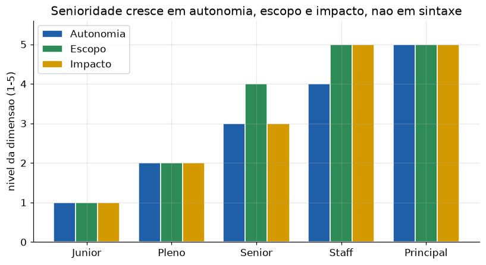
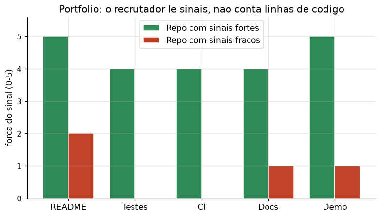

# Lição 101 — O mercado e o papel do AI Engineer; portfólio

> **Módulo:** M16 — Carreira e Entrevistas para AI Engineer · **Ordem de estudo:** 101 · **Tempo:** ~45 min
> **Pré-requisitos:** [100] Capstone: implementação e fluxo ponta-a-ponta
> **Classificação:** coberto pela ementa

> **Convenção de formatação:** matemática em LaTeX (`$...$` inline, `$$...$$` em
> destaque, render nativo na pré-visualização do VS Code); figuras reprodutíveis
> geradas por `tools/figuras/gerar_figuras_m16.py` e incorporadas por caminho
> relativo `assets/<NNN>-<slug>/<nome>.png`; blocos ```python só para código e
> saída.

## Seção_Teórica

### Motivação

Você terminou o capstone (Lição 100): um sistema que combina RAG, agentes e MCP num
fluxo ponta-a-ponta. A pergunta agora é prática — **como converter esse conhecimento
em uma vaga e em progressão de carreira?** O mercado de **AI Engineer** é jovem e os
títulos são confusos: a mesma vaga pode se chamar "AI Engineer", "ML Engineer",
"GenAI Engineer" ou "LLM Engineer". O AI Engineer típico de hoje **constrói produtos
sobre modelos pré-treinados** (LLMs, embeddings, APIs) — foca em RAG, agentes, prompt
engineering, avaliação, custo e latência — em vez de treinar modelos do zero (perfil
mais próximo do ML Researcher).

Sem um modelo mental do que cada **nível** de senioridade exige e do que um recrutador
realmente lê num **portfólio**, é fácil estudar a coisa errada ou exibir o trabalho de
forma que não comunica competência. Esta lição troca a intuição vaga por **critérios
explícitos e calculáveis**: como mapear um perfil a um nível, como pontuar sinais de um
repositório e como priorizar o que estudar a seguir.

### Princípio de funcionamento

Senioridade **não** é medida por anos nem por sintaxe decorada; é medida por três
dimensões observáveis. **Autonomia**: quanto contexto você precisa receber para
entregar (do "me diga exatamente o que fazer" ao "defina o problema certo"). **Escopo**:
o tamanho do que você toca (uma função, um serviço, uma plataforma, vários times).
**Impacto**: o alcance do resultado (uma tarefa, um produto, a estratégia técnica da
empresa). Resumimos as três num **score** $s \in [1, 5]$ e o mapeamos a um nível por
faixas.


*Figura 1 — Os três eixos da senioridade crescem juntos de Junior a Principal: o que muda entre níveis é o tamanho do problema que você resolve sozinho, não a linguagem de programação (gerada por `tools/figuras/gerar_figuras_m16.py`).*

Para o **portfólio**, o princípio é que um recrutador gasta segundos por repositório e
**lê sinais**, não conta linhas: um `README` claro, **testes**, integração contínua
(CI), documentação e uma **demo** que roda. Modelamos a qualidade como uma soma
ponderada de sinais presentes,

$$Q(\text{repo}) = \sum_{i} w_i \cdot \mathbb{1}[\text{sinal}_i \text{ presente}],$$

e normalizamos por $Q_{\max} = \sum_i w_i$. Por fim, planejar a carreira é uma
**análise de lacunas**: para cada habilidade, a prioridade de estudo é
$\text{prioridade} = \text{lacuna} \times \text{peso}$, onde a lacuna é
$\max(0,\ \text{alvo} - \text{atual})$.

---

### Conceito central 1 — Níveis de senioridade

O score $s$ é a média das três dimensões (autonomia, escopo, impacto), cada uma de 1 a
5. As faixas mapeiam $s$ ao nível: $s<1.5$ Junior, $s<2.5$ Pleno, $s<3.5$ Senior,
$s<4.5$ Staff, senão Principal. O ponto pedagógico é que **subir de nível é aumentar as
três dimensões**, e não acumular tempo de casa: um Junior recebe tarefas bem definidas;
um Principal define quais problemas valem a pena ser resolvidos.

#### Exemplo_Resolvido 1.1

```python
def nivel_por_score(score):
    # Mapeia o score medio de competencias para um nivel de senioridade.
    if score < 1.5:
        return "Junior"
    elif score < 2.5:
        return "Pleno"
    elif score < 3.5:
        return "Senior"
    elif score < 4.5:
        return "Staff"
    return "Principal"


# Perfis: (autonomia, escopo, impacto), cada dimensao de 1 a 5.
perfis = {
    "Ana":   (1, 1, 1),
    "Bruno": (3, 2, 2),
    "Carla": (3, 4, 3),
    "Dora":  (5, 5, 5),
}

for nome, dims in perfis.items():
    score = sum(dims) / len(dims)
    print(f"{nome}: dims={dims} score={score:.2f} -> {nivel_por_score(score)}")
```

**Explicação passo a passo:**
- **Bloco 1 (`nivel_por_score`):** traduz o score contínuo em rótulo de nível por faixas; os cortes em `.5` evitam ambiguidade nas fronteiras.
- **Bloco 2 (`perfis`):** quatro perfis, do iniciante (1,1,1) ao referência técnica (5,5,5).
- **Bloco 3 (laço):** calcula o score médio e classifica cada um; Bruno (média 2.33) é Pleno e Carla (3.33) é Senior, mostrando que pequenas diferenças em escopo/impacto mudam o nível.

**Saída esperada:**
```
Ana: dims=(1, 1, 1) score=1.00 -> Junior
Bruno: dims=(3, 2, 2) score=2.33 -> Pleno
Carla: dims=(3, 4, 3) score=3.33 -> Senior
Dora: dims=(5, 5, 5) score=5.00 -> Principal
```

---

### Conceito central 2 — Portfólio e sinais

Um portfólio forte não é o que tem mais repositórios, e sim o que **emite os sinais
certos**. Pontuamos cada repo por uma soma ponderada de sinais presentes — testes
valem mais que um README, porque demonstram disciplina de engenharia — e normalizamos
pela pontuação máxima. Isso transforma "meu GitHub é bom?" numa medida comparável.


*Figura 2 — Dois repositórios com a mesma "ideia" podem comunicar competências muito diferentes: o que importa é a presença de testes, CI, docs e uma demo executável (gerada por `tools/figuras/gerar_figuras_m16.py`).*

#### Exemplo_Resolvido 2.1

```python
# Pesos de cada sinal de qualidade de um repositorio de portfolio.
PESOS = {"readme": 2, "testes": 3, "ci": 2, "docs": 1, "demo": 2}


def pontuar(repo):
    # Soma os pesos apenas dos sinais presentes (True).
    return sum(PESOS[sinal] for sinal, presente in repo.items() if presente)


repos = {
    "rag-do-zero":    {"readme": True,  "testes": True,  "ci": True,  "docs": True,  "demo": True},
    "agente-tarefas": {"readme": True,  "testes": True,  "ci": False, "docs": False, "demo": True},
    "notebook-solto": {"readme": False, "testes": False, "ci": False, "docs": False, "demo": False},
}

maximo = sum(PESOS.values())
for nome, repo in sorted(repos.items(), key=lambda kv: pontuar(kv[1]), reverse=True):
    p = pontuar(repo)
    print(f"{nome:>15}: {p:2d}/{maximo} ({100 * p / maximo:.0f}%)")
```

**Explicação passo a passo:**
- **Bloco 1 (`PESOS`):** define a importância relativa de cada sinal; `testes` (peso 3) pesa mais que `docs` (peso 1).
- **Bloco 2 (`pontuar`):** soma os pesos dos sinais marcados como presentes.
- **Bloco 3 (`repos`):** três repositórios, do completo ao "notebook solto" sem nenhum sinal.
- **Bloco 4 (laço):** ordena por pontuação decrescente e imprime o percentual sobre o máximo (10); o repo completo atinge 100%, o intermediário 70% e o vazio 0%.

**Saída esperada:**
```
    rag-do-zero: 10/10 (100%)
 agente-tarefas:  7/10 (70%)
 notebook-solto:  0/10 (0%)
```

---

### Conceito central 3 — Trajetória e priorização

Saber o nível atual e o alvo não basta: é preciso decidir **o que estudar primeiro**.
A análise de lacunas calcula, por habilidade, a lacuna $\max(0,\ \text{alvo}-\text{atual})$
e a multiplica pelo peso da habilidade para o cargo desejado. Ordenar por essa
prioridade entrega um plano de estudo acionável — ataque a maior lacuna ponderada antes
de polir o que já está bom.

#### Exemplo_Resolvido 3.1

```python
# Nivel exigido (alvo), nivel atual e peso de cada habilidade (1 a 5).
alvo = {"sistemas_rag": 4, "agentes": 4, "evals": 3, "custo_latencia": 3, "comunicacao": 4}
atual = {"sistemas_rag": 2, "agentes": 3, "evals": 1, "custo_latencia": 3, "comunicacao": 2}
PESO = {"sistemas_rag": 3, "agentes": 2, "evals": 2, "custo_latencia": 1, "comunicacao": 2}

prioridades = []
for hab in alvo:
    gap = max(0, alvo[hab] - atual[hab])             # lacuna (nunca negativa)
    prioridades.append((gap * PESO[hab], gap, hab))  # prioridade = lacuna x peso

for score, gap, hab in sorted(prioridades, reverse=True):
    if gap > 0:
        print(f"{hab:>15}: gap={gap} peso={PESO[hab]} prioridade={score}")
```

**Explicação passo a passo:**
- **Bloco 1 (dicionários):** descreve onde você quer chegar (`alvo`), onde está (`atual`) e quanto cada habilidade pesa no cargo (`PESO`).
- **Bloco 2 (laço de cálculo):** a lacuna é truncada em 0 (estar acima do alvo não vira prioridade negativa) e a prioridade é lacuna × peso.
- **Bloco 3 (impressão ordenada):** `custo_latencia` some (lacuna 0); `sistemas_rag` lidera (prioridade 6), e empates de prioridade são desempatados de forma determinística pela tupla ordenada.

**Saída esperada:**
```
   sistemas_rag: gap=2 peso=3 prioridade=6
          evals: gap=2 peso=2 prioridade=4
    comunicacao: gap=2 peso=2 prioridade=4
        agentes: gap=1 peso=2 prioridade=2
```

## Seção_Prática

> **Como reproduzir:** execute cada solução de referência com
> `python trilha/solucoes/101-mercado-papel-portfolio/solucao_<n>.py` e compare a saída
> com o arquivo `.saida.txt` correspondente. Os enunciados/esqueletos ficam em
> `trilha/pratica/101-mercado-papel-portfolio/exercicio_<n>.py`.

### Exercício 1 — Classificar perfis em níveis de senioridade
- **Entrada inicial / setup:** dicionário `perfis` com `Eva=(2,1,1)`, `Felix=(3,3,2)`, `Gina=(4,4,4)`, `Hugo=(5,5,4)`, cada tupla `(autonomia, escopo, impacto)` de 1 a 5 (dados no esqueleto).
- **Passos de execução:** implemente `nivel_por_score(score)` com os cortes `1.5/2.5/3.5/4.5`; para cada perfil calcule o score médio das três dimensões e imprima `"<nome>: dims=<tupla> score=<2 casas> -> <nivel>"`.
- **Critério de conclusão (binário):** a saída é **exatamente** igual a `solucao_1.saida.txt` (`Felix` classifica como `Senior` e `Hugo` como `Principal`); qualquer divergência reprova.
- **Solução de referência:** `trilha/solucoes/101-mercado-papel-portfolio/solucao_1.py`
- **Saída esperada:** `trilha/solucoes/101-mercado-papel-portfolio/solucao_1.saida.txt`

### Exercício 2 — Pontuar repositórios de portfólio
- **Entrada inicial / setup:** `PESOS = {"readme": 2, "testes": 3, "ci": 2, "docs": 1, "demo": 2}` e três repos (`pipeline-rag`, `demo-agente`, `scripts-soltos`) com seus sinais (dados no esqueleto).
- **Passos de execução:** implemente `pontuar(repo)` somando os pesos dos sinais presentes; calcule `maximo = sum(PESOS.values())`, ordene por pontuação decrescente e imprima `"<nome alinhado a 15>: <p:2d>/<maximo> (<percentual:0 casas>%)"`.
- **Critério de conclusão (binário):** a saída é **exatamente** igual a `solucao_2.saida.txt` (`pipeline-rag` = `8/10 (80%)` e `scripts-soltos` = `0/10 (0%)`); qualquer divergência reprova.
- **Solução de referência:** `trilha/solucoes/101-mercado-papel-portfolio/solucao_2.py`
- **Saída esperada:** `trilha/solucoes/101-mercado-papel-portfolio/solucao_2.saida.txt`

### Exercício 3 — Análise de lacunas de carreira
- **Entrada inicial / setup:** dicionários `alvo`, `atual` e `PESO` para cinco habilidades (`sistemas_rag`, `agentes`, `evals`, `custo_latencia`, `comunicacao`), dados no esqueleto.
- **Passos de execução:** calcule `gap = max(0, alvo - atual)` e `prioridade = gap * PESO`; ordene por `(prioridade, gap, nome)` decrescente e imprima, só para `gap > 0`, `"<hab alinhada a 15>: gap=<gap> peso=<peso> prioridade=<prioridade>"`.
- **Critério de conclusão (binário):** a saída é **exatamente** igual a `solucao_3.saida.txt` (`sistemas_rag` lidera com `prioridade=9` e `custo_latencia` não aparece); qualquer divergência reprova.
- **Solução de referência:** `trilha/solucoes/101-mercado-papel-portfolio/solucao_3.py`
- **Saída esperada:** `trilha/solucoes/101-mercado-papel-portfolio/solucao_3.saida.txt`
