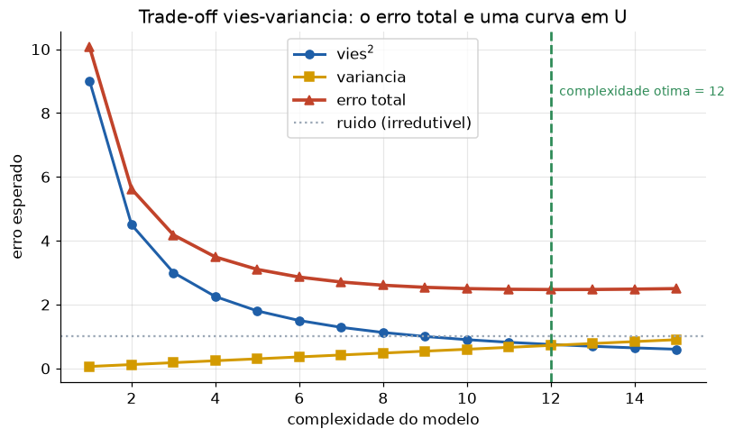
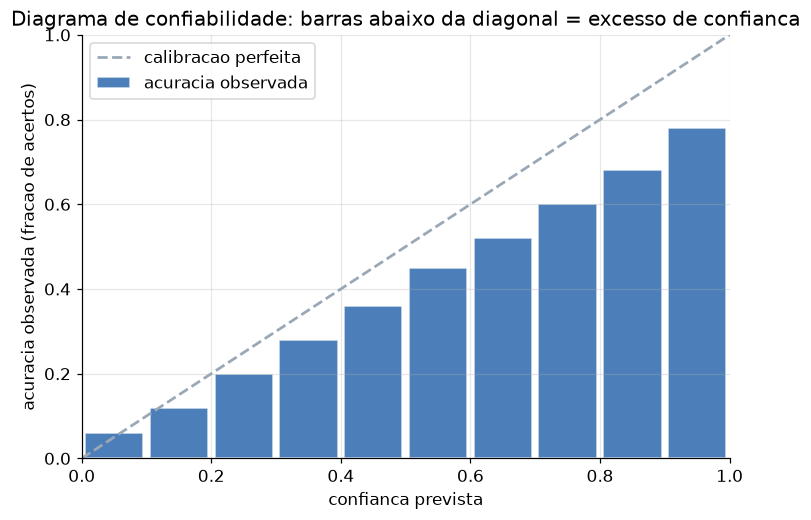

# Lição 102 — Entrevistas — Fundamentos de ML

> **Módulo:** M16 — Carreira e Entrevistas para AI Engineer · **Ordem de estudo:** 102 · **Tempo:** ~55 min
> **Pré-requisitos:** [013] Gradient Descent · [014] Backpropagation · [016] Trade-off viés-variância · [018] Calibração · [020] Data leakage
> **Classificação:** complemento de aprofundamento à ementa

> **Convenção de formatação:** matemática em LaTeX (`$...$` inline, `$$...$$` em
> destaque, render nativo na pré-visualização do VS Code); figuras reprodutíveis
> geradas por `tools/figuras/gerar_figuras_m16.py` e incorporadas por caminho
> relativo `assets/<NNN>-<slug>/<nome>.png`; blocos ```python só para código e
> saída.

## Seção_Teórica

### Motivação

Entrevistas de AI Engineer quase sempre incluem uma rodada de **fundamentos de ML**, e
ela é eliminatória. Não porque você vá treinar uma rede do zero no trabalho, mas porque
os fundamentos revelam se você **entende por que um sistema falha**: um modelo que
"decora" o conjunto de treino (variância alta), um classificador que diz "95% de
confiança" e acerta 70% (má calibração), ou um pipeline cujo resultado lindo no offline
desaba em produção (data leakage). Quem não domina esses conceitos comete esses erros em
produção sem perceber.

Esta lição organiza os fundamentos cobrados em entrevista em três blocos —
**viés-variância**, **calibração** e **data leakage / otimização** — e os trata da forma
como aparecem na entrevista: com uma explicação curta, um exemplo numérico que você pode
reproduzir e um **banco de questões com respostas de referência**. O objetivo é que você
consiga, sob pressão, dar respostas precisas e quantitativas em vez de hand-waving.

### Princípio de funcionamento

O erro esperado de um modelo em um ponto se decompõe em três partes:

$$\mathbb{E}[(y - \hat{f}(x))^2] = \underbrace{(\text{viés})^2}_{\text{rigidez}} + \underbrace{\text{variância}}_{\text{instabilidade}} + \underbrace{\sigma^2}_{\text{ruído irredutível}}.$$

Aumentar a capacidade do modelo reduz o viés mas aumenta a variância; o erro total é uma
**curva em U** e o ponto ótimo equilibra as duas. **Calibração** é uma propriedade
ortogonal à acurácia: mede se a probabilidade prevista bate com a frequência observada de
acertos — um modelo pode ser acurado e mal calibrado. Quantificamos isso com o **Expected
Calibration Error (ECE)**, a média ponderada de $|\text{acurácia} - \text{confiança}|$ por
faixa de confiança. Por fim, **data leakage** é qualquer informação do alvo (ou do
conjunto de teste) que vaza para o treino/seleção, inflando a métrica offline; o antídoto
é disciplina de **separação treino/teste** e calcular qualquer estatística **só no
treino**. A otimização que treina tudo isso — **gradient descent** e **backpropagation** —
fecha o conjunto clássico de perguntas.


*Figura 1 — O erro total é a soma de viés², variância e ruído: existe uma complexidade ótima onde a curva em U atinge o mínimo (gerada por `tools/figuras/gerar_figuras_m16.py`).*

---

### Conceito central 1 — Viés-variância e generalização

A pergunta de entrevista mais comum aqui é "explique o trade-off viés-variância". A
resposta forte é **quantitativa**: viés é o erro por o modelo ser rígido demais
(underfitting); variância é o erro por o modelo ser sensível demais aos dados de treino
(overfitting); o ruído é irredutível. Aumentar a capacidade troca viés por variância, e o
erro total tem um mínimo.

#### Exemplo_Resolvido 1.1

```python
def erros(complexidade):
    # Decomposicao do erro esperado: vies^2 cai, variancia sobe, ruido fixo.
    vies2 = 9.0 / complexidade
    variancia = 0.06 * complexidade
    ruido = 1.0
    return vies2, variancia, ruido, vies2 + variancia + ruido


for k in [1, 3, 6, 9, 12, 15]:
    b, v, r, t = erros(k)
    print(f"k={k:2d}: vies2={b:.2f} var={v:.2f} ruido={r:.2f} total={t:.2f}")

melhor = min(range(1, 16), key=lambda k: erros(k)[3])
print(f"complexidade otima (1..15): {melhor}")
```

**Explicação passo a passo:**
- **Bloco 1 (`erros`):** modela viés² como $9/k$ (cai com a capacidade $k$), variância como $0.06k$ (sobe) e ruído fixo em 1.0.
- **Bloco 2 (laço):** tabula a decomposição; veja o total cair de 10.06 (k=1, underfitting) até ~2.47 e voltar a subir (overfitting).
- **Bloco 3 (`min`):** localiza a complexidade ótima — o fundo da curva em U está em $k=12$, perto de $\sqrt{9/0.06}\approx 12.2$.

**Saída esperada:**
```
k= 1: vies2=9.00 var=0.06 ruido=1.00 total=10.06
k= 3: vies2=3.00 var=0.18 ruido=1.00 total=4.18
k= 6: vies2=1.50 var=0.36 ruido=1.00 total=2.86
k= 9: vies2=1.00 var=0.54 ruido=1.00 total=2.54
k=12: vies2=0.75 var=0.72 ruido=1.00 total=2.47
k=15: vies2=0.60 var=0.90 ruido=1.00 total=2.50
complexidade otima (1..15): 12
```

#### Banco de questões — viés-variância

**Q1. Explique o trade-off viés-variância.**
*Resposta de referência:* viés é o erro de aproximação por um modelo rígido demais
(underfitting); variância é o erro por sensibilidade excessiva ao conjunto de treino
(overfitting). O erro esperado é viés² + variância + ruído irredutível. Aumentar a
capacidade reduz viés e aumenta variância — o erro total é uma curva em U. Critério de
avaliação: citar as três componentes e a relação de troca.

**Q2. Um modelo tem erro de treino 2% e erro de validação 30%. Diagnóstico e ação?**
*Resposta de referência:* a grande lacuna treino→validação indica **alta variância
(overfitting)**. Ações: mais dados, regularização (L1/L2, dropout, early stopping),
reduzir a capacidade do modelo ou aumentar o viés indutivo. Critério: identificar
overfitting pela lacuna, não pelo valor absoluto.

**Q3. Erro de treino 28% e validação 30%. O que fazer?**
*Resposta de referência:* ambos altos e próximos = **alto viés (underfitting)**. Ações:
aumentar capacidade, treinar mais, adicionar features, reduzir regularização. Critério:
distinguir do caso Q2 pela ausência de lacuna.

**Q4. Mais dados sempre ajudam?**
*Resposta de referência:* ajudam principalmente quando o problema é **variância**; contra
**viés** alto, mais dados do mesmo tipo não resolvem (o modelo continua rígido demais).
Critério: condicionar a resposta ao diagnóstico viés vs variância.

---

### Conceito central 2 — Calibração e confiança

Calibração responde: quando o modelo diz "80% de confiança", ele acerta 80% das vezes? Um
modelo pode ter alta acurácia e ainda ser **mal calibrado** (tipicamente super-confiante).
O **ECE** mede o desvio médio entre confiança e acurácia, agrupando previsões em faixas.


*Figura 2 — Diagrama de confiabilidade: quando as barras de acurácia observada ficam abaixo da diagonal, o modelo está super-confiante — a base visual da pergunta "seu modelo é calibrado?" (gerada por `tools/figuras/gerar_figuras_m16.py`).*

#### Exemplo_Resolvido 2.1

```python
def ece(confiancas, acertos, n_bins=5):
    # Expected Calibration Error: media ponderada de |acuracia - confianca| por bin.
    n = len(confiancas)
    total = 0.0
    for b in range(n_bins):
        lo, hi = b / n_bins, (b + 1) / n_bins
        idx = [i for i in range(n) if (lo < confiancas[i] <= hi) or (b == 0 and confiancas[i] <= hi)]
        if not idx:
            continue
        conf_media = sum(confiancas[i] for i in idx) / len(idx)
        acc = sum(acertos[i] for i in idx) / len(idx)
        peso = len(idx) / n
        contrib = peso * abs(acc - conf_media)
        total += contrib
        print(f"bin {b} ({lo:.1f}-{hi:.1f}]: n={len(idx)} conf={conf_media:.3f} acc={acc:.3f} contrib={contrib:.4f}")
    return total


confiancas = [0.55, 0.62, 0.68, 0.71, 0.85, 0.88, 0.90, 0.95, 0.52, 0.78]
acertos    = [1,    0,    1,    1,    1,    0,    1,    1,    0,    1]
valor = ece(confiancas, acertos, n_bins=5)
print(f"ECE = {valor:.4f}")
```

**Explicação passo a passo:**
- **Bloco 1 (`ece`):** percorre 5 bins de largura 0.2, calcula confiança média e acurácia de cada bin e acumula `|acc - conf| * (n_bin/n)`.
- **Bloco 2 (dados):** dez previsões com suas confianças e se acertaram (1) ou não (0).
- **Bloco 3 (execução):** o bin alto (0.8–1.0] tem confiança média 0.895 mas acurácia 0.75 — super-confiança que domina o ECE final de 0.086.

**Saída esperada:**
```
bin 2 (0.4-0.6]: n=2 conf=0.535 acc=0.500 contrib=0.0070
bin 3 (0.6-0.8]: n=4 conf=0.698 acc=0.750 contrib=0.0210
bin 4 (0.8-1.0]: n=4 conf=0.895 acc=0.750 contrib=0.0580
ECE = 0.0860
```

#### Banco de questões — calibração

**Q5. O que é calibração e por que ela importa se já temos acurácia?**
*Resposta de referência:* calibração mede se as probabilidades previstas correspondem às
frequências reais de acerto. Importa porque decisões usam a probabilidade (thresholds,
custo esperado, abstenção, ranqueamento): um modelo super-confiante leva a decisões ruins
mesmo com boa acurácia. Critério: separar "ordenar bem" (acurácia/AUC) de "probabilidade
confiável" (calibração).

**Q6. Como medir e visualizar calibração?**
*Resposta de referência:* diagrama de confiabilidade (confiança prevista no eixo x,
acurácia observada no y, comparada à diagonal) e métricas como **ECE** e **Brier score**.
Critério: citar reliability diagram + ao menos uma métrica.

**Q7. Como corrigir um modelo mal calibrado sem retreinar?**
*Resposta de referência:* calibração pós-hoc — **temperature scaling** (um escalar na
logit), Platt scaling ou isotonic regression, ajustados num conjunto de validação
separado. Critério: citar um método pós-hoc e a necessidade de dados de validação.

---

### Conceito central 3 — Data leakage e otimização

Data leakage é quando informação que não estaria disponível em produção (ou rótulos do
teste) vaza para o treino/seleção, inflando a métrica offline. A forma traiçoeira é a
**seleção de features olhando todos os dados**. O antídoto: separar treino/teste antes de
qualquer decisão e calcular estatísticas só no treino. Otimização (gradient descent,
backprop) completa o bloco clássico.

#### Exemplo_Resolvido 3.1

```python
import numpy as np

rng = np.random.default_rng(0)
n, d = 120, 2000
X = rng.normal(size=(n, d))
y = rng.integers(0, 2, size=n)   # rotulos ALEATORIOS: nao ha sinal real algum

ntr = 60
Xtr, ytr = X[:ntr], y[:ntr]
Xte, yte = X[ntr:], y[ntr:]


def acuracia(j, Xs, ys):
    # Acuracia de um classificador de limiar (mediana) com a melhor polaridade.
    limiar = np.median(Xs[:, j])
    pred = (Xs[:, j] > limiar).astype(int)
    direto = (pred == ys).mean()
    return max(direto, 1.0 - direto)


def melhor_feature(Xs, ys):
    # Escolhe, entre todas as features, a de maior acuracia no conjunto dado.
    return int(np.argmax([acuracia(j, Xs, ys) for j in range(Xs.shape[1])]))


# COM vazamento: escolhe a melhor de 2000 features olhando TODOS os dados
# e relata a acuracia no MESMO conjunto (a banca viu as respostas ao escolher).
j_leak = melhor_feature(X, y)
acc_leak = acuracia(j_leak, X, y)

# SEM vazamento: escolhe no treino e mede no teste, intocado pela selecao.
j_ok = melhor_feature(Xtr, ytr)
acc_ok = acuracia(j_ok, Xte, yte)

print("rotulos aleatorios: a acuracia honesta esperada e ~ 0.50")
print(f"COM vazamento  -> feature {j_leak:4d}, acuracia no mesmo conjunto: {acc_leak:.2f}")
print(f"SEM vazamento  -> feature {j_ok:4d}, acuracia no teste: {acc_ok:.2f}")
```

**Explicação passo a passo:**
- **Bloco 1 (dados):** rótulos **aleatórios** — por construção, nenhum sinal real existe, então a acurácia honesta é ~0.50.
- **Bloco 2 (`acuracia`/`melhor_feature`):** um classificador de limiar simples e a escolha da melhor entre 2000 features.
- **Bloco 3 (com vazamento):** selecionar a melhor de 2000 features olhando todos os dados e medir no mesmo conjunto infla a acurácia para 0.67, **puro acaso disfarçado de sinal**.
- **Bloco 4 (sem vazamento):** selecionar no treino e medir no teste devolve ~0.55, perto do esperado — a separação honesta desmascara o vazamento.

**Saída esperada:**
```
rotulos aleatorios: a acuracia honesta esperada e ~ 0.50
COM vazamento  -> feature  577, acuracia no mesmo conjunto: 0.67
SEM vazamento  -> feature  231, acuracia no teste: 0.55
```

#### Banco de questões — data leakage e otimização

**Q8. O que é data leakage e dê dois exemplos comuns.**
*Resposta de referência:* uso, no treino/seleção, de informação indisponível em produção
ou derivada do alvo/teste. Exemplos: (a) normalizar/escalar ou imputar usando estatísticas
do dataset inteiro antes do split; (b) feature que codifica o futuro/alvo (ex.:
`valor_pago` para prever inadimplência). Critério: definição correta + dois exemplos
plausíveis.

**Q9. Como prevenir leakage num pipeline?**
*Resposta de referência:* fazer o split treino/teste primeiro; encapsular pré-processamento
num pipeline ajustado **só no treino** (fit no treino, transform no teste); fazer seleção
de features e tuning **dentro** da validação cruzada; respeitar a ordem temporal em séries
temporais. Critério: citar split-first e fit-no-treino.

**Q10. Escreva a regra de atualização do gradient descent e o papel da taxa de aprendizado.**
*Resposta de referência:* $\theta \leftarrow \theta - \eta\,\nabla L(\theta)$. O gradiente
aponta para o maior crescimento; o passo segue o negativo. $\eta$ pequeno converge devagar;
grande demais oscila/diverge. Critério: fórmula correta + efeito de $\eta$.

**Q11. O que é backpropagation e qual sua relação com a regra da cadeia?**
*Resposta de referência:* é o cálculo eficiente dos gradientes da perda em relação a todos
os parâmetros, aplicando a **regra da cadeia** da saída para a entrada e reaproveitando
resultados intermediários (programação dinâmica sobre o grafo computacional). Mencione
vanishing/exploding gradients como falha quando os gradientes encolhem/explodem ao longo de
muitas camadas. Critério: regra da cadeia + reuso + um modo de falha.

## Seção_Prática

> **Como reproduzir:** execute cada solução de referência com
> `python trilha/solucoes/102-entrevistas-fundamentos-ml/solucao_<n>.py` e compare a saída
> com o arquivo `.saida.txt` correspondente. Os enunciados/esqueletos ficam em
> `trilha/pratica/102-entrevistas-fundamentos-ml/exercicio_<n>.py`.

### Exercício 1 — Curva em U do erro (viés-variância)
- **Entrada inicial / setup:** `erros(k)` com `vies2 = 16.0/k`, `variancia = 0.05*k`, `ruido = 0.5` e `total = vies2 + variancia + ruido` (dado no esqueleto).
- **Passos de execução:** imprima a tabela para `k` em `[1, 5, 10, 15, 20]` no formato `"k=<2d>: vies2=<2c> var=<2c> ruido=<2c> total=<2c>"` e depois a complexidade ótima em `1..20` (`"complexidade otima (1..20): <k>"`).
- **Critério de conclusão (binário):** a saída é **exatamente** igual a `solucao_1.saida.txt` (a complexidade ótima é `18`); qualquer divergência reprova.
- **Solução de referência:** `trilha/solucoes/102-entrevistas-fundamentos-ml/solucao_1.py`
- **Saída esperada:** `trilha/solucoes/102-entrevistas-fundamentos-ml/solucao_1.saida.txt`

### Exercício 2 — Calcular o ECE
- **Entrada inicial / setup:** `confiancas = [0.45, 0.58, 0.61, 0.66, 0.72, 0.83, 0.87, 0.91, 0.93, 0.97]` e `acertos = [0, 1, 0, 1, 1, 1, 0, 1, 1, 1]`, `n_bins = 5` (dados no esqueleto).
- **Passos de execução:** atribua cada exemplo ao bin pela regra `(lo < conf <= hi)` (com o bin 0 incluindo `conf <= 0.2`); imprima `"bin <b> (<lo>-<hi>]: n=<n> conf=<3c> acc=<3c> contrib=<4c>"` por bin não vazio e o `"ECE = <4 casas>"` ao final, com `contrib = (n_bin/n)*|acc - conf_media|`.
- **Critério de conclusão (binário):** a saída é **exatamente** igual a `solucao_2.saida.txt` (`ECE = 0.0550`); qualquer divergência reprova.
- **Solução de referência:** `trilha/solucoes/102-entrevistas-fundamentos-ml/solucao_2.py`
- **Saída esperada:** `trilha/solucoes/102-entrevistas-fundamentos-ml/solucao_2.saida.txt`

### Exercício 3 — Gradient descent 1D
- **Entrada inicial / setup:** `L(theta) = (theta - 7)^2`, `gradiente = 2*(theta - 7)`, `theta = 0.0`, `eta = 0.1`, 60 passos (dado no esqueleto).
- **Passos de execução:** imprima `"theta inicial: <4c> perda inicial: <4c>"`; rode 60 passos de `theta <- theta - eta*gradiente(theta)` e, nos passos `1, 10, 30, 60`, imprima `"passo <2d>: theta=<4c> perda=<4c>"`; ao final imprima `"theta final: <4c> perda final: <4c>"`.
- **Critério de conclusão (binário):** a saída é **exatamente** igual a `solucao_3.saida.txt` (`theta final: 7.0000 perda final: 0.0000`); qualquer divergência reprova.
- **Solução de referência:** `trilha/solucoes/102-entrevistas-fundamentos-ml/solucao_3.py`
- **Saída esperada:** `trilha/solucoes/102-entrevistas-fundamentos-ml/solucao_3.saida.txt`
