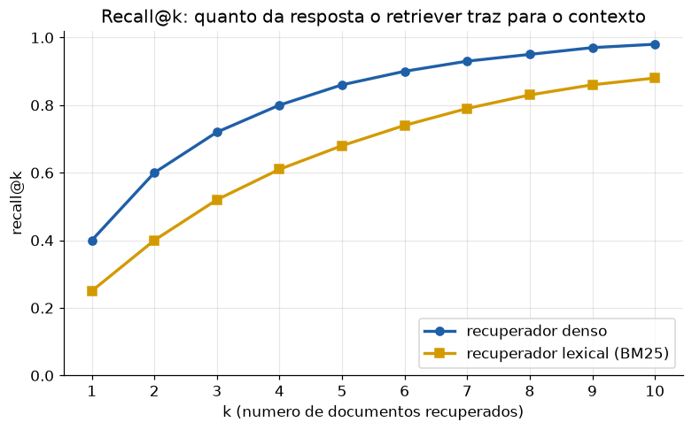
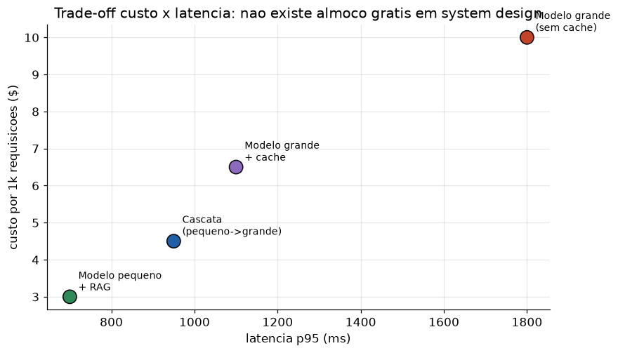

# Lição 103 — Entrevistas — Engenharia de sistemas de IA

> **Módulo:** M16 — Carreira e Entrevistas para AI Engineer · **Ordem de estudo:** 103 · **Tempo:** ~55 min
> **Pré-requisitos:** [061] Agentic RAG · [071] Sistemas multi-agente · [085] Metodologia de evals · [088] Latência de inferência
> **Classificação:** complemento de aprofundamento à ementa

> **Convenção de formatação:** matemática em LaTeX (`$...$` inline, `$$...$$` em
> destaque, render nativo na pré-visualização do VS Code); figuras reprodutíveis
> geradas por `tools/figuras/gerar_figuras_m16.py` e incorporadas por caminho
> relativo `assets/<NNN>-<slug>/<nome>.png`; blocos ```python só para código e
> saída.

## Seção_Teórica

### Motivação

Se a Lição 102 cobre os fundamentos, esta cobre o que de fato define o trabalho de um AI
Engineer: **construir sistemas de IA que funcionam em produção**. As entrevistas de
sistemas — muitas vezes uma rodada de *system design* — avaliam se você sabe montar e
**avaliar** um pipeline de RAG, orquestrar **agentes** sem que eles entrem em loop ou
estourem o orçamento, definir **evals** que detectam regressões e equilibrar **custo e
latência** sob uma SLA.

A diferença entre uma resposta fraca e uma forte aqui é **quantificação**. "Eu usaria RAG"
é fraco; "eu mediria recall@k do retriever, porque se o documento certo não entra no
top-k o gerador não tem como responder" é forte. Esta lição organiza o tema em três
blocos — **RAG e recuperação**, **agentes e orquestração** e **evals, custo/latência e
system design** — cada um com um exemplo numérico reproduzível e um banco de questões com
respostas de referência.

### Princípio de funcionamento

Um sistema de **RAG** tem duas etapas avaliáveis: o **retriever** (traz documentos) e o
**gerador** (responde com base neles). O retriever é medido por **precision@k** (fração do
top-k que é relevante), **recall@k** (fração dos relevantes que aparece no top-k) e
**MRR** (recíproco do posto do primeiro relevante). Se o recall é baixo, nenhum prompt
salva a resposta.

Um **agente** é um loop: pensa, escolhe uma ação/ferramenta, observa o resultado e repete
até concluir ou atingir um **limite** (de iterações ou de tokens/custo). Sem esse limite,
o agente pode oscilar para sempre. O custo total cresce com o número de iterações, então a
pergunta de projeto é "qual o orçamento e a condição de parada?".

Por fim, **system design** é otimização sob restrições: dada uma **SLA de latência** (ex.:
p95 $\le$ 1000 ms) e um **orçamento de custo** (ex.: $\le \$5$ por 1k requisições), o
espaço de arquiteturas viáveis é

$$\mathcal{V} = \{a : \text{latência}_{p95}(a) \le \text{SLA} \ \wedge\ \text{custo}(a) \le \text{orçamento}\},$$

e escolhemos dentro de $\mathcal{V}$ pela melhor métrica restante (custo, qualidade). Não
há almoço grátis: cache reduz custo mas adiciona complexidade; modelos menores reduzem
latência mas podem reduzir qualidade.


*Figura 1 — Recall@k mede quanto da resposta o retriever coloca no contexto: aumentar k melhora o recall, mas enche o prompt (mais custo e latência) — o trade-off central de um RAG (gerada por `tools/figuras/gerar_figuras_m16.py`).*

---

### Conceito central 1 — RAG e recuperação

A pergunta clássica é "como você avalia um RAG?". A resposta forte separa **recuperação**
de **geração** e usa métricas de ranking para a primeira. Com a lista ranqueada de
documentos e o conjunto de relevantes, calculamos precision@k, recall@k e MRR — exatamente
o que revela se o gargalo está em buscar ou em responder.

#### Exemplo_Resolvido 1.1

```python
def metricas(recuperados, relevantes, k):
    topk = recuperados[:k]
    acertos = [d for d in topk if d in relevantes]
    precision = len(acertos) / k
    recall = len(acertos) / len(relevantes)
    rr = 0.0
    for i, d in enumerate(recuperados, 1):
        if d in relevantes:
            rr = 1.0 / i
            break
    return precision, recall, rr


recuperados = ["d3", "d7", "d1", "d9", "d2"]   # ranking do retriever
relevantes = {"d1", "d2"}
for k in [1, 3, 5]:
    p, r, rr = metricas(recuperados, relevantes, k)
    print(f"@{k}: precision={p:.2f} recall={r:.2f} mrr={rr:.2f}")
```

**Explicação passo a passo:**
- **Bloco 1 (`metricas`):** corta o top-k, conta acertos para precision/recall e varre o ranking completo para achar o posto do primeiro relevante (MRR).
- **Bloco 2 (dados):** o retriever ranqueou cinco documentos; os relevantes (`d1`, `d2`) estão nas posições 3 e 5.
- **Bloco 3 (laço):** com k=1 nada é recuperado (precision/recall 0), mas o MRR já é 0.33 (primeiro relevante no posto 3); com k=5 o recall chega a 1.00 — todos os relevantes entraram no contexto.

**Saída esperada:**
```
@1: precision=0.00 recall=0.00 mrr=0.33
@3: precision=0.33 recall=0.50 mrr=0.33
@5: precision=0.40 recall=1.00 mrr=0.33
```

#### Banco de questões — RAG e recuperação

**Q1. Como você avalia um sistema de RAG?**
*Resposta de referência:* separe **recuperação** (precision@k, recall@k, MRR/nDCG) de
**geração** (faithfulness/groundedness, correção, citação das fontes). Avalie ponta a ponta
com um dataset rotulado e também cada etapa isolada para localizar o gargalo. Critério:
distinguir as duas etapas + citar métricas de cada.

**Q2. Recall@k baixo: o que isso implica e como melhorar?**
*Resposta de referência:* se o documento certo não entra no top-k, o gerador não tem como
responder — é o teto do sistema. Melhorias: melhor chunking, embeddings melhores, busca
híbrida (densa + BM25), reranking, aumentar k. Critério: reconhecer recall como teto +
duas alavancas.

**Q3. Quando NÃO usar RAG?**
*Resposta de referência:* quando o conhecimento é estável e cabe no modelo (fine-tuning ou
prompt fixo), quando a tarefa não depende de fatos externos, ou quando a latência/custo de
recuperação não se justifica. Critério: contrastar RAG com fine-tuning/contexto fixo.

**Q4. Como escolher o tamanho do chunk?**
*Resposta de referência:* trade-off entre granularidade e contexto — chunks pequenos
melhoram precisão da recuperação mas fragmentam o sentido; grandes preservam contexto mas
diluem o sinal e custam mais tokens. Decida empiricamente medindo recall@k e a qualidade
final. Critério: citar o trade-off e a decisão por medição.

---

### Conceito central 2 — Agentes e orquestração

Agentes são loops com ferramentas. A entrevista quer saber se você controla **iterações,
custo e parada**. Modelamos um loop que gasta tokens por passo e para ao concluir a tarefa
ou ao exceder o orçamento — a base para discutir loops infinitos, retries e limites.

#### Exemplo_Resolvido 2.1

```python
def simular_agente(passos_necessarios, tokens_por_passo, orcamento_tokens):
    # Loop de agente (estilo ReAct): cada passo gasta tokens ate concluir ou estourar.
    usados = 0
    iteracoes = 0
    for passo in range(1, passos_necessarios + 1):
        if usados + tokens_por_passo > orcamento_tokens:
            return iteracoes, usados, "estourou orcamento"
        usados += tokens_por_passo
        iteracoes += 1
    return iteracoes, usados, "concluiu"


for orc in [600, 1000]:
    it, usados, status = simular_agente(4, 250, orc)
    print(f"orcamento={orc}: iteracoes={it} tokens={usados} -> {status}")
```

**Explicação passo a passo:**
- **Bloco 1 (`simular_agente`):** antes de cada passo, verifica se há orçamento; se não, para com status de estouro — a condição de parada explícita que todo agente precisa.
- **Bloco 2 (laço):** a tarefa exige 4 passos de 250 tokens (1000 no total).
- **Bloco 3 (saída):** com orçamento 600, o agente para após 2 iterações (estouraria no 3º passo); com 1000, conclui exatamente no limite — ilustrando por que orçamento e parada são decisões de projeto.

**Saída esperada:**
```
orcamento=600: iteracoes=2 tokens=500 -> estourou orcamento
orcamento=1000: iteracoes=4 tokens=1000 -> concluiu
```

#### Banco de questões — agentes e orquestração

**Q5. O que é o padrão ReAct e quando um agente é melhor que uma cadeia fixa?**
*Resposta de referência:* ReAct intercala **raciocínio** (thought) e **ação** (tool call),
usando a observação para decidir o próximo passo. Use agentes quando o número/ordem de
passos é dinâmico e depende de resultados intermediários; uma cadeia fixa basta quando o
fluxo é determinístico. Critério: definir o ciclo + critério de escolha.

**Q6. Como evitar que um agente entre em loop infinito ou estoure custo?**
*Resposta de referência:* limites de iteração e de tokens/custo, detecção de repetição de
estado, timeouts, e fallback para humano/resposta parcial. Critério: citar limite de
iterações + limite de custo.

**Q7. Quando usar um sistema multi-agente em vez de um agente único?**
*Resposta de referência:* quando há especialização clara (papéis distintos), paralelismo, ou
necessidade de separar contextos; o custo é mais complexidade, latência e coordenação. Para
tarefas simples, um agente único com boas ferramentas é mais barato e robusto. Critério:
benefício (especialização/paralelismo) vs custo (coordenação).

---

### Conceito central 3 — Evals, custo/latência e system design

A rodada de system design pede uma arquitetura que respeite SLA e orçamento. A resposta
forte enumera opções, aplica as restrições e escolhe com base em números — e menciona como
**evals** garantem que mudanças não regridam a qualidade.


*Figura 2 — Cada arquitetura ocupa um ponto no plano custo × latência; a escolha é o ponto viável (dentro da SLA e do orçamento) com o melhor compromisso (gerada por `tools/figuras/gerar_figuras_m16.py`).*

#### Exemplo_Resolvido 3.1

```python
arquiteturas = {
    "grande":       {"custo_1k": 10.0, "latencia_p95": 1800},
    "grande+cache": {"custo_1k": 6.5,  "latencia_p95": 1100},
    "pequeno+rag":  {"custo_1k": 3.0,  "latencia_p95": 700},
    "cascata":      {"custo_1k": 4.5,  "latencia_p95": 950},
}
SLA_LATENCIA = 1000   # ms (p95 maximo aceitavel)
ORCAMENTO_1k = 5.0    # $ por 1000 requisicoes

viaveis = {nome: a for nome, a in arquiteturas.items()
           if a["latencia_p95"] <= SLA_LATENCIA and a["custo_1k"] <= ORCAMENTO_1k}
for nome, a in arquiteturas.items():
    ok = nome in viaveis
    print(f"{nome:>14}: custo=${a['custo_1k']:.1f}/1k p95={a['latencia_p95']}ms viavel={ok}")
escolhida = min(viaveis, key=lambda n: viaveis[n]["custo_1k"])
print(f"escolhida (menor custo entre viaveis): {escolhida}")
```

**Explicação passo a passo:**
- **Bloco 1 (`arquiteturas`):** quatro opções com custo por 1k requisições e latência p95.
- **Bloco 2 (filtro `viaveis`):** aplica as duas restrições (SLA de 1000 ms e orçamento de $5); `grande` e `grande+cache` violam a latência.
- **Bloco 3 (laço/escolha):** imprime a viabilidade de cada uma e escolhe, entre as viáveis, a de menor custo — `pequeno+rag` ($3.0, 700 ms).

**Saída esperada:**
```
        grande: custo=$10.0/1k p95=1800ms viavel=False
  grande+cache: custo=$6.5/1k p95=1100ms viavel=False
   pequeno+rag: custo=$3.0/1k p95=700ms viavel=True
       cascata: custo=$4.5/1k p95=950ms viavel=True
escolhida (menor custo entre viaveis): pequeno+rag
```

#### Banco de questões — evals, custo/latência e system design

**Q8. Como você monta uma suíte de evals para um recurso de IA?**
*Resposta de referência:* dataset rotulado representativo, métricas por etapa e ponta a
ponta, scorers determinísticos quando possível (e LLM-as-judge com cautela e validação),
execução automatizada em CI e acompanhamento de regressões. Critério: dataset + métricas +
automação.

**Q9. Quais alavancas reduzem custo de inferência sem destruir a qualidade?**
*Resposta de referência:* cache (semântico/exato), modelo menor ou cascata (pequeno
primeiro, grande no fallback), prompts mais curtos, batching, e limitar tokens de saída.
Critério: citar ao menos duas alavancas + a ressalva de qualidade.

**Q10. Por que reportar latência em p95/p99 e não na média?**
*Resposta de referência:* a média esconde a cauda; uma fração pequena de requisições lentas
(concorrência, cold starts, prompts grandes) define a experiência de pior caso e as SLAs.
Critério: cauda + uso em SLA.

**Q11. Projete um chatbot de suporte com SLA de 1s (p95) e orçamento apertado. Como começa?**
*Resposta de referência:* esclarecer requisitos (volume, domínio, tolerância a erro);
propor RAG sobre a base de conhecimento com modelo pequeno, cache e streaming para reduzir
latência percebida (TTFT); medir recall@k e qualidade com evals; usar cascata para casos
difíceis; monitorar p95 e custo. Critério: levantar requisitos + arquitetura com números +
plano de avaliação.

## Seção_Prática

> **Como reproduzir:** execute cada solução de referência com
> `python trilha/solucoes/103-entrevistas-sistemas-ia/solucao_<n>.py` e compare a saída
> com o arquivo `.saida.txt` correspondente. Os enunciados/esqueletos ficam em
> `trilha/pratica/103-entrevistas-sistemas-ia/exercicio_<n>.py`.

### Exercício 1 — Métricas de recuperação
- **Entrada inicial / setup:** `recuperados = ["d5", "d2", "d8", "d1", "d4", "d7"]` e `relevantes = {"d1", "d2", "d4"}` (dados no esqueleto).
- **Passos de execução:** implemente `metricas(recuperados, relevantes, k)` retornando precision@k, recall@k e MRR; para `k` em `[1, 3, 6]` imprima `"@<k>: precision=<2c> recall=<2c> mrr=<2c>"`.
- **Critério de conclusão (binário):** a saída é **exatamente** igual a `solucao_1.saida.txt` (em `@6`, `recall=1.00`; o MRR é `0.50`); qualquer divergência reprova.
- **Solução de referência:** `trilha/solucoes/103-entrevistas-sistemas-ia/solucao_1.py`
- **Saída esperada:** `trilha/solucoes/103-entrevistas-sistemas-ia/solucao_1.saida.txt`

### Exercício 2 — Orçamento de loop de agente
- **Entrada inicial / setup:** `passos_necessarios = 5`, `tokens_por_passo = 300`, `orcamentos = [800, 1500]` (dados no esqueleto).
- **Passos de execução:** implemente `simular_agente(passos_necessarios, tokens_por_passo, orcamento_tokens)` que retorna `(iteracoes, tokens_usados, status)`; imprima, para cada orçamento, `"orcamento=<orc>: iteracoes=<it> tokens=<usados> -> <status>"`.
- **Critério de conclusão (binário):** a saída é **exatamente** igual a `solucao_2.saida.txt` (com `800` estoura em `2` iterações; com `1500` conclui com `1500` tokens); qualquer divergência reprova.
- **Solução de referência:** `trilha/solucoes/103-entrevistas-sistemas-ia/solucao_2.py`
- **Saída esperada:** `trilha/solucoes/103-entrevistas-sistemas-ia/solucao_2.saida.txt`

### Exercício 3 — Escolha de arquitetura sob restrições
- **Entrada inicial / setup:** dicionário `arquiteturas` (4 opções com `custo_1k` e `latencia_p95`), `SLA_LATENCIA = 1300` ms e `ORCAMENTO_1k = 6.0` $ (dados no esqueleto).
- **Passos de execução:** marque como viável quem satisfaz `latencia_p95 <= SLA_LATENCIA` e `custo_1k <= ORCAMENTO_1k`; imprima a tabela `"<nome alinhado a 14>: custo=$<1c>/1k p95=<int>ms viavel=<bool>"` e, ao final, a escolhida de menor custo entre as viáveis.
- **Critério de conclusão (binário):** a saída é **exatamente** igual a `solucao_3.saida.txt` (a escolhida é `pequeno+rag`); qualquer divergência reprova.
- **Solução de referência:** `trilha/solucoes/103-entrevistas-sistemas-ia/solucao_3.py`
- **Saída esperada:** `trilha/solucoes/103-entrevistas-sistemas-ia/solucao_3.saida.txt`
