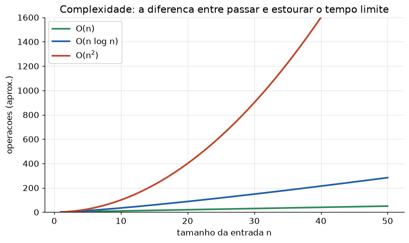

# Lição 104 — Exercícios de entrevista resolvidos em Python e simulação

> **Módulo:** M16 — Carreira e Entrevistas para AI Engineer · **Ordem de estudo:** 104 · **Tempo:** ~55 min
> **Pré-requisitos:** [102] Entrevistas — Fundamentos de ML · [103] Entrevistas — Engenharia de sistemas de IA
> **Classificação:** complemento de aprofundamento à ementa

> **Convenção de formatação:** matemática em LaTeX (`$...$` inline, `$$...$$` em
> destaque, render nativo na pré-visualização do VS Code); figuras reprodutíveis
> geradas por `tools/figuras/gerar_figuras_m16.py` e incorporadas por caminho
> relativo `assets/<NNN>-<slug>/<nome>.png`; blocos ```python só para código e
> saída.

## Seção_Teórica

### Motivação

A rodada final de quase toda entrevista de AI Engineer é **live coding**: resolver um
problema em Python, no tempo, explicando o raciocínio em voz alta. Não são problemas
exóticos — são padrões recorrentes de **manipulação de dados/strings**, **algoritmos e
estruturas de dados** e **primitivas numéricas de ML**. A diferença entre passar e travar
está menos em "saber o truque" e mais em ter um **método**: esclarecer o problema, propor
uma solução simples, analisar a complexidade, melhorar e **testar com exemplos**.

Esta lição é deliberadamente prática. Cada conceito central traz um **exercício de
entrevista resolvido** — enunciado, solução comentada, análise de complexidade e saída
verificável — e a Seção_Prática traz três variações para você resolver sozinho. Trate
cada uma como uma simulação: leia o enunciado, decida a estrutura de dados, implemente e
confira a saída exata contra o gabarito.

### Princípio de funcionamento

Três ideias resolvem a maioria dos exercícios. Primeiro, **escolher a estrutura de dados
certa** muda a complexidade: um `dict`/`Counter` transforma uma busca de O(n) em O(1)
amortizado, derrubando soluções O(n²) para O(n). Segundo, **desempate determinístico**: ao
ordenar, defina explicitamente os critérios (ex.: por frequência decrescente e, em empate,
ordem alfabética) — sem isso a saída não é reproduzível e o teste binário falha. Terceiro,
**estabilidade numérica**: em ML, calcular $e^{x}$ diretamente transborda; o truque do
softmax é subtrair o máximo,

$$\text{softmax}(x)_i = \frac{e^{x_i - \max_j x_j}}{\sum_k e^{x_k - \max_j x_j}},$$

que é matematicamente idêntico mas seguro. A análise de complexidade acompanha tudo: saber
que ordenar é $O(n \log n)$ e que uma varredura com hash é $O(n)$ é o que a banca quer
ouvir.


*Figura 1 — Por que a estrutura de dados importa: a diferença entre $O(n)$, $O(n\log n)$ e $O(n^2)$ é a diferença entre passar e estourar o tempo limite à medida que a entrada cresce (gerada por `tools/figuras/gerar_figuras_m16.py`).*

---

### Conceito central 1 — Manipulação de dados e strings

**Exercício resolvido:** dado um texto, retorne as `k` palavras mais frequentes, com
desempate determinístico (frequência decrescente; em empate, ordem alfabética). É um
padrão de NLP disfarçado de live coding: contar tokens e ranquear.

#### Exemplo_Resolvido 1.1

```python
from collections import Counter


def top_k_palavras(texto, k):
    palavras = texto.lower().split()
    contagem = Counter(palavras)
    # Desempate deterministico: maior frequencia, depois ordem alfabetica.
    return sorted(contagem.items(), key=lambda kv: (-kv[1], kv[0]))[:k]


texto = "rag agente rag eval agente rag eval custo"
for palavra, freq in top_k_palavras(texto, 3):
    print(f"{palavra}: {freq}")
```

**Explicação passo a passo:**
- **Bloco 1 (`top_k_palavras`):** normaliza para minúsculas, separa por espaços e conta com `Counter` (O(n)); ordena por `(-frequência, palavra)` (O(m log m), m = palavras únicas) e corta o top-k.
- **Bloco 2 (dados):** `rag` aparece 3 vezes, `agente` e `eval` 2 vezes cada, `custo` 1.
- **Bloco 3 (laço):** o empate entre `agente` e `eval` (ambos 2) é resolvido por ordem alfabética — `agente` vem primeiro, garantindo saída reproduzível.

**Saída esperada:**
```
rag: 3
agente: 2
eval: 2
```

---

### Conceito central 2 — Algoritmos e estruturas de dados

**Exercício resolvido:** dado um vetor de inteiros e um alvo, retorne os índices de dois
números que somam o alvo (*two-sum*). A solução ingênua é O(n²); com uma tabela hash cai
para O(n) — exatamente a melhoria que a banca espera ver.

#### Exemplo_Resolvido 2.1

```python
def two_sum(nums, alvo):
    visto = {}
    for i, x in enumerate(nums):
        comp = alvo - x
        if comp in visto:
            return (visto[comp], i)
        visto[x] = i
    return None


nums = [2, 7, 11, 15, 3]
print(two_sum(nums, 9))
print(two_sum(nums, 18))
print(two_sum(nums, 100))
```

**Explicação passo a passo:**
- **Bloco 1 (`two_sum`):** mantém um dicionário `valor -> índice`; para cada `x`, verifica se o complemento `alvo - x` já apareceu (busca O(1)), devolvendo o par de índices.
- **Bloco 2 (consultas):** `9 = 2 + 7` → índices `(0, 1)`; `18 = 7 + 11` → `(1, 2)`; `100` não tem par → `None`.
- **Conclusão:** uma única passada resolve o problema em O(n) tempo e O(n) memória, contra O(n²) da força bruta.

**Saída esperada:**
```
(0, 1)
(1, 2)
None
```

---

### Conceito central 3 — Numérico e ML

**Exercício resolvido:** implemente o **softmax numericamente estável** e a **similaridade
de cosseno**. São primitivas que aparecem em qualquer pipeline de LLM/embeddings e que a
banca usa para checar cuidado com overflow e normalização.

#### Exemplo_Resolvido 3.1

```python
import numpy as np


def softmax(x):
    x = np.asarray(x, dtype=float)
    z = x - np.max(x)            # subtrai o maximo: estabilidade numerica
    e = np.exp(z)
    return e / e.sum()


def cosseno(a, b):
    a = np.asarray(a, dtype=float)
    b = np.asarray(b, dtype=float)
    return float(a @ b / (np.linalg.norm(a) * np.linalg.norm(b)))


logits = [2.0, 1.0, 0.1]
p = softmax(logits)
print("softmax:", [f"{v:.4f}" for v in p])
print(f"soma: {p.sum():.4f}")
print(f"cosseno: {cosseno([1, 0, 1], [1, 1, 0]):.4f}")
```

**Explicação passo a passo:**
- **Bloco 1 (`softmax`):** subtrai o máximo dos logits antes de exponenciar — passo idêntico em valor, mas que evita overflow do `exp` — e normaliza pela soma.
- **Bloco 2 (`cosseno`):** produto interno dividido pelo produto das normas; mede ângulo, não magnitude.
- **Bloco 3 (execução):** o softmax soma exatamente 1.0 (é uma distribuição); o cosseno de `[1,0,1]` e `[1,1,0]` é `1/2 = 0.5` (compartilham uma componente de três).

**Saída esperada:**
```
softmax: ['0.6590', '0.2424', '0.0986']
soma: 1.0000
cosseno: 0.5000
```

## Seção_Prática

> **Como reproduzir:** execute cada solução de referência com
> `python trilha/solucoes/104-exercicios-entrevista-python/solucao_<n>.py` e compare a saída
> com o arquivo `.saida.txt` correspondente. Os enunciados/esqueletos ficam em
> `trilha/pratica/104-exercicios-entrevista-python/exercicio_<n>.py`.

### Exercício 1 — Top-k palavras mais frequentes
- **Entrada inicial / setup:** `texto = "embedding token embedding rag token embedding rag chunk rag"` e `k = 3` (dados no esqueleto).
- **Passos de execução:** implemente `top_k_palavras(texto, k)` (minúsculas, `split`, `Counter`, ordenação por `(-frequência, palavra)`) e imprima `"<palavra>: <freq>"` para cada uma das k.
- **Critério de conclusão (binário):** a saída é **exatamente** igual a `solucao_1.saida.txt` (o empate entre `embedding` e `rag`, ambos 3, é resolvido alfabeticamente — `embedding` primeiro); qualquer divergência reprova.
- **Solução de referência:** `trilha/solucoes/104-exercicios-entrevista-python/solucao_1.py`
- **Saída esperada:** `trilha/solucoes/104-exercicios-entrevista-python/solucao_1.saida.txt`

### Exercício 2 — Two-sum em O(n)
- **Entrada inicial / setup:** `nums = [1, 4, 5, 8, 12]` e consultas de alvo `9`, `20`, `2` (dados no esqueleto).
- **Passos de execução:** implemente `two_sum(nums, alvo)` com tabela hash `{valor: índice}`, retornando `(índice_do_complemento, i)` ou `None`; imprima o resultado de cada consulta.
- **Critério de conclusão (binário):** a saída é **exatamente** igual a `solucao_2.saida.txt` (`9 -> (1, 2)`, `20 -> (3, 4)`, `2 -> None`); qualquer divergência reprova.
- **Solução de referência:** `trilha/solucoes/104-exercicios-entrevista-python/solucao_2.py`
- **Saída esperada:** `trilha/solucoes/104-exercicios-entrevista-python/solucao_2.saida.txt`

### Exercício 3 — Softmax estável, argmax e cosseno
- **Entrada inicial / setup:** `logits = [1.0, 3.0, 0.0, 2.0]` e vetores `a = [2, 1, 0]`, `b = [1, 2, 0]` (dados no esqueleto).
- **Passos de execução:** implemente `softmax(x)` (subtraindo o máximo antes do `exp`) e `cosseno(a, b)`; imprima `"softmax: <lista com 4 casas>"`, `"classe prevista (argmax): <int>"` e `"cosseno: <4 casas>"`.
- **Critério de conclusão (binário):** a saída é **exatamente** igual a `solucao_3.saida.txt` (`classe prevista (argmax): 1` e `cosseno: 0.8000`); qualquer divergência reprova.
- **Solução de referência:** `trilha/solucoes/104-exercicios-entrevista-python/solucao_3.py`
- **Saída esperada:** `trilha/solucoes/104-exercicios-entrevista-python/solucao_3.saida.txt`
